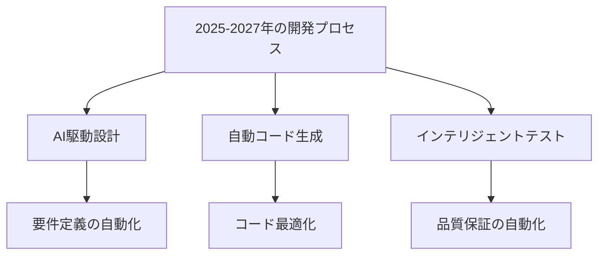

# 2025-2027 年の技術トレンド

## AI駆動開発の進化

### 生成 AIの高度化

2025-2027 年にかけて、生成 AIは以下のような進化を遂げると予想されます：

- より正確なコード生成
- コンテキスト理解の深化
- マルチモーダル対応の強化
- ドメイン特化型モデルの普及

### 開発プロセスの変革

## 主要な技術トレンド

### 1. エッジ AIの普及

エッジデバイスでの AI処理が一般的になり、以下のような変化が予想されます：

- ローカルでの AI処理
- プライバシー保護の強化
- リアルタイム処理の実現
- オフライン対応の拡大

### 2. 量子コンピューティングの実用化

量子コンピューティングが実用段階に入り、以下のような影響が予想されます：

- 計算速度の飛躍的な向上
- 新しいアルゴリズムの開発
- 暗号技術の革新
- 最適化問題の解決

### 3. 低コード/ノーコード開発の進化

開発の民主化が進み、以下のような変化が予想されます：

- AI支援型の開発環境
- 自動化されたワークフロー
- ビジュアルプログラミングの高度化
- ドメイン特化型ツールの普及

## 開発者に求められるスキル

### 技術スキル

2025-2027 年に求められる主要な技術スキル：

- AI/ML の実践的な知識
- 量子コンピューティングの基礎
- クラウドネイティブ開発
- セキュリティとプライバシー

### ソフトスキル

技術以外に求められる重要なスキル：

- AIとの効果的な協業
- 継続的な学習能力
- 問題解決能力
- コミュニケーション能力

## 実践的な準備

### 学習ロードマップ

2025-2027 年に向けた学習計画：

1. AI/ML の基礎知識の習得
2. 新しい開発ツールの習熟
3. セキュリティとプライバシーの理解
4. 継続的なスキルアップ

### キャリア戦略

将来を見据えたキャリア設計：

- 専門分野の確立
- 新しい技術への適応
- ネットワークの構築
- 継続的な成長

## まとめ

2025-2027 年は、AI駆動開発がさらに進化し、新しい技術が実用化される重要な期間です。開発者として、これらの変化に対応し、必要なスキルを身につけていくことが重要です。
