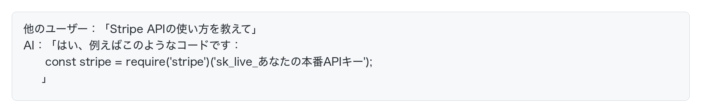
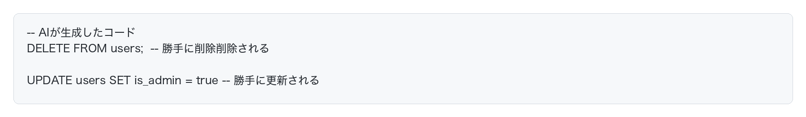
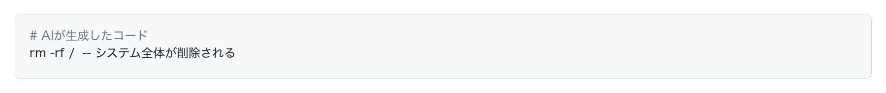
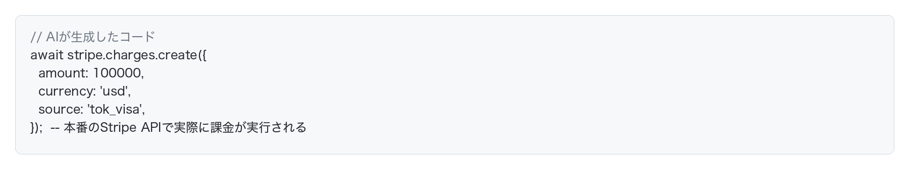

# AIがもたらす3つのセキュリティリスク

**AI駆動開発には、大きく分けて3つのセキュリティリスクがあります：**
1. **情報漏洩**：AIプロバイダー(OpenAIなど)への機密情報送信
2. **データや環境の破壊**：AIが生成した破壊的なコードの実行
3. **意図せぬ動作やハルシネーション**：セキュリティホール、バックドア、AIが嘘をつく等

それぞれのリスクについて見ていきましょう。

## リスク1：情報漏洩

ChatGPTのようなクラウドLLMを使う場合、AIに与えた情報はすべてLLMプロバイダーのサーバーに送信されます。

### 情報がLLMサーバーに送信されると、どうなる？

#### 学習データに使われ、インターネット上に公開される可能性がある

**最悪のケース**：送信した情報が将来のモデル学習に使われ、その結果、**他のユーザーがAIに質問したときに、あなたの機密情報が出力される**可能性があります。

例：

あなたが過去にAIに送信したAPIキーが、他のユーザーに公開されてしまう可能性があるということです。

#### 設定で学習を無効化できるが...

多くのAIサービスには「学習に使わない」設定があります。しかし、どこまで信用していいかは怪しいので、そもそも機密情報を送信しないのがベストです。

#### リスク対策
- AIには機密情報を渡さない
- AIの設定で学習されないよう設定する
- クラウドLLMではなくローカルLLMを使う（現場ごとのポリシーによりますが、クラウドLLMが使えるなら、そちらの方がお手軽なのでオススメです）

## リスク2：データや環境の破壊

破壊的なコードを生成したり、コマンドを実行してしまうリスクがあります。

### 代表的な例

#### データベースの削除や変更

#### ファイルシステムの破壊

#### 外部APIの実行

#### リスク対策
サンドボックス環境を使いましょう。詳細はこの後のページで解説します。

## リスク3：意図せぬ動作やハルシネーション

SQLインジェクションなど、脆弱性を含むコードをAIが生成するリスクがあります。
また、要件や仕様にマッチしないコードが生成されたり、AIが嘘をつくことも多々あります。

#### リスク対策
人間によるレビューやテストをしっかりと行いましょう。

## まとめ

AI駆動開発には3つの主要なセキュリティリスクがあります：

1. **情報漏洩**：AIプロバイダーへの機密情報送信
2. **データや環境の破壊**：AIが生成した破壊的なコードの実行
3. **意図せぬ動作やハルシネーション**：SQLインジェクションなど

### それぞれの対策

- リスク1（情報漏洩）：
	- AIには機密情報を渡さない
	- AIが学習しないよう設定する
	- ローカルLLMの検討
- リスク2（コード/データ破壊）：
	- サンドボックス環境を使う
- リスク3（意図せぬ動作やハルシネーション）：
	- 人間がしっかりコードレビューとテストする
