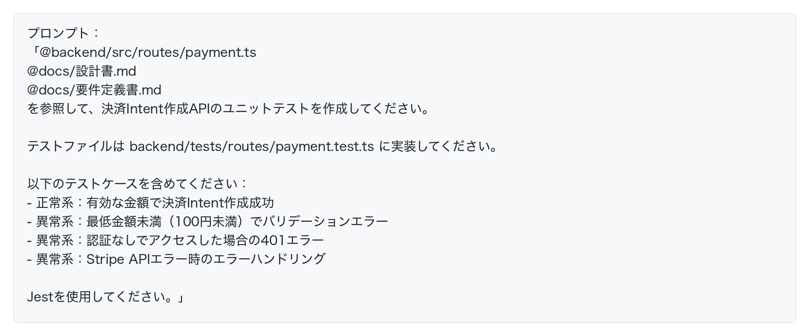
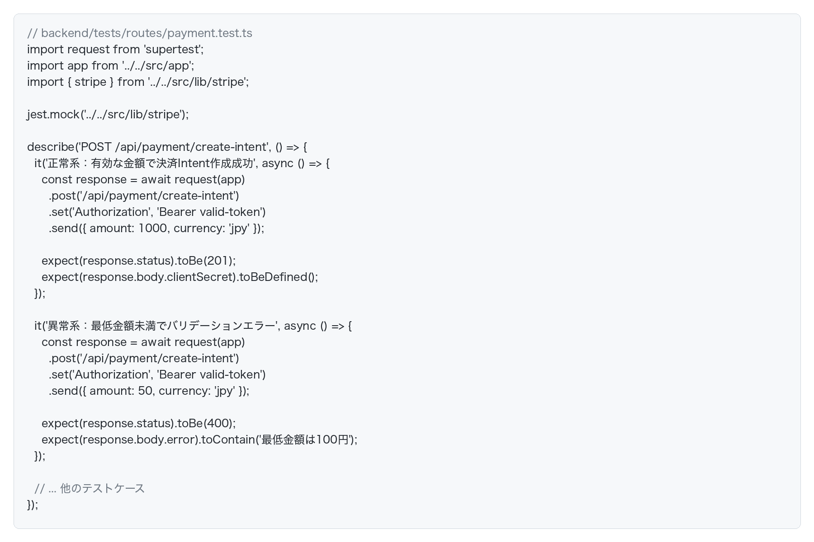
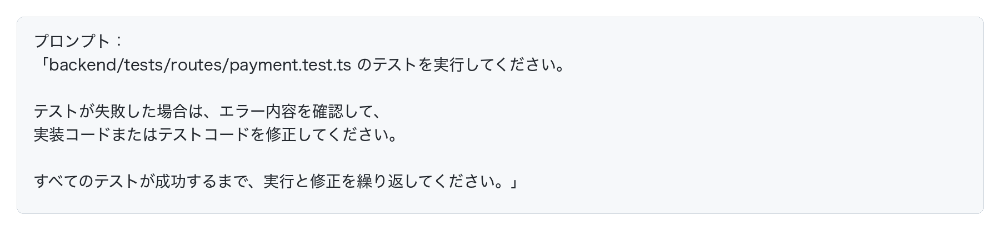
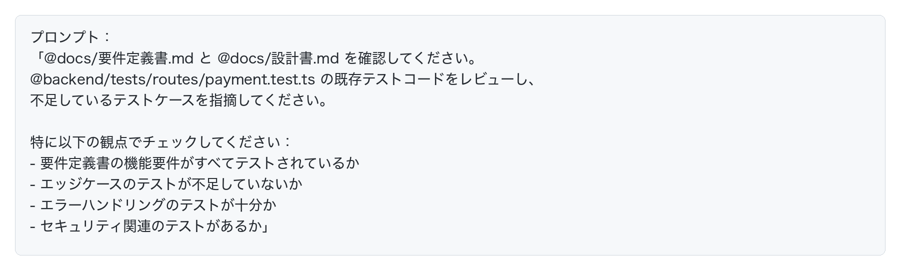
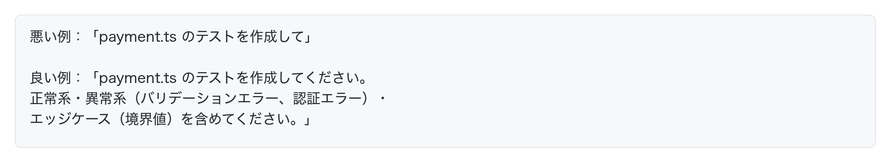
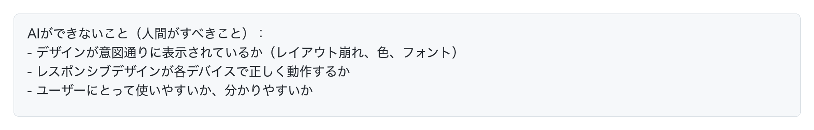
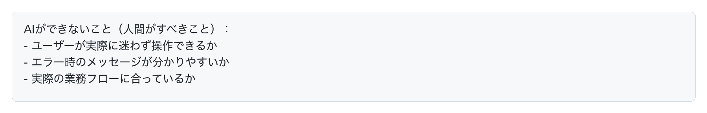

# AIでテストする

実装が完了したら、テストコードを作成します。
「そもそもテストコードって何？」という方は、「TDD（テスト駆動開発）」を勉強しましょう。

## テスト生成に必要な3つの情報源

AIに質の高いテストコードを生成させるには、**3つの情報源を参照させる**ことが重要です。

- 要件定義書
- 設計書
- 実装コード

この3つを組み合わせることで、**仕様を満たし、実装と一致した、網羅性の高いテストコード**をAIが生成できます。

## AIでテストコードを生成してみよう

例として、ECサイトの決済APIに対するテストコードを生成してみます。
実装コード、設計書、要件定義書を参照させて、ユニットテストを生成します。

AIが以下のようなテストコードを自動生成してくれます。

### AIにテストを実行させて自動修正させる

テストコードを生成したら、AIにテストを実行させます。**テストが失敗した場合、AIが自動でバグを修正**してくれます。

## AIによるテストレビュー戦略

テストコードを生成した後、要件定義書・設計書と既存のテストコードを突き合わせて、AIに「何が足りないか」を指摘させると、テストの品質を高めることができます。

## よくある失敗パターンと対処法

AIでテストを生成する際の、よくある失敗パターンと対処法を紹介します。

### パターン1：プロンプトが曖昧でテストが不完全

**症状**: 生成されたテストが正常系のみで、異常系やエッジケースが不足している。

**原因**: プロンプトで「テストを作成して」とだけ指示し、具体的なテストケースを明示していない。

**対処法**:

### パターン2：何が正しいのか？のコンテキストが不十分

どういう振る舞いになれば正しいのか？の情報をAIに与えないと、間違ったテストが生成されてしまいます。

要件定義書や仕様書のマークダウンファイルを与えるか、もしくは「どうなれば正解」の情報をAIに伝えましょう。

## AIの限界と人間の役割

AIは効率的にテストコードを生成し、自動テストを実行できますが、**すべてのテストをAIに任せることはできません。**

AIでできるテストと、人間がすべきテストを正しく理解し、適切に役割分担することが重要です。

### AIができるテスト

AIは以下のようなテストを自動化できます：

1. **ユニットテスト**
   - 関数やメソッドの入出力テスト
   - 正常系・異常系・エッジケースの網羅
   - モックを使った単体テスト

2. **統合テスト**
   - API エンドポイントのテスト
   - 複数コンポーネント間の連携テスト

3. **E2Eテスト（自動化可能な範囲）**
   - ブラウザ操作の自動化（Playwright等）
   - 画面遷移のテスト
   - フォーム入力と送信のテスト

4. **リグレッションテスト**
   - 既存機能の動作確認
   - コード変更による影響範囲の検証

### AIができないテスト・人間がすべきテスト

以下のようなテストは、**AIでは自動化できず、人間が手動で確認する必要があります**：

#### 1. 外部システム連携の確認

**例：ECサイトの決済機能**

#### 2. UI/UXの品質確認

#### 3. ユーザー視点でのチェック

特に「要件を満たしているか？」はAIには分かりません。人間が必ずチェックするようにしましょう。

### テストの責任は人間にある

**重要な原則**：
- **テストの主役はあなた（人間）であり、AIはあくまで助手です**
- そのコードにバグがあった場合、責任を負うのはあなたです
- AIが生成したテストコードは必ず人間がレビューする
- AIで自動化できるテストはAIに任せ、人間は手動でしかできないテストに集中する

