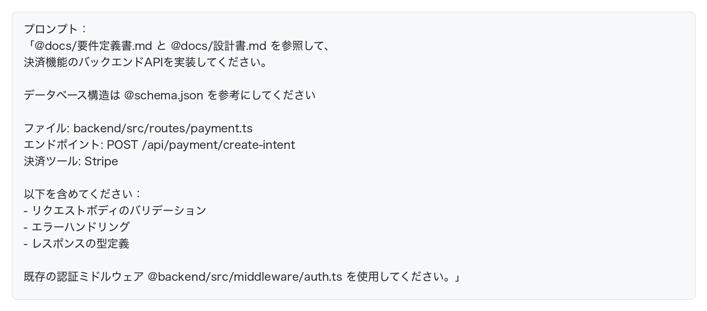
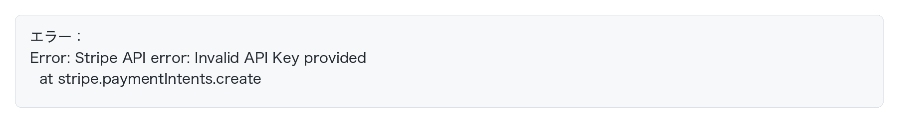
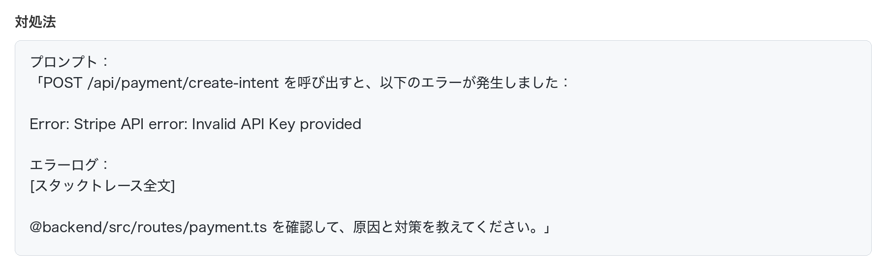
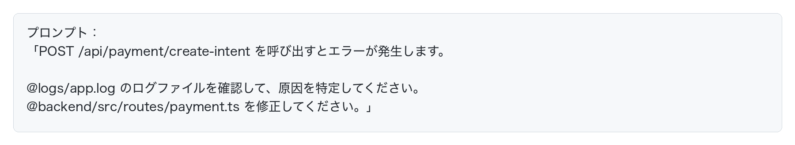
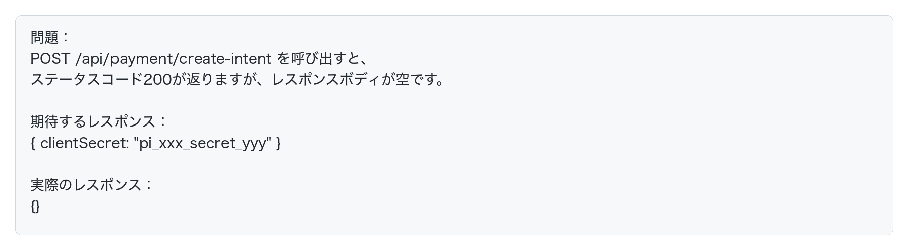
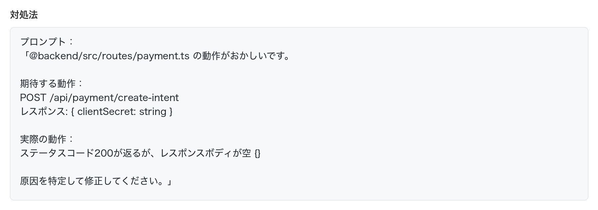
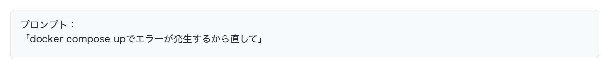

# AIで実装を自動化する

要件定義書・設計書が完成したら、いよいよ実装フェーズです。実装フェーズでは**タスクを適切に分割すること**が非常に重要です。

この章では、**実装フェーズならではのAI活用のポイント**を、ECサイトの決済機能を例に学びます。

## ECサイトの決済機能を実装してみよう

要件定義と設計で決めたECサイトに、Stripe決済機能を実装していきます。

### ステップ1：バックエンドAPIの実装

まず、CursorやClaude Codeで決済APIを実装します。

**ポイント：**
- @記法で、要件定義書と設計書を両方参照させる
- @schema.json のように、他のファイルも参照させることができる
- 可能な限りタスクを分割し、明確に指示する

### ステップ2：人間がコードをレビューする

AIが生成したコードを、**人間がレビューします。**
AIはあくまで助手であり、**そのコードの責任を持つのはあなた**です。

作成されたコードは100%人間がレビューし、間違いがあれば、AIに修正指示を出しましょう。

### ステップ3：AIにテストさせる

コードのレビューが完了したら、**AIに自動でテスト+バグ修正させます。**

### ステップ4：人間が最終動作確認する

AIのテストが完了したら、**最後は必ず人間が動作確認します。**

AIはユニットテストコードを書くのは得意ですが、「ブラウザ上で動作するか？」「決済システムStripeの管理画面で正しくデータが作成されているか？」などの確認は不得意です。

つまり、AIにも得意・不得意がありますし、AIが書いたユニットテストですら間違っている可能性もありますので、最終的には人間が100%責任を持ってテストする必要があります。

## エラーが出たときの対処法

実装フェーズでは、エラーに遭遇することが頻繁にあります。AIを使ってエラーを解決する方法を学びましょう。

### パターン1：実行時エラー

**状況：** APIを呼び出すとサーバーエラーが発生

**対処法：**

**ポイント：**
- エラーメッセージの全文をコピペする
- スタックトレースも含める
- どのファイルを確認すべきかを`@記法`で指定する
- **ログファイルのパスを伝えるとさらに効果的**

**ログファイルを活用する：**

エラーの詳細がログファイルに出力されている場合、そのパスを`@記法`で指定すると、AIがログを読んで原因を特定できます。

AIがログファイルを読んで、エラーの原因を特定し、コードを修正してくれます。

### パターン2：期待通りに動かない

**状況：** エラーは出ないが、期待した動作をしない

**対処法：**

**ポイント：**
- **期待する動作**と**実際の動作**を明確に伝える
- エラーが出ない場合でも、AIは問題を特定できる

### パターン3：Dockerのビルドエラー

**状況：** docker compose up を実行したらエラーが発生する

Docker環境での開発では、依存関係やビルド設定のエラーが頻繁に発生します。このような場合も、**AIに自動で実行→エラー修正→再実行を繰り返させる**ことができます。

**AIが自動で以下を実行してくれます：**
1. `docker compose up` を実行
2. エラーが出たら原因を分析
3. Dockerfileやdocker-compose.ymlを自動修正
4. 再度実行
5. 成功するまで繰り返す

## まとめ

実装フェーズでのAI活用の流れ：

### 基本の4ステップ

1. **AIにコードを作らせる**
2. **人間がコードをレビューする**
3. **AIにテストさせる**
4. **人間が最終動作確認する**

**実装フェーズでもAIは強力な味方です。ただし、AIはあくまで助手。コードレビューと最終確認は人間が責任を持って行いましょう。**

