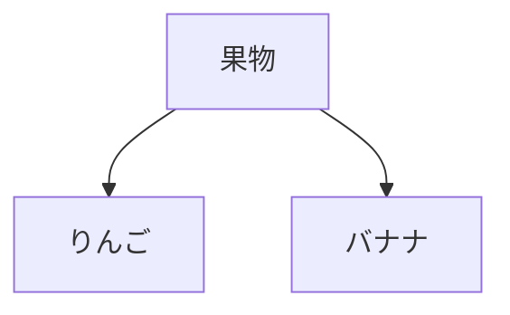

# AIで要件定義書を作成する

この章では、**開発フロー全体でAIを最大限活用する方法**を学びます。そのための最初のステップが、**マークダウンで要件定義書を作成すること**です。

## マークダウンとは

**マークダウン**は、テキストに簡単な記号を使って見出しや箇条書きを表現する記法です。

### マークダウンの基本記法

**見出し：**
```markdown
# 見出し1（最上位）
## 見出し2
### 見出し3
```

**箇条書き：**
```markdown
- 箇条書き1
- 箇条書き2
- 箇条書き3
```

**番号付きリスト：**
```markdown
1. 番号付きリスト1
2. 番号付きリスト2
```

**強調：**
```markdown
**太字**
*斜体*
```

**コードブロック：**
````markdown
```javascript
console.log("コードブロック");
```
````


## なぜマークダウンで要件定義書を書くのか

### AI駆動開発における開発フローの全体像

従来の開発では、各フェーズのドキュメントをExcelなどで管理していました。

```
要件定義 → 設計 → 実装 → テスト
（Excelなどで管理）
```

AI駆動開発では、**AIで各フェーズをシームレスにつなぐのが理想です**。

```
要件定義書.md
    ↓ AIに渡して設計書を生成
設計書.md
    ↓ AIに渡してコードを生成
コード
    ↓ AIに渡してテストを生成
テストコード
```

しかし、これを実現するには、**AIが理解できる形式でドキュメントを管理する**必要があります。その最適な形式が、**マークダウン**です。

### ExcelやWordの問題点

従来の開発現場では、要件定義書をExcelやWordで作成するのが一般的でした。しかし、**AI駆動開発では、ExcelやWordは不向き**です。

その理由は、**ExcelやWordは、AIが正確に読み取れない**からです。
一応、読み込むことは出来るものの、精度がかなり落ちます。

マークダウンなら、**純粋なテキストファイル**なので、AIが100%正確に理解できます。

でも、マークダウンだと図が書けないよね？と思っている方、安心してください。
マークダウンでも図が書けます

#### マークダウンで図を描く（Mermaid）

マークダウンには、**Mermaid**という図を描く機能があります。

**Mermaid**は、テキストで図を描ける記法です。例えば、以下のコードを書くと：

````

````

このような図が自動生成されます：


#### 一部Excelと併用しても良い
ただし場合によっては、マークダウンよりもExcelの方が便利な時もあります。そういう時は部分的にExcelを併用するのもオススメです。

なお、Excelをマークダウンに変換したい時は、ExcelをHTMLに変換し、HTMLをマークダウンに変換するのが最も変換成功率が高いです。

#### Gitにコミットしよう

マークダウンでドキュメントを作成したら、今後はそれをAIに読み込ませながらAI駆動開発を進めるので、ソースコードと同じGitリポジトリに、マークダウン一式もコミットしましょう。フォルダはdocs/フォルダなど、どこでも構いません

**結論：AI駆動開発では、マークダウンでドキュメント管理して、Gitにコミットするのがオススメ**

## マークダウンで要件定義書を作ってみよう

ここでは、**ECサイト構築**を例に、**AIと壁打ちしながら要件定義を進める実践的な流れ**を紹介します。

### ステップ1：AIに要件定義書の雛形を作ってもらう

まず、要件定義書作成はCursorを使うのがオススメです。
CursorのAIチャットを起動し、以下のようにプロンプトを入力します：

```
あなたはシステムエンジニアで要件定義のエキスパートです。

docs/要件定義書.mdに、ECサイトの要件定義書をマークダウンで作成してください。

以下の機能を含めてください：
- 商品の検索・一覧表示
- ショッピングカート機能
- 決済機能
- 注文履歴表示

```

すると、以下のような内容が作成されます
```markdown
# 要件定義書：ECサイト

## 1. プロジェクト概要

### 目的
オンラインで商品を販売し、顧客が簡単に購入できるECサイトを構築する。

## 2. 機能要件

### 2.1 商品の検索・一覧表示

#### 詳細説明
商品をカテゴリやキーワードで検索し、一覧表示する機能。

#### 機能詳細
- キーワード検索
- カテゴリ別表示

### 2.2 ショッピングカート機能

#### 詳細説明
商品をカートに追加し、数量変更や削除ができる機能。

#### 機能詳細
- カートに商品を追加
- カートから削除
...
```

### ステップ2：AIと壁打ちしながら詳細化する

ここからが**AIと壁打ちする本番**です。

生成された要件定義書を見ながら、**「これで本当に実装できるか？」**を考えます。そして、足りない部分をAIに質問しながら詰めていきます。

#### 壁打ち例1：決済機能の詳細を詰める

```
あなた：
「決済機能について、どの決済方法に対応すべきか教えて」

AI：
「以下の決済方法が一般的です：
- クレジットカード（Stripe、PayPal）
- コンビニ決済
- 銀行振込
- 代金引換

初期リリースでは、クレジットカード決済（Stripe）に絞るのが現実的です。」

あなた：
「なるほど。じゃあ、要件定義書の決済機能のセクションに、
『クレジットカード決済（Stripe）を使用。将来的に他の決済方法も追加予定』
という内容を追記して」
```

`Cmd+K`で該当箇所を選択し、AIに追記してもらいます。

#### 壁打ち例2：セキュリティ要件を詰める

```
あなた：
「ECサイトで最低限必要なセキュリティ要件って何？」

AI：
「以下が必須です：
- SSL/TLS通信（HTTPS）
- パスワードのハッシュ化（bcrypt）
- クレジットカード情報は保存しない（Stripeに委譲）
- SQLインジェクション対策
- CSRF対策」

あなた：
「わかった。要件定義書に『3. 非機能要件』のセクションを追加して、
そのセキュリティ要件を書いて」
```

AIに新しいセクションを追加してもらいます。

#### 壁打ち例3：パフォーマンス要件を詰める

```
あなた：
「商品一覧ページの表示速度はどれくらいを目標にすべき？」

AI：
「一般的なECサイトでは：
- ページ読み込み時間：2秒以内
- 商品画像の最適化：WebP形式、遅延読み込み
- 同時接続数：最低500ユーザー

まずは『ページ読み込み2秒以内』を目標にすると良いでしょう。」

あなた：
「じゃあ、非機能要件のセクションに
『パフォーマンス：ページ読み込み時間2秒以内、商品画像はWebP形式で遅延読み込み』
を追加して」
```

このように、**AIに質問しながら、要件を詰めていく**のが壁打ちの流れです。

### ステップ5：最終確認してGitにコミット

要件定義書が完成したら、最後にAIに確認してもらいます。

```
あなた：
「この要件定義書で、実装に必要な情報は揃ってる？足りない項目はない？」

AI：
「以下の項目が不足しています：
- 注文完了後のメール通知機能
- 在庫管理の仕様（在庫切れ時の挙動）
- 返品・キャンセルポリシー

これらを追加すると、より完成度が高くなります。」
```

必要に応じて追加したら、Gitにコミットします。

```bash
git add Docs/要件定義書.md
git commit -m "feat: ECサイトの要件定義書を作成"
```

**なぜGitで管理するのか？**

- 変更履歴が追跡できる
- 後から「なぜこの仕様にしたのか？」を振り返れる
- チームメンバーとの共有・レビューがしやすい
- 設計・実装フェーズでAIに正確に伝えられる

## 実際のプロンプトのコツ

### 良いプロンプトの例

```
✅ 具体的で明確
「ECサイトの要件定義書.mdを作成してください。
以下の機能を含めてください：
- 商品の検索・一覧表示（カテゴリ、価格帯でフィルタリング）
- ショッピングカート機能（数量変更、削除）
- 決済機能（クレジットカード、PayPal）
- 注文履歴表示

非機能要件として以下も含めてください：
- レスポンスタイム：平均200ms以内
- 同時接続数：1000ユーザー
- セキュリティ：PCI DSS準拠」
```

### 悪いプロンプトの例

```
❌ 曖昧で不明確
「ECサイトの要件定義書を作って」
→ 具体的な機能が不明
→ 非機能要件が欠落
→ 再度修正が必要になる
```

## 段階的に詳細化する

複雑なシステムの場合、一度に全てを指示せず、段階的に詳細化するのが効果的です。

### ステップ1：大枠を作る

```
プロンプト：
「タスク管理アプリの要件定義書.mdを作成してください。
以下のセクションの見出しだけ作成してください：
- プロジェクト概要
- 機能要件（主要5機能）
- 非機能要件
- 技術要件
- 制約事項」
```

### ステップ2：各セクションを詳細化

```
プロンプト：
「2.1 ユーザー登録・ログイン機能のセクションを詳細化してください。
以下を含めてください：
- 詳細説明
- 機能詳細（箇条書き）
- ユーザーストーリー
- 制約条件」
```

### ステップ3：さらに具体化

```
プロンプト：
「2.1.1 OAuth認証の実装詳細を追加してください。
対応プロバイダ、認可フロー、エラーハンドリングを含めてください。」
```

このように**分割して指示**することで、AIの精度が上がり、修正の手間が減ります。

## まとめ

**AI駆動開発では、マークダウン形式で要件定義書を作成すべきです。**

**理由：**
1. AIが100%正確に理解できる
2. Gitで完璧にバージョン管理できる
3. 開発フロー全体でAIに情報を渡せる
4. CursorやClaude Codeと相性抜群
5. 図もコードで管理できる（Mermaid）

**作成手順：**

| ステップ | 内容 | ツール |
|---------|------|-------|
| 1 | プロジェクト初期化 | Bash |
| 2 | 要件定義書の雛形作成 | Cmd+I（チャット） |
| 3 | レビュー＆修正 | Cmd+K |
| 4 | 詳細化・追加（図も含む） | Cmd+I / Cmd+K |
| 5 | Gitコミット | Bash |

**重要なポイント：**

- マークダウン形式で作成する
- 具体的で明確なプロンプトを使う
- 複雑な場合は段階的に詳細化
- 必ずGitで管理する
- AIが生成した内容は必ず人間がレビュー
- 図はMermaidで描く

**次のセクションでは：**

要件定義書をもとに、AIで設計書を作成する方法を学びます。
