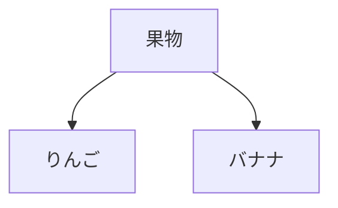

# AIで要件定義書を作成する

この章では、**開発フロー全体でAIを最大限活用する方法**を学びます。そのための最初のステップが、**マークダウンで要件定義書を作成すること**です。

## マークダウンとは

**マークダウン**は、テキストに簡単な記号を使って見出しや箇条書きを表現する記法です。

### マークダウンの基本記法

**見出し：**
```markdown
# 見出し1（最上位）
## 見出し2
### 見出し3
```

**箇条書き：**
```markdown
- 箇条書き1
- 箇条書き2
- 箇条書き3
```

**番号付きリスト：**
```markdown
1. 番号付きリスト1
2. 番号付きリスト2
```

**強調：**
```markdown
**太字**
*斜体*
```

**コードブロック：**
````markdown
```javascript
console.log("コードブロック");
```
````


## なぜマークダウンで要件定義書を書くのか

### AI駆動開発における開発フローの全体像

従来の開発では、各フェーズのドキュメントをExcelなどで管理していました。

```
要件定義 → 設計 → 実装 → テスト
（Excelなどで管理）
```

AI駆動開発では、**AIで各フェーズをシームレスにつなぐのが理想です**。

```
要件定義書.md
    ↓ AIに渡して設計書を生成
設計書.md
    ↓ AIに渡してコードを生成
コード
    ↓ AIに渡してテストを生成
テストコード
```

しかし、これを実現するには、**AIが理解できる形式でドキュメントを管理する**必要があります。その最適な形式が、**マークダウン**です。

### ExcelやWordの問題点

従来の開発現場では、要件定義書をExcelやWordで作成するのが一般的でした。しかし、**AI駆動開発では、ExcelやWordは不向き**です。

その理由は、**ExcelやWordは、AIが正確に読み取れない**からです。
一応、読み込むことは出来るものの、精度がかなり落ちます。

マークダウンなら、**純粋なテキストファイル**なので、AIが100%正確に理解できます。

でも、マークダウンだと図が書けないよね？と思っている方、安心してください。
マークダウンでも図が書けます

#### マークダウンで図を描く（Mermaid）

マークダウンには、**Mermaid**という図を描く機能があります。

**Mermaid**は、テキストで図を描ける記法です。例えば、以下のコードを書くと：

````

````

このような図が自動生成されます：


#### 一部Excelと併用しても良い
ただし場合によっては、マークダウンよりもExcelの方が便利な時もあります。そういう時は部分的にExcelを併用するのもオススメです。

なお、Excelをマークダウンに変換したい時は、ExcelをHTMLに変換し、HTMLをマークダウンに変換するのが最も変換成功率が高いです。

#### Gitにコミットしよう

マークダウンでドキュメントを作成したら、今後はそれをAIに読み込ませながらAI駆動開発を進めるので、ソースコードと同じGitリポジトリに、マークダウン一式もコミットしましょう。フォルダはdocs/フォルダなど、どこでも構いません

**結論：AI駆動開発では、マークダウンでドキュメント管理して、Gitにコミットするのがオススメ**

## マークダウンで要件定義書の作り方

例として、マークダウンで以下のような目次の要件定義書を作っていきます

```markdown
# 要件定義書：[プロジェクト名]

## 1. プロジェクト概要
- 目的
- 背景
- ターゲットユーザー

## 2. 機能要件
### 2.1 [機能名A]
- 詳細説明
- ユーザーストーリー
- 制約条件

### 2.2 [機能名B]
...

## 3. 非機能要件
- パフォーマンス
- セキュリティ
- 可用性

## 4. 技術要件
- 使用技術
- 開発環境
- デプロイ環境

## 5. 制約事項
- スケジュール
- 予算
- リソース
```

## Cursorで要件定義書を作成する

### ステップ1：プロジェクトの初期化

まず、プロジェクトディレクトリを作成し、Cursorで開きます。

```bash
mkdir my-project
cd my-project
git init
```

Cursorでこのディレクトリを開きます。

### ステップ2：Composerで要件定義書の雛形を作成

`Cmd+I`でComposerを起動し、以下のようにプロンプトを入力します：

```
プロンプト例：
「タスク管理WebアプリケーションのDocs/要件定義書.mdを作成してください。
以下の要件を含めてください：
- ユーザー登録・ログイン機能
- タスクのCRUD操作
- タスクの優先度設定
- 期限管理
- チーム共有機能

マークダウン形式で、見出しレベルを適切に使い分け、
箇条書きを活用して読みやすく構成してください。」
```

### ステップ3：AIが生成した要件定義書をレビュー

Cursorが自動生成した要件定義書を確認します。例えば以下のような内容が生成されます：

```markdown
# 要件定義書：タスク管理Webアプリケーション

## 1. プロジェクト概要

### 目的
チーム全体でタスクを効率的に管理し、プロジェクトの進捗を可視化するWebアプリケーションを開発する。

### ターゲットユーザー
- 小規模〜中規模の開発チーム（5〜20名）
- フリーランスや個人事業主
- リモートワーク中心のチーム

## 2. 機能要件

### 2.1 ユーザー登録・ログイン機能

#### 詳細説明
ユーザーがメールアドレスとパスワードでアカウントを作成し、ログインできる機能。

#### 機能詳細
- メールアドレスによるユーザー登録
- パスワードは8文字以上、英数字記号を含む
- メール認証必須
- パスワードリセット機能
- OAuth認証（Google、GitHub）

#### 制約条件
- パスワードはbcryptでハッシュ化
- セッション有効期限は24時間

### 2.2 タスクのCRUD操作

#### 詳細説明
ユーザーがタスクを作成、閲覧、編集、削除できる基本機能。

#### 機能詳細
- タスク作成：タイトル、説明、優先度、期限を設定
- タスク一覧表示：フィルタリング、ソート機能
- タスク詳細表示：コメント機能付き
- タスク編集：すべての項目を編集可能
- タスク削除：確認ダイアログ表示

...
```

### ステップ4：詳細を追加・修正

AIが生成した要件定義書に対して、具体的な指示を追加します。

`Cmd+K`でインライン編集を使い、特定の箇所を修正：

```
プロンプト例：
「2.1 ユーザー登録・ログイン機能に、
以下を追加してください：
- 2要素認証（2FA）のサポート
- ログイン試行回数制限（5回まで）
- アカウントロック機能（30分間）」
```

### ステップ5：Gitにコミット

要件定義書が完成したら、Gitにコミットします。

Cursorのターミナルで：

```bash
git add Docs/要件定義書.md
git commit -m "feat: タスク管理アプリの要件定義書を作成"
```

**なぜGitで管理するのか？**

- 変更履歴が追跡できる
- バージョン管理が容易
- チームメンバーとの共有・レビューがしやすい
- 設計・実装フェーズでAIに正確に伝えられる

## 実際のプロンプトのコツ

### 良いプロンプトの例

```
✅ 具体的で明確
「ECサイトの要件定義書.mdを作成してください。
以下の機能を含めてください：
- 商品の検索・一覧表示（カテゴリ、価格帯でフィルタリング）
- ショッピングカート機能（数量変更、削除）
- 決済機能（クレジットカード、PayPal）
- 注文履歴表示

非機能要件として以下も含めてください：
- レスポンスタイム：平均200ms以内
- 同時接続数：1000ユーザー
- セキュリティ：PCI DSS準拠」
```

### 悪いプロンプトの例

```
❌ 曖昧で不明確
「ECサイトの要件定義書を作って」
→ 具体的な機能が不明
→ 非機能要件が欠落
→ 再度修正が必要になる
```

## 段階的に詳細化する

複雑なシステムの場合、一度に全てを指示せず、段階的に詳細化するのが効果的です。

### ステップ1：大枠を作る

```
プロンプト：
「タスク管理アプリの要件定義書.mdを作成してください。
以下のセクションの見出しだけ作成してください：
- プロジェクト概要
- 機能要件（主要5機能）
- 非機能要件
- 技術要件
- 制約事項」
```

### ステップ2：各セクションを詳細化

```
プロンプト：
「2.1 ユーザー登録・ログイン機能のセクションを詳細化してください。
以下を含めてください：
- 詳細説明
- 機能詳細（箇条書き）
- ユーザーストーリー
- 制約条件」
```

### ステップ3：さらに具体化

```
プロンプト：
「2.1.1 OAuth認証の実装詳細を追加してください。
対応プロバイダ、認可フロー、エラーハンドリングを含めてください。」
```

このように**分割して指示**することで、AIの精度が上がり、修正の手間が減ります。

## まとめ

**AI駆動開発では、マークダウン形式で要件定義書を作成すべきです。**

**理由：**
1. AIが100%正確に理解できる
2. Gitで完璧にバージョン管理できる
3. 開発フロー全体でAIに情報を渡せる
4. CursorやClaude Codeと相性抜群
5. 図もコードで管理できる（Mermaid）

**作成手順：**

| ステップ | 内容 | ツール |
|---------|------|-------|
| 1 | プロジェクト初期化 | Bash |
| 2 | 要件定義書の雛形作成 | Composer (Cmd+I) |
| 3 | レビュー＆修正 | Cmd+K |
| 4 | 詳細化・追加（図も含む） | Composer / Cmd+K |
| 5 | Gitコミット | Bash |

**重要なポイント：**

- マークダウン形式で作成する
- 具体的で明確なプロンプトを使う
- 複雑な場合は段階的に詳細化
- 必ずGitで管理する
- AIが生成した内容は必ず人間がレビュー
- 図はMermaidで描く

**次のセクションでは：**

要件定義書をもとに、AIで設計書を作成する方法を学びます。
