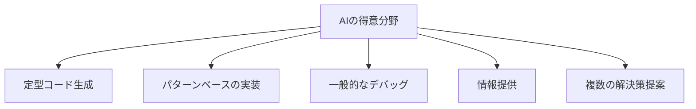
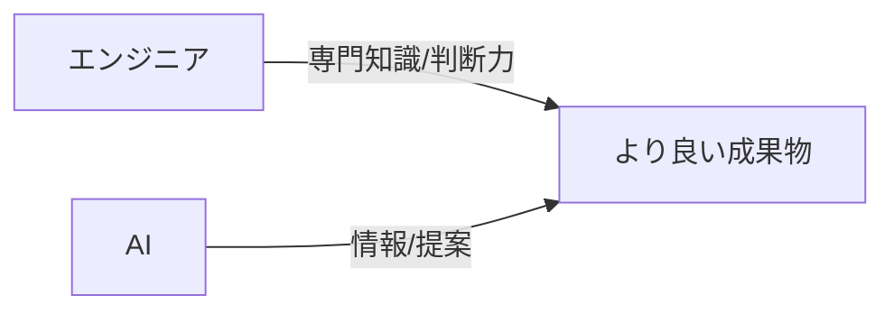
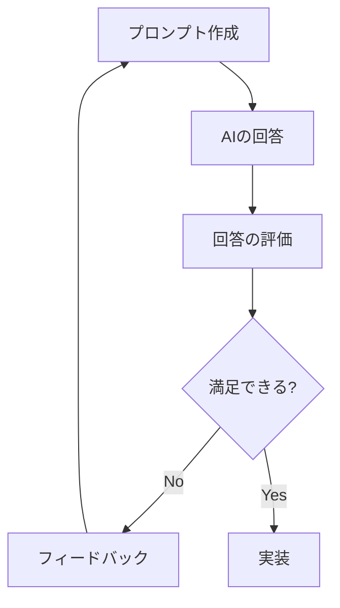

# AI と協業するための心構え

## はじめに

AI ツールはソフトウェア開発の強力な助手となりますが、その可能性を最大限に引き出すためには適切な心構えとアプローチが必要です。この記事では、AI と効果的に協業するための基本的な考え方や実践的なヒントを紹介します。

## 1. AI の特性を理解する

### AI の得意なこと

AI ツール（特に大規模言語モデル）は以下のような作業が得意です：

- 定型的なコードの生成
- 既存のパターンに基づいた実装
- 一般的な問題のデバッグ支援
- 広範な知識に基づいた情報提供
- 異なる実装アプローチの提案



### AI の苦手なこと

一方で、以下のような点は苦手または限界があります：

- プロジェクト固有の深い文脈の理解
- 最新の技術トレンドや未公開情報
- 複雑な問題のルート原因の特定
- 高度なパフォーマンス最適化
- セキュリティの包括的な分析
- 美的センスを要する UI デザイン

## 2. 効果的な協業のための基本姿勢

### 批判的思考を保つ

AI の出力は常に批判的に評価しましょう。AI は間違えることもあるため、提案された解決策や情報を鵜呑みにせず、自分の知識と照らし合わせて検証することが重要です。

### 専門知識を補完するツールとして活用

AI はあなたの専門知識を置き換えるものではなく、補完するツールです。あなたの判断力や創造性と組み合わせることで、より良い結果を生み出せます。



### 反復的なプロセスを受け入れる

AI との協業は一発で完璧な結果を得るよりも、反復的なプロセスとして考えるべきです。初期の回答を基に改善を重ねていくことで、より良い結果に近づけます。

### 責任の所在を理解する

AI が生成したコードやアイデアに対する最終的な責任はエンジニアにあります。特にセキュリティやパフォーマンスに関わる部分は自分で検証することが不可欠です。

## 3. 実践的な協業テクニック

### 明確な目標設定

AI に何を求めているかを明確にしましょう。漠然とした質問よりも、具体的な目標や制約条件を伝えることで、より適切な回答を得られます。

**例**：

```
「認証機能を実装したい」(曖昧)

↓

「Node.jsとExpressで、JWTを使用したRESTful APIの認証機能を実装したい。
ユーザー登録、ログイン、パスワードリセット機能が必要で、
セキュリティのベストプラクティスに従いたい。」(具体的)
```

### 段階的なタスク分解

複雑な問題は小さなステップに分解して、AI に順番に解決してもらいましょう。一度に全てを解決しようとするのではなく、段階的にアプローチすることで、各ステップでより良い回答を得られます。

**例**：

```
ステップ1：データモデルの設計
ステップ2：API設計
ステップ3：認証ロジックの実装
ステップ4：エラーハンドリングの追加
ステップ5：テストケースの作成
```

### フィードバックループの構築

AI からの回答に対して、改善点や追加要件を伝えることで、より良い結果に繋がります。一方通行のやり取りではなく、対話的なプロセスとして捉えましょう。



### コンテキストの効果的な共有

AI はあなたのプロジェクト全体を把握していないため、関連するコンテキスト情報を提供することが重要です。

**効果的なコンテキスト共有の例**：

```
「私は現在、Reactとフロントエンドで、バックエンドはExpressとMongoDBを使用したEコマースサイトを開発しています。
現在のコードベースでは、商品のカートへの追加機能を実装していますが、
以下のバグが発生しています: [バグの詳細な説明]
関連するコンポーネントのコードは次の通りです: [コード]
どのようにこの問題を解決できるでしょうか？」
```

## 4. AI との協業における一般的な課題と解決策

### 過剰依存の回避

**課題**：AI に頼りすぎて自分で考える力が弱まる危険性

**解決策**：

- AI を使う前に、まず自分で問題について考える時間を取る
- AI からの回答を鵜呑みにせず、なぜその解決策が適切なのか理解する
- 自分の技術力を高めるための学習を継続する

### 品質の確保

**課題**：AI が生成したコードの品質にばらつきがある

**解決策**：

- コードレビューを欠かさない
- テストを徹底する
- セキュリティレビューを実施する
- パフォーマンステストを行う

### プライバシーとセキュリティ

**課題**：センシティブな情報を AI に共有するリスク

**解決策**：

- 機密情報、認証情報は共有しない
- 実際のプロダクションコードではなく、抽象化されたサンプルを使用する
- 企業のポリシーに従う
- オープンソースや独自ホスティングの AI ソリューションを検討する

### 著作権とライセンス

**課題**：AI が生成したコードの著作権やライセンスの扱い

**解決策**：

- 使用する AI サービスの利用規約を確認する
- 生成されたコードを理解して自分のものとして書き直す
- オープンソースライブラリを使用する場合はライセンスを確認する

## 5. AI との協業を次のレベルに引き上げるためのヒント

### 学習と実験の文化を育む

AI ツールは急速に進化しています。定期的に新しい機能や手法を試し、自分のワークフローに取り入れる姿勢が重要です。

### チーム内でのベストプラクティス共有

AI との効果的な協業方法をチーム内で共有し、全体のスキルレベルを向上させましょう。

**共有すべきもの**：

- 効果的なプロンプトのテンプレート
- AI との協業で解決した難しい問題の事例
- AI の限界に遭遇した経験
- プライバシーとセキュリティのガイドライン

### AI とのペアプログラミング

AI をペアプログラミングのパートナーとして活用する方法を確立しましょう。

**実践方法**：

1. 実装したい機能のプランを立てる
2. AI に最初のコード案を生成してもらう
3. コードをレビューし、問題点や改善点を AI にフィードバック
4. 修正案を得て統合する
5. テストケースの作成を AI に依頼する

### 継続的な学習のサポートとして活用

新しい技術やフレームワークの学習においても、AI は強力な助けになります。

**活用例**：

- 新技術の概念説明を依頼する
- サンプルコードとその解説を生成してもらう
- 自分の理解を確認するための質問に回答してもらう
- 学習計画の立案をサポートしてもらう

## 6. AI との協業における倫理的考慮

### バイアスの認識と対処

AI モデルはトレーニングデータに含まれるバイアスを反映することがあります。生成された内容にバイアスがないか常に注意し、必要に応じて修正しましょう。

### 透明性の維持

チームや関係者に対して、どの部分に AI を活用したかを適切に伝えることが重要です。

### 人間中心のアプローチ

AI はあくまでツールであり、最終的な決定や創造性は人間にあることを忘れないようにしましょう。AI の支援を受けながらも、人間の価値観や倫理観を中心に据えた開発を心がけます。

## まとめ：AI と共に成長するエンジニアになるために

AI との効果的な協業は、以下の点を意識することで実現できます：

1. **理解** - AI の能力と限界を正しく理解する
2. **批判的思考** - AI の出力を常に評価・検証する
3. **明確なコミュニケーション** - 具体的な指示と十分なコンテキストを提供する
4. **反復的プロセス** - 一度で完璧を求めずに段階的に改善する
5. **責任** - 最終的な品質と安全性はエンジニアの責任である
6. **継続的学習** - AI ツールと協業テクニックの進化に合わせて自己成長する

AI は優れたツールですが、あなたの創造性、批判的思考力、問題解決能力を置き換えるものではありません。AI と人間の強みを組み合わせることで、より効率的で革新的なソフトウェア開発が可能になります。

AI との協業は単なるスキルではなく、今後のエンジニアキャリアにおける重要なマインドセットです。この心構えを身につけることで、常に進化するテクノロジーの世界で活躍できるエンジニアになれるでしょう。
