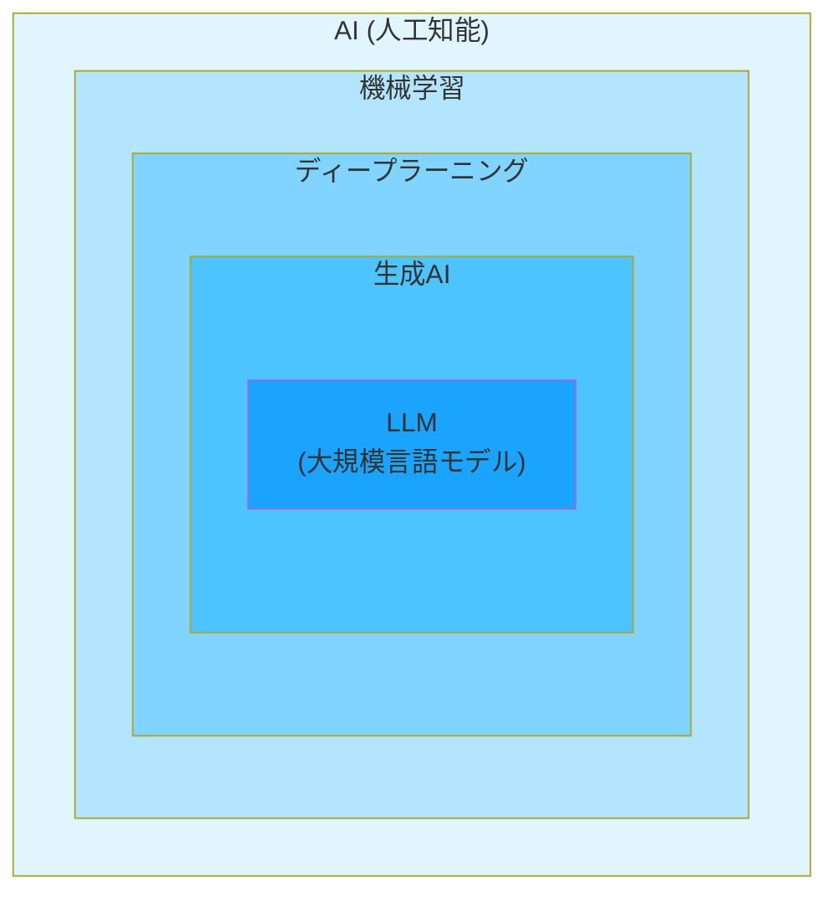
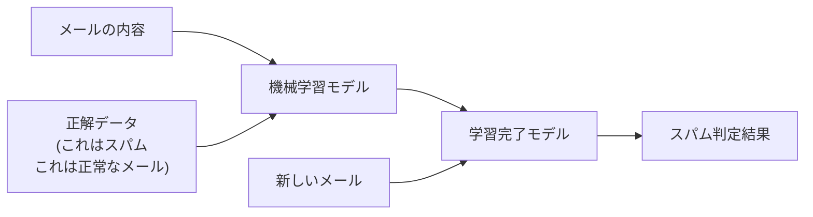
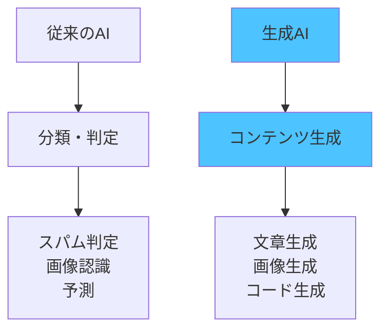
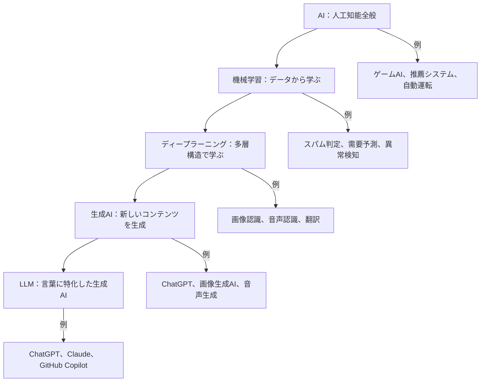

# AIの種類

AI駆動開発でよく耳にする「機械学習」「ディープラーニング」「生成AI」「LLM」といった用語について、それぞれの違いと関係性を説明します

## AI技術の全体像

まず、これらの技術がどのような関係にあるのかを見ていきます。

この図が示すように、各技術は階層構造になっています。つまり、外側の技術が内側の技術を含む関係です。

- **AI**が最も大きな概念
- その中に**機械学習**がある
- 機械学習の一種として**ディープラーニング**がある
- ディープラーニングを使った技術の1つが**生成AI**
- 生成AIの中で文章を扱うものが**LLM**

それでは、それぞれの技術を詳しく見ていきます。

## 機械学習：データから学ぶ技術

機械学習（Machine Learning）とは、前章でも説明したように、コンピュータが大量のデータからパターンや規則性を見つけ出して学習する技術です。

### 機械学習の3つの学習方法

機械学習には、大きく分けて3つの学習方法があります。

**1. 教師あり学習**

正解データとセットで学習する方法です。

例えば、スパムメール判定システムを作る場合、「これはスパム」「これは正常なメール」という正解データが付いたメールを大量に用意し、モデルに学習させます。

**2. 教師なし学習**

正解データなしで、データの中から特徴やグループを自動的に見つける方法です。

例えば、ECサイトの顧客データを分析して、似た購買行動をする顧客グループを自動的に分類します。「このグループは高価格商品を好む」「このグループは頻繁に購入する」といった特徴を、AIが自動的に発見します。

**3. 強化学習**

試行錯誤を繰り返して、最適な行動を学習する方法です。

「良い行動をしたら報酬を与え、悪い行動をしたらペナルティを与える」という方法で学習します。例えば、囲碁AIのAlphaGoは、何百万回もの対局を通じて強化学習で学習しました。

## ディープラーニング：脳の仕組みを模倣した学習

ディープラーニング（Deep Learning）は、機械学習の一種です。人間の脳の神経細胞のネットワーク（これを「ニューラルネットワーク」と呼びます）を真似た、多層の構造を持っています。

### ディープラーニングの構造

ディープラーニングの「多層」とは、複数の層を重ねた構造のことです。

各層では、前の層から受け取った情報を処理して、次の層に渡します。層を重ねることで、より複雑なパターンを理解できるようになります。

- **第1層**：単純な特徴（線や点など）を検出
- **第2層**：第1層の情報を組み合わせて、やや複雑な特徴（角や曲線など）を検出
- **第3層**：さらに組み合わせて、もっと複雑な特徴（耳の形や目の形など）を検出
- **第4層以降**：最終的に「猫である」という判断に必要な特徴を統合

層が深い（多い）ほど、複雑なパターンを学習できます。これが「ディープ（深い）ラーニング」と呼ばれる理由です。

### 機械学習とディープラーニングの違い

**機械学習**では、人間がデータの特徴を手動で抽出する必要がありました。

例えば、画像から猫を認識するシステムを作る場合、人間が「耳の形」「目の位置」「ひげの有無」といった特徴を事前に定義する必要がありました。

**ディープラーニング**では、特徴の抽出も自動的に学習します。

画像データを大量に与えるだけで、「どこに注目すれば猫だと判断できるか」をAI自身が発見します。これにより、人間が特徴を定義する手間が不要になり、より高い精度を実現できるようになりました。

### ディープラーニングが得意な分野

ディープラーニングは、以下の分野で特に高い性能を発揮します。

- **画像認識**：顔認証、自動運転の物体検出
- **音声認識**：スマートスピーカーの音声理解
- **自然言語処理**：機械翻訳、文章生成
- **動画解析**：動作認識、異常行動の検出

現在のAI駆動開発で使われるツール（ChatGPT、GitHub Copilotなど）は、すべてディープラーニングをベースにしています。

## 生成AI：新しいコンテンツを生み出す技術

生成AI（Generative AI）は、ディープラーニングを活用した技術の1つで、新しいコンテンツを生成することに特化したAIです。

### 従来のAIとの違い

**従来のAI**は、主に「分類」や「判定」を行っていました。

- スパムメールかどうかを判定する
- 画像に写っているものが猫かどうかを分類する
- 株価が上がるか下がるかを予測する

**生成AI**は、新しいコンテンツを生み出します。

- 文章を書く
- 画像を描く
- 音楽を作曲する
- プログラムコードを生成する

### 生成AIの種類

生成AIには、扱うコンテンツによって複数の種類があります。

**1. テキスト生成AI**

文章を生成します。ChatGPT、Claudeなどが代表例です。

- ブログ記事の執筆
- メールの下書き作成
- プログラムコードの生成
- ドキュメントの作成

**2. 画像生成AI**

画像を生成します。Stable Diffusion、Midjourney、DALL-Eなどが代表例です。

- プロンプト（文章での指示）から画像を生成
- 既存画像の編集や拡張
- デザイン案の作成

**3. 音声生成AI**

音声や音楽を生成します。

- テキストを自然な音声に変換
- 音楽の自動作曲
- 声質の変換

## LLM：言葉を理解する大規模モデル

LLM（Large Language Model：大規模言語モデル）は、生成AIの中でも特に「人間の言語を理解すること」に特化したAIです。

### LLMができること

**文章の理解**
- 質問の意図を理解
- 文章の要約
- 感情分析

**文章の生成**
- 質問への回答
- 文章の作成
- 翻訳

**コードの理解と生成**
- プログラムコードの説明
- コードの生成
- バグの発見と修正

## 各技術の関係を整理する

ここまで学んだ技術を、もう一度整理します。

**重要なポイント**

1. **包含関係**：外側の技術は内側の技術を含んでいます
2. **専門性の向上**：内側に行くほど、特定の用途に特化します
3. **AI駆動開発**：主にLLMと生成AIを活用します

## エンジニアが知るべき実践的な使い分け

実際の開発では、これらの技術をどう使い分けるのでしょうか。

### 機械学習を選ぶ場合

- データに基づいて判定や予測をしたい
- パターン認識や分類が目的
- 説明可能性が重要（なぜその判断をしたのか説明が必要）

**例**：ログ監視システム、需要予測、不正検知

### ディープラーニングを選ぶ場合

- 画像、音声、動画などの複雑なデータを扱う
- 人間が特徴を定義しにくい問題
- 大量のデータがある

**例**：顔認証システム、音声アシスタント、自動運転

### 生成AI（LLM）を選ぶ場合

- コンテンツを生成したい
- 自然言語での対話が必要
- コードやドキュメントを自動生成したい

**例**：ChatGPTでのコード生成、ドキュメント作成、GitHub Copilot

実際、現在のAI駆動開発では、**生成AI（特にLLM）** を活用するケースが大半です。そのため、本書でも主に生成AIとLLMに焦点を当てて解説していきます。

## まとめ

この章では、AI技術の全体像と、各技術の違いを学びました。

**技術の階層構造**
- AI > 機械学習 > ディープラーニング > 生成AI > LLM
- 内側に行くほど専門化し、AI駆動開発に直結する

**各技術の特徴**
- **機械学習**：データからパターンを学習する基本技術
- **ディープラーニング**：多層構造で複雑なパターンを学習
- **生成AI**：新しいコンテンツを生成することに特化
- **LLM**：言葉の理解と生成に特化した大規模モデル

**AI駆動開発での活用**
- 主に生成AI（LLM）を使う
- コード生成、デバッグ、ドキュメント作成などで活躍

次の章では、「機械学習とディープラーニングの違い」について、さらに詳しく掘り下げていきます。
