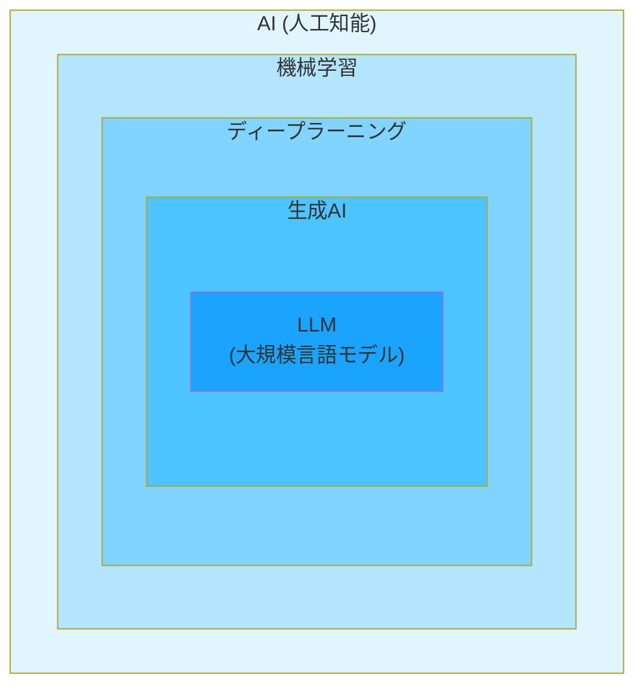
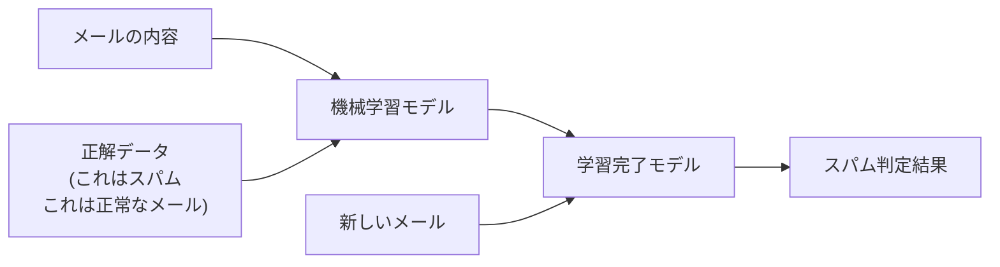
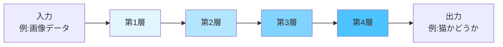
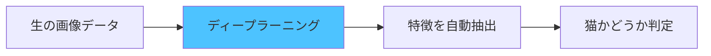
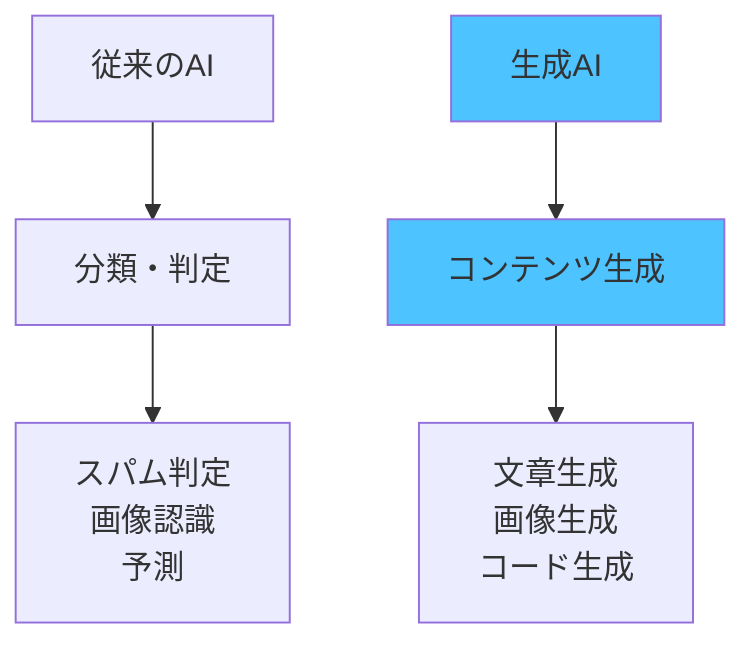
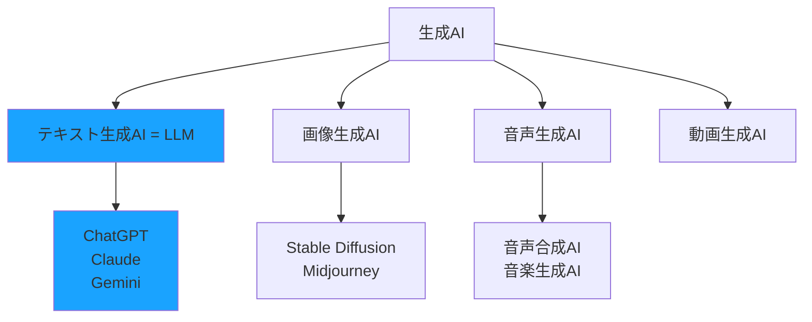
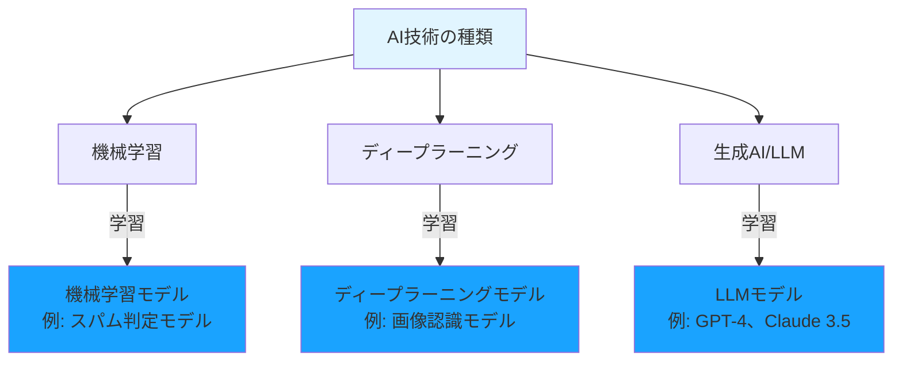
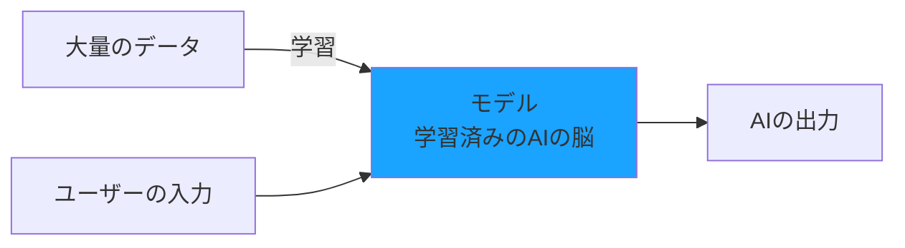
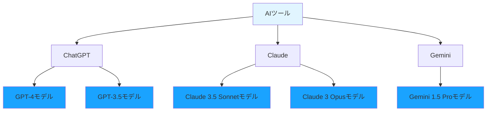

# AIの種類

AI駆動開発でよく耳にする「機械学習」「ディープラーニング」「生成AI」「LLM」といった用語について、それぞれの違いと関係性を説明します

## AI技術の全体像

まず、これらの技術がどのような関係にあるのかを見ていきます。

この図が示すように、各技術は階層構造になっています。つまり、外側の技術が内側の技術を含む関係です。

- **AI**が最も大きな概念
- その中に**機械学習**がある
- 機械学習の一種として**ディープラーニング**がある
- ディープラーニングを使った技術の1つが**生成AI**
- 生成AIの中で文章を扱うものが**LLM**

それでは、それぞれの技術を詳しく見ていきます。

## 機械学習：データから学ぶ技術

機械学習（Machine Learning）とは、前章でも説明したように、コンピュータが大量のデータからパターンや規則性を見つけ出して学習する技術です。

### 機械学習の3つの学習方法

機械学習には、大きく分けて3つの学習方法があります。

**1. 教師あり学習**

正解データとセットで学習する方法です。

例えば、スパムメール判定システムを作る場合、「これはスパム」「これは正常なメール」という正解データが付いたメールを大量に用意し、モデルに学習させます。

**2. 教師なし学習**

正解データなしで、データの中から特徴やグループを自動的に見つける方法です。

例えば、ECサイトの顧客データを分析して、似た購買行動をする顧客グループを自動的に分類します。「このグループは高価格商品を好む」「このグループは頻繁に購入する」といった特徴を、AIが自動的に発見します。

**3. 強化学習**

試行錯誤を繰り返して、最適な行動を学習する方法です。

「良い行動をしたら報酬を与え、悪い行動をしたらペナルティを与える」という方法で学習します。例えば、囲碁AIのAlphaGoは、何百万回もの対局を通じて強化学習で学習しました。

## ディープラーニング：脳の仕組みを模倣した学習

ディープラーニング（Deep Learning）は、機械学習の一種です。人間の脳の神経細胞のネットワーク（これを「ニューラルネットワーク」と呼びます）を真似た、多層の構造を持っています。

### ディープラーニングの構造

ディープラーニングの「多層」とは、複数の層を重ねた構造のことです。

各層では、前の層から受け取った情報を処理して、次の層に渡します。層を重ねることで、より複雑なパターンを理解できるようになります。

- **第1層**：単純な特徴（線や点など）を検出
- **第2層**：第1層の情報を組み合わせて、やや複雑な特徴（角や曲線など）を検出
- **第3層**：さらに組み合わせて、もっと複雑な特徴（耳の形や目の形など）を検出
- **第4層以降**：最終的に「猫である」という判断に必要な特徴を統合

層が深い（多い）ほど、複雑なパターンを学習できます。これが「ディープ（深い）ラーニング」と呼ばれる理由です。

### 機械学習とディープラーニングの違い

**機械学習**では、人間がデータの特徴を手動で抽出する必要がありました。

例えば、画像から猫を認識するシステムを作る場合、人間が「耳の形」「目の位置」「ひげの有無」といった特徴を事前に定義する必要がありました。

**ディープラーニング**では、特徴の抽出も自動的に学習します。

画像データを大量に与えるだけで、「どこに注目すれば猫だと判断できるか」をAI自身が発見します。これにより、人間が特徴を定義する手間が不要になり、より高い精度を実現できるようになりました。

### ディープラーニングが得意な分野

ディープラーニングは、以下の分野で特に高い性能を発揮します。

- **画像認識**：顔認証、自動運転の物体検出
- **音声認識**：スマートスピーカーの音声理解
- **自然言語処理**：機械翻訳、文章生成
- **動画解析**：動作認識、異常行動の検出

現在のAI駆動開発で使われるツール（ChatGPT、GitHub Copilotなど）は、すべてディープラーニングをベースにしています。

## 生成AI：新しいコンテンツを生み出す技術

生成AI（Generative AI）は、ディープラーニングを活用した技術の1つで、新しいコンテンツを生成することに特化したAIです。

### 従来のAIとの違い

**従来のAI**は、主に「分類」や「判定」を行っていました。

- スパムメールかどうかを判定する
- 画像に写っているものが猫かどうかを分類する
- 株価が上がるか下がるかを予測する

**生成AI**は、新しいコンテンツを生み出します。

- 文章を書く
- 画像を描く
- 音楽を作曲する
- プログラムコードを生成する

### 生成AIの種類

生成AIには、扱うコンテンツによって複数の種類があります。

**1. テキスト生成AI**

文章を生成します。ChatGPT、Claudeなどが代表例です。

- ブログ記事の執筆
- メールの下書き作成
- プログラムコードの生成
- ドキュメントの作成

**2. 画像生成AI**

画像を生成します。Stable Diffusion、Midjourney、DALL-Eなどが代表例です。

- プロンプト（文章での指示）から画像を生成
- 既存画像の編集や拡張
- デザイン案の作成

**3. 音声生成AI**

音声や音楽を生成します。

- テキストを自然な音声に変換
- 音楽の自動作曲
- 声質の変換

## LLM：言葉を理解する大規模モデル

LLM（Large Language Model：大規模言語モデル）は、生成AIの中でも特に「人間の言語を理解すること」に特化したAIです。

### LLMができること

**文章の理解**
- 質問の意図を理解
- 文章の要約
- 感情分析

**文章の生成**
- 質問への回答
- 文章の作成
- 翻訳

**コードの理解と生成**
- プログラムコードの説明
- コードの生成
- バグの発見と修正

## 生成AIとLLMの違い

### LLMは生成AIの一種

LLMは、生成AIの中で「テキスト（言語）」に特化したものです。

## モデルとは何か

ここまでAIの種類について学んできましたが、「モデル」という言葉も頻繁に耳にします。この「モデル」とは何でしょうか？

### モデルは「学習済みのAIの脳」

**モデル（Model）** とは、大量のデータで学習を完了したAIのことです。言い換えれば、「AIの脳」です。

先ほど説明した「機械学習」「ディープラーニング」「生成AI」「LLM」は**技術の種類**でした。一方、「モデル」はこれらの技術を使って**学習した結果できあがるもの**です。

- **技術**：AI、機械学習、ディープラーニング、生成AI、LLM（学習の方法）
- **モデル**：GPT-4、Claude 3.5 Sonnet、Gemini 1.5 Pro（学習の成果物）

### モデルの作成プロセス

例えば、ChatGPTで使われている「GPT-4」は、インターネット上の膨大なテキストデータで学習を完了したモデルです。このモデルがあるからこそ、私たちの質問に答えたり、コードを生成したりできます。

### モデルとAIツールの違い

**モデル**と**AIツール**は違うものです。

- **AIツール**：ChatGPT、Claude、Geminiなど、私たちが使うサービスやアプリケーション
- **モデル**：そのツールの中で動いているAIの脳（GPT-4、Claude 3.5 Sonnetなど）

同じツールでも、複数のモデルを選択できることがあります。

### モデルによって何が違う？

同じAIツールでも、モデルが違うと以下の点が変わります。

**1. 性能（賢さ）**

新しいモデルや大規模なモデルほど、複雑な問題を解けます。

- **GPT-4**：高度な推論や複雑なコード生成が得意
- **GPT-3.5**：シンプルな質問やコード生成に対応

**2. 速度**

小さいモデルほど、応答が速い傾向があります。

- **GPT-3.5**：応答が速い
- **GPT-4**：応答に時間がかかるが高精度

**3. コスト**

大規模なモデルほど、利用料金が高くなります。

- **GPT-3.5**：低コスト
- **GPT-4**：高コスト

**4. 得意分野**

モデルによって、得意な分野が異なります。

- **Claude 3.5 Sonnet**：長文の理解と生成が得意
- **GPT-4**：幅広いタスクに対応
- **Gemini 1.5 Pro**：Google検索との統合が得意

### AI駆動開発で使う主なモデル

AI駆動開発で使われる代表的なLLMモデルを紹介します。

**OpenAIのモデル（ChatGPT、GitHub Copilot）**
- **GPT-4 Turbo**：最も高性能。複雑なコード生成に最適
- **GPT-4o**：高性能で高速。バランスが良い
- **GPT-3.5 Turbo**：低コストで高速。シンプルなタスク向け

**Anthropicのモデル（Claude）**
- **Claude 3.5 Sonnet**：長文理解に優れ、複雑な推論が得意
- **Claude 3 Opus**：最高性能だが応答が遅い
- **Claude 3 Haiku**：高速で低コスト

**Googleのモデル（Gemini）**
- **Gemini 1.5 Pro**：長いコンテキストを扱える
- **Gemini 1.5 Flash**：高速で低コスト

### なぜモデルを理解する必要があるのか

AI駆動開発では、**適切なモデルを選ぶこと**が重要です。

- **複雑なコード生成**：高性能モデル（GPT-4、Claude 3.5 Sonnet）を使う
- **シンプルな質問**：低コストモデル（GPT-3.5、Claude 3 Haiku）で十分
- **長いコードの理解**：長文が得意なモデル（Claude 3.5 Sonnet）を使う

モデルの特徴を理解することで、タスクに応じて最適なAIを選択でき、開発効率とコストのバランスを取れます。

## まとめ

この章では、AI技術の種類とそれぞれの違いについて学びました。

### AI技術は入れ子構造になっている

**AI**という大きな概念の中に、**機械学習**があります。機械学習の一種として**ディープラーニング**があり、ディープラーニングを使った技術の1つが**生成AI**です。そして生成AIの中でテキストに特化したものが**LLM**です。

外側の技術が内側の技術を含む、入れ子構造になっています。

### それぞれの技術の役割

**機械学習**
- データからパターンを学習する基本技術
- スパム判定、需要予測、異常検知などに使われる

**ディープラーニング**
- 人間の脳を真似た多層構造で学習
- 画像認識、音声認識、翻訳などが得意
- 特徴を人間が定義する必要がなく、AIが自動で見つける

**生成AI**
- 新しいコンテンツを生成する技術
- 従来のAI（分類・判定）と違い、文章、画像、音声などを生み出せる
- テキスト生成AI、画像生成AI、音声生成AIなどがある

**LLM（大規模言語モデル）**
- 生成AIの中でテキストに特化したもの
- ChatGPT、Claude、Geminiなどがこれにあたる
- 文章の理解、生成、コード生成ができる

### 「技術」と「モデル」の違い

**技術**は学習の方法です（機械学習、ディープラーニング、LLMなど）。

**モデル**は学習した結果できあがるAIの脳です（GPT-4、Claude 3.5 Sonnetなど）。

ChatGPTは**AIツール**で、その中で動いているGPT-4が**モデル**です。同じツールでも複数のモデルを選べます。モデルによって性能、速度、コストが違います。

### AI駆動開発で使うのはLLM

AI駆動開発では、主に**LLM**を使います。

なぜなら、開発で扱うもの（コード、ドキュメント、設計書、バグレポート）はすべてテキストだからです。画像生成AIや音声生成AIも便利ですが、開発の中心はLLMです。

代表的なLLMモデル：
- **GPT-4 Turbo / GPT-4o**（OpenAI）：高性能でバランスが良い
- **Claude 3.5 Sonnet**（Anthropic）：長文理解と複雑な推論が得意
- **Gemini 1.5 Pro**（Google）：長いコンテキストを扱える

タスクに応じて適切なモデルを選ぶことで、開発効率とコストのバランスを取れます。
