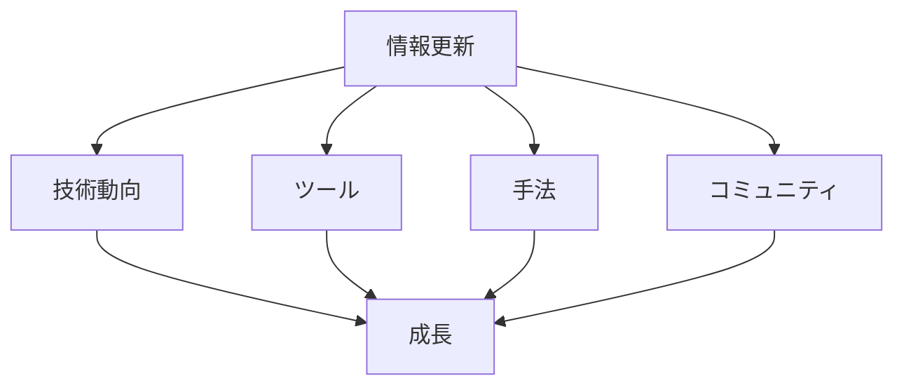

# AI の進化は早いので情報を更新しましょう

## 情報更新の重要性

### なぜ情報更新が必要か

AI 技術の急速な進化により、以下のような理由で情報の更新が不可欠です：

- 技術の進化スピード
- 新しい手法の登場
- ベストプラクティスの変化
- 競争力の維持

### 情報更新の要素

## 効果的な情報収集方法

### 1. 技術動向の把握

技術動向を把握する方法：

- 技術ブログの定期チェック
- カンファレンスへの参加
- 研究論文の読解
- コミュニティの活動

### 2. ツールの更新

新しいツールの情報収集：

- 公式ドキュメントの確認
- リリースノートの追跡
- ベータ版の試用
- ユーザーフィードバック

### 3. 手法の進化

新しい手法の学習：

- チュートリアルの実践
- ハンズオン演習
- コードレビュー
- ベストプラクティスの共有

## 実践的なアプローチ

### 情報収集の計画

効果的な情報収集の計画：

- 定期的なチェック
- 優先順位の設定
- 実践的な検証
- 知識の整理

### 情報の整理

収集した情報の整理方法：

- ドキュメント化
- ナレッジベースの構築
- チームでの共有
- 定期的な更新

## 成功のポイント

### 継続的な学習

継続的な学習のポイント：

- 習慣化
- 実践的な演習
- フィードバックの活用
- 知識の応用

### 情報の活用

収集した情報の活用方法：

- 実務での適用
- チームでの共有
- ベストプラクティスの確立
- 継続的な改善

## 実践的なアドバイス

### 情報更新のステップ

効果的な情報更新のステップ：

1. 情報源の特定
2. 定期的なチェック
3. 実践的な検証
4. 知識の整理
5. チームでの共有

### 成功への道筋

情報更新を成功させるポイント：

- 計画的なアプローチ
- 継続的な学習
- 実践的な検証
- チームでの共有

## まとめ

AI 技術の急速な進化に対応するためには、継続的な情報更新が不可欠です。計画的な情報収集、実践的な検証、そしてチームでの共有が重要です。
