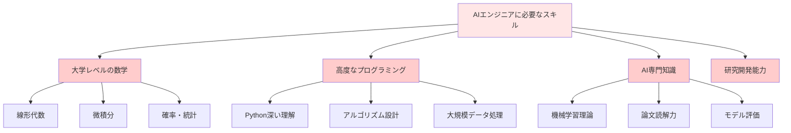
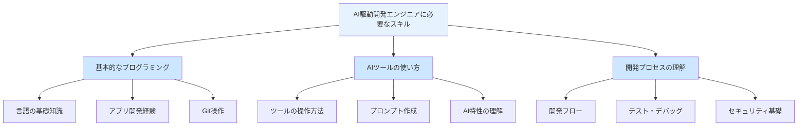
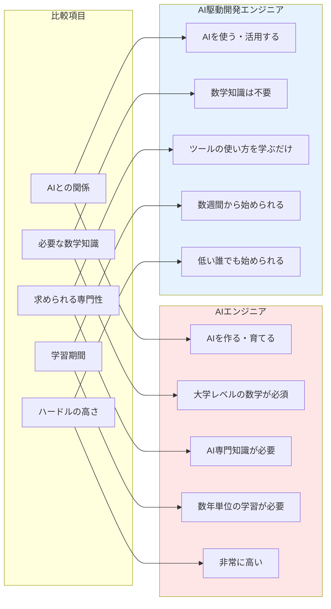
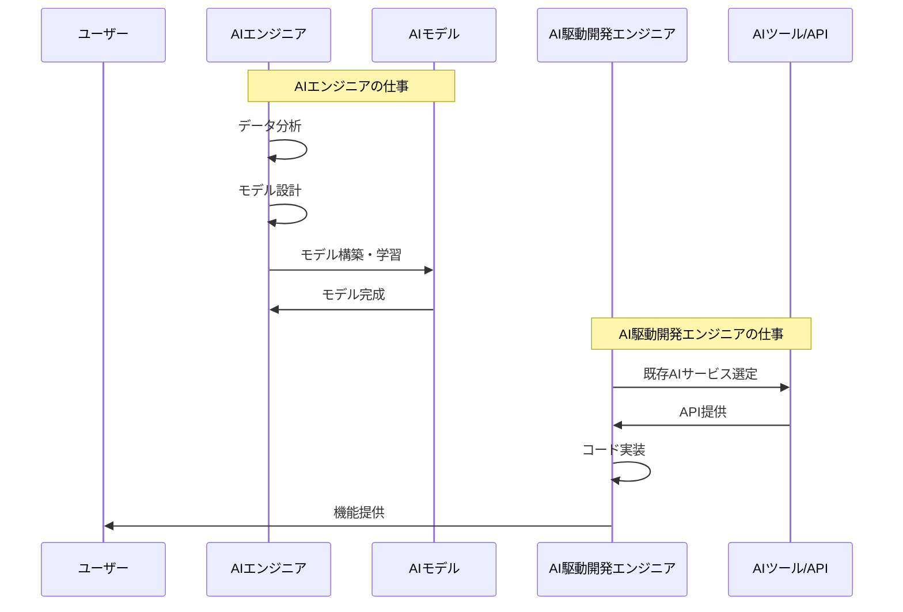
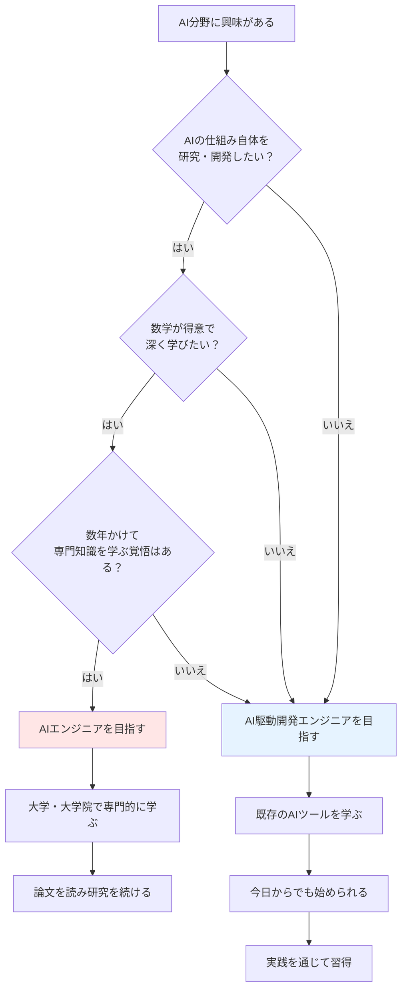

# AIエンジニアとAI駆動開発エンジニアの違い

「AIエンジニア」と「AI駆動開発エンジニア」、この2つは名前が似ていますが、全く別物です。

大きな違いは、「AIを育てる側」か「AIを使う側」かという点です。

その２つの違いについて理解しましょう

## AIエンジニア：AIを育てる側

AIエンジニアは、機械学習やディープラーニングなどの手法を用いて、AI自体を開発する専門家です。ChatGPTのようなAIツールを作る側の人たちです。

### AIエンジニアの主な仕事

**1. 機械学習モデルの開発**

新しいAIモデルを設計し、実装します。例えば、医療画像から病気を診断するAIや、工場の生産ラインで不良品を検出するAIなどを作ります。

**2. データの収集と前処理**

AIを学習させるための大量のデータを集めて、AIが学習しやすい形に整えます。例えば、100万枚の画像を集めて、それぞれに「これは猫」「これは犬」というラベルを付ける作業などです。

**3. モデルの学習と最適化**

AIに学習させて、精度を高めていきます。「なぜこのAIは誤判定するのか」「どうすればもっと精度を上げられるか」を分析し、改善します。

**4. 研究開発**

まだ世の中にない新しいAI技術を研究します。論文を読んだり、実験を繰り返したりして、最先端の技術を追求します。

### AIエンジニアに必要なスキル

AIエンジニアには、以下のような専門的な知識が必要です。

**数学の知識**
- **線形代数**：行列やベクトルの計算
- **微積分**：最適化のための微分計算
- **確率・統計**：データ分析や予測モデルの理解

これらは大学レベルの数学知識です。

**プログラミングスキル**
- Python（特にNumPy、TensorFlow、PyTorchなどのライブラリ）
- アルゴリズムとデータ構造の深い理解
- 大規模なデータ処理

**AI専門知識**
- 機械学習アルゴリズムの理論
- ディープラーニングの仕組み
- モデルの評価方法
- 最新の研究論文を読む力

### AIエンジニアのハードル

正直に言うと、AIエンジニアになるハードルは高いです。

- 大学や大学院でAI・機械学習を専門的に学ぶ必要がある
- 常に最新の論文を読んで勉強し続ける必要がある
- 数学が苦手な人には厳しい
- 実務経験を積むまでに時間がかかる

もしあなたが「数学は得意だし、AIの仕組み自体を作りたい！」という方なら、AIエンジニアを目指すのも良い選択です。しかし、多くのソフトウェアエンジニアにとっては、別のアプローチがあります。

## AI駆動開発エンジニア：AIを使う側

AI駆動開発エンジニアは、既存のAIツールを使いこなして、ソフトウェア開発の生産性を高めるエンジニアです。AIを作るのではなく、AIを活用する側です。

### AI駆動開発エンジニアの主な仕事

**1. AIツールを使った開発**

ChatGPT、GitHub Copilot、Cursorなどの既存のAIツールを使って、アプリケーションやWebサービスを開発します。

**2. プロンプトの作成**

AIに適切な指示（プロンプト）を出して、望む結果を得ます。「こういう機能を作ってほしい」「このバグを修正してほしい」と効果的に依頼する能力です。

**3. 開発プロセスの効率化**

テストコードの生成、ドキュメントの作成、コードレビューなど、開発の各工程でAIを活用して効率化します。

**4. AIを組み込んだアプリケーション開発**

ChatGPTのAPIを使ったチャットボットや、画像生成AIを組み込んだWebサービスなど、AIの機能を活用したアプリケーションを開発します。

### AI駆動開発エンジニアに必要なスキル

AI駆動開発エンジニアに必要なスキルは、一般的なソフトウェアエンジニアとほぼ同じです。特別な数学の知識は不要です。

**基本的なプログラミングスキル**
- プログラミング言語の理解（Python、JavaScript、Goなど）
- アプリケーション開発の基礎知識
- バージョン管理（Git）の使い方

**AIツールの使い方**
- ChatGPTやGitHub Copilotなどのツールの操作方法
- 効果的なプロンプトの書き方
- AIの得意・不得意の理解

**ソフトウェア開発の知識**
- 開発フローの理解
- デバッグやテストの方法
- セキュリティの基本

### AI駆動開発エンジニアのハードル

AI駆動開発エンジニアになるハードルは、AIエンジニアと比べて大幅に低いです。

- 特別な数学の知識は不要
- AI専門の論文を読む必要はない
- 既存のツールを使うだけなので、すぐに始められる
- 通常のソフトウェア開発スキルがあれば誰でも習得できる

つまり、あなたがすでにエンジニアとして働いているなら、今日からでもAI駆動開発エンジニアを目指せます。

## 2つの役割の違いを比較

ここまでの内容を表で整理します。

**AIとの関係**
- **AIエンジニア**：AIを作る・育てる
- **AI駆動開発エンジニア**：AIを使う・活用する

**必要な数学知識**
- **AIエンジニア**：線形代数、微積分、確率・統計など大学レベルの数学が必須
- **AI駆動開発エンジニア**：数学知識は不要

**求められる専門性**
- **AIエンジニア**：機械学習、ディープラーニングの深い理解、論文読解力
- **AI駆動開発エンジニア**：AIツールの使い方、プロンプト作成スキル

**学習期間**
- **AIエンジニア**：数年単位の学習が必要
- **AI駆動開発エンジニア**：数週間から始められる

**ハードルの高さ**
- **AIエンジニア**：非常に高い
- **AI駆動開発エンジニア**：低い（誰でも始められる）

## 実際の開発現場での役割の違い

具体的な開発現場で、2つの役割がどう違うのかを見てみます。

### ECサイトに商品推薦機能を追加する場合

**AIエンジニアの仕事**
1. ユーザーの購買履歴データを分析
2. 推薦アルゴリズムを設計
3. 機械学習モデルを構築
4. モデルを学習させて精度を調整
5. 本番環境にモデルをデプロイ

このプロセスには数ヶ月かかることもあります。

**AI駆動開発エンジニアの仕事**
1. OpenAIのAPIやAWSの推薦サービスなど、既存のAIサービスを調査
2. 選んだサービスをアプリケーションに組み込む
3. ChatGPTやCopilotを使ってコードを生成
4. AIツールでテストコードを自動生成
5. 動作確認して完成

このプロセスは数日から数週間で完了します。

## あなたはどちらを目指すべきか？

ここまで読んで、「自分はどちらを目指すべきか？」と考えているかもしれません。以下のフローチャートを参考にしてください。

**こんな人はAIエンジニアを目指すと良い**
- AIの仕組み自体に興味がある
- 数学が得意で、理論を学ぶのが好き
- 最先端の研究に携わりたい
- 数年かけてじっくり専門性を高めたい

**こんな人はAI駆動開発エンジニアを目指すと良い**
- AIを使って実用的なアプリケーションを作りたい
- 数学は苦手だけどAIは使いこなしたい
- 今すぐにでもAIを活用して開発したい
- 短期間で実践的なスキルを身につけたい

本書を読んでいるあなたは、おそらく後者のAI駆動開発エンジニアを目指す方だと思います。安心してください。AI駆動開発は、誰でも今日から始められます。

## まとめ

AIを活用するエンジニアには、2つの異なる道があります。

**AIエンジニア**
- AIを作る・育てる側
- 高度な数学知識とAI専門知識が必要
- ハードルは高いが、最先端の研究に携われる
- 数年単位の学習期間が必要

**AI駆動開発エンジニア**
- AIを使う・活用する側
- 特別な数学知識は不要
- ハードルは低く、誰でも始められる
- 数週間から実践できる

あなたがソフトウェア開発のスキルを持っていれば、AI駆動開発エンジニアとして今日からでもスタートできます。次の章では、AI駆動開発で使われる「生成AI」の仕組みと特徴について詳しく見ていきます。
