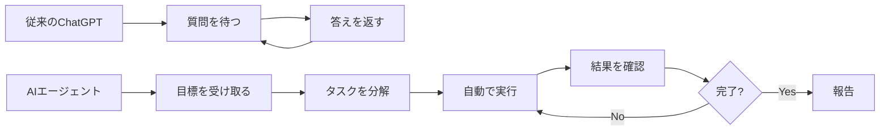
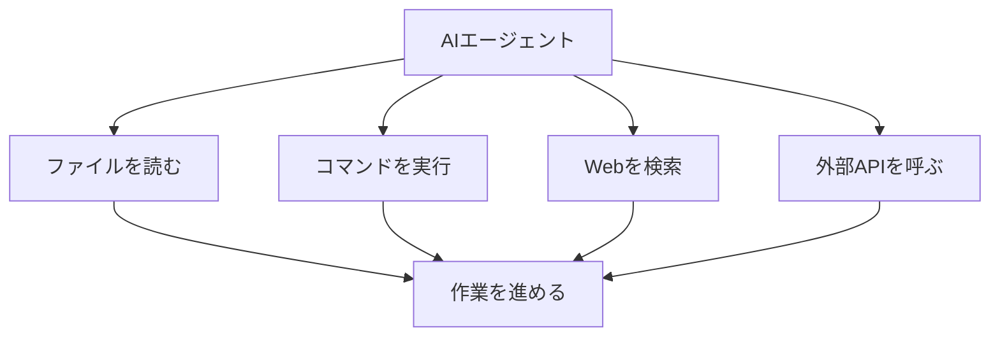
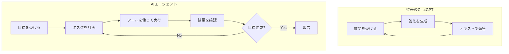
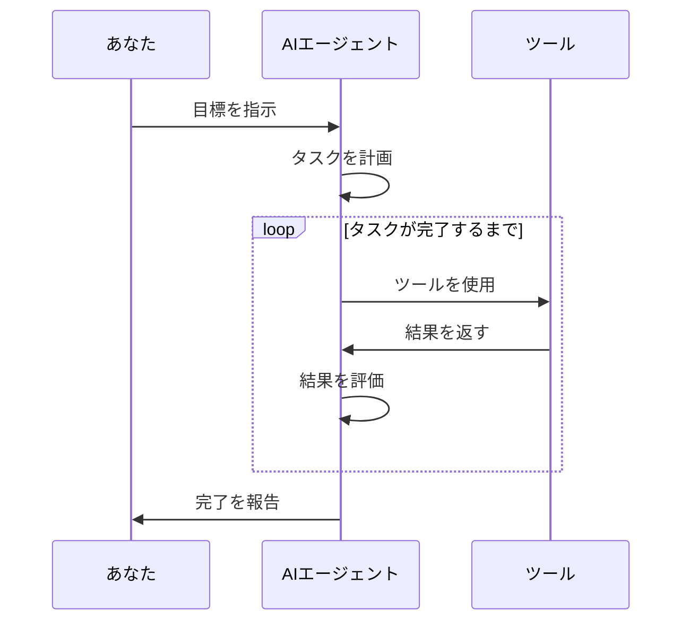

# AIエージェントとは

これまで、LLMやプロンプトといったAIの基本知識について学んできました。ChatGPTを使ったことがある方なら、「質問を投げるとAIが答えてくれる」という体験をしたことがあるでしょう。

しかし、AIの世界には、単に質問に答えるだけではない、もっと自立的に動くAIが登場しています。それが「AIエージェント」です。

## ChatGPTとAIエージェントの違い

まず、従来のChatGPTのような対話型AIと、AIエージェントの違いを見てみます。

### 従来のChatGPT（対話型AI）

従来のChatGPTは、こんな使い方をします。

```
あなた：「Pythonでファイルを読み込む方法を教えて」
ChatGPT：「Pythonでファイルを読み込むには、open()関数を使います...」
```

これは「一問一答型」のコミュニケーションです。あなたが質問するたびに、AIが答えを返してくれます。とても便利ですが、**あなたが質問しなければ、AIは何もしません**。

### AIエージェント

一方、AIエージェントはこんな動きをします。

```
あなた：「Webサイトを作って公開まで完了させて」
AIエージェント：
  1. 必要なファイルを自動で作成
  2. コードを書く
  3. テストを実行
  4. エラーがあれば自分で修正
  5. デプロイの準備
  6. 公開完了の報告
```

つまり、**あなたは最初に「何をしてほしいか」だけ伝えれば、あとはAIが自律的に作業を進めてくれます**。



## AIエージェントができること

AIエージェントは、次のような能力を持っています。

### 1. 自律的な行動

あなたが指示した目標に向かって、AIエージェント自身が「次に何をすべきか」を考えて実行します。

たとえば、「バグを修正して」と指示すると、以下のような作業を自動で行います。

1. エラーログを確認
2. 関連するコードを探す
3. 問題の原因を特定
4. 修正案を考える
5. コードを修正
6. テストを実行
7. テストが通るまで修正を繰り返す

### 2. ツールの使用

AIエージェントは、様々なツールを使って作業を進めます。

- **ファイル操作**：ファイルの読み書き、検索、編集
- **コマンド実行**：ターミナルコマンドの実行
- **Web検索**：最新情報の取得
- **外部サービス連携**：APIの呼び出し、データベース操作

従来のChatGPTは「提案」しかできませんでしたが、AIエージェントは実際に「実行」します。



### 3. 問題解決能力

作業中にエラーが発生しても、AIエージェントは自分で対処します。

たとえば、コードを実行してエラーが出た場合：

1. エラーメッセージを読む
2. 原因を分析する
3. 修正方法を考える
4. 修正を実行
5. 再度テスト
6. エラーが解消されるまで繰り返す

あなたは途中で介入する必要がありません。

## 具体的な活用例

AIエージェントがどのように役立つか、いくつかの例を見てみます。

### 例1：新しいプロジェクトの立ち上げ

**あなたの指示：**
「Node.jsでTodoアプリを作成して、テストも書いて」

**AIエージェントの動き：**

1. プロジェクトフォルダを作成
2. package.jsonを作成
3. 必要なライブラリをインストール
4. サーバーコードを作成
5. フロントエンドのHTMLを作成
6. テストコードを作成
7. テストを実行して動作確認
8. 「完了しました」と報告

### 例2：バグ調査と修正

**あなたの指示：**
「ユーザー登録機能でエラーが出ているので調査して修正して」

**AIエージェントの動き：**

1. エラーログを確認
2. 関連するコードファイルを探索
3. データベースのスキーマを確認
4. 問題箇所を特定（バリデーションの不足）
5. コードを修正
6. テストを実行
7. 修正内容を報告

### 例3：ドキュメント作成

**あなたの指示：**
「このプロジェクトのREADMEを作成して」

**AIエージェントの動き：**

1. プロジェクトの構造を分析
2. package.jsonから依存関係を確認
3. コードから機能を把握
4. セットアップ手順を確認
5. README.mdを作成
6. 図解も追加
7. 完成を報告

## AIエージェントと従来のAIの比較

ここまでの内容を表で整理します。

| 項目 | 従来のChatGPT | AIエージェント |
|------|--------------|--------------|
| 動き方 | あなたが質問するたびに答える | 目標を受け取ったら自律的に作業 |
| 主な役割 | アドバイザー、提案者 | 実行者、作業者 |
| ツール使用 | できない | できる（ファイル操作、コマンド実行など） |
| エラー対処 | 提案のみ | 自分で修正を試みる |
| 向いている作業 | 質問への回答、アイデア出し | 実装、テスト、デバッグ |



## AIエージェントの仕組み

AIエージェントは、どうやって自律的に動いているのでしょうか。簡単に仕組みを見てみます。

### 1. 目標の理解

まず、あなたの指示から「何を達成すべきか」を理解します。

```
指示：「Webサイトを作って」
↓
目標：完成したWebサイトを用意すること
```

### 2. タスクの分解

目標を達成するために必要な作業を細かく分解します。

```
目標：Webサイトを作る
↓
タスク：
- HTMLファイルを作成
- CSSファイルを作成
- JavaScriptファイルを作成
- 画像を配置
- ローカルサーバーで動作確認
```

### 3. ツールの選択と実行

各タスクに適したツールを選んで実行します。

```
タスク：HTMLファイルを作成
↓
ツール：ファイル書き込みツール
↓
実行：index.htmlを作成
```

### 4. 結果の確認

実行した結果を確認して、次の行動を決めます。

```
実行：テストを実行
↓
結果：エラーが発生
↓
次の行動：エラーを修正する
```



## AIエージェントの登場で何が変わるのか

AIエージェントの登場により、ソフトウェア開発は大きく変わります。

### 変化1：「質問力」から「目標設定力」へ

従来のChatGPTでは、「どう質問するか」が重要でした。しかしAIエージェントでは、「何を達成したいか」を明確に伝えることが重要になります。

**従来のChatGPT：**
「Pythonでファイルを読み込む方法を教えて」
「その方法でエラーが出たんだけど」
「このエラーの対処法は？」

**AIエージェント：**
「CSVファイルを読み込んでグラフを作成して」

### 変化2：「提案」から「実行」へ

従来は、AIが提案したコードをあなたがコピーして実行していました。AIエージェントは、提案だけでなく実行まで行います。

### 変化3：「単発作業」から「プロジェクト完遂」へ

従来は、一つ一つの作業をAIに質問していました。AIエージェントは、プロジェクト全体を通して作業を進められます。

## 代表的なAIエージェント

現在、いくつかのAIエージェントが利用可能です。

### Claude Code

Anthropic社が提供するAIエージェントです。ファイル操作、コマンド実行、Web検索などができます。この本の後半で詳しく扱います。

### Cursor（Agent機能）

コードエディタCursorに搭載されているAIエージェント機能です。エディタ内でファイルを作成・編集できます。

### Devin

ソフトウェア開発に特化したAIエージェントです。複雑なプロジェクトも自律的に進められます。

## 注意点

AIエージェントは強力ですが、注意すべき点もあります。

### 1. 完璧ではない

AIエージェントも間違えることがあります。生成したコードにバグが含まれる可能性もあります。

### 2. 最終確認は人間が行う

AIエージェントが作成したコードやファイルは、必ず人間が確認します。特にセキュリティに関わる部分は注意が必要です。

### 3. 目標の明確化が重要

曖昧な指示だと、AIエージェントは意図しない動きをします。「何を達成したいか」を明確に伝えることが重要です。

## まとめ

この章では、AIエージェントについて学びました。

- **従来のChatGPT**は「質問に答えてくれる賢いAI」
- **AIエージェント**は「自立してタスクをこなしてくれるAI」
- AIエージェントは、ツールを使って実際に作業を実行できる
- エラーが発生しても、自分で対処しながら目標を達成する
- 開発の流れが「質問と回答」から「目標設定と実行」に変わる

次の章では、AIをさらに強化する技術として「RAG」について学びます。AIエージェントと組み合わせることで、さらに強力な開発環境が構築できます。
