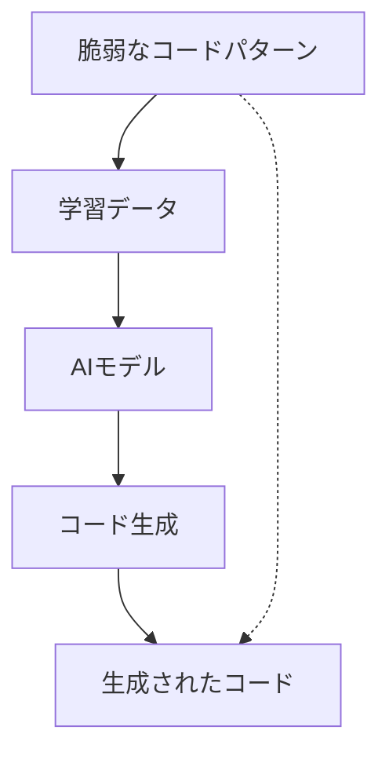
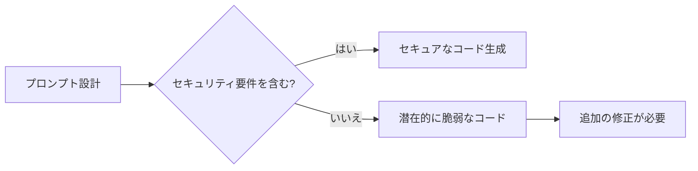

# AI 生成コードの脆弱性対策

AI 支援ツールによって生成されたコードは、開発を大幅に効率化できる一方、セキュリティの観点からいくつかの固有のリスクを持っています。本章では、AI 生成コードに潜む脆弱性とその対策について解説します。

## AI 生成コードの脆弱性の特徴

### 1. パターン化された脆弱性

AI 開発支援ツールは学習データに含まれるコードのパターンに基づいて新しいコードを生成します。学習データに脆弱なコードパターンが含まれていると、同様の脆弱性を持つコードが生成される可能性があります。



### 2. コンテキスト理解の限界

AI ツールは、セキュリティのコンテキストを完全に理解していないことがあります。特にアプリケーション固有のセキュリティ要件や、ビジネスロジックに関連する脆弱性を見落とす可能性があります。

### 3. 古いセキュリティプラクティス

AI モデルの学習データが古い場合、最新のセキュリティベストプラクティスが反映されていないコードが生成されることがあります。

### 4. 不完全な実装

AI は概念的に正しいコードを生成しても、実装の詳細が不完全または誤っている場合があり、その結果として脆弱性が生じることがあります。

## 一般的な脆弱性の種類とその対策

### 1. インジェクション攻撃の脆弱性

SQL インジェクション、XSS（クロスサイトスクリプティング）、コマンドインジェクションなどの脆弱性は AI 生成コードでも頻繁に見られます。

#### 対策：

- 生成されたクエリやコマンドを必ず検証する
- パラメータ化クエリを使用する
- 入力値のバリデーションと適切なエスケープ処理を徹底する

```javascript
// 悪い例（AI生成される可能性あり）
const query = `SELECT * FROM users WHERE username = '${username}'`;

// 良い例（パラメータ化クエリ）
const query = "SELECT * FROM users WHERE username = ?";
db.query(query, [username]);
```

### 2. 認証・認可の不備

AI ツールは認証や認可のロジックを生成する際に、不完全または安全でない実装を提案することがあります。

#### 対策：

- 認証・認可コードは特に注意深くレビューする
- 最新のセキュリティライブラリやフレームワークを使用する
- 多要素認証やセッション管理の実装は信頼できるライブラリを利用する

### 3. 機密情報の不適切な扱い

機密情報の保存や転送方法が不適切であるコードが AI によって生成される可能性があります。

#### 対策：

- 暗号化アルゴリズムとその実装を確認する
- ハードコードされたシークレットや API キーがないか確認する
- 機密情報は環境変数や安全な方法で管理する

```javascript
// 悪い例（AI生成される可能性あり）
const apiKey = "1234567890abcdef";

// 良い例
const apiKey = process.env.API_KEY;
```

### 4. セキュアでない依存関係

AI は古いバージョンのライブラリや脆弱性を含むパッケージを推奨することがあります。

#### 対策：

- 依存関係スキャンツールを使用して定期的に確認する
- 推奨されたパッケージのバージョンを最新のものに更新する
- 信頼できるソースからのパッケージのみを使用する

## AI 生成コードのセキュリティ確保のためのプロセス

### 1. セキュリティを意識したプロンプト設計



AI に対するプロンプトにセキュリティ要件を明示的に含めることで、より安全なコードを生成させることができます。

#### 例：

```
以下のユーザー入力をデータベースに保存するコードを生成してください。
ただし、SQLインジェクション攻撃を防ぐため、パラメータ化クエリを使用し、
入力値の適切なバリデーションを含めてください。
```

### 2. セキュリティコードレビュー

AI 生成コードには必ずセキュリティの観点からのコードレビューを実施しましょう。

- OWASP Top 10 などのチェックリストを使用する
- 静的コード解析ツールを導入する
- セキュリティの専門家によるレビューを定期的に行う

### 3. 自動テストの強化

AI 生成コードの脆弱性を検出するためのテストを強化します。

- セキュリティユニットテストの作成
- ファジングテストの実施
- 侵入テストの定期的な実施

### 4. 継続的なモニタリングと更新

- 脆弱性スキャンを定期的に実施する
- セキュリティパッチを迅速に適用する
- インシデント検出・対応の仕組みを整える

## AI 生成コードの脆弱性対策のベストプラクティス

1. **ゼロトラストアプローチ**: AI 生成コードは信頼せず、必ず検証する
2. **シフトレフト**: 開発の早い段階からセキュリティを考慮する
3. **継続的学習**: セキュリティチームと開発チームが最新の脅威について学び続ける
4. **セキュリティガイドライン**: AI 生成コードのレビュー基準を明確にする
5. **責任の明確化**: AI 生成コードであっても、最終的なセキュリティ責任は開発者にある

## まとめ

AI 生成コードは開発効率を大幅に向上させる強力なツールですが、セキュリティの観点からは注意が必要です。適切なプロンプト設計、厳格なコードレビュー、自動テストの強化、継続的なモニタリングなどのプロセスを確立することで、AI 生成コードの脆弱性リスクを最小限に抑えることができます。

AI ツールは優れたアシスタントですが、セキュリティの最終的な責任は人間の開発者にあることを忘れないでください。AI と人間の強みを組み合わせることで、効率的かつ安全なコード開発が可能になります。
