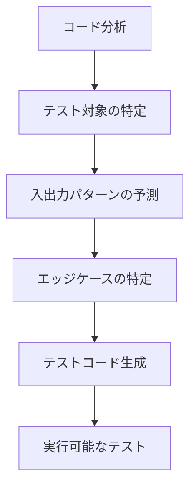
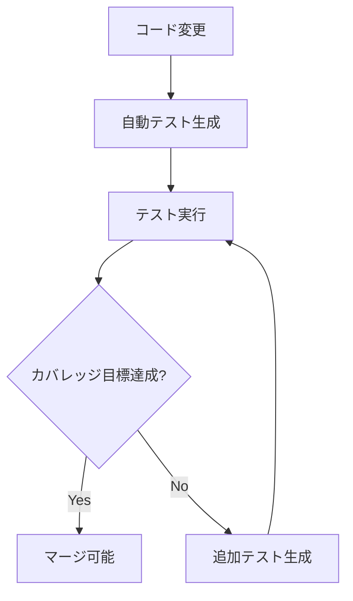
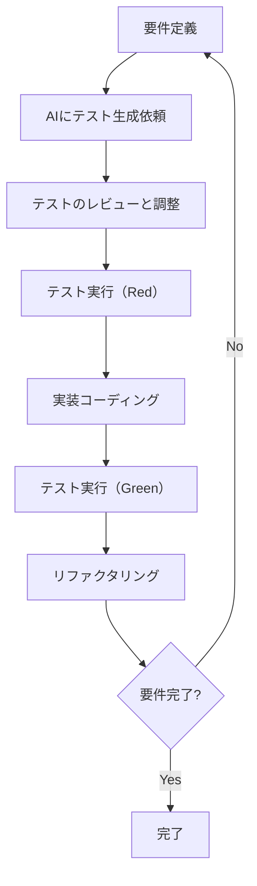

# AI 駆動ユニットテスト作成

## はじめに

ユニットテストは品質の高いソフトウェアを開発するために不可欠な要素ですが、多くの開発者にとって時間がかかり、しばしば後回しにされがちな作業です。AI 駆動開発の手法を活用することで、ユニットテスト作成の効率を大幅に向上させ、より包括的なテストカバレッジを実現できます。この章では、AI を活用したユニットテスト作成の方法と実践的なテクニックについて解説します。

## ユニットテストの重要性と課題

### ユニットテストの価値

ユニットテストには以下のような重要な価値があります：

1. **バグの早期発見**: 問題を開発サイクルの早い段階で発見できる
2. **リファクタリングの安全性確保**: コードを変更しても機能が壊れていないことを確認できる
3. **ドキュメントとしての役割**: テストコードが機能の使用方法を示す実例となる
4. **設計の改善**: テスト駆動開発（TDD）を通じて、より良い設計を促進する

### 従来のユニットテスト作成の課題

従来のユニットテスト作成には次のような課題がありました：

1. **時間とリソースの制約**: 十分なテストを書く時間が確保できない
2. **網羅性の確保**: すべてのエッジケースを考慮するのが難しい
3. **テストスキルの不足**: 効果的なテストの書き方に関する知識や経験の不足
4. **テスト維持の負担**: コード変更に合わせてテストも更新する必要がある
5. **モチベーション**: プロダクション機能と比べて優先度が低く感じられる

## AI を活用したユニットテスト作成の基本

### AI によるテスト生成の仕組み

AI を活用したユニットテスト生成は、以下のような流れで行われます：



AI はコードを理解し、以下の情報を抽出・予測します：

1. 関数やメソッドの入力パラメータとその型
2. 期待される戻り値や副作用
3. 例外処理や条件分岐
4. 潜在的なエッジケース

そしてこの情報をもとに、実行可能なテストコードを生成します。

### 主な AI テスト生成手法

#### 1. プロンプトベースのテスト生成

ChatGPT や Gemini などの LLM に対して、テスト対象のコードとテスト要件を入力し、テストコードを生成する方法です。

**プロンプト例**:

```
以下の関数に対するユニットテストを作成してください。テストフレームワークはJestを使用します。
境界値、null/undefined、一般的なケースをカバーするテストを含めてください。

function calculateDiscount(price, quantity) {
  if (price <= 0 || quantity <= 0) {
    throw new Error('Price and quantity must be positive');
  }

  let discount = 0;
  if (quantity >= 10) {
    discount = 0.1; // 10%
  } else if (quantity >= 5) {
    discount = 0.05; // 5%
  }

  return price * quantity * (1 - discount);
}
```

#### 2. IDE 統合型のテスト生成

GitHub Copilot などの開発環境に直接統合された AI ツールを使用する方法です。コードを選択して「テストを生成」などのコマンドを実行すると、コンテキストに合わせたテストコードが提案されます。

#### 3. 専用テスト生成ツール

ユニットテスト生成に特化した AI ツールを使用する方法です。これらのツールは多くの場合、より深いコード解析機能を持っています。

## 実践的な AI 駆動ユニットテスト作成テクニック

### 1. テスト対象コードの分析と準備

効果的なテスト生成のためには、AI にコードの構造や意図を明確に伝える必要があります：

1. **テスト対象を明確に特定**: テストしたい関数やクラスを明示する
2. **依存関係を整理**: 外部依存をモックする必要性を特定する
3. **ビジネスルールを説明**: コードの裏にある業務ルールを AI に伝える

例えば：

```javascript
// このユーザーサービスは、ユーザーの登録、認証、プロフィール更新を担当します
// データベース操作はUserRepositoryに委譲しています
// パスワードは保存前にハッシュ化する必要があります
class UserService {
  constructor(userRepository, passwordHasher) {
    this.userRepository = userRepository;
    this.passwordHasher = passwordHasher;
  }

  async registerUser(username, password, email) {
    // 既存ユーザーチェック
    const existingUser = await this.userRepository.findByUsername(username);
    if (existingUser) {
      throw new Error("Username already exists");
    }

    // パスワード検証
    if (password.length < 8) {
      throw new Error("Password must be at least 8 characters");
    }

    // ユーザー作成
    const hashedPassword = await this.passwordHasher.hash(password);
    return this.userRepository.create({
      username,
      password: hashedPassword,
      email,
      createdAt: new Date(),
    });
  }

  // 他のメソッド...
}
```

### 2. AI プロンプトの最適化

AI からより良いテストを生成するためのプロンプト設計のコツ：

1. **テストフレームワークを指定**: 使用したいテストフレームワーク（Jest、Mocha、PyTest 等）を明示する
2. **テストカバレッジの要件**: カバーしたいケースやエッジケースを具体的に挙げる
3. **モックの使用**: 外部依存のモック方法に関する指示を含める
4. **テストスタイル**: AAA（Arrange-Act-Assert）等の特定のパターンを希望する場合は明示する

**最適化プロンプト例**:

```
以下のUserServiceクラスのregisterUserメソッドに対するユニットテストを作成してください。

テスト要件:
1. テストフレームワーク: Jest
2. モックライブラリ: jest.mock
3. AAA（Arrange-Act-Assert）パターンに従う
4. 以下のテストケースをカバーする:
   - ユーザー名が既に存在する場合のエラー
   - パスワードが短すぎる場合のエラー
   - 正常にユーザーが登録できる場合
   - データベース接続エラーの処理
5. userRepositoryとpasswordHasherは適切にモックすること
6. 非同期処理を適切に処理すること

[コードをここに貼り付け]
```

### 3. 生成されたテストの評価と改善

AI が生成したテストをそのまま使うのではなく、以下の観点から評価・改善しましょう：

1. **テストの網羅性**: 重要なコードパスがすべてカバーされているか
2. **アサーションの適切さ**: 正しい値や状態が検証されているか
3. **テストの独立性**: 各テストは他のテストに影響されないか
4. **テストの可読性**: テストの意図が明確に理解できるか
5. **メンテナンス容易性**: コード変更時にテストの更新が容易か

問題があれば、AI に修正を依頼するか、自分で調整します。

### 4. テストデータの生成

効果的なテストには適切なテストデータが不可欠です。AI を活用して多様なテストデータを生成できます：

```javascript
// AIに依頼するプロンプト例
// 「以下のUser型に対する有効な10件のテストデータと、
// 各種バリデーションに失敗する5件の無効なデータを生成してください」

interface User {
  id?: number;
  username: string; // 4-20文字、英数字のみ
  email: string; // 有効なメールアドレス
  age: number; // 18以上
  role: "admin" | "user" | "guest";
  profile?: {
    firstName?: string,
    lastName?: string,
    bio?: string, // 最大200文字
  };
}
```

AI は上記のような型定義からバリデーションルールを理解し、適切なテストデータを生成できます。

### 5. CI/CD パイプラインとの統合

AI 駆動テスト生成を CI/CD パイプラインに統合することで、テストカバレッジの向上を自動化できます：



GitHub Actions の例：

```yaml
name: Generate Tests

on:
  pull_request:
    branches: [main]

jobs:
  generate-tests:
    runs-on: ubuntu-latest
    steps:
      - uses: actions/checkout@v2

      - name: Setup Node.js
        uses: actions/setup-node@v2
        with:
          node-version: "16"

      - name: Install dependencies
        run: npm install

      - name: Identify files without tests
        id: check-tests
        run: |
          FILES=$(node scripts/find-files-without-tests.js)
          echo "::set-output name=files::$FILES"

      - name: Generate tests with AI
        if: steps.check-tests.outputs.files != ''
        run: |
          for file in ${{ steps.check-tests.outputs.files }}; do
            node scripts/generate-tests-with-ai.js $file
          done

      - name: Create PR with generated tests
        uses: peter-evans/create-pull-request@v3
        with:
          title: "Add missing tests [AI generated]"
          body: "AI has generated tests for files that were missing test coverage."
          branch: "auto-generate-tests"
```

## フレームワーク別 AI 駆動テスト作成ガイド

### JavaScript/TypeScript（Jest）

Jest 用のテスト生成の例：

```javascript
// テスト対象コード: calculator.js
export function add(a, b) {
  if (typeof a !== "number" || typeof b !== "number") {
    throw new TypeError("Arguments must be numbers");
  }
  return a + b;
}
```

AI に依頼するプロンプト：

```
以下の関数に対するJestテストを作成してください。
標準ケース、型チェック、エラーハンドリングをカバーしてください。

[コードをここに貼り付け]
```

生成されるテスト例：

```javascript
// calculator.test.js
import { add } from "./calculator";

describe("add function", () => {
  test("adds two positive numbers correctly", () => {
    expect(add(1, 2)).toBe(3);
    expect(add(5, 7)).toBe(12);
  });

  test("handles negative numbers", () => {
    expect(add(-1, -2)).toBe(-3);
    expect(add(-5, 7)).toBe(2);
  });

  test("handles zero", () => {
    expect(add(0, 0)).toBe(0);
    expect(add(0, 5)).toBe(5);
  });

  test("handles decimal numbers", () => {
    expect(add(0.1, 0.2)).toBeCloseTo(0.3);
  });

  test("throws TypeError when non-number arguments are provided", () => {
    expect(() => add("1", 2)).toThrow(TypeError);
    expect(() => add(1, "2")).toThrow(TypeError);
    expect(() => add(null, 2)).toThrow(TypeError);
    expect(() => add(1, undefined)).toThrow(TypeError);
  });
});
```

### Python（PyTest）

PyTest でのテスト生成例：

```python
# テスト対象コード: user_validator.py
def validate_username(username):
    """
    ユーザー名のバリデーション
    - 3〜20文字
    - 英数字とアンダースコアのみ
    - 先頭は文字であること
    """
    import re
    if not isinstance(username, str):
        raise TypeError("Username must be a string")
    if len(username) < 3 or len(username) > 20:
        return False
    if not re.match(r'^[a-zA-Z][a-zA-Z0-9_]*$', username):
        return False
    return True
```

AI に依頼するプロンプト：

```
以下のPython関数に対するPyTestテストを作成してください。
パラメータ化テストを使用して多様なケースをカバーしてください。

[コードをここに貼り付け]
```

生成されるテスト例：

```python
# test_user_validator.py
import pytest
from user_validator import validate_username

def test_validate_username_type_error():
    """ユーザー名が文字列でない場合はTypeErrorを発生させる"""
    with pytest.raises(TypeError):
        validate_username(123)

    with pytest.raises(TypeError):
        validate_username(None)

@pytest.mark.parametrize("username,expected", [
    # 有効なユーザー名
    ("abc", True),
    ("user123", True),
    ("john_doe", True),
    ("a" * 20, True),

    # 無効なユーザー名
    ("ab", False),  # 短すぎる
    ("a" * 21, False),  # 長すぎる
    ("123user", False),  # 数字で始まる
    ("user-name", False),  # 不正な文字を含む
    ("user name", False),  # スペースを含む
])
def test_validate_username(username, expected):
    """様々なユーザー名パターンのバリデーション"""
    assert validate_username(username) == expected
```

### Java（JUnit）

JUnit でのテスト生成例：

```java
// テスト対象コード: StringUtils.java
public class StringUtils {
    /**
     * 文字列を逆順にする
     * @param input 入力文字列
     * @return 逆順にした文字列、nullの場合はnull
     */
    public static String reverse(String input) {
        if (input == null) {
            return null;
        }
        StringBuilder reversed = new StringBuilder();
        for (int i = input.length() - 1; i >= 0; i--) {
            reversed.append(input.charAt(i));
        }
        return reversed.toString();
    }
}
```

AI に依頼するプロンプト：

```
以下のJavaクラスに対するJUnit 5のテストクラスを作成してください。
静的メソッドのテスト、null処理、空文字列、通常ケースをカバーしてください。

[コードをここに貼り付け]
```

生成されるテスト例：

```java
// StringUtilsTest.java
import org.junit.jupiter.api.Test;
import org.junit.jupiter.params.ParameterizedTest;
import org.junit.jupiter.params.provider.CsvSource;
import org.junit.jupiter.params.provider.NullSource;
import static org.junit.jupiter.api.Assertions.*;

class StringUtilsTest {

    @Test
    void shouldReturnNullWhenInputIsNull() {
        assertNull(StringUtils.reverse(null));
    }

    @Test
    void shouldReturnEmptyStringWhenInputIsEmpty() {
        assertEquals("", StringUtils.reverse(""));
    }

    @ParameterizedTest
    @CsvSource({
        "a,a",
        "abc,cba",
        "hello,olleh",
        "A man a plan a canal Panama,amanaP lanac a nalp a nam A"
    })
    void shouldReverseString(String input, String expected) {
        assertEquals(expected, StringUtils.reverse(input));
    }

    @Test
    void shouldReverseSingleCharacter() {
        assertEquals("X", StringUtils.reverse("X"));
    }

    @Test
    void shouldReverseStringWithSpecialCharacters() {
        assertEquals("!@#$%", StringUtils.reverse("%$#@!"));
    }
}
```

## 高度な AI 駆動テスト作成テクニック

### 1. テスト駆動開発（TDD）との組み合わせ

TDD のサイクルに AI を組み込むことで、より効率的な開発が可能になります：



1. 要件定義を行い、AI にテストケースを生成させる
2. 生成されたテストをレビューし、必要に応じて調整
3. テストを実行し、「赤」（失敗）を確認
4. 実装コードを記述
5. テストを再実行し、「緑」（成功）を確認
6. コードをリファクタリング

### 2. プロパティベーステストとの組み合わせ

AI を活用して、プロパティベーステスト（特定の性質を持つことを検証するテスト）を生成する方法：

```javascript
// AIに依頼するプロンプト:
// 「sort関数に対するプロパティベーステストを生成してください。
// 以下の性質をテストしたいです：
// 1. ソート後の配列の長さは元の配列と同じ
// 2. ソート後の配列はソート済みである（昇順）
// 3. ソート後の配列は元の配列の並べ替えである（同じ要素を含む）」

// 生成されるテスト例：
const fc = require("fast-check");

describe("Array sort property tests", () => {
  test("sorted array has same length as original", () => {
    fc.assert(
      fc.property(fc.array(fc.integer()), (arr) => {
        const sorted = [...arr].sort((a, b) => a - b);
        return sorted.length === arr.length;
      })
    );
  });

  test("sorted array is actually sorted", () => {
    fc.assert(
      fc.property(fc.array(fc.integer()), (arr) => {
        const sorted = [...arr].sort((a, b) => a - b);
        for (let i = 1; i < sorted.length; i++) {
          if (sorted[i] < sorted[i - 1]) return false;
        }
        return true;
      })
    );
  });

  test("sorted array contains same elements as original", () => {
    fc.assert(
      fc.property(fc.array(fc.integer()), (arr) => {
        const sorted = [...arr].sort((a, b) => a - b);
        // 配列をカウントマップに変換して比較
        const countMap = (array) => {
          return array.reduce((map, item) => {
            map.set(item, (map.get(item) || 0) + 1);
            return map;
          }, new Map());
        };

        const originalMap = countMap(arr);
        const sortedMap = countMap(sorted);

        if (originalMap.size !== sortedMap.size) return false;

        for (const [key, count] of originalMap) {
          if (sortedMap.get(key) !== count) return false;
        }

        return true;
      })
    );
  });
});
```

### 3. モックとスタブの自動生成

複雑な依存関係を持つコードのテストでは、モックやスタブの生成が重要です。AI はコードを分析し、適切なモックを自動生成できます：

```typescript
// AIに依頼するプロンプト:
// 「以下のOrderServiceクラスに対するテストを作成し、
// 依存するPaymentServiceとNotificationServiceの適切なモックを生成してください」

// テスト対象クラス
class OrderService {
  constructor(
    private paymentService: PaymentService,
    private notificationService: NotificationService
  ) {}

  async placeOrder(
    userId: string,
    items: OrderItem[],
    paymentInfo: PaymentInfo
  ): Promise<Order> {
    // 注文の作成
    const order = new Order(userId, items);

    // 支払い処理
    try {
      const paymentResult = await this.paymentService.processPayment(
        userId,
        order.totalAmount,
        paymentInfo
      );

      if (paymentResult.status === "success") {
        order.status = "paid";

        // 通知送信
        await this.notificationService.sendOrderConfirmation(userId, order);

        return order;
      } else {
        order.status = "payment_failed";
        order.statusReason = paymentResult.message;
        return order;
      }
    } catch (error) {
      order.status = "error";
      order.statusReason = error.message;
      return order;
    }
  }
}
```

生成されるテスト例：

```typescript
// OrderService.test.ts
import { OrderService } from "./OrderService";
import { PaymentService } from "./PaymentService";
import { NotificationService } from "./NotificationService";
import { Order, OrderItem, PaymentInfo } from "./types";

// モックの作成
jest.mock("./PaymentService");
jest.mock("./NotificationService");

describe("OrderService", () => {
  // テスト前の準備
  let orderService: OrderService;
  let mockPaymentService: jest.Mocked<PaymentService>;
  let mockNotificationService: jest.Mocked<NotificationService>;

  const testUserId = "user123";
  const testItems: OrderItem[] = [
    { id: "item1", name: "Test Item 1", price: 10.0, quantity: 2 },
  ];
  const testPaymentInfo: PaymentInfo = {
    cardNumber: "4111111111111111",
    expiryDate: "12/25",
    cvv: "123",
  };

  beforeEach(() => {
    // モックのリセットとインスタンス化
    jest.clearAllMocks();
    mockPaymentService = new PaymentService() as jest.Mocked<PaymentService>;
    mockNotificationService =
      new NotificationService() as jest.Mocked<NotificationService>;
    orderService = new OrderService(
      mockPaymentService,
      mockNotificationService
    );
  });

  test("should process order successfully when payment succeeds", async () => {
    // Arrange
    mockPaymentService.processPayment.mockResolvedValue({
      status: "success",
      transactionId: "tx123",
    });
    mockNotificationService.sendOrderConfirmation.mockResolvedValue(undefined);

    // Act
    const result = await orderService.placeOrder(
      testUserId,
      testItems,
      testPaymentInfo
    );

    // Assert
    expect(result.status).toBe("paid");
    expect(mockPaymentService.processPayment).toHaveBeenCalledWith(
      testUserId,
      result.totalAmount,
      testPaymentInfo
    );
    expect(mockNotificationService.sendOrderConfirmation).toHaveBeenCalledWith(
      testUserId,
      expect.any(Order)
    );
  });

  test("should mark order as failed when payment fails", async () => {
    // Arrange
    const failureMessage = "Insufficient funds";
    mockPaymentService.processPayment.mockResolvedValue({
      status: "failed",
      message: failureMessage,
    });

    // Act
    const result = await orderService.placeOrder(
      testUserId,
      testItems,
      testPaymentInfo
    );

    // Assert
    expect(result.status).toBe("payment_failed");
    expect(result.statusReason).toBe(failureMessage);
    expect(
      mockNotificationService.sendOrderConfirmation
    ).not.toHaveBeenCalled();
  });

  test("should handle exceptions from payment service", async () => {
    // Arrange
    const errorMessage = "Service unavailable";
    mockPaymentService.processPayment.mockRejectedValue(
      new Error(errorMessage)
    );

    // Act
    const result = await orderService.placeOrder(
      testUserId,
      testItems,
      testPaymentInfo
    );

    // Assert
    expect(result.status).toBe("error");
    expect(result.statusReason).toBe(errorMessage);
    expect(
      mockNotificationService.sendOrderConfirmation
    ).not.toHaveBeenCalled();
  });
});
```

## 実用的な Tips

### AI が生成したテストのデバッグ

AI が生成したテストが動作しない場合は、以下のステップでデバッグします：

1. **依存関係の確認**: 必要なライブラリやインポートが正しいか
2. **環境の違い**: AI が想定した環境と実際の環境の違いを特定する
3. **段階的な修正**: 一部のテストだけを実行し、問題を特定する
4. **エラーメッセージの活用**: エラーメッセージを AI に提供し解決策を得る

### テスト品質の向上

AI が生成したテストの品質を向上させるためのチェックリスト：

1. **テスト名の明確さ**: 各テストが何をテストしているかが明確か
2. **アサーションの適切さ**: 適切な値や状態が検証されているか
3. **DRY 原則**: テスト間で重複するコードがないか
4. **セットアップとクリーンアップ**: テスト前後の環境が適切に設定・クリーンアップされるか
5. **テスト独立性**: テスト同士が干渉しないか

### テストメンテナンスの効率化

AI を活用してテストのメンテナンスも効率化できます：

1. **テスト更新の自動化**: コード変更時に AI にテスト更新を依頼
2. **テストリファクタリング**: 複雑化したテストの整理を AI に依頼
3. **テストドキュメント生成**: テストから機能説明ドキュメントを生成

## まとめ

AI 駆動ユニットテスト作成は、以下のような多くのメリットをもたらします：

1. **開発速度の向上**: テスト作成の時間を大幅に削減
2. **テストカバレッジの向上**: 人間が見落としがちなエッジケースも含めた包括的なテスト
3. **テスト品質の向上**: 構造化された一貫性のあるテスト
4. **テストスキルの向上**: AI 生成テストから学ぶことでテスト技術の向上
5. **テスト文化の促進**: テスト作成の障壁を下げることでテスト文化を促進

AI を活用することで、テスト作成はもはや面倒な作業ではなく、効率的かつ効果的なプロセスとなります。AI が提案するテストをベースに、開発者の知識と経験を組み合わせることで、最高品質のテストスイートを構築できるでしょう。

AI をテスト作成の「助手」として活用し、継続的に学習・改善しながら、より堅牢で信頼性の高いソフトウェアを開発していきましょう。
