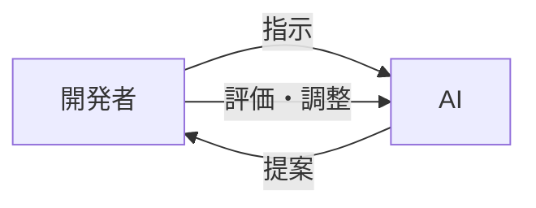

# AI駆動開発でエンジニアの仕事はどう変わる？

AIの登場により、これまで何時間もかかっていた作業が数分で終わるようになりました。この章では、AI駆動開発でエンジニアの仕事がどう変わるのか、生産性がどれほど向上するのかを見ていきます。

## エンジニアの役割はどう変わるのか

AI駆動開発では、開発者は「AIに指示を出す人」「AIの提案を評価する人」へと役割が変わります。

**開発者の役割**
- 何を作るか決める
- AIの提案を評価する
- 必要に応じて調整する

**AIの役割**
- コードを提案する
- テストケースを生成する
- エラーを解析する
- ドキュメントを作成する

## 実際の開発作業はどう変わるのか

### コーディング
「ユーザー登録機能を作って」と指示すると、AIがコードを提案してくれます。提案されたコードを確認し、調整すれば完成です。

### テスト
「この関数のテストを作って」と頼むと、正常系・異常系・エッジケースのテストを自動生成してくれます。

### デバッグ
エラーメッセージをAIに見せると、原因と修正方法を教えてくれます。

### ドキュメント
AIにドキュメントの作成を依頼すると、関数の説明やAPIの使い方を自動生成してくれます。

## どれくらい生産性が変わるのか

Webアプリケーション開発の例：

| 開発フェーズ | 従来 | AI駆動 | 短縮率 |
|:---:|:---:|:---:|:---:|
| フロントエンド | 14日 | 7日 | 50% |
| バックエンド | 21日 | 10日 | 52% |
| テスト | 7日 | 3日 | 57% |
| デバッグ | 7日 | 3日 | 57% |
| **合計** | **49日** | **23日** | **53%** |

**開発期間が半分以下になります。**

さらに以下のような効果も：

- 単純作業が減り、創造的な作業に集中できる
- テストケースが充実し、バグが減る
- 深夜までのデバッグ作業が減る

## 1日の作業量の違い

### 従来の開発
- 1機能の実装（テスト・ドキュメント未完）
- デバッグで時間を消費

### AI駆動開発
- 2機能の実装（テスト・ドキュメント完了）
- 学習時間も確保可能

## まとめ

AI駆動開発では、開発者の役割が変わります。すべてを手作業で行うのではなく、AIと協力しながら効率的に開発を進めるスタイルです。

適切な指示の出し方や、AIの提案を評価するスキルが重要になります。次の章から、具体的な活用方法を学んでいきましょう。
