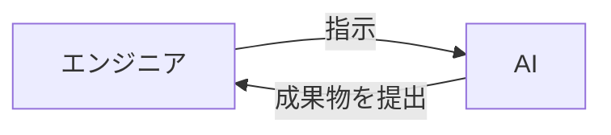

# AI駆動開発でエンジニアの仕事はどう変わる？

AIの登場により、これまで何時間もかかっていた作業が数分で終わるようになりました。この章では、AI駆動開発でエンジニアの仕事がどう変わるのか、生産性がどれほど向上するのかを見ていきます。

## エンジニアの役割はどう変わるのか

AI駆動開発では、エンジニアは「作業者」から「AIへの指示を出す人」へと役割が変わります。
つまりAIという部下を持つマネージャーへ昇格するのです。

**エンジニアの役割**
- 指示を出す
- AIの成果物をチェックする

**AIの役割**
- コードの作成
- テストコードの作成
- ドキュメントの作成
など

## どれくらい生産性が変わるのか

| 開発フェーズ | 従来 | AI駆動 |
|:---:|:---:|:---:|
| コーディング | 14日 | 7日 |
| テスト | 7日 | 3日 |
| **合計** | **21日** | **10日** |

**開発期間が半分以下になります。**

## まとめ

AI駆動開発では、エンジニアの役割が変わります。すべてを手作業で行うのではなく、AIと協力しながら効率的に開発を進めるスタイルです。

適切な指示の出し方や、AIの提案を評価するスキルが重要になります。

次の章から、AIの基本について学んでいきましょう
