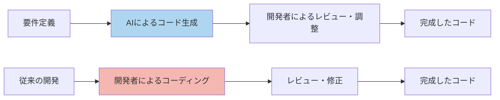
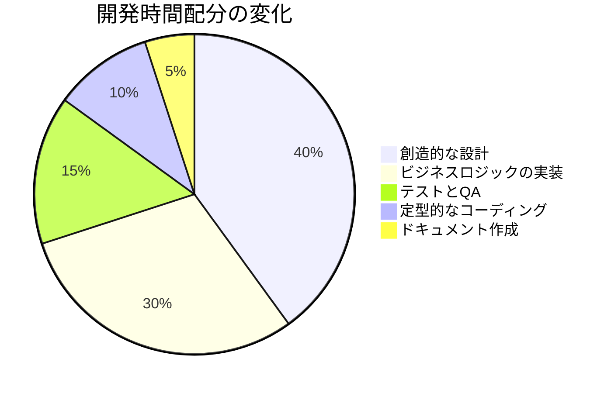
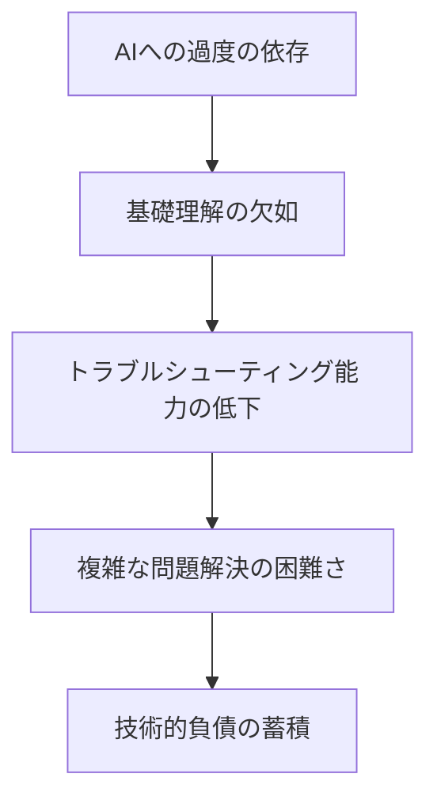
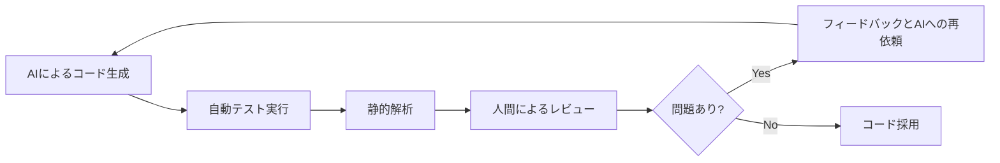
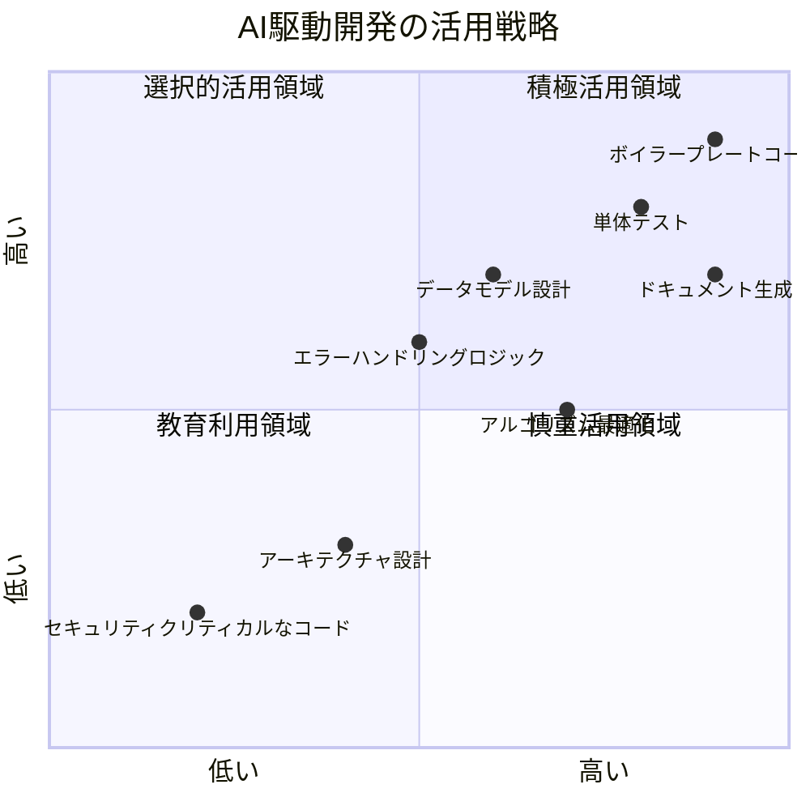

# AI 駆動開発のメリットと課題

AI 駆動開発は、ソフトウェア開発の方法論に革命をもたらしています。本章では、AI 駆動開発がもたらす様々なメリットと、導入・運用時に直面する可能性のある課題について詳しく解説します。

## AI 駆動開発のメリット

### 1. 開発速度の劇的な向上

AI 駆動開発の最も顕著なメリットは、開発速度の向上です。

#### コード生成の高速化

AI ツールを活用することで、以下のようなコード生成が高速化されます：

- ボイラープレートコードの自動生成
- 反復的なコードパターンの素早い実装
- データモデルや API エンドポイントの自動生成



実際のプロジェクトでは、以下のような効率化が報告されています：

```
- 基本的なCRUD機能の実装：従来の1/10の時間
- UI要素の実装：従来の1/5の時間
- 一般的なアルゴリズムの実装：従来の1/3の時間
```

#### 問題解決の加速

AI は問題解決も加速します：

- エラーメッセージの解析と解決策の提案
- パフォーマンスボトルネックの特定と最適化提案
- バグの原因特定と修正案の提示

### 2. コード品質の向上

AI ツールは、開発速度だけでなくコード品質も向上させることができます。

#### ベストプラクティスの自動適用

AI は膨大なコードベースから学習しているため、業界のベストプラクティスを自然に取り入れます：

- デザインパターンの適切な適用
- エラーハンドリングの完全実装
- セキュリティ対策の組み込み

#### 一貫性の確保

AI は忘れたり疲れたりしないため、コードの一貫性を保つのに役立ちます：

- 命名規則の統一
- コードスタイルの一貫性
- ドキュメントの整合性

### 3. 学習曲線の短縮

AI 駆動開発は、新しい技術の習得を大幅に加速します。

```javascript
// 例: Reactを学びたい開発者がAIに尋ねる
// 「Reactでフォーム送信と状態管理を実装するコードを生成してください」

// AIが生成するサンプルコード
import React, { useState } from "react";

function ContactForm() {
  const [formData, setFormData] = useState({
    name: "",
    email: "",
    message: "",
  });

  const [errors, setErrors] = useState({});
  const [isSubmitting, setIsSubmitting] = useState(false);

  const handleChange = (e) => {
    const { name, value } = e.target;
    setFormData({
      ...formData,
      [name]: value,
    });
  };

  const validate = () => {
    // バリデーションロジック
    let newErrors = {};
    if (!formData.name) newErrors.name = "名前は必須です";
    if (!formData.email) newErrors.email = "メールアドレスは必須です";
    else if (!/\S+@\S+\.\S+/.test(formData.email)) {
      newErrors.email = "メールアドレスの形式が不正です";
    }
    return newErrors;
  };

  const handleSubmit = async (e) => {
    e.preventDefault();
    const newErrors = validate();

    if (Object.keys(newErrors).length > 0) {
      setErrors(newErrors);
      return;
    }

    try {
      setIsSubmitting(true);
      // APIリクエストなどの非同期処理
      // await submitFormData(formData);
      alert("送信成功！");
      setFormData({ name: "", email: "", message: "" });
      setErrors({});
    } catch (error) {
      console.error("エラー:", error);
      alert("送信に失敗しました");
    } finally {
      setIsSubmitting(false);
    }
  };

  return (
    <form onSubmit={handleSubmit}>
      <div>
        <label htmlFor="name">名前</label>
        <input
          type="text"
          id="name"
          name="name"
          value={formData.name}
          onChange={handleChange}
        />
        {errors.name && <p>{errors.name}</p>}
      </div>

      <div>
        <label htmlFor="email">メールアドレス</label>
        <input
          type="email"
          id="email"
          name="email"
          value={formData.email}
          onChange={handleChange}
        />
        {errors.email && <p>{errors.email}</p>}
      </div>

      <div>
        <label htmlFor="message">メッセージ</label>
        <textarea
          id="message"
          name="message"
          value={formData.message}
          onChange={handleChange}
        />
      </div>

      <button type="submit" disabled={isSubmitting}>
        {isSubmitting ? "送信中..." : "送信"}
      </button>
    </form>
  );
}
```

このコードを分析することで、React の基本的な概念（状態管理、フォーム処理、バリデーション）を効率的に学べます。

#### 新技術の習得

AI ツールを活用することで、新しい言語やフレームワークの学習が加速します：

- 典型的な実装パターンの即時生成
- 概念の実践的な説明
- 動作する例の提供

#### ベストプラクティスの学習

AI は単にコードを生成するだけでなく、なぜそのように実装するのかを説明することもできます：

```
「このコードでは、React Hooksを使用して状態管理を行っています。
クラスコンポーネントではなく関数コンポーネントを使用するのは、
よりシンプルで読みやすいコードを書くためのモダンなアプローチです。
useStateフックを使うことで、コンポーネントの状態を簡潔に管理できます。」
```

### 4. リソース最適化

AI 駆動開発により、開発リソースの最適化が可能になります。

#### 人的リソースの有効活用

開発者は単純な実装作業から解放され、より創造的で価値の高い業務に集中できます：



#### コスト削減

多くの組織では、AI 駆動開発の導入によって以下のようなコスト削減効果が報告されています：

- 開発期間の短縮による人件費削減
- バグ修正コストの低減
- 保守コストの削減

### 5. ドキュメント自動化

AI はコードからドキュメントを自動生成することができます。

#### API 仕様書の自動生成

```python
# このPythonコードから
def calculate_order_total(items, tax_rate, discount_code=None):
    """
    商品リストから注文合計金額を計算します。

    Args:
        items (list): 商品オブジェクトのリスト。各オブジェクトはname, price, quantityを含む
        tax_rate (float): 適用する税率（0.1は10%を意味する）
        discount_code (str, optional): 適用する割引コード

    Returns:
        dict: 以下のキーを含む辞書
            - subtotal: 税抜きの小計
            - tax: 税額
            - discount: 割引額
            - total: 最終合計金額

    Raises:
        ValueError: 無効なitems引数や負の数量が指定された場合
    """
    # 実装コード
```

AI は上記のコードから、詳細な API ドキュメントを自動生成できます。

#### コメントとドキュメントの整合性確保

コードが変更された場合、AI はドキュメントも自動的に更新できるため、ドキュメントとコードの整合性が確保されます。

## AI 駆動開発の課題

AI 駆動開発には多くのメリットがありますが、導入・運用時にはいくつかの課題にも直面します。

### 1. コード品質と信頼性の問題

#### ハルシネーション（幻覚）問題

AI は時に存在しないライブラリや API を参照したり、誤った情報に基づいてコードを生成することがあります。

```python
# AIが生成した問題のあるコード例
import nonexistent_library  # 存在しないライブラリ

def process_data(data):
    # 誤った関数や構文を使用
    result = nonexistent_library.magic_function(data)
    return result.optimize()  # 存在しないメソッド
```

#### 不完全な実装

AI が生成したコードは、エッジケースや例外処理が不十分なことがあります。

```javascript
// 不完全なコード例（エラーハンドリングが不足）
function fetchUserData(userId) {
  return fetch(`/api/users/${userId}`)
    .then((response) => response.json())
    .then((data) => {
      return data;
    });
  // エラー処理が欠如している
}

// 改善されたコード
function fetchUserData(userId) {
  return fetch(`/api/users/${userId}`)
    .then((response) => {
      if (!response.ok) {
        throw new Error(`HTTP error ${response.status}`);
      }
      return response.json();
    })
    .then((data) => {
      return data;
    })
    .catch((error) => {
      console.error("データ取得エラー:", error);
      throw error;
    });
}
```

### 2. セキュリティリスク

#### 脆弱性の混入

AI は学習データに含まれる脆弱なコードパターンを再現してしまうことがあります。

```java
// AIが生成した脆弱性を含むコード例
public void authenticateUser(String username, String password) {
    String query = "SELECT * FROM users WHERE username='" + username +
                   "' AND password='" + password + "'";
    // SQLインジェクションの脆弱性あり

    Statement stmt = connection.createStatement();
    ResultSet rs = stmt.executeQuery(query);
    // ...
}

// セキュアなコード
public void authenticateUser(String username, String password) {
    String query = "SELECT * FROM users WHERE username=? AND password=?";
    PreparedStatement stmt = connection.prepareStatement(query);
    stmt.setString(1, username);
    stmt.setString(2, password);
    ResultSet rs = stmt.executeQuery();
    // ...
}
```

#### データプライバシーの懸念

開発者が AI ツールにコードを送信する際、機密情報が意図せず共有されるリスクがあります。

### 3. AI への依存と技術的負債

#### スキル低下のリスク

AI に頼りすぎると、開発者の根本的な理解や技術力が低下するリスクがあります。



#### ブラックボックス化

AI が生成したコードを理解せずに使用すると、コードベースがブラックボックス化するリスクがあります。

### 4. 学習と適応の課題

#### AI ツールの学習コスト

AI ツールを効果的に活用するためには、適切なプロンプト作成や結果の評価など、新しいスキルセットが必要です。

#### チーム内での導入障壁

チーム内での AI 駆動開発の導入には、以下のような障壁があることがあります：

- 従来の開発手法に慣れた開発者の抵抗
- AI ツールの使用スキルの差によるチーム内格差
- AI ツールのライセンスコスト

### 5. 法的・倫理的問題

#### 著作権と知的財産権

AI が生成したコードの著作権や、学習データに含まれるライセンスコードの問題があります。

```
「AIが生成したコードには、学習データに含まれるオープンソースライセンスの
コードの一部が含まれている可能性があります。そのため、生成されたコードの
ライセンス遵守には注意が必要です。」
```

#### 責任の所在

AI が生成したコードに問題があった場合の責任の所在が明確でない場合があります。

## AI 駆動開発の課題を克服するための戦略

AI 駆動開発の課題を効果的に克服するための戦略を紹介します。

### 1. 品質確保のためのベストプラクティス

#### コードレビュープロセスの強化

AI が生成したコードに対しても、従来以上に厳格なコードレビューを行うことが重要です。



#### テスト自動化の強化

AI が生成したコードに対しては、より徹底したテストが必要です：

- ユニットテストの網羅率向上
- 統合テストの拡充
- エッジケーステストの徹底

### 2. AI 活用のための教育・トレーニング

#### プロンプトエンジニアリングのスキル向上

効果的なプロンプトを作成するスキルを向上させることが重要です：

```
効果的なプロンプトの例：
「ReactとTypeScriptを使用したTodoリストコンポーネントを作成してください。
以下の機能を実装する必要があります：
1. Todoの追加、削除、完了のマーク
2. ローカルストレージを使用したデータの永続化
3. フィルタリング（すべて、完了済み、未完了）
4. レスポンシブデザイン

なお、このプロジェクトではMaterial-UIを使用しており、
そのコンポーネントを活用してください。
また、状態管理にはReduxではなくReact Context APIを使用してください。」
```

#### AI ツールの限界理解

AI ツールの長所と限界を理解することが、効果的な活用につながります：

- AI が得意な領域と不得意な領域の把握
- 生成されたコードの検証方法の習得
- AI の提案を批判的に評価するスキルの育成

### 3. 組織的な導入アプローチ

#### 段階的な導入

AI 駆動開発を組織に導入する場合は、段階的なアプローチが効果的です：

1. パイロットプロジェクトでの試験導入
2. 成功事例の共有と教訓の抽出
3. ガイドラインとベストプラクティスの策定
4. 全体への段階的展開

#### 明確なガイドラインの策定

AI ツールの使用に関する明確なガイドラインを策定することが重要です：

- セキュリティ上の注意点
- 機密情報の取り扱い
- コードレビュー基準
- ライセンスとコンプライアンスの考慮事項

### 4. メリットと課題のバランス

AI 駆動開発のメリットを最大化し、課題を最小化するためのバランス戦略：



#### 人間と AI の協業モデル

AI と人間の強みを組み合わせた協業モデルの構築：

- AI は定型作業やコード生成を担当
- 人間は設計・アーキテクチャ決定・レビューを担当
- クリティカルな判断は常に人間が行う

## まとめ

AI 駆動開発は、ソフトウェア開発に革命をもたらす可能性を秘めていますが、その導入と運用には慎重なアプローチが必要です。主なポイントをまとめます：

1. **顕著なメリット**：開発速度の向上、コード品質の改善、学習曲線の短縮、リソース最適化、ドキュメント自動化

2. **重要な課題**：コード品質と信頼性の問題、セキュリティリスク、AI への依存、学習と適応の課題、法的・倫理的問題

3. **課題克服の戦略**：品質確保のためのベストプラクティス、教育・トレーニング、組織的な導入アプローチ、人間と AI の適切な協業モデル

AI 駆動開発は、正しく活用すれば開発者の能力を拡張し、ソフトウェア開発の生産性と品質を大きく向上させる強力なアプローチです。しかし、AI を単なる「魔法の杖」と見なすのではなく、その限界を理解し、人間の創造性や批判的思考と組み合わせることが、真の価値を生み出す鍵となります。
