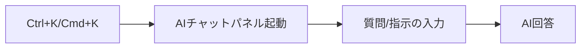
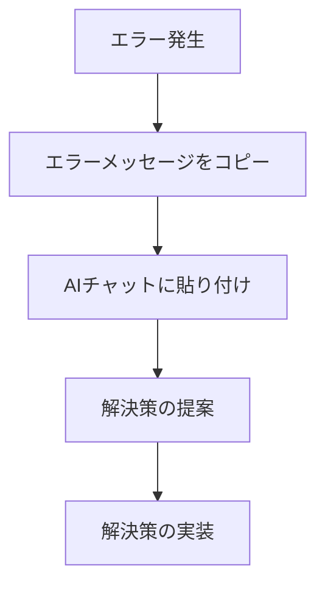
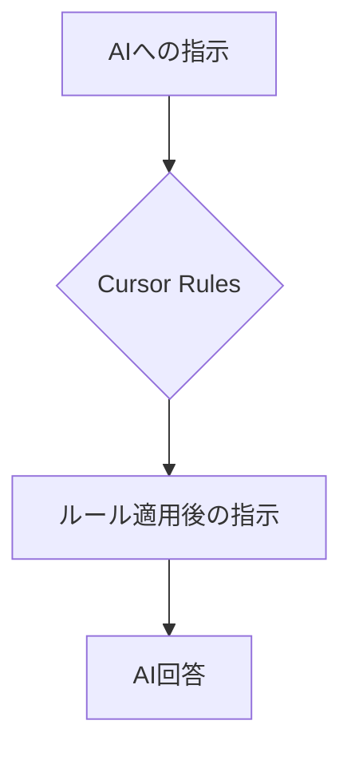

# Cursor の基本的な使い方とコツ

Cursor は、AIを活用した次世代のコードエディタです。VS Code の使い勝手を継承しながら、AIによるコーディング支援機能を搭載しています。この記事では、Cursor を効果的に活用するための基本的な使い方とコツを解説します。

## Cursor の基本的なインターフェース

Cursor のインターフェースは、VS Code とほぼ同じ構成になっています。

- **エディタ領域**：コードを編集する中央の領域
- **サイドバー**：左側にあるファイル一覧やエクスプローラーなどのビュー
- **ステータスバー**：下部にある状態表示
- **コマンドパレット**：`Ctrl+Shift+P`または`Cmd+Shift+P`で呼び出せるコマンド入力欄

## AI機能の基本的な使い方

### 1. AIチャットパネルの起動

AIとの対話は、Cursor の核となる機能です。

1. `Ctrl+K`（Mac の場合は`Cmd+K`）を押して AIチャットパネルを起動
2. 質問や指示を入力
3. AIからの回答を受け取る



### 2. コードに関する質問

コードを選択した状態で AIチャットパネルを開くと、選択したコードについて質問できます。

1. 理解したいコードを選択
2. `Ctrl+K`（Mac の場合は`Cmd+K`）を押す
3. 「このコードは何をしていますか？」などと質問

### 3. コード生成

自然言語での指示からコードを生成できます。

1. コードを挿入したい場所にカーソルを置く
2. `Ctrl+K`（Mac の場合は`Cmd+K`）を押す
3. 「ユーザー入力をバリデーションする JavaScript 関数を作成して」などと指示
4. 生成されたコードを確認し、必要に応じて修正

### 4. コード修正と最適化

既存のコードを改善する提案を AIに求めることができます。

1. 修正したいコードを選択
2. `Ctrl+K`（Mac の場合は`Cmd+K`）を押す
3. 「このコードをより効率的にしてください」などと指示
4. AIが提案する修正内容を確認

### 5. ドキュメント生成

コードにコメントやドキュメントを追加できます。

1. ドキュメントを追加したい関数やクラスを選択
2. `Ctrl+K`（Mac の場合は`Cmd+K`）を押す
3. 「このコードに JSDoc コメントを追加してください」などと指示

## Cursor の高度な使い方

### 1. 複数ファイルの同時編集

Cursor では、複数のファイルにまたがる変更も指示できます。

1. AIチャットパネルを開く
2. 「User モデルと Profile モデルの関連付けを実装してください」など、複数ファイルに関わる指示を出す
3. AIが関連するファイルを特定し、必要な変更を提案

### 2. ターミナルとの連携

AIにターミナルコマンドの実行を指示できます。

1. `Ctrl+Shift+K`（Mac の場合は`Cmd+Shift+K`）を押してターミナルを開く
2. AIチャットパネルで「このプロジェクトに React をインストールして」などと指示
3. AIが適切なコマンドを提案

### 3. デバッグ支援

エラーメッセージを AIに解析してもらい、解決策を得られます。

1. エラーメッセージをコピー
2. AIチャットパネルを開く
3. エラーメッセージを貼り付け、「このエラーを解決するにはどうすればいいですか？」と質問



## Cursor を効果的に使うためのコツ

### 1. 明確で具体的な指示を出す

AIに指示を出す際は、具体的であるほど良い結果が得られます。

**悪い例**：

```
アプリを作って
```

**良い例**：

```
React Hooksを使って、ユーザー認証機能を持つToDoアプリのコンポーネントを作成してください。
機能要件:
1. ユーザー登録・ログイン
2. タスクの追加・削除・編集
3. タスクの完了状態の切り替え
4. ローカルストレージでのデータ保存
```

### 2. コンテキストを提供する

AIに背景情報を提供することで、より適切な回答を得られます。

**悪い例**：

```
このバグを修正して
```

**良い例**：

```
私はExpressとMongoDBを使用したRESTful APIを開発しています。
ユーザーがデータを投稿する際に以下のエラーが発生します：
[エラーメッセージ]

関連するコードはこちらです：
[コード]

原因と修正方法を教えてください。
```

### 3. 段階的なアプローチ

複雑な問題は、小さなステップに分割して解決すると効果的です。

1. まず概念的な設計やアーキテクチャについて質問
2. 次に具体的な実装の方向性を確認
3. 最後に詳細なコードを生成

### 4. フィードバックループの活用

AIの回答を一方的に受け取るだけでなく、対話を重ねることで精度を高められます。

1. AIの回答を確認
2. 問題点や改善点を指摘
3. より具体的な指示で再度質問
4. 満足のいく結果が得られるまで繰り返す

### 5. コードの再利用と保存

頻繁に使う AIとの対話パターンやプロンプトは保存しておくと便利です。

- 有用なプロンプトはメモやファイルに保存
- プロジェクト固有のコンテキスト情報をテンプレート化
- 成功した AIとの対話は参照用に保存

## Cursor のショートカットキー

Cursor を効率的に使うためのショートカットキーを覚えておくと便利です。

| 操作                    | Windows ショートカット | Mac ショートカット |
| ----------------------- | ---------------------- | ------------------ |
| AIチャットパネルを開く | Ctrl+K                 | Cmd+K              |
| コマンドパレットを開く  | Ctrl+Shift+P           | Cmd+Shift+P        |
| ファイル検索            | Ctrl+P                 | Cmd+P              |
| シンボル検索            | Ctrl+Shift+O           | Cmd+Shift+O        |
| 全文検索                | Ctrl+Shift+F           | Cmd+Shift+F        |
| ターミナルを開く        | Ctrl+`                 | Cmd+`              |
| 定義へジャンプ          | F12                    | F12                |
| コードアクション        | Ctrl+.                 | Cmd+.              |

## Cursor 専用の AIコマンド

Cursor には、特殊な AIコマンドが用意されています。これらは、AIチャットパネルで`/`から始まるコマンドとして入力します。

| コマンド  | 説明                           |
| --------- | ------------------------------ |
| /edit     | 選択したコードを編集する       |
| /explain  | 選択したコードを説明する       |
| /refactor | コードをリファクタリングする   |
| /generate | 新しいコードを生成する         |
| /docs     | コードにドキュメントを追加する |
| /fix      | コードのバグを修正する         |
| /test     | テストコードを生成する         |

## Cursor Rules の活用

Cursor Rules は、AIとのやり取りをカスタマイズするための設定です。プロジェクトに合わせたルールを設定することで、より一貫性のある回答を得られます。

### Rules の設定方法

1. 左下の歯車アイコンをクリックして設定を開く
2. 「AI」セクションを選択
3. 「Rules」タブをクリック
4. プロジェクトに合わせたルールを追加

### Rules の例

```
このプロジェクトでは以下のルールに従ってください：
1. TypeScriptのコードは必ずinterface型を使用する
2. コメントは日本語で書く
3. 関数名はキャメルケースで書く
4. テストコードは必ずJestを使用する
```



## よくある失敗と解決策

### 1. AIが理解できないケース

問題：AIが指示を正確に理解できないことがある

解決策：

- より具体的に指示を書き直す
- 複雑な問題は小さなステップに分解する
- 例を示して期待する結果を明確にする

### 2. コード生成の品質が低い

問題：生成されたコードが期待通りでない、または低品質

解決策：

- 技術的な制約や条件をより詳細に指定する
- 生成されたコードの問題点を具体的に指摘して改善を求める
- 特定のパターンやアーキテクチャを指定する

### 3. パフォーマンスの問題

問題：AIの応答が遅い、またはエディタが重い

解決策：

- 不要なプラグインを無効化する
- 大きなプロジェクトでは対象を限定して指示を出す
- キャッシュをクリアする

## まとめ

Cursor は、AIを活用することで開発効率を大幅に向上させる強力なツールです。基本的な機能の使い方を理解し、効果的なプロンプトの書き方を身につけることで、さまざまな開発タスクを迅速に進めることができます。

AIは完璧ではないため、生成されたコードは必ず確認し、必要に応じて修正することが重要です。Cursor を日々の開発ワークフローに組み込み、継続的に活用していくことで、より効率的なコーディング環境を構築していきましょう。
