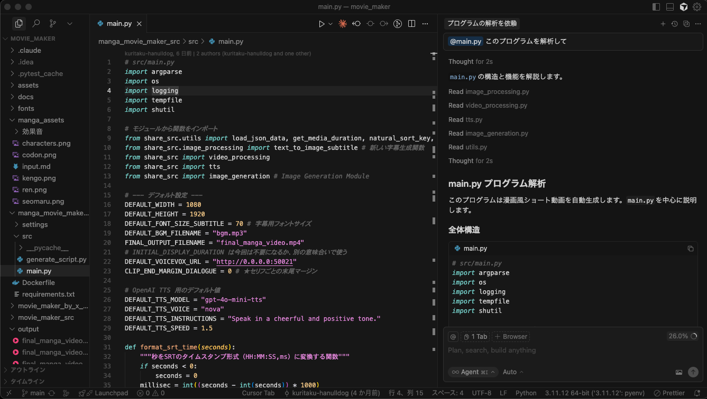
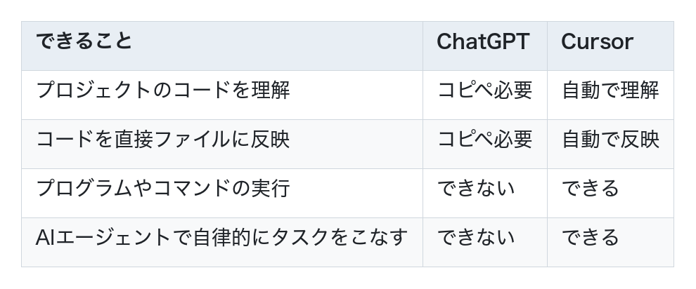
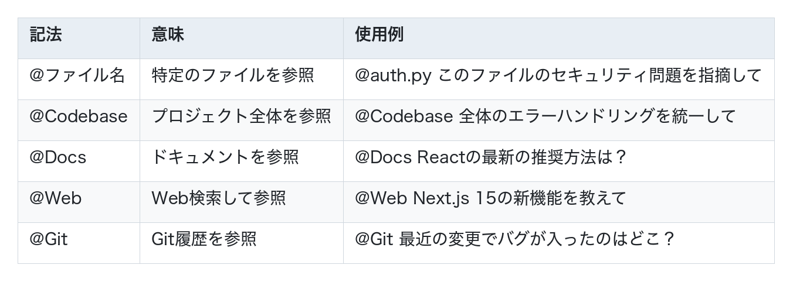
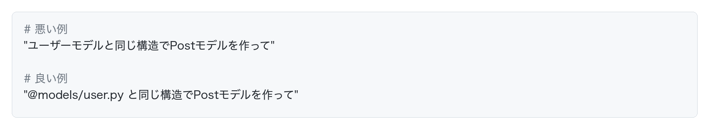

# Cursorの紹介

AI駆動開発で最も人気のあるエディタ、Cursorを紹介します。

現在、プログラマーに最も人気のあるエディタはVS Codeですが、
その**VS CodeにAIエージェント機能を搭載したのがCursor**です。
つまり、VS Codeと全く同じ操作感で使うことができます。

## Cursorがおすすめな理由

1. **VS Codeと同じ操作感**
   - すでにVS Codeを使っているなら、違和感なく使える
   - キーボードショートカットも同じ
   - 拡張機能もそのまま使える

2. **エディタの中でAIと対話できる**
   - いつものエディタの中でAIに指示を出せる
   - コードを見ながらAIと相談できる
   - ChatGPTのようにブラウザとエディタを行き来する必要がない

## Cursorでできること

Cursorは、ChatGPTではできなかったことを実現します。

### ChatGPTとの違い

つまり、生産性が爆発的に上がります。

### 具体的にできること

- プロジェクト全体を理解した上でコードを作成・編集・解析調査
- エラーを自動で修正
- テストコードを自動で作成
- ドキュメントを自動で作成
- Docker環境を自動で作成
- gitのcommitなど、各種コマンドの実行

## CursorでAIを使ってみよう

キーボードショートカットでCmd+L（Mac）/ Ctrl+L（Windows）を実行すると、エディタの右側にチャットパネルが開き、AIと会話しながら開発を進められます。

**使用例：**

## @記法：AIに正確な指示を出す

CursorのAIに指示を出す際、**@記法**を使うことで、特定のファイルやコンテキストを指定できます。

### 主な@記法

## Cursorの料金プラン

Cursorは無料で始められます。本格的に使う場合でも月額約3000円程度です。

## Cursorを使う際のコツ

### @記法を積極的に使う

特定のファイルを参照することで、AIがより正確な回答をしてくれます。

## よくある質問

### Q1: VS Codeの設定や拡張機能は引き継げる？

**A:** はい、引き継げます。Cursorは初回起動時に、VS Codeの設定をインポートするか聞いてきます。キーバインドや拡張機能もほぼそのまま使えます。

### Q2: オフラインでも使える？

**A:** 基本的なエディタ機能は使えますが、AI機能はオンライン環境が必要です。

### Q3: コードは学習に使われる？

**A:** Freeプランでは学習に使用される可能性があります。Proプラン以上で、プライバシー設定から学習に使用しないオプションを選べます。Businessプランでは、データ保持なしのオプションがあります。

### Q4: どれくらい生産性が上がる？

**A:** タスクによりますが、コード生成で50-70%、リファクタリングで30-50%の時間短縮が報告されています。

## まとめ

Cursorは、AI駆動開発の最初の一歩として最適なツールです。

ChatGPTとは比べ物にならないくらいの生産性が手に入るので、開発でChatGPTを使うのは卒業して、Cursorを試しましょう。
一番重要なことは、実際に試すことです。
