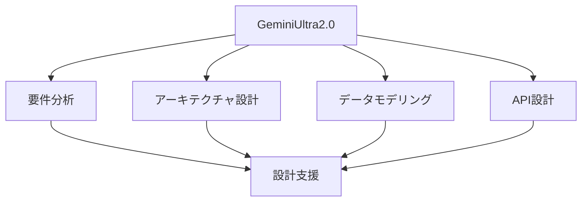

# GeminiUltra2.0 による設計

## GeminiUltra2.0 の特徴

### モデルの特徴

GeminiUltra2.0 は以下のような特徴を持つ AI モデルです：

- 高度な自然言語理解
- 複雑な問題解決能力
- マルチモーダル対応
- ドメイン特化型の知識

### 設計支援の可能性

## 設計プロセスでの活用

### 1. 要件分析

GeminiUltra2.0 を活用した要件分析：

- 要件の整理と分類
- 優先順位付け
- リスク分析
- 依存関係の特定

### 2. アーキテクチャ設計

GeminiUltra2.0 を活用したアーキテクチャ設計：

- システム構成の最適化
- スケーラビリティの考慮
- セキュリティの設計
- パフォーマンスの最適化

### 3. データモデリング

GeminiUltra2.0 を活用したデータモデリング：

- エンティティの定義
- リレーションシップの設計
- 正規化の最適化
- パフォーマンスの考慮

## 実践的な手法

### 設計プロセス

GeminiUltra2.0 を活用した設計プロセス：

- 要件定義
- アーキテクチャ設計
- データモデリング
- API 設計
- セキュリティ設計

### 品質管理

GeminiUltra2.0 を活用した品質管理：

- 設計レビュー
- パフォーマンス分析
- セキュリティチェック
- スケーラビリティ評価

## 成功のポイント

### 設計の最適化

システム設計の最適化：

- アーキテクチャパターン
- データモデリング
- セキュリティ設計
- スケーラビリティ

### 運用管理

GeminiUltra2.0 を活用した運用管理：

- モニタリング
- パフォーマンス最適化
- セキュリティ管理
- インシデント対応

## 実践的なアドバイス

### 導入のステップ

GeminiUltra2.0 を設計プロセスに導入するステップ：

1. 現状分析
2. 目標設定
3. ツール選択
4. プロセス確立
5. 評価と改善

### 成功への道筋

GeminiUltra2.0 による設計を成功させるポイント：

- 明確な目標設定
- 段階的な導入
- チームの理解と協力
- 継続的な改善

## まとめ

GeminiUltra2.0 を活用したシステム設計は、設計の品質と効率を大幅に向上させる可能性を秘めています。適切な活用と継続的な改善が重要です。
