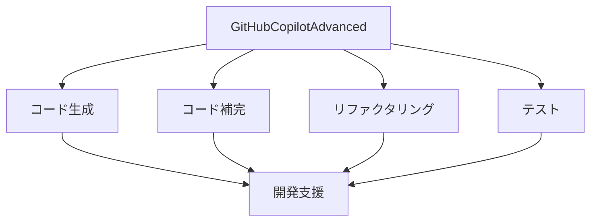

# GitHubCopilotAdvanced 活用

## GitHubCopilotAdvanced の特徴

### ツールの特徴

GitHubCopilotAdvanced は以下のような特徴を持つ AI 開発ツールです：

- 高度なコード生成
- コンテキスト理解
- マルチ言語対応
- セキュリティ機能

### 開発支援の可能性

## 開発プロセスでの活用

### 1. コード生成

GitHubCopilotAdvanced を活用したコード生成：

- 機能の実装
- アルゴリズムの最適化
- デザインパターンの適用
- エラーハンドリング

### 2. コード補完

GitHubCopilotAdvanced を活用したコード補完：

- 変数名の提案
- 関数の補完
- クラスの生成
- ドキュメントの作成

### 3. リファクタリング

GitHubCopilotAdvanced を活用したリファクタリング：

- コードの改善
- パフォーマンス最適化
- 可読性の向上
- 保守性の改善

## 実践的な手法

### 開発プロセス

GitHubCopilotAdvanced を活用した開発プロセス：

- 要件理解
- 設計
- 実装
- テスト
- レビュー

### 品質管理

GitHubCopilotAdvanced を活用した品質管理：

- コードレビュー
- パフォーマンス分析
- セキュリティチェック
- バグ修正

## 成功のポイント

### 開発の最適化

コード開発の最適化：

- コーディング規約
- デザインパターン
- パフォーマンス
- セキュリティ

### 運用管理

GitHubCopilotAdvanced を活用した運用管理：

- モニタリング
- パフォーマンス最適化
- セキュリティ管理
- インシデント対応

## 実践的なアドバイス

### 導入のステップ

GitHubCopilotAdvanced を開発プロセスに導入するステップ：

1. 現状分析
2. 目標設定
3. ツール選択
4. プロセス確立
5. 評価と改善

### 成功への道筋

GitHubCopilotAdvanced による開発を成功させるポイント：

- 明確な目標設定
- 段階的な導入
- チームの理解と協力
- 継続的な改善

## まとめ

GitHubCopilotAdvanced を活用した開発は、開発効率と品質を大幅に向上させる可能性を秘めています。適切な活用と継続的な改善が重要です。
