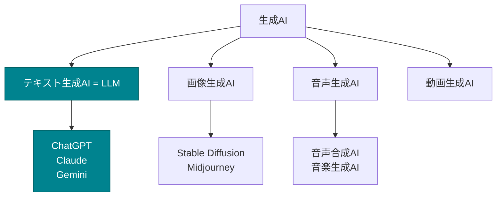

# LLMとは

LLM（Large Language Model：大規模言語モデル）は、生成AIの中でも特に「人間の言語を理解すること」に特化したAIです。

## LLMができること

### 読む・分析する
- 質問の意図を理解する
- 文章の要約
- 感情分析

### 書く・答える
- 質問への回答
- 文章の作成
- 翻訳

### プログラミングの支援
- コードの説明
- コードの生成
- バグの発見と修正

## 生成AIとLLMの違い

### LLMは生成AIの一種

LLMは、生成AIの中で「テキスト（言語）」に特化したものです。

