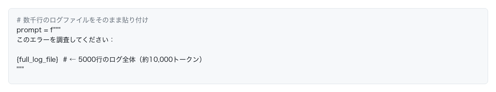
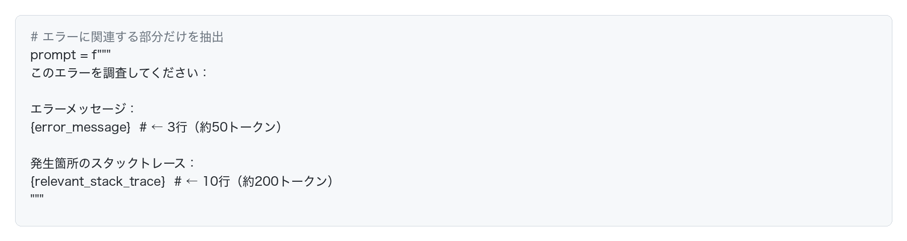

# LLMの料金とトークンの関係

## はじめに

LLMの利用料金は、主にトークン数に基づいて計算されます。この章では、料金体系とコスト最適化について説明します。

## LLMの料金

LLMサービスの多くは、使用したトークン数に応じて料金が発生します。

## 入力トークンと出力トークンの違い

LLMの料金計算では、入力トークンと出力トークンが区別されており、それぞれ異なる料金が設定されています。この違いを理解することで、より効果的なコスト管理が可能になります。

### 入力トークンとは

入力トークンは、ユーザーがLLMに送信する内容全体を指します。具体的には以下のような要素が含まれます。

**含まれる要素：**
- ユーザーが入力したプロンプト（質問や指示）
- システムプロンプト（AIの振る舞いを定義する設定）
- 会話履歴（過去のやり取り）
- 添付されたファイルやドキュメントの内容
- コンテキスト情報（参考資料など）

### 出力トークンとは

出力トークンは、LLMが生成して返す応答全体を指します。

**含まれる要素：**
- LLMが生成したテキスト、画像などの出力物全て

## コスト削減の実践テクニック

LLMを使う際、ちょっとした工夫でコストを大幅に削減できます。特に入力トークンの最適化は、すぐに実践できる効果的な方法です。

例えば、エラー調査でLLMを使う際、ログの貼り付け方でコストが大きく変わります。

**悪い例：無駄に長いログをそのまま貼り付ける**

このケースでは、入力トークンだけで10,000トークン以上消費してしまいます。

**良い例：関連する部分だけを抜粋**

このように必要な部分だけを抜粋すれば、約250トークンで済みます。

## まとめ

LLMの料金はトークン数に直接連動します。入力トークンと出力トークンの違いを理解し、適切なモデル選択とプロンプトの最適化を行うことで、コストを意識しながらLLMを利用しましょう。

特に**入力トークンの最適化は、今日から実践できる最も効果的なコスト削減方法**です。ログやコードを送る際は、本当に必要な部分だけを送るよう心がけてください。
