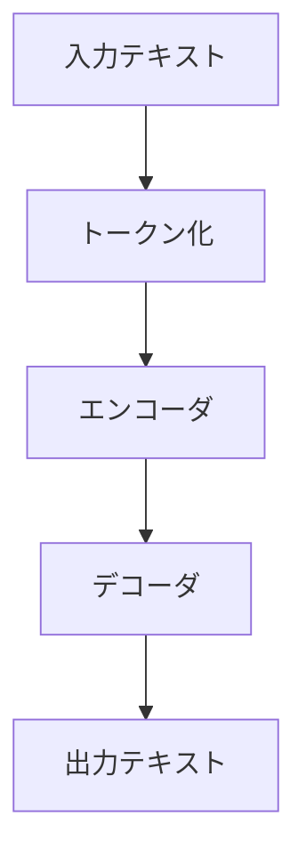

# LLM（大規模言語モデル）の基本

## はじめに

LLM（大規模言語モデル）は、自然言語処理の分野で革新的な技術として注目されています。この章では、LLM の基本的な概念について説明していきます。

## LLM とは

LLM（Large Language Model）は、大量のテキストデータを学習し、自然な文章を生成・理解する AIモデルです。

### 主な特徴

1. 大規模な学習データ

   - インターネット上のテキスト
   - 書籍や論文
   - コードリポジトリ

2. 高度な言語理解

   - 文脈の理解
   - 意味の把握
   - 多言語対応

3. 多様な応用
   - 文章生成
   - 質問応答
   - 翻訳
   - コード生成

## LLM の仕組み

### 1. 基本的な構造

### 2. 学習プロセス

1. データ収集

   - 大量のテキストデータを収集
   - データの前処理
   - 品質の確保

2. モデル学習

   - トークン化
   - 文脈の学習
   - パターンの理解

3. 生成プロセス
   - 入力の解析
   - 文脈の考慮
   - 出力の生成

## LLM の種類

### 1. オープンソースモデル

特徴：

- 自由に利用可能
- カスタマイズ可能
- コミュニティによる開発

例：

- LLaMA
- Mistral
- Falcon

### 2. 商用モデル

特徴：

- 高品質な出力
- 安定した性能
- サポート体制

例：

- GPT-4
- Claude
- Gemini

## LLM の特徴

### 1. 長所

- 自然な文章生成
- 文脈の理解
- 多様なタスク対応
- 継続的な学習

### 2. 短所

- 計算リソースの要求
- ハルシネーション
- バイアスの問題
- プライバシーの懸念

## LLM の活用例

### 1. ビジネス

- カスタマーサポート
- コンテンツ作成
- データ分析
- マーケティング

### 2. 開発

- コード生成
- デバッグ支援
- ドキュメント作成
- テスト生成

### 3. 教育

- 学習支援
- 問題作成
- フィードバック
- 言語学習

## LLM の課題

### 1. 技術的な課題

- 計算コストの削減
- 精度の向上
- リアルタイム処理
- 多言語対応の強化

### 2. 社会的な課題

- 倫理的な使用
- プライバシーの保護
- 著作権の問題
- 誤情報の防止

## まとめ

LLM は、自然言語処理の分野で革新的な可能性を秘めています。ただし、その活用には、技術的な理解と社会的な配慮が必要です。適切に活用することで、より効率的なコミュニケーションと創造的な作業が可能になります。
