# MCP（Model Context Protocol）とは

これまで、AIエージェントが様々なツールを使って作業を進めることを学びました。
しかし、AIエージェントがツールを使うためには、ある重要な仕組みが必要です。それが「MCP（Model Context Protocol）」です。

## AIエージェントがツールを使う仕組み

まず、AIエージェントがどのようにツールを使っているのか、見てみます。

### AIエージェントが使うツールの例

AIエージェントは、様々なツールを使います。

- **カレンダー**：予定を追加、確認、削除
- **メール**：メールの送信、受信、検索
- **データベース**：データの検索、追加、更新
- **Web検索**：最新情報の取得
- **ファイル操作**：ファイルの読み書き、編集

これらのツールは、それぞれ異なるサービスやアプリケーションです。

### ツールごとに使い方が違う問題

ここで問題があります。
**ツールごとに使い方が違う**のです。

たとえば、カレンダーアプリは「カレンダーA社」と「カレンダーB社」で、使い方が違います。

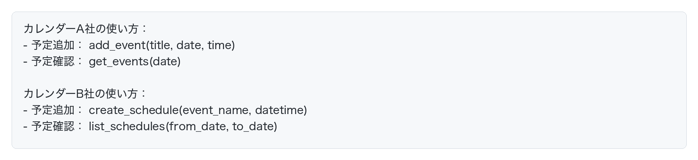

つまり、**同じ「カレンダー」でも、使い方が全く違う**のです。

### AIエージェントの困りごと

AIエージェントが100種類のツールを使おうとすると、こうなります。

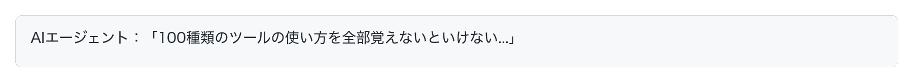

これでは大変です。ツールが増えるたびに、AIエージェントに新しい使い方を教える必要があります。

## MCPという解決策

この問題を解決するのが「MCP（Model Context Protocol）」です。

MCPは、**AIエージェントとツールが共通のルールで会話するための約束事**です。

### MCPのイメージ：コンセントの規格

MCPをわかりやすく言うと、「コンセントの規格」のようなものです。

**コンセントがない世界を想像してください：**
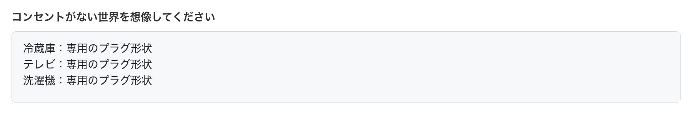

これでは大変です。家電を買うたびに、専用のコンセントを設置する必要があります。

**現実の世界（コンセントの規格がある）：**
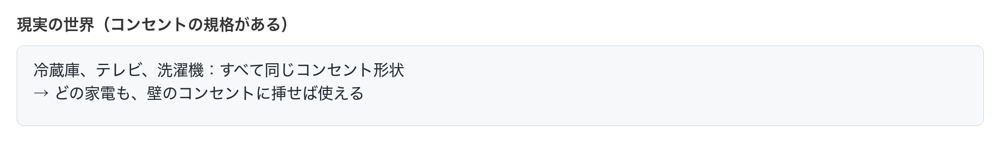

MCPも同じです。

**MCPがない世界：**
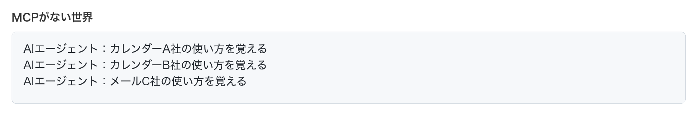

**MCPがある世界：**
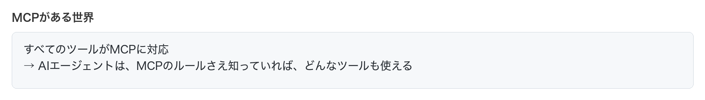

### MCPの仕組み

MCPでは、ツールとAIエージェントが次のように会話します。

**1. AIエージェントがツールに問い合わせる**
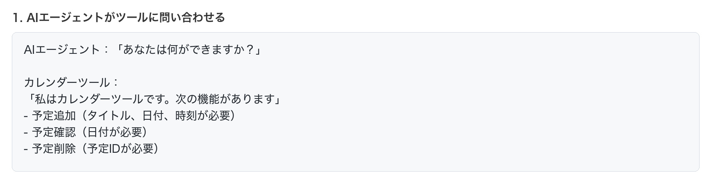

**2. AIエージェントが機能を理解する**
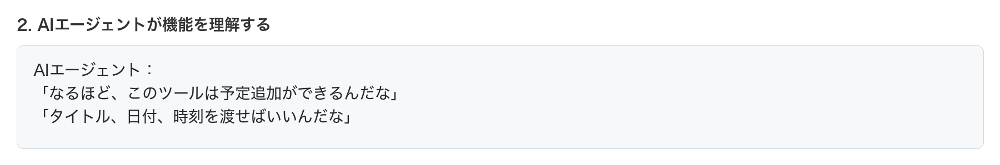

**3. AIエージェントが必要に応じて実行する**
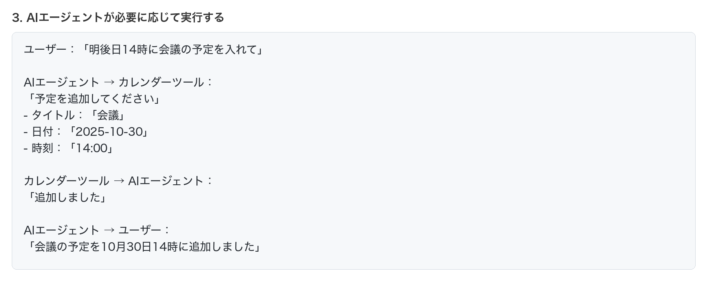

このやりとりが、**MCPという共通のルールで行われる**のです。

つまり、MCPは次の3つのステップで動きます：

1. **発見**：AIエージェントが「何ができるか」をツールに聞く
2. **理解**：ツールが「自分の機能」を説明する
3. **実行**：AIエージェントがツールに命令を送り、ツールが実行する

## MCPのメリット

MCPがあることで、様々なメリットがあります。

### 1. ツールを簡単に追加できる

新しいツールを追加する場合、MCPに対応させるだけで、すぐにAIエージェントが使えるようになります。

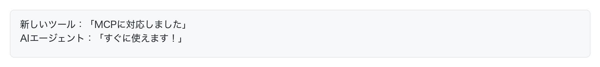

MCPがなければ、新しいツールを追加するたびに、AIエージェント側の設定を変更する必要がありました。

### 2. どのAIエージェントでも使える

MCPに対応したツールは、MCPに対応したAIエージェントなら、どれでも使えます。

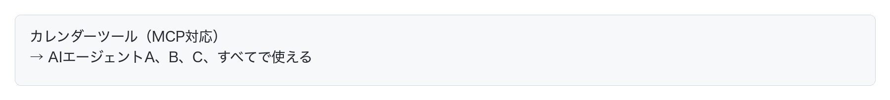

### 3. ツールを入れ替えやすい

同じ機能を持つツールなら、簡単に入れ替えられます。

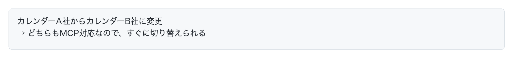

## MCPとAPIの違い

エンジニアの方は、「それってAPIと何が違うの？」と思うかもしれません。具体的なコードで比較してみましょう。

### 従来のAPI：決められたインターフェースしか使えない

カレンダーAPIを使うとき、開発者はこう書きます。

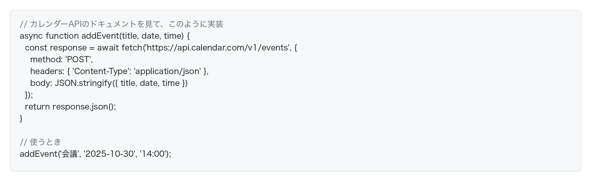

この場合：
- **エンドポイント（`/v1/events`）が決まっている**
- **メソッド（`POST`）が決まっている**
- **パラメータ（`title`, `date`, `time`）が決まっている**
- **これ以外のことはできない**（例：予定の色を変えたくても、APIに無ければ不可能）

### MCP：自己記述的で拡張可能なインターフェース

MCPサーバー側では、開発者はツールが「何ができるか」を記述するだけです。

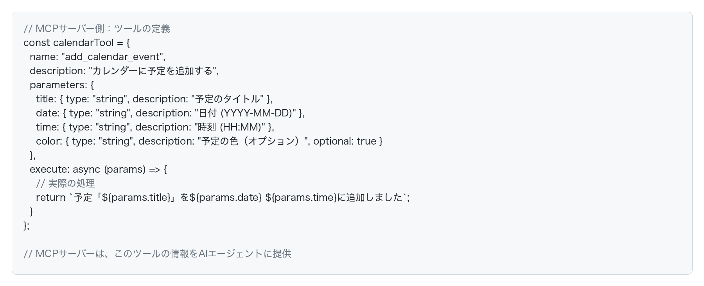

AIエージェント側では、次の4ステップでツールを呼び出します。**ステップ①〜④はすべてAIが自動で行います。人間がやることは②の「話しかけるだけ」です。**

**ステップ① 〈AI〉 MCPサーバーに接続し、使えるツールの一覧を取得する**
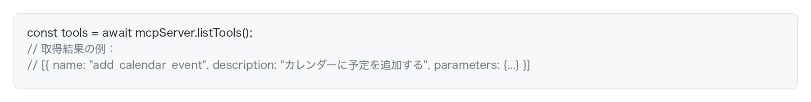

**ステップ② 〈人間〉 自然言語で話しかける**
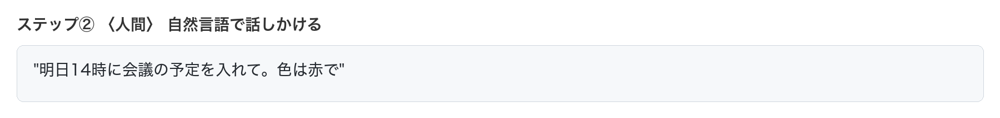

ここだけが人間の仕事です。以降はAIが全部やります。

**ステップ③ 〈AI〉 「どのツールを使うか」「パラメータは何か」を判断する**
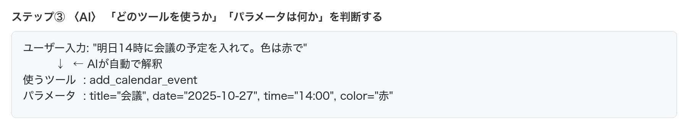

「明日」→ 日付、「14時」→ "14:00"、「赤」→ color パラメータ、という変換もAIが自動でやります。

**ステップ④ 〈AI〉 ツールを実行する**
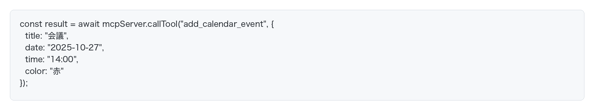

AIが自分でMCPサーバーを呼び出し、結果を受け取ります。

### 本質的な違い

#### **API：開発者が全部書く**

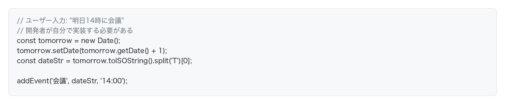

- 開発者が「明日」を計算するコードを書く
- 開発者が「14時」を解釈するコードを書く
- 開発者がAPIを呼び出すコードを書く

#### **MCP：AIエージェントが判断して実行**

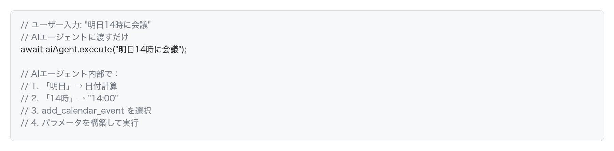

### まとめ

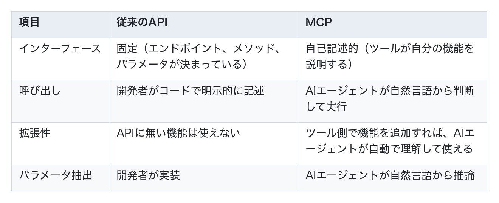

**APIは「決められたことしかできない」、MCPは「ツールができることを自己記述して、AIエージェントがそれを理解して使う」**

これにより、開発者は「カレンダーに予定を追加する」という機能だけを定義すれば、AIエージェントが自然言語から適切にパラメータを判断して実行してくれます。

## MCPの活用例

MCPは、様々な場面で活用されています。

### 例1：カレンダー連携

**やりたいこと：**
「来週の月曜日、午後2時に会議の予定を入れて」

### 例2：メール送信

**やりたいこと：**
「田中さんに、プロジェクトの進捗を報告するメールを送って」

### 例3：データベース検索

**やりたいこと：**
「先月の売上データを取得して、グラフを作って」

## AI駆動開発におけるMCP：何が嬉しいのか？

「それってAPIでもできるじゃん」と思うかもしれません。しかし、MCPの真価は**複数のツールを組み合わせて使うとき**に発揮されます。

### APIだけだと何が大変なのか

従来のAPIを使う場合、開発者がすべての統合コードを書く必要があります。

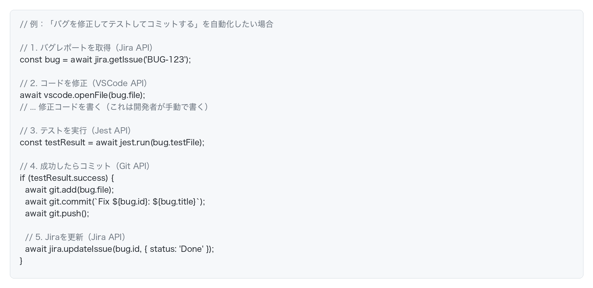

この場合：
- **開発者が各APIの使い方を調べる**
- **開発者が統合コードを書く**
- **開発者がエラー処理を書く**
- **Jira、VSCode、Jest、Gitの各APIに精通している必要がある**

### MCPがあると何が嬉しいのか

すべてのツールがMCPに対応していれば、AIエージェントに指示するだけです。

これならとっても楽ですね！

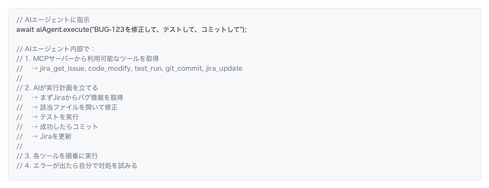

## MCPの現実と未来

ここまでMCPの素晴らしさを説明してきましたが、新しい技術のため現実には課題もあります。

### 現実1：サービス提供側が対応している必要がある

MCPは、APIと同じく、**サービス提供側が対応していないと使えません**。

#### APIの場合

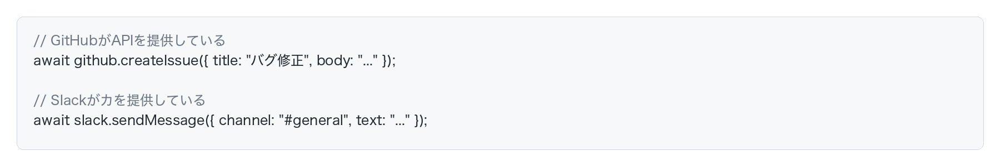

これらは、GitHub社やSlack社が「APIを提供しよう」と決めて、開発・公開したから使えるわけです。

#### MCPも同じ

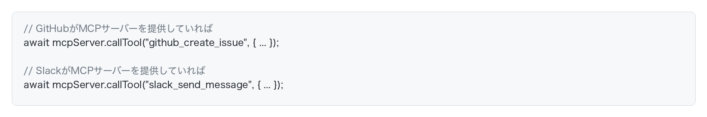

MCPも、GitHub社やSlack社が「MCPサーバーを作ろう」と決めて、開発・公開する必要があります。

### 現実2：MCP対応はまだ少ない

MCPは2024年頃に登場した新しい技術です。2026年現在、MCPに対応しているサービスは限られています。

つまり、**「すべてのツールがMCP対応している」という理想の世界は、まだ来ていません**。

### 自分でMCPサーバーを作ることもできる

ただし、MCPはオープンな仕様なので、**自分でMCPサーバーを作ることができます**。

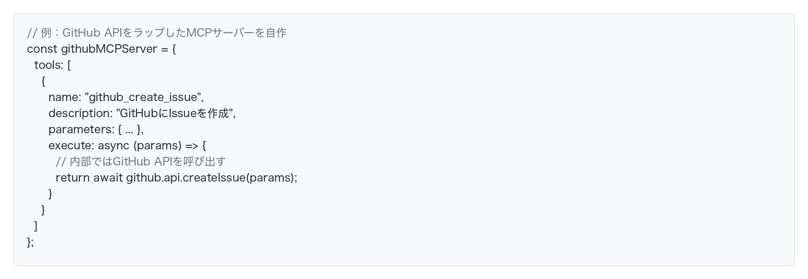

これにより、GitHub公式がMCP対応していなくても、自分でMCPサーバーを作れば、AIエージェントから使えるようになります。

### APIとMCPの普及の比較

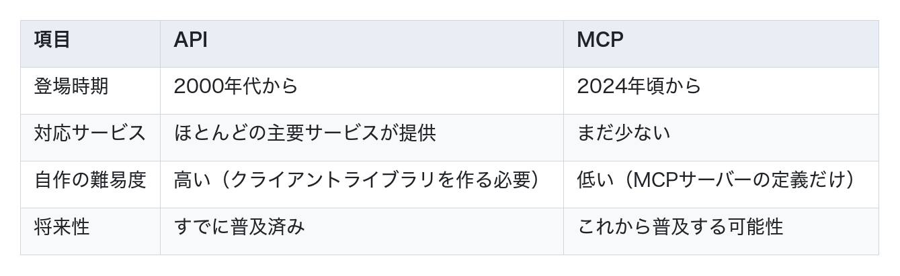

### 現実的な使い方

現時点では、以下のような使い方が現実的です。

1. **MCP対応しているツールを優先的に使う**
   - Claude Codeなど、MCP対応済みのツールを活用

2. **よく使うサービスは自分でMCPサーバーを作る**
   - 社内ツールやよく使うAPIをMCPでラップする

3. **APIとMCPを併用する**
   - MCP対応していないサービスは従来通りAPIで使う
   - MCP対応しているサービスはMCPで使う

### エンジニアとして押さえておくべきポイント

- **MCPは2024年頃に登場した新しい技術**
- **まだ発展途上で、対応サービスは少ない**
- **サービス提供側が対応する必要がある**（APIと同じ）
- **自分でMCPサーバーを作ることもできる**
- **今後普及する可能性がある**技術として注目されている
- **現時点では、APIとMCPを併用する**のが現実的

MCPは、AIエージェントの可能性を大きく広げる技術です。現時点ではまだ発展途上ですが、今後の普及が期待されています。
