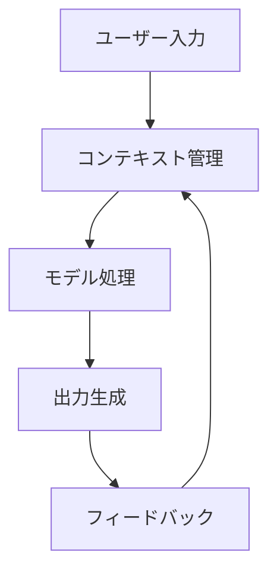

# MCP（ModelContextProtocol）の活用

## はじめに

MCP（ModelContextProtocol）は、AI モデルとコンテキストの相互作用を管理するためのプロトコルです。この章では、MCP の基本的な概念と活用方法について説明していきます。

## MCP とは

MCP は、AI モデルがコンテキストを理解し、適切に処理するための標準化されたプロトコルです。

### 主な特徴

1. コンテキスト管理

   - 文脈の保持
   - 情報の整理
   - 状態の管理

2. 相互作用

   - モデルとコンテキストの連携
   - 情報の伝達
   - フィードバックの処理

3. 標準化
   - 共通の形式
   - 互換性
   - 拡張性

## MCP の仕組み

### 1. 基本的な構造

### 2. 主要なコンポーネント

1. コンテキストマネージャー

   - 情報の収集
   - 状態の管理
   - 履歴の保持

2. モデルインターフェース

   - 入力の処理
   - 出力の生成
   - フィードバックの処理

3. プロトコルハンドラー
   - 形式の変換
   - エラーの処理
   - 互換性の確保

## MCP の活用例

### 1. チャットボット

- 会話の文脈を保持
- ユーザーの意図を理解
- 適切な応答の生成

### 2. ドキュメント処理

- 文書の構造を理解
- 関連情報の抽出
- 要約の生成

### 3. コード生成

- プロジェクトの文脈を理解
- コードの一貫性を保持
- 適切な実装の提案

## MCP の実装方法

### 1. 基本的な実装

### 2. 高度な実装

- 複数のコンテキストの管理
- 動的なプロトコルの調整
- エラー処理の強化

## MCP の利点

### 1. 技術的な利点

- 一貫性のある処理
- 効率的な情報管理
- 拡張性の向上

### 2. 実用的な利点

- 開発の効率化
- メンテナンスの容易さ
- 品質の向上

## MCP の課題

### 1. 技術的な課題

- 複雑な文脈の処理
- パフォーマンスの最適化
- スケーラビリティ

### 2. 実装上の課題

- プロトコルの設計
- 互換性の確保
- テストの実施

## まとめ

MCP は、AI システムの文脈理解と処理を効率化する重要なプロトコルです。適切に実装することで、より効果的な AI システムを構築することができます。
