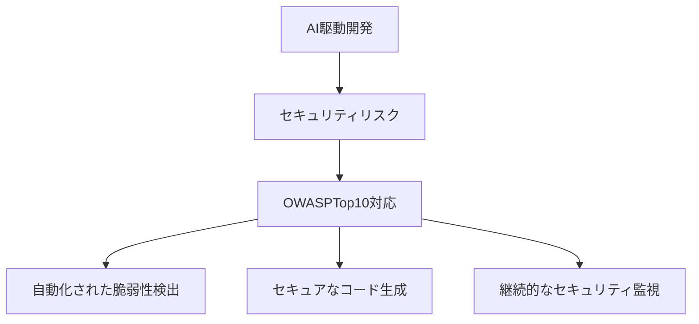
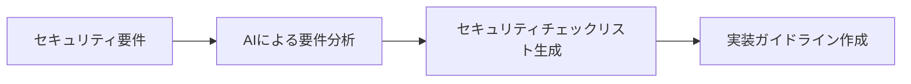

# OWASPTop10 対応

## OWASPTop10 とは

OWASPTop10 は、Web アプリケーションのセキュリティリスクの中で最も重要な 10 の脆弱性をまとめたリストです。AI 駆動開発においても、これらのセキュリティリスクへの対応は不可欠です。

## AI 駆動開発における OWASPTop10 対応の重要性

AI ツールを活用した開発では、セキュリティの考慮がより重要になります。AI が生成するコードには、セキュリティ上の脆弱性が含まれる可能性があるためです。



## OWASPTop10 の各項目と AI 駆動開発での対応

### 1. 認証の不備

**リスク**:

- 弱いパスワードポリシー
- 不適切なセッション管理
- 多要素認証の欠如

**AI 駆動開発での対応**:

- セキュアな認証コードの自動生成
- パスワードポリシーの自動検証
- セッション管理のベストプラクティス適用

### 2. 暗号化の失敗

**リスク**:

- 弱い暗号化アルゴリズムの使用
- 不適切な鍵管理
- 平文でのデータ送信

**AI 駆動開発での対応**:

- 最新の暗号化ライブラリの推奨
- 暗号化実装の自動検証
- セキュアな通信プロトコルの適用

### 3. インジェクション

**リスク**:

- SQL インジェクション
- コマンドインジェクション
- XSS（クロスサイトスクリプティング）

**AI 駆動開発での対応**:

- パラメータ化クエリの自動生成
- 入力値の自動サニタイズ
- インジェクション脆弱性の自動検出

### 4. 安全でない設計

**リスク**:

- 不適切なアーキテクチャ設計
- セキュリティ要件の欠如
- 不適切なエラーハンドリング

**AI 駆動開発での対応**:

- セキュアなアーキテクチャパターンの提案
- セキュリティ要件の自動検証
- エラーハンドリングのベストプラクティス適用

### 5. セキュリティの設定ミス

**リスク**:

- デフォルト設定の使用
- 不適切なアクセス制御
- 不要な機能の有効化

**AI 駆動開発での対応**:

- セキュアな設定の自動生成
- 設定の自動検証
- 最小権限の原則の適用

### 6. 脆弱で古いコンポーネント

**リスク**:

- 古いライブラリの使用
- 既知の脆弱性を持つコンポーネント
- 不適切なバージョン管理

**AI 駆動開発での対応**:

- 依存関係の自動スキャン
- 脆弱性のあるコンポーネントの検出
- セキュアなバージョンへの自動アップデート

### 7. 認証と識別の失敗

**リスク**:

- 不適切なユーザー認証
- セッション管理の不備
- パスワードリセットの脆弱性

**AI 駆動開発での対応**:

- セキュアな認証フローの自動生成
- セッション管理のベストプラクティス適用
- パスワードリセット機能のセキュリティ強化

### 8. ソフトウェアとデータの整合性の失敗

**リスク**:

- 不適切なデータ検証
- 改ざんの検出失敗
- 整合性チェックの欠如

**AI 駆動開発での対応**:

- データ検証ロジックの自動生成
- 整合性チェックの自動実装
- 改ざん検出メカニズムの強化

### 9. セキュリティログとモニタリングの失敗

**リスク**:

- 不適切なログ記録
- セキュリティイベントの検出失敗
- インシデント対応の遅延

**AI 駆動開発での対応**:

- セキュリティログの自動生成
- 異常検知の自動実装
- インシデント対応フローの最適化

### 10. サーバーサイドリクエストフォージェリ（SSRF）

**リスク**:

- 不適切な URL 検証
- 内部リソースへの不正アクセス
- リクエストの検証不備

**AI 駆動開発での対応**:

- URL 検証ロジックの自動生成
- リクエストの自動サニタイズ
- アクセス制御の強化

## AI 駆動開発での OWASPTop10 対応の実践

### 1. セキュリティ要件の定義



### 2. 自動化されたセキュリティテスト

- 静的解析ツールの統合
- 動的セキュリティテストの自動化
- 継続的セキュリティスキャン

### 3. セキュアなコード生成

- セキュリティパターンの適用
- 脆弱性の自動検出と修正
- セキュリティベストプラクティスの組み込み

### 4. 継続的なセキュリティ監視

- リアルタイムの脆弱性検出
- セキュリティイベントの自動通知
- インシデント対応の自動化

## 実践的な OWASPTop10 対応の例

### 認証の不備への対応

```python
# AIが生成したセキュアな認証コードの例
from passlib.hash import pbkdf2_sha256
from datetime import datetime, timedelta
import jwt

class SecureAuthentication:
    def __init__(self, secret_key):
        self.secret_key = secret_key

    def hash_password(self, password):
        return pbkdf2_sha256.hash(password)

    def verify_password(self, password, hashed):
        return pbkdf2_sha256.verify(password, hashed)

    def create_session_token(self, user_id):
        payload = {
            'user_id': user_id,
            'exp': datetime.utcnow() + timedelta(hours=24)
        }
        return jwt.encode(payload, self.secret_key, algorithm='HS256')

    def verify_session_token(self, token):
        try:
            payload = jwt.decode(token, self.secret_key, algorithms=['HS256'])
            return payload['user_id']
        except jwt.ExpiredSignatureError:
            return None
        except jwt.InvalidTokenError:
            return None
```

### インジェクション対策

```python
# AIが生成したセキュアなデータベースアクセスコードの例
import sqlite3
from typing import List, Dict, Any

class SecureDatabase:
    def __init__(self, db_path: str):
        self.db_path = db_path

    def execute_query(self, query: str, params: Dict[str, Any] = None) -> List[Dict[str, Any]]:
        with sqlite3.connect(self.db_path) as conn:
            conn.row_factory = sqlite3.Row
            cursor = conn.cursor()
            if params:
                cursor.execute(query, params)
            else:
                cursor.execute(query)
            return [dict(row) for row in cursor.fetchall()]

    def get_user_by_id(self, user_id: int) -> Dict[str, Any]:
        query = "SELECT * FROM users WHERE id = :user_id"
        results = self.execute_query(query, {"user_id": user_id})
        return results[0] if results else None
```

## まとめ

OWASPTop10 への対応は、AI 駆動開発においても重要な課題です。AI ツールを活用することで、セキュリティ対策を自動化し、効率的に実装することができます。ただし、AI が生成するコードのセキュリティを常に確認し、必要に応じて人間によるレビューを行うことが重要です。

セキュリティは一度の対策で終わるものではなく、継続的な改善と監視が必要です。AI 駆動開発においても、セキュリティを最優先事項として考慮し、OWASPTop10 の各項目に対応した実装を行うことが求められます。
