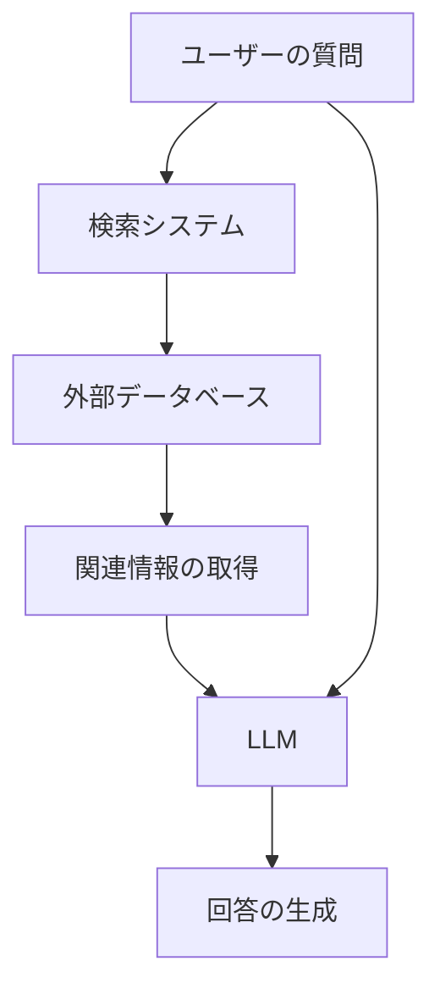
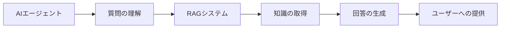

# RAGとは

## はじめに

RAG（Retrieval-Augmented Generation）は、外部知識を活用して回答を生成する技術です。この章では、RAGの基本的な概念について説明していきます。

## RAG とは

RAG（Retrieval-Augmented Generation）は、外部知識を活用して回答を生成する技術です。

### 基本的な仕組み

### 主な特徴

1. 知識の取得

   - 外部データベースの検索
   - 関連情報の抽出
   - 最新情報の活用

2. 回答の生成

   - 取得した情報の活用
   - 文脈の考慮
   - 自然な回答の生成

3. 精度の向上
   - 事実に基づく回答
   - ハルシネーションの低減
   - 信頼性の向上

## RAG の活用例

### 1. カスタマーサポート

- 製品情報の検索
- トラブルシューティング
- ユーザーガイドの提供

### 2. 研究支援

- 論文の検索
- データの分析
- 仮説の検証

### 3. 教育支援

- 学習資料の提供
- 質問への回答
- 知識の整理

## AIエージェントと RAG の組み合わせ

### 1. 基本的な組み合わせ

### 2. 高度な組み合わせ

- 複数の RAG システムの活用
- 動的な知識の更新
- 継続的な学習と改善

## 課題と対策

### 1. 技術的な課題

- 検索精度の向上
- リアルタイム処理
- スケーラビリティ

### 2. 社会的な課題

- プライバシーの保護
- 倫理的な使用
- 透明性の確保

## まとめ

RAG は、AIシステムの重要な要素です。外部知識を活用することで、より正確で信頼性の高い回答を生成することができます。
