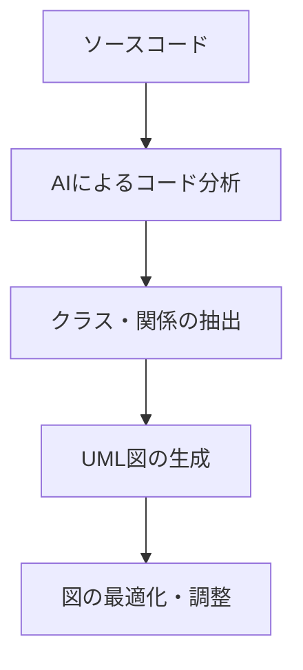
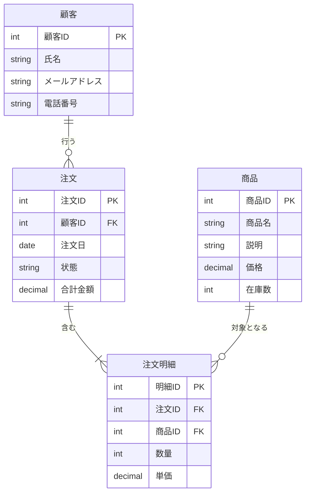
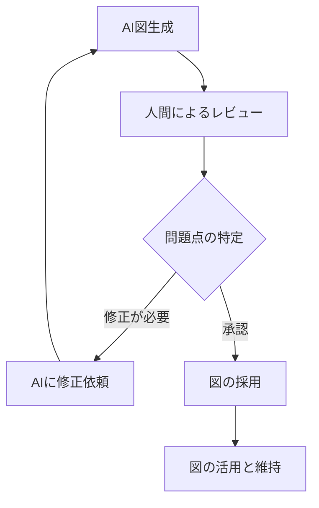
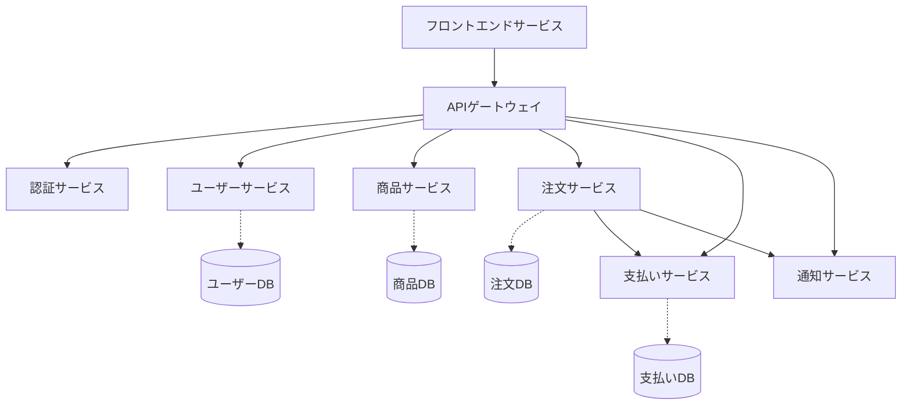

# UML 図・ER 図の生成と最適化

UML 図や ER 図はソフトウェア開発において設計を視覚化する重要なツールですが、これらの図を手動で作成・更新することは時間がかかり、エラーも起こりやすいものです。AI 駆動開発を活用することで、これらの図を効率的に生成し、最適化することができるようになりました。本章では、AI を活用した UML 図・ER 図の生成と最適化の方法について解説します。

## UML 図と ER 図の基本

### UML 図の概要

UML（Unified Modeling Language：統一モデリング言語）は、ソフトウェアシステムの設計を表現するための標準的な図法です。主に以下のような図があります：

- **クラス図**: クラス、その属性、メソッド、および他のクラスとの関係を表現
- **シーケンス図**: オブジェクト間の相互作用を時系列で表現
- **ユースケース図**: システムの機能とアクターの関係を表現
- **アクティビティ図**: ビジネスプロセスやワークフローを表現
- **コンポーネント図**: システムのコンポーネント構造と依存関係を表現
- **状態遷移図**: オブジェクトの状態変化を表現

### ER 図の概要

ER 図（Entity-Relationship Diagram：実体関連図）は、データベースの構造を視覚的に表現するための図法です。主に以下の要素で構成されます：

- **エンティティ**: データの集まり（テーブルに相当）
- **属性**: エンティティの特性（カラムに相当）
- **関連**: エンティティ間の関係
- **カーディナリティ**: 関連における数量関係（1 対 1、1 対多、多対多など）

## AI を活用した UML 図生成

### コードから UML 図を生成する

AI は既存のコードを分析し、そこから UML 図を自動生成することができます。このアプローチのメリットは以下の通りです：

1. 実際のコードを反映した正確な図を作成できる
2. コードが更新されても図を簡単に更新できる
3. 大規模なコードベースの理解が容易になる



### 自然言語から UML 図を生成する

AI は自然言語の要件記述から UML 図を生成することもできます。このアプローチは要件定義の初期段階で特に有用です：

1. テキストによる要件記述を AI に入力
2. AI が要件から主要なクラス、アクター、関係などを特定
3. 初期の UML 図が生成される
4. 人間と AI の対話を通じて図を洗練

## AI を活用した ER 図生成

### 要件から ER 図を生成する

AI はビジネス要件の記述から、適切な ER 図を提案することができます：



上記は、EC サイトのシンプルな ER 図の例です。AI は以下のようなプロンプトから、このような ER 図を生成できます：

```
ECサイトのデータベース設計を行いたいです。以下の要件に基づいてER図を生成してください：
- 顧客は氏名、メールアドレス、電話番号を持つ
- 顧客は複数の注文を行うことができる
- 注文には注文日、状態、合計金額の情報がある
- 各注文には複数の商品が含まれる（注文明細）
- 商品には商品名、説明、価格、在庫数の情報がある
```

### データベースから ER 図をリバースエンジニアリングする

既存のデータベースから逆算して ER 図を生成することも可能です：

1. データベースのスキーマ情報を AI に提供
2. AI がテーブル構造、キー関係を分析
3. 正規化の問題点や改善点を提案
4. 最適化された ER 図を生成

## AI 駆動開発での UML 図・ER 図生成のベストプラクティス

### 効果的な AI プロンプト設計

UML 図や ER 図を AI に生成させる際の効果的なプロンプトの例を紹介します：

#### UML 図生成プロンプト（クラス図）

```
以下の要件に基づくクラス図を生成してください：

ドメイン：オンライン書店システム

主要機能：
- ユーザーは書籍を検索、閲覧、購入できる
- 書籍は著者、出版社、カテゴリ、価格などの情報を持つ
- ユーザーはアカウントを作成し、注文履歴を確認できる
- 管理者は書籍情報の管理、在庫管理、注文管理を行う
- 支払いは複数の方法（クレジットカード、ペイパル等）で行える

以下の点に注意してクラス図を設計してください：
- 適切な継承関係
- コンポジション、集約関係
- 属性とメソッドを含める
- アクセス修飾子を明示する
```

#### ER 図生成プロンプト

```
以下のシステム要件に基づいてER図を生成してください：

システム：病院予約管理システム

エンティティとその属性：
- 患者（患者ID、氏名、生年月日、連絡先）
- 医師（医師ID、氏名、専門、スケジュール）
- 診療科（科ID、科名、説明）
- 予約（予約ID、日時、状態）
- 診察（診察ID、診断内容、処方）

関係：
- 患者は複数の予約を行える
- 医師は複数の予約を担当する
- 医師は一つの診療科に所属する
- 予約は一つの診察につながる

その他の条件：
- 患者IDと医師IDはそれぞれプライマリキー
- 予約日時に対して同じ医師の重複予約は不可
- 診察記録は患者のプライバシー保護のため別テーブルで管理
```

### UML 図・ER 図の最適化テクニック

AI が生成した図をより良くするためのテクニックを紹介します：

1. **複雑性の削減**

   - 図が複雑すぎる場合、AI に簡略化を依頼する
   - 関連性の低い部分を分離して別の図に移動する

2. **視認性の向上**

   - 図の配置を最適化して読みやすくする
   - 色分けやグループ化を活用して理解しやすくする

3. **命名の一貫性**

   - AI に名前の一貫性をチェックしてもらう
   - ドメイン用語の統一を図る

4. **段階的詳細化**
   - 最初は概要レベルの図を作成し、徐々に詳細を追加する
   - 複数のレベルの図（概要、詳細）を維持する

## AI 生成図の検証と改善

AI が生成した図は便利ですが、必ず人間によるレビューと検証が必要です：



### 検証ポイント

1. **ビジネスルールの正確性**

   - 業務知識に照らして関係性が正しいか
   - 必要な制約が全て表現されているか

2. **技術的整合性**

   - 実装可能な設計になっているか
   - パフォーマンス面での問題はないか

3. **網羅性**
   - 要件が全て図に反映されているか
   - 例外ケースも考慮されているか

### AI との対話による改善

図の問題点を発見したら、AI との対話を通じて改善していくことができます：

```
生成いただいた図について、以下の点を改善したいです：

1. 「注文」と「支払い」の関係が多対多になっていますが、一つの注文に対して複数の支払いが発生することはなく、1対多が正しいです。

2. 「ユーザー」クラスに「パスワードリセット」のメソッドがありますが、セキュリティの観点からこれは認証サービスクラスに移動するべきです。

3. 商品カテゴリの階層構造が表現されていないので、自己参照関係を追加してください。

これらの修正を加えた図を再生成いただけますか？
```

## 実践的な応用例

### マイクロサービスアーキテクチャの設計



AI を活用してマイクロサービスアーキテクチャの設計図を作成する際のプロンプト例：

```
ECサイトのマイクロサービスアーキテクチャを設計したいと思います。
以下のサービスを考えています：

- フロントエンドサービス（React SPA）
- APIゲートウェイ
- 認証サービス
- ユーザーサービス
- 商品サービス
- 注文サービス
- 支払いサービス
- 通知サービス

各サービスの責務と相互関係、およびデータストアを図示してください。
また、非同期通信が適切な箇所があれば、それも表現してください。
```

### データベース移行計画の策定

既存のデータベースを新しいスキーマに移行する際、AI を活用して ER 図を作成し、移行計画を立てることができます：

```
現在のデータベーススキーマと移行先のスキーマを以下に示します：

[現在のスキーマ]
- users (id, name, email, address, phone, created_at)
- orders (id, user_id, total, status, shipping_address, created_at)
- products (id, name, price, stock, category, description)
- order_items (id, order_id, product_id, quantity, price)

[移行先のスキーマ]
- users (id, name, email, created_at)
- user_profiles (id, user_id, phone, created_at)
- addresses (id, user_id, address_line1, address_line2, city, state, country, postal_code, is_default)
- orders (id, user_id, total, status, address_id, created_at)
- products (id, name, price, description, created_at)
- product_inventory (id, product_id, stock, updated_at)
- product_categories (id, name)
- product_category_mappings (product_id, category_id)
- order_items (id, order_id, product_id, quantity, price)

両方のスキーマのER図を作成し、データ移行の手順を提案してください。
特に以下の点に注意してください：
- テーブル分割の移行方法
- データ整合性の確保
- 移行中のダウンタイムの最小化
```

## まとめ

AI を活用した UML 図・ER 図の生成と最適化は、以下のような多くのメリットをもたらします：

1. **設計時間の短縮**：手動で図を作成する時間を大幅に削減
2. **一貫性の向上**：命名や関係性の一貫性を保ちやすい
3. **迅速な反復**：設計変更を素早く図に反映できる
4. **コミュニケーションの改善**：チーム間の認識の齟齬を減らせる
5. **ドキュメント作成の効率化**：図から自動的に説明文を生成できる

AI は完璧ではなく、特にドメイン知識が必要な部分では人間の判断が必要です。AI が生成した図は必ずレビューし、必要に応じて修正を加えることが重要です。AI と人間のそれぞれの強みを活かしたコラボレーションにより、より効率的で質の高い設計が可能になります。

UML 図・ER 図の生成と最適化に AI を活用することで、設計作業を効率化し、より多くの時間を創造的な課題解決に充てることができるようになります。AI 駆動開発の大きな利点の一つと言えるでしょう。
