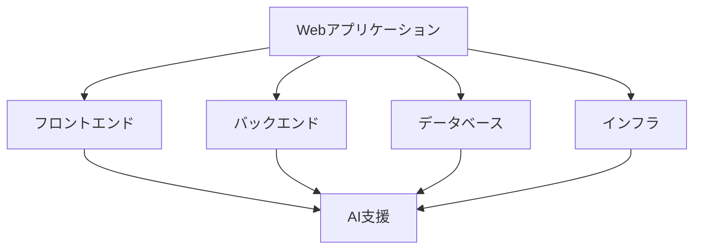

# Web アプリケーション開発

## Web アプリケーション開発の特徴

### 開発の特徴

Web アプリケーション開発には以下のような特徴があります：

- フロントエンドとバックエンドの分離
- レスポンシブデザイン
- セキュリティの重要性
- スケーラビリティ

### 開発の課題

## AIを活用した開発

### 1. フロントエンド開発

AIを活用したフロントエンド開発：

- UI コンポーネントの生成
- レスポンシブデザインの最適化
- パフォーマンス最適化
- アクセシビリティの向上

### 2. バックエンド開発

AIを活用したバックエンド開発：

- API 設計の最適化
- データモデルの生成
- セキュリティの強化
- パフォーマンス最適化

### 3. テスト自動化

AIを活用したテスト自動化：

- ユニットテストの生成
- E2E テストの自動化
- パフォーマンステスト
- セキュリティテスト

## 実践的な手法

### 開発プロセス

AIを活用した開発プロセス：

- 要件定義
- 設計
- 実装
- テスト
- デプロイ

### 品質管理

AIを活用した品質管理：

- コードレビュー
- パフォーマンス最適化
- セキュリティチェック
- ユーザーフィードバック

## 成功のポイント

### 設計の最適化

アプリケーション設計の最適化：

- アーキテクチャ設計
- データモデリング
- セキュリティ設計
- スケーラビリティ

### 運用管理

AIを活用した運用管理：

- モニタリング
- ログ分析
- パフォーマンス最適化
- インシデント対応

## 実践的なアドバイス

### 導入のステップ

AIを Web アプリケーション開発に導入するステップ：

1. 現状分析
2. 目標設定
3. ツール選択
4. プロセス確立
5. 評価と改善

### 成功への道筋

Web アプリケーション開発での AI活用を成功させるポイント：

- 明確な目標設定
- 段階的な導入
- チームの理解と協力
- 継続的な改善

## まとめ

AIを活用した Web アプリケーション開発は、開発効率と品質を大幅に向上させる可能性を秘めています。適切な設計と継続的な改善が重要です。
