# git worktreeでマルチタスクを並列化する

Claude Codeの完全自動実行モードを使うと、人間が関与しなくても自動でgithubのプルリクエストを作成してくれるようになります。

そうなってくると、複数のAIを並列で走らせて、複数機能を同時に開発したくなってきます。それを実現するのがgit worktreeです。

## 並列実行したいというニーズ

例えば、あなたのプロジェクトに3つのIssueがあるとします。

- **Issue 1**：ユーザー登録機能の追加
- **Issue 2**：パスワードリセット機能のバグ修正
- **Issue 3**：管理画面のUIデザイン改善

通常の開発では、これらを1つずつ順番に実装していきます。Issue 1が完了してから、Issue 2に取り掛かり、Issue 2が終わったらIssue 3に着手します。

しかし、Claude Codeの完全自動実行モードを使えば、こう考えることができます。

「AIに全部任せて自動実行できるなら、3つのタスクを同時に走らせたらもっと早く終わるのでは？」

この考えは正しいです。3つのIssueが互いに独立している場合、並列実行することで開発速度を大幅に向上させることができます。

しかしここで問題が起きます。

## 問題：一般的な流れでGitを使用すると並列作業ができない

通常、gitでは同時に1つのブランチしかチェックアウトできないので並列作業は出来ません。
これでは、3つのIssueを並列実行することはできません。
それを解決するのがgit worktreeです。

## git worktreeとは

git worktreeは、**同時に複数のワーキングディレクトリ(作業スペース)を作成できる機能**です。

**従来の`git checkout`の場合：** 1つのフォルダ(=ワーキングディレクトリ)で作業。git checkoutコマンドでブランチを切り替える

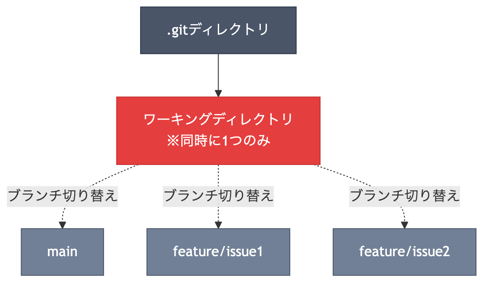

**`git worktree`の場合：** gitディレクトリ配下に、子フォルダ(=ワーキングディレクトリ)が複数作成される。git checkoutではなく、フォルダ移動することで作業場所を切り替える

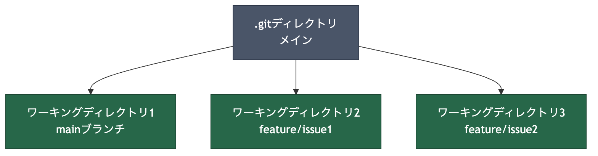

### git checkoutとの違い

多くの方が「ブランチを切り替えるなら`git checkout`があるじゃないか」と疑問に思うかもしれません。しかし、`git checkout`は同時に1つのブランチしか扱えません。

一方、git worktreeコマンドを使うと、いつものgitディレクトリ配下に、1ブランチにつき、1つの子フォルダ(=ワーキングディレクトリ)が作成されます。git checkoutコマンドではなく、フォルダ移動することで作業場所を切り替えます。

**`git worktree`の場合：**
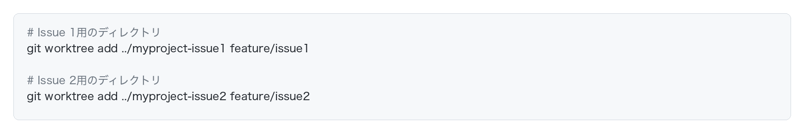

git worktreeは、以下のような構造を作ります。

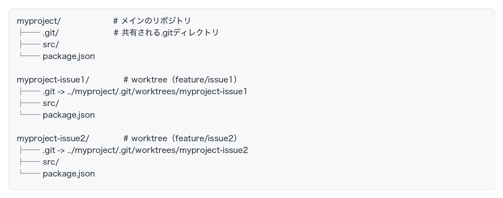

各worktreeは、メインの`.git`ディレクトリを参照しています。そのため、リポジトリ全体を複製する必要がありません。

**メリット：**
- ディスク容量の節約（リポジトリは1つだけ）
- リポジトリの同期が簡単（`.git`ディレクトリは共有されている）
- 各ワーキングディレクトリで異なるブランチを同時にチェックアウト可能

### git cloneとの違い

「複数のディレクトリで作業するなら、`git clone`で複数回クローンすればいいのでは？」と思う方もいるかもしれません。確かに可能ですが、`git worktree`の方が圧倒的に効率的です。

**`git clone`で複数回クローンする場合：**
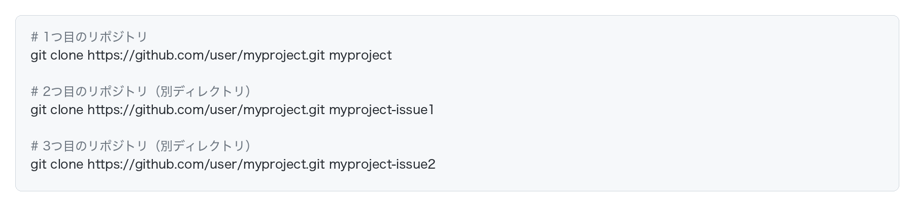

**`git clone`の問題点：**
- **ディスク容量を大量に消費**：各クローンが完全な`.git`ディレクトリを持つため、同じ履歴データが3回保存される
- **同期が面倒**：各リポジトリで個別に`git fetch`や`git pull`を実行する必要がある

**`git worktree`の場合：**
- **ディスク容量を大幅に節約**：`.git`ディレクトリは1つだけ。worktreeは作業ファイルのみを持つ
- **同期が簡単**：メインリポジトリで`git fetch`すれば、すべてのworktreeに反映される

## git worktreeの基本的な使い方

### 1. worktreeの作成

新しいworktreeを作成するには、`git worktree add`コマンドを使います。

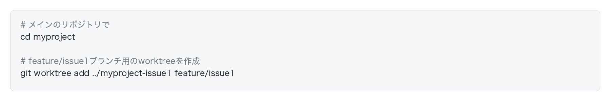

このコマンドは以下のことを実行します：

1. `../myproject-issue1`ディレクトリを作成
2. そのディレクトリで`feature/issue1`ブランチをチェックアウト
3. worktreeをメインリポジトリの`.git`にリンク

### 2. 新しいブランチを作成してworktreeを作成

ブランチがまだ存在しない場合は、`-b`オプションで新しいブランチを作成できます。

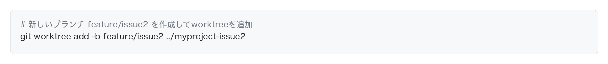

### 3. worktreeの一覧を表示

現在のworktreeの一覧を確認するには、`git worktree list`を使います。

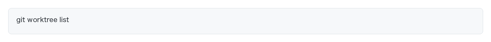

出力例：

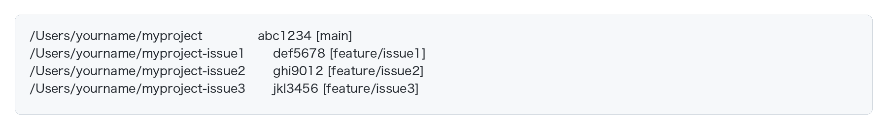

### 4. worktreeの削除

作業が完了したworktreeは削除できます。

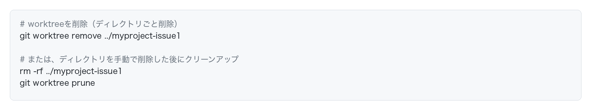

**注意：**
- `git worktree remove`は、未コミットの変更がある場合は削除を拒否します
- `-f`オプションで強制削除できますが、変更が失われるため注意が必要です

## AI駆動開発での具体的な活用シナリオ

git worktreeとClaude Codeを組み合わせた、実践的な並列開発のワークフローを見ていきます。

### ステップ1：worktreeを複数作成

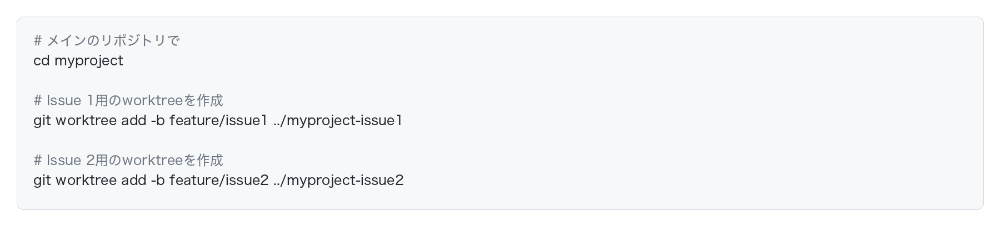

### ステップ2：それぞれのworktreeでClaude Codeを起動し、並列で開発を進める

**ターミナル1：**
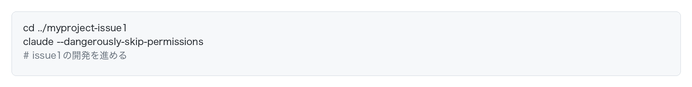

**ターミナル2：**

### ステップ3：開発完了後、worktreeを削除

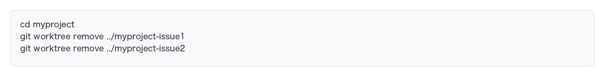

## まとめ

git worktreeを活用することで、AI駆動開発の生産性をさらに向上させることができます。

なお、claude codeの --dangerously-skip-permissions のような、完全自動実行してくれるモードの使用を強くお勧めします。
