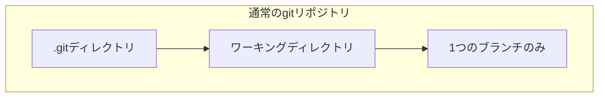

# git worktreeでマルチタスクを並列化する

Claude Codeの完全自動実行モードを学びました。AIが人間の確認なしに作業を進められることで、寝ている間にもタスクが進行するという画期的な開発スタイルが実現しました。

しかし、ここでさらに効率を高める方法があります。それが**複数のタスクを並列実行する**というアプローチです。

## 並列実行したいというニーズ

例えば、あなたのプロジェクトに3つのIssueがあるとします。

- **Issue 1**：ユーザー登録機能の追加
- **Issue 2**：パスワードリセット機能のバグ修正
- **Issue 3**：管理画面のUIデザイン改善

通常の開発では、これらを1つずつ順番に実装していきます。Issue 1が完了してから、Issue 2に取り掛かり、Issue 2が終わったらIssue 3に着手します。

しかし、Claude Codeの完全自動実行モードを使えば、こう考えることができます。

「AIに全部任せて自動実行できるなら、3つのタスクを同時に走らせたらもっと早く終わるのでは？」

この考えは正しいです。3つのIssueが互いに独立している場合、並列実行することで開発速度を大幅に向上させることができます。

### 具体的なシナリオ

例えば、こんな状況を想像してみてください。

**朝9時：**
- Issue 1用にClaude Codeを起動（feature/issue1ブランチで作業）
- Issue 2用にClaude Codeを起動（feature/issue2ブランチで作業）
- Issue 3用にClaude Codeを起動（feature/issue3ブランチで作業）

**夕方18時：**
- Issue 1の実装が完了してテストもパス
- Issue 2のバグ修正が完了してテストもパス
- Issue 3のUI改善が完了してプレビュー確認も完了

もし順番に実装していたら、3日かかる作業が1日で完了するのです。

## 問題：通常のgitでは並列作業ができない

しかし、ここで問題があります。通常のgitリポジトリでは、**1つのワーキングディレクトリに対して1つのブランチしかチェックアウトできません**。

つまり、あなたのプロジェクトディレクトリ `/myproject` では、feature/issue1ブランチをチェックアウトしている間は、feature/issue2やfeature/issue3には切り替えられないのです。

```bash
# myprojectディレクトリで
git checkout feature/issue1

# この状態では、別のブランチで作業するには
# まずこのブランチから離れる必要がある
git checkout feature/issue2  # feature/issue1の作業を中断
```

これでは、3つのIssueを並列実行することはできません。

### 解決策1：プロジェクトを3回クローンする（非推奨）

1つの解決策は、プロジェクトを複数回クローンすることです。

```bash
git clone https://github.com/yourname/myproject.git myproject-issue1
git clone https://github.com/yourname/myproject.git myproject-issue2
git clone https://github.com/yourname/myproject.git myproject-issue3
```

こうすれば、それぞれのディレクトリで異なるブランチをチェックアウトできます。

**しかし、この方法には問題があります：**

1. **ディスク容量の無駄**：同じリポジトリを3回複製するため、3倍のディスク容量が必要
2. **管理が煩雑**：3つのディレクトリを管理する必要がある
3. **リポジトリの同期が面倒**：各ディレクトリで`git fetch`や`git pull`を実行する必要がある

### 解決策2：git worktree（推奨）

より良い解決策が**git worktree**です。

git worktreeを使えば、**1つのgitリポジトリで複数のワーキングディレクトリを持つ**ことができます。

## git worktreeとは

git worktreeは、**1つのリポジトリに対して複数のワーキングディレクトリを作成できる機能**です。

### 通常のgitリポジトリとの違い



通常のgitでは、1つの`.git`ディレクトリに対して1つのワーキングディレクトリしか持てません。


git worktreeを使うと、1つの`.git`ディレクトリを複数のワーキングディレクトリで共有できます。

### 仕組みの説明

git worktreeは、以下のような構造を作ります。

```
myproject/                    # メインのリポジトリ
├── .git/                     # 共有される.gitディレクトリ
├── src/
└── package.json

myproject-issue1/             # worktree（feature/issue1）
├── .git -> ../myproject/.git/worktrees/myproject-issue1
├── src/
└── package.json

myproject-issue2/             # worktree（feature/issue2）
├── .git -> ../myproject/.git/worktrees/myproject-issue2
├── src/
└── package.json

myproject-issue3/             # worktree（feature/issue3）
├── .git -> ../myproject/.git/worktrees/myproject-issue3
├── src/
└── package.json
```

各worktreeは、メインの`.git`ディレクトリを参照しています。そのため、リポジトリ全体を複製する必要がありません。

**メリット：**
- ディスク容量の節約（リポジトリは1つだけ）
- リポジトリの同期が簡単（`.git`ディレクトリは共有されている）
- 各ワーキングディレクトリで異なるブランチを同時にチェックアウト可能

## git worktreeの基本的な使い方

### 1. worktreeの作成

新しいworktreeを作成するには、`git worktree add`コマンドを使います。

```bash
# メインのリポジトリで
cd myproject

# feature/issue1ブランチ用のworktreeを作成
git worktree add ../myproject-issue1 feature/issue1
```

このコマンドは以下のことを実行します：

1. `../myproject-issue1`ディレクトリを作成
2. そのディレクトリで`feature/issue1`ブランチをチェックアウト
3. worktreeをメインリポジトリの`.git`にリンク

### 2. 新しいブランチを作成してworktreeを作成

ブランチがまだ存在しない場合は、`-b`オプションで新しいブランチを作成できます。

```bash
# 新しいブランチ feature/issue2 を作成してworktreeを追加
git worktree add -b feature/issue2 ../myproject-issue2
```

### 3. worktreeの一覧を表示

現在のworktreeの一覧を確認するには、`git worktree list`を使います。

```bash
git worktree list
```

出力例：

```
/Users/yourname/myproject              abc1234 [main]
/Users/yourname/myproject-issue1       def5678 [feature/issue1]
/Users/yourname/myproject-issue2       ghi9012 [feature/issue2]
/Users/yourname/myproject-issue3       jkl3456 [feature/issue3]
```

### 4. worktreeの削除

作業が完了したworktreeは削除できます。

```bash
# worktreeを削除（ディレクトリごと削除）
git worktree remove ../myproject-issue1

# または、ディレクトリを手動で削��した後にクリーンアップ
rm -rf ../myproject-issue1
git worktree prune
```

**注意：**
- `git worktree remove`は、未コミットの変更がある場合は削除を拒否します
- `-f`オプションで強制削除できますが、変更が失われるため注意が必要です

## AI駆動開発での具体的な活用シナリオ

git worktreeとClaude Codeを組み合わせた、実践的な並列開発のワークフローを見ていきます。

### ステップ1：worktreeを3つ作成

```bash
# メインのリポジトリで
cd myproject

# Issue 1用のworktreeを作成
git worktree add -b feature/issue1 ../myproject-issue1

# Issue 2用のworktreeを作成
git worktree add -b feature/issue2 ../myproject-issue2

# Issue 3用のworktreeを作成
git worktree add -b feature/issue3 ../myproject-issue3
```

### ステップ2：それぞれのworktreeでClaude Codeを起動

**ターミナル1：**

```bash
cd ../myproject-issue1
claude --dangerously-skip-permissions
```

プロンプト：

```
ユーザー登録機能を実装してください。
要件は以下の通りです：
- メールアドレスとパスワードで登録
- パスワードは8文字以上
- バリデーションエラーをわかりやすく表示
- 実装完了後、テストを実行して全て通るまで修正してください
```

**ターミナル2：**

```bash
cd ../myproject-issue2
claude --dangerously-skip-permissions
```

プロンプト：

```
パスワードリセット機能のバグを修正してください。
現在、メールが送信されないという問題があります。
バグを特定して修正し、テストを実行して全て通るまで修正してください。
```

**ターミナル3：**

```bash
cd ../myproject-issue3
claude --dangerously-skip-permissions
```

プロンプト：

```
管理画面のUIを改善してください。
要件は以下の通りです：
- レスポンシブデザインに対応
- ダークモード対応
- テーブルの並び替え機能を追加
- 実装完了後、ブラウザで動作確認してください
```

### ステップ3：AIが自動で並列実行

3つのターミナルで、Claude Codeが同時に作業を進めます。

**ターミナル1：**
```
Claude Code (Issue 1):
  ✓ ユーザー登録フォームコンポーネントを作成中...
  ✓ バリデーションロジックを実装中...
  ✓ APIエンドポイントを作成中...
  ✓ テストを実行中...
```

**ターミナル2：**
```
Claude Code (Issue 2):
  ✓ バグの原因を調査中...
  ✓ メール送信ロジックの修正中...
  ✓ テストを実行中...
```

**ターミナル3：**
```
Claude Code (Issue 3):
  ✓ レスポンシブCSSを実装中...
  ✓ ダークモードの切り替えボタンを追加中...
  ✓ テーブルの並び替え機能を実装中...
  ✓ ブラウザで動作確認中...
```

### ステップ4：完了後、それぞれプルリクエストを作成

各worktreeで作業が完了したら、プルリクエストを作成します。

```bash
# Issue 1
cd ../myproject-issue1
git push origin feature/issue1
gh pr create --title "ユーザー登録機能の追加" --body "..."

# Issue 2
cd ../myproject-issue2
git push origin feature/issue2
gh pr create --title "パスワードリセット機能のバグ修正" --body "..."

# Issue 3
cd ../myproject-issue3
git push origin feature/issue3
gh pr create --title "管理画面のUI改善" --body "..."
```

### ステップ5：レビュー後、worktreeを削除

プルリクエストがマージされたら、worktreeを削除します。

```bash
cd myproject
git worktree remove ../myproject-issue1
git worktree remove ../myproject-issue2
git worktree remove ../myproject-issue3
```

## ベストプラクティス

### 1. worktreeの命名規則を統一する

worktreeのディレクトリ名は、ブランチ名と一致させると管理しやすいです。

```bash
# ❌ 悪い例：名前がバラバラ
git worktree add ../work1 feature/issue1
git worktree add ../temp2 feature/issue2

# ✅ 良い例：命名規則が統一されている
git worktree add ../myproject-issue1 feature/issue1
git worktree add ../myproject-issue2 feature/issue2
```

### 2. worktreeは短期間の作業に使う

worktreeは、数時間〜数日程度の短期間の作業に適しています。

長期間のブランチで作業する場合は、通常のブランチ切り替えで十分です。

### 3. 完了したworktreeはすぐに削除する

作業が完了したworktreeは、すぐに削除してディレクトリを整理します。

```bash
# プルリクエストがマージされたら
git worktree remove ../myproject-issue1
```

### 4. CLAUDE.mdファイルを共有する

worktreeはメインリポジトリの`.git`を共有しているため、`CLAUDE.md`などの設定ファイルも共有されます。

各worktreeで同じルールが適用されるため、一貫性のある開発が可能です。

### 5. 並列実行するタスクは独立したものを選ぶ

並列実行するタスクは、できるだけ互いに影響しないものを選びます。

**❌ 悪い例：**
- Issue 1：ユーザー認証機能の追加
- Issue 2：ユーザー認証機能のテスト追加

これらは同じファイルを編集する可能性が高く、コンフリクトが発生しやすいです。

**✅ 良い例：**
- Issue 1：ユーザー認証機能の追加
- Issue 2：管理画面のUI改善
- Issue 3：メール通知機能の追加

これらは異なるファイルを編集するため、コンフリクトが発生しにくいです。

## メリットと注意点

### メリット

**1. 並列作業による生産性の爆発的向上**

3つのタスクを同時に進めることで、理論上は3倍の速度で開発が進みます。

**2. ディスク容量の節約**

リポジトリを複数回クローンする必要がないため、ディスク容量を節約できます。

**3. リポジトリの同期が簡単**

`.git`ディレクトリは共有されているため、メインリポジトリで`git fetch`を実行すれば、すべてのworktreeに反映されます。

**4. ブランチの切り替えが不要**

各worktreeは独立したワーキングディレクトリなので、ブランチを切り替える必要がありません。

### 注意点

**1. ディスクI/Oが増える**

複数のworktreeで同時に作業すると、ディスクI/Oが増加します。特に、3つ以上のworktreeで並列実行する場合は、ディスク性能がボトルネックになる可能性があります。

**2. メモリ消費が増える**

各worktreeでClaude Codeを起動すると、それぞれがメモリを消費します。マシンのメモリ容量に注意してください。

**3. コンフリクトのリスク**

同じファイルを複数のworktreeで編集している場合、マージ時にコンフリクトが発生する可能性があります。

**4. 完全自動モードのリスク**

`--dangerously-skip-permissions`モードを使う場合は、必ずサンドボックス環境で実行してください。3つのClaude Codeが同時に自動実行していると、予期しない動作が発生する可能性があります。

## まとめ

**git worktreeは、AI駆動開発における並列作業の強力な武器です。**

**主なポイント：**

1. **通常のgitでは1つのブランチしかチェックアウトできない**
   - 複数のタスクを並列実行できない

2. **git worktreeなら複数のワーキングディレクトリを持てる**
   - 1つのリポジトリで複数のブランチを同時にチェックアウト
   - ディスク容量を節約しつつ並列作業が可能

3. **Claude Codeと組み合わせて並列実行**
   - 各worktreeでClaude Codeを起動
   - 完全自動モードで3つのタスクを同時に進める
   - 理論上は3倍の速度で開発が進む

4. **ベストプラクティス**
   - 命名規則を統一
   - 短期間の作業に使う
   - 完了したworktreeはすぐに削除
   - 独立したタスクを選ぶ

5. **注意点**
   - ディスクI/Oとメモリ消費に注意
   - コンフリクトのリスクを考慮
   - 完全自動モードはサンドボックス環境で実行

git worktreeを活用することで、AI駆動開発の生産性をさらに向上させることができます。複数のタスクを並列実行し、開発速度を最大化しましょう。
