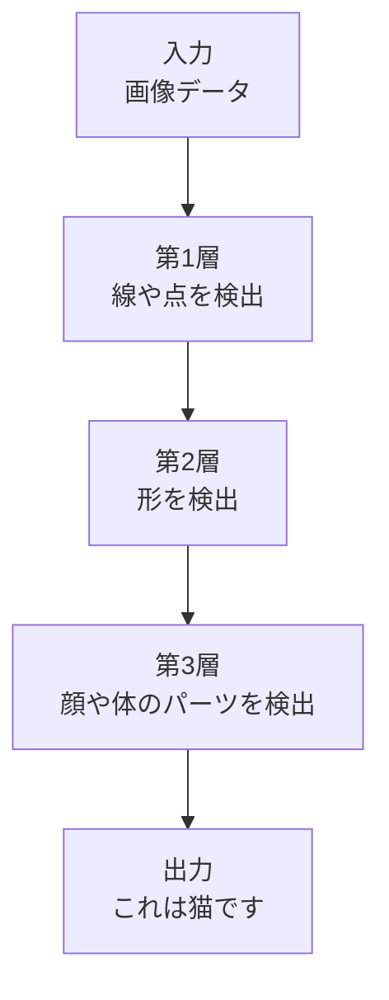

# そもそもAIって何？

## AIは「経験から学ぶコンピュータプログラム」

AI（人工知能）と聞くと、なんだか難しそうに感じるかもしれません。でも、本質はとてもシンプルです。AIとは「経験から学んで、賢くなっていくコンピュータプログラム」のことです。

普通のプログラムは、人間が書いたルール通りにしか動きません。例えば「もし気温が30度以上なら『暑い』と表示する」というコードを書けば、その通りに動きます。しかし、新しいパターンに出会っても、自分で判断することはできません。

一方、AIは違います。たくさんのデータを見せることで、自分でパターンを見つけて学習します。まるで、あなたが経験を積んで仕事を覚えていくように、AIもデータという経験から学んでいきます。

## 身近な例で理解するAI

あなたは毎日、知らず知らずのうちにAIを使っています。

**YouTubeのおすすめ動画**を考えてみましょう。あなたが見た動画の履歴から、次に見たくなりそうな動画を予測して表示してくれます。これはAIが「この人はこういう動画が好きだ」というパターンを学習した結果です。

**スマホの音声アシスタント**も同じです。あなたの声を聞いて、それが何という言葉なのかを理解します。最初は精度が低くても、たくさんの人の音声データから学習することで、どんどん正確になっていきます。

## AIの3つの基本的な能力

AIには主に3つの能力があります。

### 1. 学習する力

人間が「これは猫の画像です」「これは犬の画像です」と大量の写真をAIに見せます。すると、AIは自分で「耳が尖っている」「鼻が長い」といった特徴を見つけ出し、新しい画像を見ても「これは猫だ」と判断できるようになります。

プログラマーが「猫の特徴は耳が尖っていて...」とルールを書く必要はありません。AIが自分で学ぶのです。

### 2. 推論する力

学習したパターンを使って、新しい状況で判断する力です。

例えば、過去の気象データから学習したAIは「明日の天気」を予測できます。これまでに見たことがない明日の天気でも、過去のパターンから「このような気圧配置の時は雨になりやすい」と推論します。

### 3. 言葉を理解する力

これは「自然言語処理」と呼ばれる技術です。

人間が普段使っている言葉を理解して、適切に返事をする能力です。ChatGPTのようなツールは、この能力を使ってあなたと会話します。「おすすめのラーメン屋を教えて」という質問の意味を理解し、適切な回答を生成します。

## AIの2つのタイプ

AIには大きく分けて2つのタイプがあります。

### 特化型AI（今、実際に使われているAI）

1つのことに特化したAIです。現在使われているほぼすべてのAIがこのタイプです。

- **画像認識AI**: 写真の中の猫を見つけることはできるが、料理のレシピは作れない
- **音声認識AI**: 人間の声を文字に変換できるが、株価の予測はできない
- **翻訳AI**: 英語を日本語に翻訳できるが、病気の診断はできない

料理が得意な人、スポーツが得意な人がいるように、AIもそれぞれ得意分野が決まっています。

### 汎用AI（まだ実現していないAI）

人間のように、あらゆることができるAIです。映画やアニメに出てくるような、自分で考えて、どんな問題も解決できるAIのことです。

「朝起きて、天気を見て服を決めて、仕事をして、趣味を楽しんで...」と人間のように様々なことができるAIは、まだ実現していません。

現在のAIはすべて特化型です。ChatGPTも文章生成に特化したAIであり、実際に手足を動かして料理を作ることはできません。

## AIはどうやって学ぶのか

AIの学習方法には、主に2つの段階があります。

### ステップ1: 機械学習

大量のデータを見せて、パターンを学習させる方法です。

例えば、スパムメールを見分けるAIを作りたいとします。

1. 10,000通のメールを用意します
2. それぞれに「スパム」か「正常」かのラベルを付けます
3. AIに見せて学習させます
4. AIは「『無料』という単語が多い」「送信元が怪しい」などの特徴を自分で見つけます
5. 新しいメールが来たら、その特徴に基づいて判定します

### ステップ2: ディープラーニング

人間の脳の仕組みを真似た、より高度な学習方法です。

人間の脳には「ニューロン」という神経細胞があり、それらが複雑につながっています。ディープラーニングはこの仕組みを真似て、何層にも重なった「ニューラルネットワーク」という構造を使います。

画像認識を例にすると、次のような段階で学習します。

1. **第1層**: 画像の中の線や点を検出
2. **第2層**: それらを組み合わせて、丸や四角などの形を認識
3. **第3層**: さらに組み合わせて、目や耳などのパーツを認識
4. **出力層**: 最終的に「これは猫だ」と判断

この多層構造により、人間が特徴を指定しなくても、AIが自動的に「何が重要な特徴か」を学習できます。

## あなたの周りのAI活用例

AIはすでに様々な場面で使われています。

### 日常生活での活用

- **スマホのカメラ**: 人の顔を自動で検出して、ピントを合わせる
- **Netflix・YouTube**: あなたの好みを学習して、おすすめの動画を提案
- **Google Maps**: 過去の交通データから、最速ルートを予測
- **メールアプリ**: 迷惑メールを自動で振り分け

### エンジニアの仕事での活用

- **GitHub Copilot**: コードを書いていると、次に書きそうなコードを提案
- **ChatGPT**: わからないエラーメッセージを説明してくれる
- **コードレビューツール**: バグになりそうなコードを自動で指摘

### ビジネスでの活用

- **顧客サポート**: チャットボットが簡単な質問に自動で回答
- **在庫管理**: 過去の売上データから、必要な在庫量を予測
- **不正検知**: クレジットカードの不正利用を検出

## AIにも苦手なことがある

AIは万能ではありません。いくつかの課題があります。

### データの質と量が必要

AIは大量のデータがないと学習できません。データが少ないと、正しく学習できず、間違った判断をしてしまいます。

また、偏ったデータで学習すると���偏った判断をします。例えば、男性の写真ばかりで学習したAIは、女性の顔を正しく認識できないかもしれません。

### 計算リソースが必要

高度なAIを動かすには、強力なコンピュータが必要です。ChatGPTのような大規模なAIを学習させるには、数億円規模の計算機が必要になります。

### 「なぜそう判断したか」が分かりにくい

AIが出した答えの理由を説明するのが難しい場合があります。

例えば、採用面接でAIが「この人は不合格」と判断したとき、なぜそう判断したのかを説明できないことがあります。これは倫理的に問題になる場合があります。

### プライバシーの問題

AIを学習させるには大量のデータが必要ですが、その中に個人情報が含まれている場合があります。適切に管理しないと、プライバシー侵害につながります。

## まとめ

AIは「経験から学ぶコンピュータプログラム」です。すでにあなたの日常生活やエンジニアの仕事の中で活用されています。

重要なポイントは次の通りです。

- AIはデータから自動でパターンを学習します
- 現在のAIは特定の作業に特化しています
- 大量のデータと計算リソースが必要です
- 万能ではなく、苦手なこともあります

次の章では、AIの種類についてさらに詳しく見ていきます。AIにはどんな種類があり、それぞれどんな特徴があるのかを理解することで、適切にAIを活用できるようになります。
