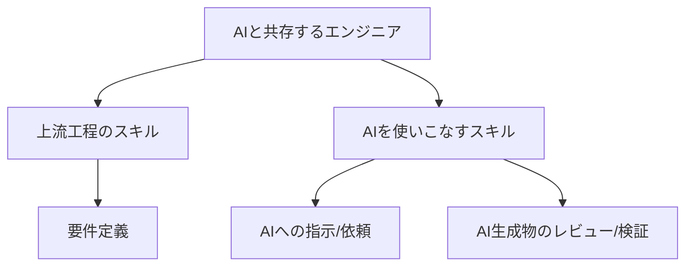

# もうエンジニアは不要？AI駆動開発とは？

近年、AIの目覚ましい進化により、ソフトウェア開発の現場に大きな変革が訪れようとしています。もしかすると、「エンジニアの仕事はAIに奪われるのではないか？」と不安を感じている方もいるかもしれません。結論から申し上げると、コードを書くというエンジニアの仕事は、間違いなくAIに置き換えられていきます。これは遠い未来の話ではなく、すでに多くの開発現場で、AIが人間の業務を代替し始めています。今後2～3年でさらに加速していきます。

では、エンジニアはもう必要なくなるのでしょうか？

残念ながら、今後は「AIに仕事を奪われるエンジニア」と「生き残るエンジニア」の**二極化**が進みます。

## 仕事を失うエンジニアとは？

AIを使いこなせないエンジニアの多くは、職を失うか、年収が下がります。特に、日々の業務でコーディングやテストといった作業が中心のエンジニアは、AIに仕事を奪われます。

-----

## AIと共存し、生き残るエンジニアの未来

一方で、AIを使いこなし、上流工程のスキルを持つ一部のエンジニアは、これまで以上に市場価値が高まるでしょう。今後は、コーディングやテストといった具体的な実装作業はAIが行うようになります。その結果、人間のエンジニアに求められる役割は、以下のようなものに変化していきます。

  * **要件定義:** 顧客やビジネスサイドと密に連携し、システムの目的や必要な機能を明確に定義する。
  * **AIへの指示・依頼:** 定義された要件に基づき、AIに開発作業を正確に指示・依頼する。
  * **レビューと検証:** AIが生成したコードや成果物が要件を満たしているか、品質に問題がないかをレビューし、検証する。

このように、生き残るエンジニアになるためには、**上流工程のスキル**と**AIを使いこなすスキル**の2つが必須となります。

## 変化を恐れず、時代の波に乗ろう

AIによる開発の波は、もはや避けることのできない現実です。

しかし、これはピンチでもあり、チャンスでもあります。

AIに仕事を奪われると恐れるのではなく、**AIを強力なパートナーとして活用する**視点を持つことが重要です。AIを使いこなすことで、あなたは超人的な生産性を手に入れた「スーパーエンジニア」になることが出来るのです。

本講座では、そんな未来を実現するための知識とスキルを、基礎からわかりやすく解説していきます。一緒にこれからの時代を生き残りましょう！

