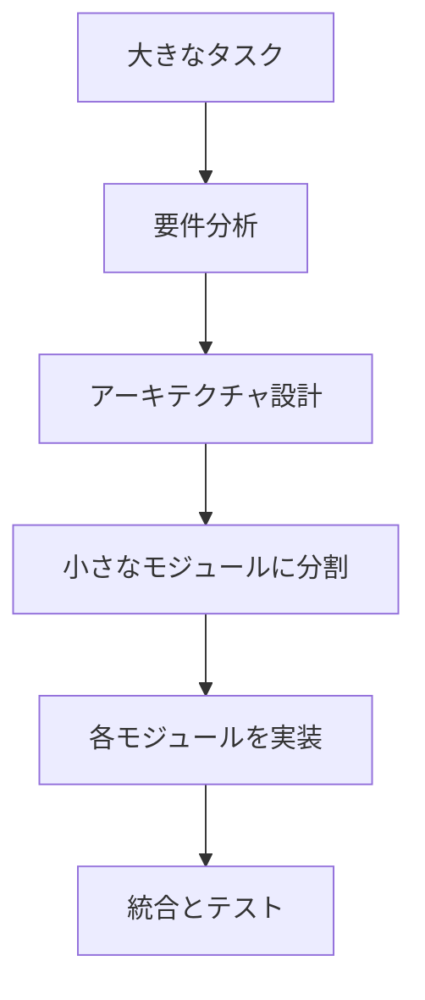
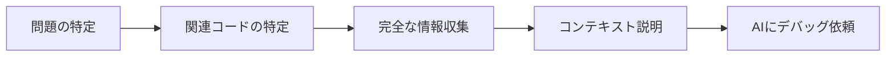
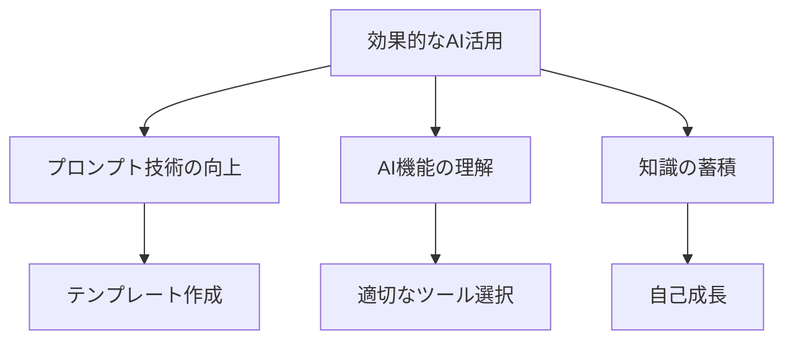

# よくある失敗と解決策

AI 駆動開発を始めたばかりのエンジニアが直面しがちな失敗とその解決策を紹介します。これらの知識を身につけることで、AI 駆動開発をより効果的に活用できるようになるでしょう。

## プロンプトに関する失敗

### 1. 曖昧な指示を出してしまう

**失敗例**：

```
ログイン機能を作って
```

このような漠然とした指示では、AI は必要な詳細情報がなく、汎用的な解答しか返せません。

**解決策**：

- 使用言語やフレームワークを明示する
- 必要な機能を具体的に箇条書きする
- 既存のコードベースの情報を提供する

**改善例**：

```
React、TypeScript、Firebase Authenticationを使ったログイン機能を実装してください。
必要な機能:
- メールアドレスとパスワードによるログイン
- Googleアカウントによるソーシャルログイン
- ログイン状態の永続化
- パスワードリセット機能
既存のプロジェクトではReact Router v6を使用しています。
```

### 2. 必要なコンテキストを提供しない

**失敗例**：

```
このバグを修正して
[コード片]
```

AI には、プロジェクトの全体像や発生しているエラーなどの背景情報がわかりません。

**解決策**：

- エラーメッセージを含める
- バグが発生する状況を説明する
- 関連するコードも提供する
- プロジェクトの構造やアーキテクチャについて説明する

**改善例**：

```
以下のReactコンポーネントでエラーが発生しています：
エラーメッセージ: "TypeError: Cannot read properties of undefined (reading 'map')"

問題のコード:
[コード]

このコンポーネントはAPIからデータをフェッチしてリスト表示します。
エラーはページ初回ロード時に発生します。データが読み込まれる前にレンダリングが行われていると思われます。
```

### 3. 一度に複雑すぎる要求をする

**失敗例**：

```
フルスタックのEコマースサイトを作成して。ユーザー認証、商品一覧、カート機能、決済機能、管理画面を含む。
```

AI は大きすぎるタスクに対して全体を把握しづらく、不完全な回答になりがちです。

**解決策**：

- タスクを小さなステップに分割する
- 段階的に実装を進める
- 基本機能から始め、徐々に機能を追加する

**改善例**：

```
Eコマースサイトを構築するプロジェクトの第一段階として、まず全体のアーキテクチャと技術スタックについて相談させてください。その後、各モジュールを個別に実装していきたいと思います。
```



## コード生成に関する失敗

### 1. 生成コードをそのまま使用する

**失敗**：AI が生成したコードを理解せずにそのままコピー＆ペーストする

**問題点**：

- バグや脆弱性が含まれる可能性がある
- プロジェクト固有の要件に合わない可能性がある
- 将来的なメンテナンスが困難になる

**解決策**：

- 生成されたコードを必ず理解してから使用する
- コードレビューを行う
- テストを書いて機能を検証する
- 必要に応じて修正・最適化する

### 2. 非現実的なコードを生成してもらう

**失敗例**：存在しないライブラリや API、古いバージョンのフレームワークを使ったコードを生成させる

**解決策**：

- 使用するライブラリやフレームワークのバージョンを明示する
- 生成されたコードの依存関係を確認する
- ライブラリのドキュメントと生成コードを比較する

**改善例**：

```
Node.js v16、Express v4.18.2、MongoDB v6を使用したRESTful APIを作成してください。
最新のES6構文を使用し、async/awaitでの非同期処理を優先してください。
```

### 3. エラーハンドリングが不十分なコードを受け入れる

**失敗**：例外処理やエラーハンドリングが不足したコードをそのまま使用する

**解決策**：

- エラーハンドリングを明示的に要求する
- 境界条件（エッジケース）の処理を確認する
- ユーザー入力の検証コードを追加する

**改善例**：

```
上記のコードに以下のエラーハンドリングを追加してください：
1. ネットワークエラーの処理
2. ユーザー入力の検証（XSS対策を含む）
3. APIからの無効なレスポンスの処理
4. タイムアウト処理
```

## デバッグに関する失敗

### 1. エラーメッセージを正確に伝えない

**失敗例**：

```
コードが動きません。何が問題ですか？
```

**解決策**：

- 完全なエラーメッセージをコピー＆ペーストする
- スタックトレースがあれば含める
- 発生状況や再現手順を説明する

**改善例**：

```
以下のコードを実行すると、このエラーが発生します：

TypeError: Cannot read property 'length' of undefined
    at UserList (UserList.js:12)
    at renderWithHooks (react-dom.development.js:14985)
    ...

エラーが発生するのはユーザーリストページに移動した直後です。
関連するコードは以下の通りです：
[コード]
```

### 2. 断片的な情報でデバッグを依頼する

**失敗**：問題の一部だけを見せて全体を解決してもらおうとする

**解決策**：

- 関連するコード全体を共有する
- コンポーネント間の関係を説明する
- データフローを説明する



## AI の回答に関する失敗

### 1. AI の回答を鵜呑みにする

**失敗**：AI の回答が常に正確だと思い込む

**解決策**：

- 回答を批判的に評価する
- ドキュメントや信頼できる情報源で検証する
- 解決策を理解してから適用する
- 必要に応じて追加質問する

### 2. AI のハルシネーション（幻覚）に気づかない

**失敗例**：AI が存在しないライブラリや API を提案しても気づかない

**解決策**：

- 不確かな情報は検証する
- ライブラリ名や関数が実際に存在するか確認する
- 自分の知識と照らし合わせる
- 公式ドキュメントを参照する

### 3. 一回のやり取りで諦める

**失敗**：AI からの回答が期待に合わない場合にすぐ諦める

**解決策**：

- フィードバックを提供して回答を改善してもらう
- 質問を具体化・明確化する
- 段階的にアプローチする

**改善例**：

```
ありがとうございます。しかしこの解決策ではまだ問題が解決しません。
具体的には以下の点が課題です：
1. 非同期処理の順序が正しくない
2. エラーハンドリングが不足している

特に、データが読み込まれる前にコンポーネントがレンダリングされる問題を解決したいです。
React Suspenseや条件付きレンダリングを使った解決策を提案していただけますか？
```

## セキュリティに関する失敗

### 1. 機密情報を AI に提供してしまう

**失敗**：API キー、パスワード、個人情報などをプロンプトに含めてしまう

**解決策**：

- 機密情報はマスクまたは削除する（例：`API_KEY_XXXXX`）
- 機密データはダミーデータに置き換える
- 社内情報を共有する前にポリシーを確認する

### 2. セキュリティを考慮しないコードを生成してもらう

**失敗**：セキュリティに関する要件を明示せず、脆弱なコードを受け入れる

**解決策**：

- セキュリティ要件を明示的に伝える
- OWASP Top 10 などのセキュリティベストプラクティスを参照する
- 生成されたコードのセキュリティレビューを行う

**改善例**：

```
以下の要件でユーザー登録フォームを実装してください。セキュリティに特に注意し、以下の点を考慮してください：
1. SQLインジェクション対策
2. XSS対策
3. CSRFトークンの実装
4. パスワードの安全なハッシュ化
5. 入力値の検証
```

## ワークフロー関連の失敗

### 1. AI 依存度が高くなりすぎる

**失敗**：すべての問題解決を AI に頼り切ってしまう

**解決策**：

- AI を補助ツールとして使用する意識を持つ
- 自分の判断力と知識を高め続ける
- AI に頼る前に自分で考える時間を持つ
- AI の回答から学び、知識を蓄積する

### 2. 効率的な活用法を学ばない

**失敗**：AI ツールの機能を十分に理解せず、基本的な使い方だけで満足してしまう

**解決策**：

- AI ツールのドキュメントや機能を学ぶ
- プロンプトエンジニアリングのスキルを磨く
- 他の開発者の AI 活用法から学ぶ
- 効果的なプロンプトを保存・整理する



## 継続的な学習の失敗

### 1. AI からの回答を理解せずに使う

**失敗**：生成されたコードや説明を理解しようとしない

**解決策**：

- AI に説明を求める
- 不明点は追加質問する
- コードの動作原理を学ぶ
- 関連する概念やライブラリについて調べる

### 2. 基礎知識の学習をおろそかにする

**失敗**：AI にコードを生成してもらうことで、基礎知識の習得が不足する

**解決策**：

- 基礎から学ぶ時間を確保する
- AI を「先生」として活用し、概念の説明を求める
- 「なぜそのコードが動作するのか」を理解する
- 手作業でコードを書く機会も持つ

**改善例**：

```
このReactコンポーネントがどのように動作するか、詳しく説明してください。
特に以下の点について知りたいです：
1. useEffectの依存配列が空の意味
2. コンポーネントのライフサイクルとの関係
3. クリーンアップ関数の役割
4. この実装の潜在的な問題点
```

## まとめ

AI 駆動開発における失敗を避けるためのポイント：

1. **明確なプロンプトを作成する**：具体的な要件、コンテキスト、制約条件を提供する
2. **生成されたコードを批判的に評価する**：コードレビューとテストを行う
3. **段階的にタスクを進める**：複雑な問題は小さなステップに分割する
4. **継続的に学習する**：AI から学び、自分のスキルを向上させる
5. **セキュリティを常に意識する**：機密情報の取り扱いに注意し、セキュアなコードを求める
6. **フィードバックループを活用する**：初回の回答で満足せず、改善を求める

これらのポイントを意識することで、AI ツールをより効果的に活用し、開発効率と品質を高めることができるでしょう。失敗は学びの機会と捉え、継続的に改善していくことが大切です。
