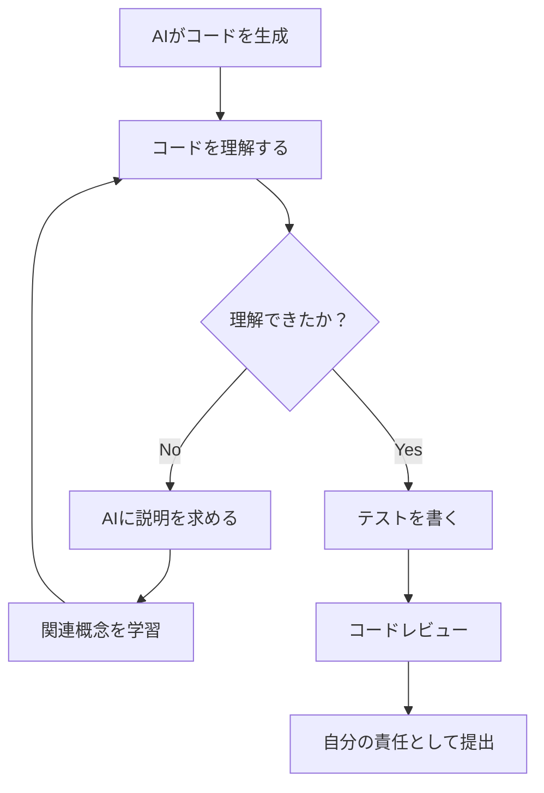
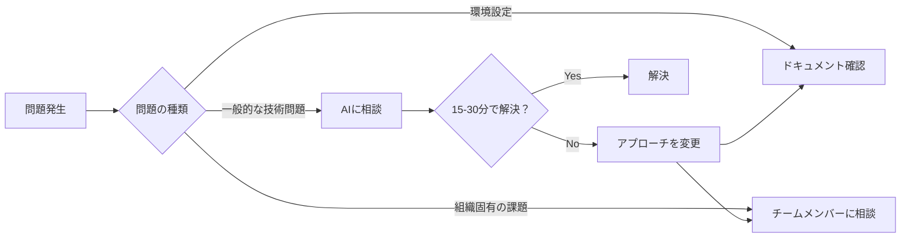
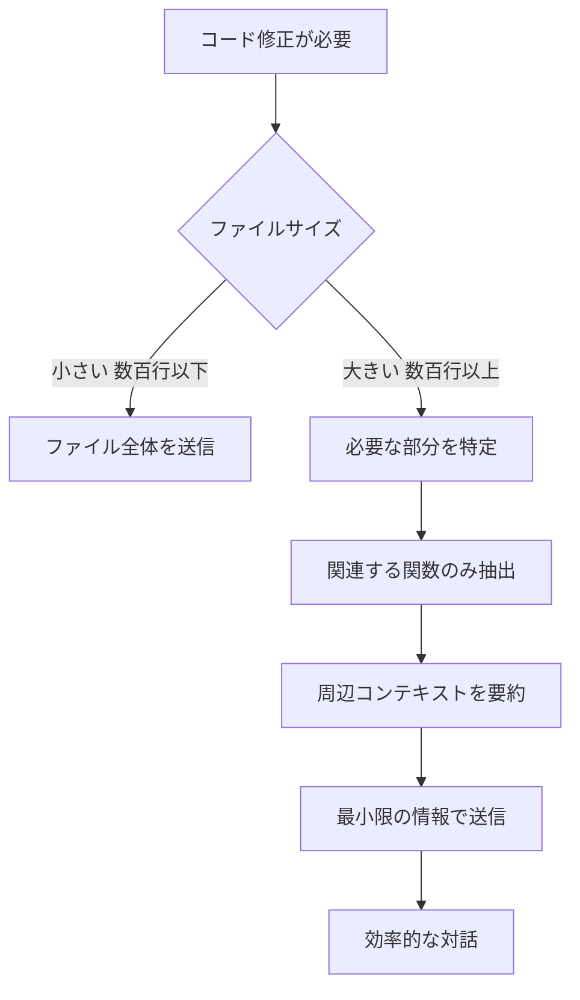
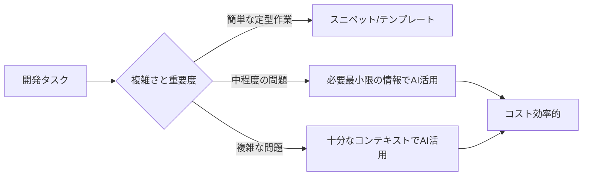
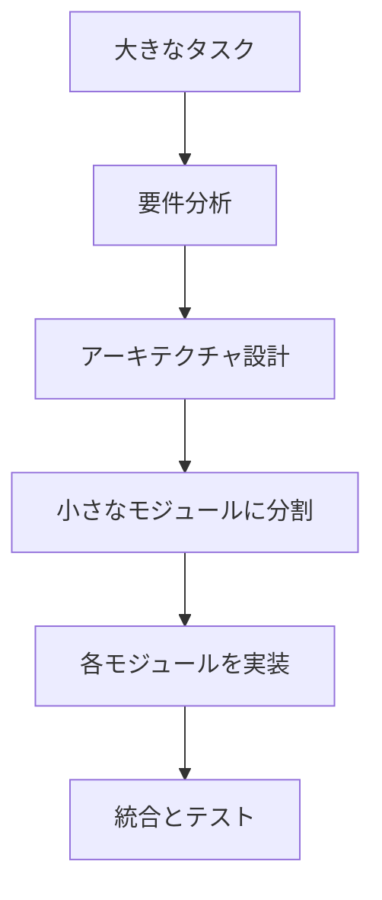
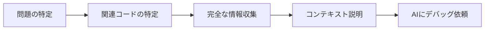
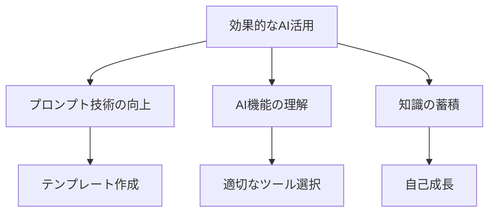

# よくある失敗と解決策

## 心構えの失敗

### 1. AIの回答を理解せず「バグを直せ」と繰り返す

エラー解決の場面で最も多い失敗パターンが、AIの回答をまともに見ようともせず、理解しようともせずに、「バグを直せ」と繰り返すことです。この行動は無限ループを引き起こし、時間もお金（AIのトークンコスト）も浪費する結果に終わります。

**失敗例：無限ループパターン**

```
あなた: エラーが出ています。直してください。
AI: エラーを修正しました
あなた: まだエラーが出ます。直してください。
AI: エラーを修正しました
あなた: 動きません。直してください。
AI: エラーを修正しました
（この後も延々と続く）
```

**⚠️ 警告：この失敗は、AIではなく、あなたの問題です**

#### 最も重要な原則：AIは主役ではなくサポート役。主役はあなた

AI駆動開発で最初に理解すべきことは、**AIはあくまでサポート役であり、主役はあなた**だということです。AIに丸投げしてはいけません。最終的な判断・理解はあなたの責任です。

そして、これは絶対的な原則です。あなた自身が理解しようとせずにAIに仕事を丸投げすることは、プロフェッショナルなエンジニアとして許されません。

#### 必須のサイクル：理解→指示→理解→指示

AI駆動開発では、以下のサイクルを絶対に守る必要があります：

1. **自分自身がちゃんと理解した上でAIに指示を出す**
2. **AIが出してきた回答に対してしっかりと理解・読解した上で次の指示を適切に出す**

AIはあなたの部下だと思ってください。
あなたは部下に仕事を丸投げするだけの上司になってはいけません。

AIに対して、明確かつ適切な指示を出し、その結果をチェックすることが、あなたの仕事です

３回のやり取りで解決しなければ、このアンチパターンを疑ってください。

**問題点の本質**：

- **理解のサイクルが完全に欠如している** - AIの回答を読んでいない、理解していない
- **自分自身が問題を理解していない** - エラーの原因を考えていない
- **AIに丸投げしている** - 主導権を完全に放棄している

#### モデル変更は最後の切り札

「それでも解決しない場合」の**最後の手段**として、モデル変更や人への相談を検討します。重要なのは順序です：

1. **まず自分が理解する** - エラーメッセージを読み、原因を考える
2. **AIの回答を理解する** - 提案を完全に理解する
3. **適切に指示を出す** - 理解に基づいた指示を出す
4. **それでも15〜30分解決しない場合** - この時点で初めてモデル変更や人への相談を検討

モデル変更は、理解のサイクルを回した上での最後の選択肢です。理解せずにモデルを変更しても、同じ無限ループが繰り返されるだけです。

**改善例：理解を中心に据えた結果**

あるエンジニアは、「理解していないのはNG」という原則を徹底してから、以下の習慣を身につけました：

1. **AIの回答を必ず最後まで読み、理解する** - 理解できなければ追加質問
2. **自分の理解を言語化する** - 「つまり○○ということですね？」と確認
3. **提案を実装し、結果を具体的に確認する**
4. **何が起きたかを具体的に報告する** - 「動きません」は禁止
5. **15分で解決しない場合、問題を整理してアプローチを変える**

この結果：
- 問題解決の時間が平均60%短縮
- トークン消費が40%削減（コスト削減）
- エラーに対する理解力が大幅に向上
- 同じような問題に二度と悩まなくなった

**最も重要なのは時間とコストの節約ではありません。あなた自身が理解し、成長することです。**

### 2. コードレビューでAIが書いたことを理由に責任を回避する

**失敗例**：

```
レビュアー: このコードにセキュリティの問題がありますが、理解していますか？
あなた: これはAIが生成したコードなので、自分では詳しくわかりません。
```

このような態度は、プロフェッショナルとして適切ではありません。AIが生成したコードであっても、それを使用する責任は開発者自身にあります。

**問題点**：

- チームメンバーからの信頼を失う
- コードの品質が低下する
- 自分の成長機会を逃す
- プロジェクトのリスクが高まる

**解決策**：

- AIが生成したコードも自分が書いたコードと同じ責任を持つ
- コードを理解できるまでAIに説明を求める
- 理解できない部分は使用前に学習する
- コードレビューでの指摘は学びの機会と捉える



**改善例**：

```
レビュアー: このコードにセキュリティの問題がありますが、理解していますか？
あなた: ご指摘ありがとうございます。確かにSQL文の組み立てに問題がありますね。
      プレースホルダーを使った実装に修正します。今後は入力値検証も
      より慎重に確認します。
```

### 3. AIで解決できない問題に固執して時間を浪費する

**失敗例**：

ある開発者が、特定のバグ修正をAIに依頼し続けたが、2時間経っても解決しませんでした。結局、先輩エンジニアに相談したところ、環境設定の問題だったことが5分で判明しました。

**問題点**：

- 開発時間を無駄にする
- プロジェクトの進捗に悪影響を与える
- 他の解決手段を試す機会を失う
- 自分で考える力が育たない

**解決策**：

- AIに依頼する前に問題の性質を判断する
- 15〜30分で解決しない場合は別のアプローチを検討する
- 人間のエンジニアに相談することも選択肢として持つ
- 環境固有の問題や組織特有の課題は人に聞く



**AIが得意な問題**：

- 一般的なプログラミングパターン
- よくあるエラーのデバッグ
- アルゴリズムの実装
- コードのリファクタリング
- ライブラリの使い方

**AIが苦手な問題**：

- 組織固有の開発環境の問題
- 特定のバージョン組み合わせによる不具合
- ネットワーク設定やインフラの問題
- プロジェクト固有のビジネスロジックの判断
- リアルタイムの最新情報が必要な問題

**改善例**：

```
30分AIと対話したが解決しない
→ 問題を整理して先輩エンジニアに相談
→ 「それはローカル環境のNode.jsバージョンが原因ですね」
→ 5分で解決 + 環境構築の知識も獲得
```

## コスト・効率性に関する失敗

### 1. トークン消費を考慮せず、巨大なファイルを繰り返しAIに送信する

**失敗例**：

ある開発者が、5000行のコードファイル全体を10回以上AIに送信し、小さな修正を繰り返し依頼しました。結果として、その月のAPI利用料金が予想の3倍になりました。

**問題点**：

- 不必要なコストが発生する
- レスポンス速度が遅くなる
- 重要な部分にAIが集中できない
- トークン制限に到達しやすくなる

**解決策**：

- 必要な部分だけを抽出して送信する
- 関連する関数やクラスのみを共有する
- ファイル全体が必要な場合は一度に完結させる
- コンテキストを簡潔にまとめて伝える



**具体的な対策**：

1. **部分的な送信**

```
❌ 悪い例：
このファイル全体を見て、getUser関数のバグを修正してください。
[5000行のコード全体]

✅ 良い例：
このgetUser関数にバグがあります。UserServiceクラスの一部です。
[該当する関数と直接関連する部分のみ 50行程度]

補足情報：
- このクラスはユーザー管理を担当
- データベースはPostgreSQLを使用
- エラー：ユーザーが見つからない場合にNullPointerException
```

2. **コンテキストの要約**

```
❌ 悪い例：
[巨大な設定ファイル全体をペースト]
この中のデータベース接続設定を修正して

✅ 良い例：
データベース接続設定（config/database.yml）で接続エラーが発生しています。
現在の設定：
- host: localhost
- port: 5432
- database: myapp_dev

エラーメッセージ：
connection timeout after 5000ms

プール設定を最適化してください。
```

3. **繰り返しの削減**

```
❌ 悪い例：
修正1回目：[全ファイル] この部分を修正
修正2回目：[全ファイル] 別の部分を修正
修正3回目：[全ファイル] さらに別の部分を修正

✅ 良い例：
以下の3つの修正を一度に行ってください：
1. getUser関数のエラーハンドリング追加
2. updateUser関数のバリデーション強化
3. deleteUser関数のログ出力追加

[関連する部分のみ抽出したコード]
```

**トークン消費の目安**：

- 1トークン ≒ 4文字（英語）、1-2文字（日本語）
- 1000行のコードファイル ≒ 3000-5000トークン
- GPT-4の場合：入力トークンのコストは出力トークンより安いが、累積すると高額に

**コスト削減のベストプラクティス**：

- 質問を明確にし、往復回数を減らす
- ローカルで解決できる簡単な問題はAIを使わない
- 定型的なコードはスニペットやテンプレートを用意
- 同じような質問は過去の回答を記録して再利用



**改善例**：

ある開発者は以下の工夫でコストを70%削減しました：

1. よく使うプロンプトをテンプレート化
2. コードの必要部分のみを抽出する習慣づけ
3. 複数の小さな質問を1つの対話にまとめる
4. AIの回答を社内Wikiに記録して再利用

## プロンプトに関する失敗

### 1. 曖昧な指示を出してしまう

**失敗例**：

```
ログイン機能を作って
```

このような漠然とした指示では、AIは必要な詳細情報がなく、汎用的な解答しか返せません。

**解決策**：

- 使用言語やフレームワークを明示する
- 必要な機能を具体的に箇条書きする
- 既存のコードベースの情報を提供する

**改善例**：

```
React、TypeScript、Firebase Authenticationを使ったログイン機能を実装してください。
必要な機能:
- メールアドレスとパスワードによるログイン
- Googleアカウントによるソーシャルログイン
- ログイン状態の永続化
- パスワードリセット機能
既存のプロジェクトではReact Router v6を使用しています。
```

### 2. 必要なコンテキストを提供しない

**失敗例**：

```
このバグを修正して
[コード片]
```

AIには、プロジェクトの全体像や発生しているエラーなどの背景情報がわかりません。

**解決策**：

- エラーメッセージを含める
- バグが発生する状況を説明する
- 関連するコードも提供する
- プロジェクトの構造やアーキテクチャについて説明する

**改善例**：

```
以下のReactコンポーネントでエラーが発生しています：
エラーメッセージ: "TypeError: Cannot read properties of undefined (reading 'map')"

問題のコード:
[コード]

このコンポーネントはAPIからデータをフェッチしてリスト表示します。
エラーはページ初回ロード時に発生します。データが読み込まれる前にレンダリングが行われていると思われます。
```

### 3. 一度に複雑すぎる要求をする

**失敗例**：

```
フルスタックのEコマースサイトを作成して。ユーザー認証、商品一覧、カート機能、決済機能、管理画面を含む。
```

AIは大きすぎるタスクに対して全体を把握しづらく、不完全な回答になりがちです。

**解決策**：

- タスクを小さなステップに分割する
- 段階的に実装を進める
- 基本機能から始め、徐々に機能を追加する

**改善例**：

```
Eコマースサイトを構築するプロジェクトの第一段階として、まず全体のアーキテクチャと技術スタックについて相談させてください。その後、各モジュールを個別に実装していきたいと思います。
```



## コード生成に関する失敗

### 1. 生成コードをそのまま使用する

**失敗**：AIが生成したコードを理解せずにそのままコピー＆ペーストする

**問題点**：

- バグや脆弱性が含まれる可能性がある
- プロジェクト固有の要件に合わない可能性がある
- 将来的なメンテナンスが困難になる

**解決策**：

- 生成されたコードを必ず理解してから使用する
- コードレビューを行う
- テストを書いて機能を検証する
- 必要に応じて修正・最適化する

### 2. 非現実的なコードを生成してもらう

**失敗例**：存在しないライブラリや API、古いバージョンのフレームワークを使ったコードを生成させる

**解決策**：

- 使用するライブラリやフレームワークのバージョンを明示する
- 生成されたコードの依存関係を確認する
- ライブラリのドキュメントと生成コードを比較する

**改善例**：

```
Node.js v16、Express v4.18.2、MongoDB v6を使用したRESTful APIを作成してください。
最新のES6構文を使用し、async/awaitでの非同期処理を優先してください。
```

### 3. エラーハンドリングが不十分なコードを受け入れる

**失敗**：例外処理やエラーハンドリングが不足したコードをそのまま使用する

**解決策**：

- エラーハンドリングを明示的に要求する
- 境界条件（エッジケース）の処理を確認する
- ユーザー入力の検証コードを追加する

**改善例**：

```
上記のコードに以下のエラーハンドリングを追加してください：
1. ネットワークエラーの処理
2. ユーザー入力の検証（XSS対策を含む）
3. APIからの無効なレスポンスの処理
4. タイムアウト処理
```

## デバッグに関する失敗

### 1. エラーメッセージを正確に伝えない

**失敗例**：

```
コードが動きません。何が問題ですか？
```

**解決策**：

- 完全なエラーメッセージをコピー＆ペーストする
- スタックトレースがあれば含める
- 発生状況や再現手順を説明する

**改善例**：

```
以下のコードを実行すると、このエラーが発生します：

TypeError: Cannot read property 'length' of undefined
    at UserList (UserList.js:12)
    at renderWithHooks (react-dom.development.js:14985)
    ...

エラーが発生するのはユーザーリストページに移動した直後です。
関連するコードは以下の通りです：
[コード]
```

### 2. 断片的な情報でデバッグを依頼する

**失敗**：問題の一部だけを見せて全体を解決してもらおうとする

**解決策**：

- 関連するコード全体を共有する
- コンポーネント間の関係を説明する
- データフローを説明する



## AIの回答に関する失敗

### 1. AIの回答を鵜呑みにする

**失敗**：AIの回答が常に正確だと思い込む

**解決策**：

- 回答を批判的に評価する
- ドキュメントや信頼できる情報源で検証する
- 解決策を理解してから適用する
- 必要に応じて追加質問する

### 2. AIのハルシネーション（幻覚）に気づかない

**失敗例**：AIが存在しないライブラリや API を提案しても気づかない

**解決策**：

- 不確かな情報は検証する
- ライブラリ名や関数が実際に存在するか確認する
- 自分の知識と照らし合わせる
- 公式ドキュメントを参照する

### 3. 一回のやり取りで諦める

**失敗**：AIからの回答が期待に合わない場合にすぐ諦める

**解決策**：

- フィードバックを提供して回答を改善してもらう
- 質問を具体化・明確化する
- 段階的にアプローチする

**改善例**：

```
ありがとうございます。しかしこの解決策ではまだ問題が解決しません。
具体的には以下の点が課題です：
1. 非同期処理の順序が正しくない
2. エラーハンドリングが不足している

特に、データが読み込まれる前にコンポーネントがレンダリングされる問題を解決したいです。
React Suspenseや条件付きレンダリングを使った解決策を提案していただけますか？
```

## セキュリティに関する失敗

### 1. 機密情報を AIに提供してしまう

**失敗**：API キー、パスワード、個人情報などをプロンプトに含めてしまう

**解決策**：

- 機密情報はマスクまたは削除する（例：`API_KEY_XXXXX`）
- 機密データはダミーデータに置き換える
- 社内情報を共有する前にポリシーを確認する

### 2. セキュリティを考慮しないコードを生成してもらう

**失敗**：セキュリティに関する要件を明示せず、脆弱なコードを受け入れる

**解決策**：

- セキュリティ要件を明示的に伝える
- OWASP Top 10 などのセキュリティベストプラクティスを参照する
- 生成されたコードのセキュリティレビューを行う

**改善例**：

```
以下の要件でユーザー登録フォームを実装してください。セキュリティに特に注意し、以下の点を考慮してください：
1. SQLインジェクション対策
2. XSS対策
3. CSRFトークンの実装
4. パスワードの安全なハッシュ化
5. 入力値の検証
```

## ワークフロー関連の失敗

### 1. AI依存度が高くなりすぎる

**失敗**：すべての問題解決を AIに頼り切ってしまう

**解決策**：

- AIを補助ツールとして使用する意識を持つ
- 自分の判断力と知識を高め続ける
- AIに頼る前に自分で考える時間を持つ
- AIの回答から学び、知識を蓄積する

### 2. 効率的な活用法を学ばない

**失敗**：AIツールの機能を十分に理解せず、基本的な使い方だけで満足してしまう

**解決策**：

- AIツールのドキュメントや機能を学ぶ
- プロンプトエンジニアリングのスキルを磨く
- 他の開発者の AI活用法から学ぶ
- 効果的なプロンプトを保存・整理する



## 継続的な学習の失敗

### 1. AIからの回答を理解せずに使う

**失敗**：生成されたコードや説明を理解しようとしない

**解決策**：

- AIに説明を求める
- 不明点は追加質問する
- コードの動作原理を学ぶ
- 関連する概念やライブラリについて調べる

### 2. 基礎知識の学習をおろそかにする

**失敗**：AIにコードを生成してもらうことで、基礎知識の習得が不足する

**解決策**：

- 基礎から学ぶ時間を確保する
- AIを「先生」として活用し、概念の説明を求める
- 「なぜそのコードが動作するのか」を理解する
- 手作業でコードを書く機会も持つ

**改善例**：

```
このReactコンポーネントがどのように動作するか、詳しく説明してください。
特に以下の点について知りたいです：
1. useEffectの依存配列が空の意味
2. コンポーネントのライフサイクルとの関係
3. クリーンアップ関数の役割
4. この実装の潜在的な問題点
```

## まとめ

AI駆動開発における失敗を避けるためのポイント：

1. **責任あるマインドセットを持つ**：AIが生成したコードでも自分の責任として扱い、理解してから使用する
2. **適切な判断力を養う**：AIで解決できる問題とそうでない問題を見極め、時間を効果的に使う
3. **コストを意識する**：必要最小限の情報でAIと対話し、トークン消費を最適化する
4. **明確なプロンプトを作成する**：具体的な要件、コンテキスト、制約条件を提供する
5. **生成されたコードを批判的に評価する**：コードレビューとテストを行う
6. **段階的にタスクを進める**：複雑な問題は小さなステップに分割する
7. **継続的に学習する**：AIから学び、自分のスキルを向上させる
8. **セキュリティを常に意識する**：機密情報の取り扱いに注意し、セキュアなコードを求める
9. **フィードバックループを活用する**：初回の回答で満足せず、改善を求める

これらのポイントを意識することで、AIツールをより効果的に活用し、開発効率と品質を高めることができます。失敗は学びの機会と捉え、継続的に改善していくことが大切です。
