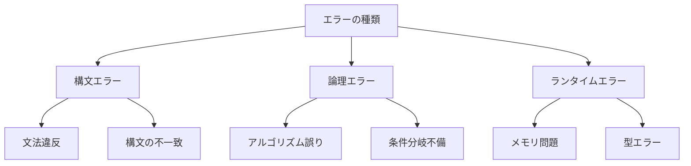

# エラーの検出と修正

## AI 駆動開発におけるエラー検出の重要性

AI 駆動開発では、生成されたコードや AI の出力に含まれるエラーを迅速に検出し、適切に修正することが重要です。これにより、開発の効率性と品質を維持できます。

## エラーの種類と特徴

### 1. 構文エラー

- コードの文法違反
- 括弧の不一致
- セミコロンの欠落
- インデントの誤り

### 2. 論理エラー

- アルゴリズムの誤り
- 条件分岐の不備
- ループの無限化
- データ処理の誤り

### 3. ランタイムエラー

- メモリ不足
- 未定義の変数参照
- 型の不一致
- ファイルアクセスエラー



## エラー検出のアプローチ

### 1. 静的解析

**コード解析ツール**:

- リンター
- 静的型チェッカー
- コード品質分析ツール
- セキュリティスキャナー

**解析のポイント**:

- 構文エラーの検出
- 潜在的な問題の特定
- コーディング規約の遵守確認
- セキュリティ脆弱性の検出

### 2. 動的解析

**テスト実行**:

- ユニットテスト
- 統合テスト
- エンドツーエンドテスト
- パフォーマンステスト

**デバッグツール**:

- デバッガー
- プロファイラー
- メモリリーク検出器
- ログ分析ツール

### 3. AI を活用した検出

**自動化された検出**:

- パターンマッチング
- 異常検知
- 予測的エラー検出
- コードレビューの自動化

## エラー修正の実践

### 1. 自動修正

**コード修正ツール**:

- 自動フォーマッター
- リファクタリングツール
- コード生成器
- 修正提案システム

**修正のポイント**:

- 構文エラーの自動修正
- コードスタイルの統一
- パフォーマンスの最適化
- セキュリティの強化

### 2. 手動修正

**修正プロセス**:

- エラーの原因特定
- 修正方針の決定
- コードの変更
- 修正の検証

**修正の注意点**:

- 副作用の考慮
- 既存機能への影響
- テストの更新
- ドキュメントの更新

## 実践的なエラー検出と修正の例

### 1. 静的解析の実装

```python
# 静的解析ツールの使用例
from pylint import lint
from mypy import api

def run_static_analysis(code_path: str):
    # Pylintによる解析
    pylint_output = lint.Run([code_path], do_exit=False)

    # MyPyによる型チェック
    mypy_result = api.run([code_path])

    return {
        "pylint_issues": pylint_output.linter.stats,
        "mypy_issues": mypy_result[0]
    }
```

### 2. 動的テストの実装

```python
# 動的テストの実装例
import unittest
from typing import List, Dict

class CodeValidator:
    def __init__(self):
        self.test_suite = unittest.TestSuite()

    def add_test_case(self, test_case: unittest.TestCase):
        self.test_suite.addTest(test_case)

    def run_tests(self) -> Dict:
        runner = unittest.TextTestRunner()
        result = runner.run(self.test_suite)

        return {
            "tests_run": result.testsRun,
            "failures": len(result.failures),
            "errors": len(result.errors),
            "skipped": len(result.skipped)
        }
```

### 3. AI を活用したエラー検出

```python
# AIを活用したエラー検出システムの例
class AIErrorDetector:
    def __init__(self, model_path: str):
        self.model = self.load_model(model_path)

    def detect_errors(self, code: str) -> List[Dict]:
        # コードの解析
        code_features = self.extract_features(code)

        # エラーの予測
        predictions = self.model.predict(code_features)

        # 結果の整形
        return self.format_predictions(predictions)

    def suggest_fixes(self, error: Dict) -> List[str]:
        # エラーに対する修正案の生成
        return self.model.generate_fixes(error)
```

## エラー管理のベストプラクティス

### 1. エラーログの管理

- エラーの記録と追跡
- エラーの分類と優先順位付け
- エラー発生の傾向分析
- エラー解決の履歴管理

### 2. エラー予防

- コーディング規約の遵守
- 自動テストの充実
- コードレビューの徹底
- 継続的インテグレーション

### 3. エラー対応プロセス

- エラー報告の標準化
- 対応優先順位の決定
- 修正の検証と確認
- 再発防止策の実施

## まとめ

エラーの検出と修正は、AI 駆動開発の品質を確保するために不可欠なプロセスです。効果的なエラー管理には、以下の要素が重要です：

1. 適切な検出ツールの活用
2. 体系的な修正プロセス
3. 継続的なモニタリング
4. 予防的な対策の実施

これらの要素を組み合わせることで、より効率的で信頼性の高い開発プロセスを実現できます。
