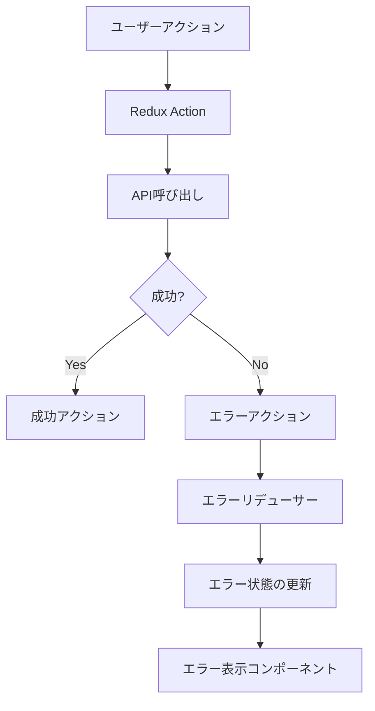
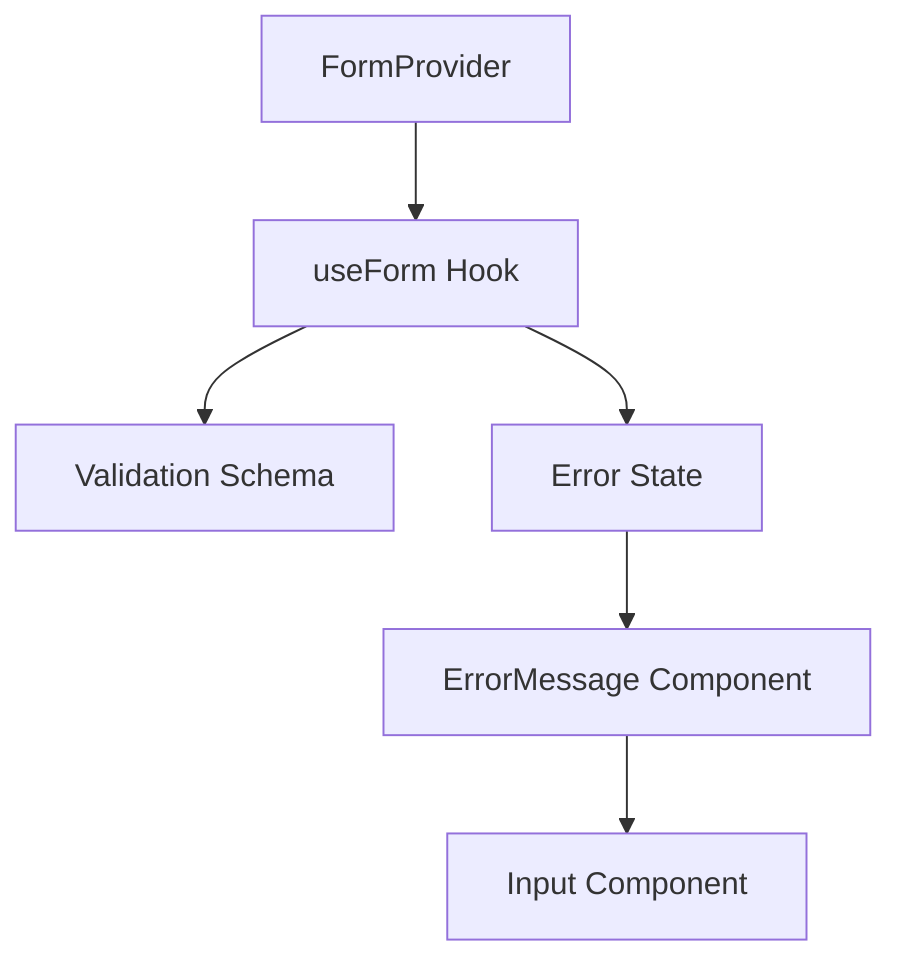

# エラーハンドリングの自動化

エラーハンドリングは、堅牢なアプリケーション開発において欠かせない要素です。しかし、すべての例外パターンを想定してエラー処理を書くのは時間がかかり、見落としも発生しがちです。この記事では、AI駆動開発を活用してエラーハンドリングを自動化し、より効率的に高品質なコードを書く方法を解説します。

## エラーハンドリングの重要性

エラーハンドリングは、以下の理由から非常に重要です：

1. **ユーザー体験の向上**: 適切なエラーメッセージでユーザーを誘導できます
2. **デバッグの容易さ**: エラーの原因特定が素早くできます
3. **システムの堅牢性**: 予期せぬ状況でもアプリケーションが停止せず継続的に動作します
4. **セキュリティの向上**: エラーを適切に処理することで、情報漏洩などのリスクを軽減できます

しかし、良質なエラーハンドリングには以下のような課題があります：

- すべての例外パターンを想定するのが難しい
- コードの可読性を損なう可能性がある
- 実装に時間がかかる
- メンテナンスが大変

AI駆動開発を活用することで、これらの課題を効率的に解決できます。

## AI駆動開発によるエラーハンドリングの自動化

### 1. 基本的なエラーパターンの自動検出と実装

AIは、コードを分析して潜在的なエラーパターンを特定し、適切なエラーハンドリングコードを提案できます。

**AIへの指示例**：

```
以下のユーザー登録関数にエラーハンドリングを追加してください。考えられるすべてのエラーパターンを検出し、適切な例外処理を実装してください。

async function registerUser(username, email, password) {
  const user = await db.users.create({
    username,
    email,
    password: await bcrypt.hash(password, 10)
  });

  const token = jwt.sign({ id: user.id }, process.env.JWT_SECRET);
  return { user, token };
}
```

**AIが提案するエラーハンドリング例**：

```javascript
async function registerUser(username, email, password) {
  try {
    // 入力値の検証
    if (!username || !email || !password) {
      throw new Error("All fields are required");
    }

    if (!isValidEmail(email)) {
      throw new Error("Invalid email format");
    }

    if (password.length < 8) {
      throw new Error("Password must be at least 8 characters long");
    }

    // ユーザー名とメールの重複チェック
    const existingUser = await db.users.findOne({
      where: {
        [Op.or]: [{ username }, { email }],
      },
    });

    if (existingUser) {
      if (existingUser.username === username) {
        throw new Error("Username already exists");
      }
      if (existingUser.email === email) {
        throw new Error("Email already registered");
      }
    }

    // ハッシュ化とユーザー作成
    let hashedPassword;
    try {
      hashedPassword = await bcrypt.hash(password, 10);
    } catch (hashError) {
      throw new Error("Error during password encryption");
    }

    let user;
    try {
      user = await db.users.create({
        username,
        email,
        password: hashedPassword,
      });
    } catch (dbError) {
      throw new Error(`Database error: ${dbError.message}`);
    }

    // トークン生成
    let token;
    try {
      token = jwt.sign({ id: user.id }, process.env.JWT_SECRET);
    } catch (tokenError) {
      throw new Error("Error generating authentication token");
    }

    return { user, token };
  } catch (error) {
    // エラーログ記録
    logger.error(`User registration failed: ${error.message}`, {
      username,
      email,
      error: error.stack,
    });

    throw error; // 上位のエラーハンドラで処理できるようエラーを再スロー
  }
}
```

AIは単に try-catch を追加するだけでなく、以下のような包括的なエラーハンドリングを提案します：

1. 入力値のバリデーション
2. ビジネスロジックのエラーチェック（重複など）
3. 外部サービス（データベース、認証など）のエラー処理
4. エラーログの記録
5. 適切なエラーメッセージの生成

### 2. エラーハンドリングのパターン抽出と再利用

プロジェクト全体で一貫したエラーハンドリングを実装するため、AIにパターンの抽出と再利用可能なユーティリティの作成を依頼できます。

**AIへの指示例**：

```
私のNode.js/Expressプロジェクトで再利用可能なエラーハンドリングユーティリティを作成してください。以下の要件を満たすものが欲しいです：

1. カスタムエラークラスのセット（BadRequestError, AuthenticationError, ForbiddenErrorなど）
2. エラー情報を適切にログに記録する機能
3. API応答でのエラー情報の標準化
4. 非同期関数のエラーをキャッチするためのラッパー関数
```

**AIが生成するエラーハンドリングユーティリティ例**：

```javascript
// errors/customErrors.js
class AppError extends Error {
  constructor(message, statusCode, errorCode) {
    super(message);
    this.statusCode = statusCode;
    this.errorCode = errorCode;
    this.isOperational = true;
    Error.captureStackTrace(this, this.constructor);
  }
}

class BadRequestError extends AppError {
  constructor(message, errorCode = "BAD_REQUEST") {
    super(message, 400, errorCode);
  }
}

class AuthenticationError extends AppError {
  constructor(message, errorCode = "AUTHENTICATION_FAILED") {
    super(message, 401, errorCode);
  }
}

class ForbiddenError extends AppError {
  constructor(message, errorCode = "ACCESS_FORBIDDEN") {
    super(message, 403, errorCode);
  }
}

class NotFoundError extends AppError {
  constructor(message, errorCode = "RESOURCE_NOT_FOUND") {
    super(message, 404, errorCode);
  }
}

class ConflictError extends AppError {
  constructor(message, errorCode = "RESOURCE_CONFLICT") {
    super(message, 409, errorCode);
  }
}

class InternalServerError extends AppError {
  constructor(message, errorCode = "SERVER_ERROR") {
    super(message, 500, errorCode);
  }
}

module.exports = {
  AppError,
  BadRequestError,
  AuthenticationError,
  ForbiddenError,
  NotFoundError,
  ConflictError,
  InternalServerError,
};

// middlewares/errorHandler.js
const logger = require("../utils/logger");
const { AppError } = require("../errors/customErrors");

// 非同期関数をラップしてエラーを自動的にキャッチする
const catchAsync = (fn) => {
  return (req, res, next) => {
    fn(req, res, next).catch(next);
  };
};

// エラー応答を標準化するミドルウェア
const errorHandler = (err, req, res, next) => {
  let error = { ...err };
  error.message = err.message;

  // エラーログの記録
  if (error.statusCode >= 500) {
    logger.error(
      `${error.statusCode || 500} - ${error.message} - ${req.originalUrl} - ${
        req.method
      } - ${req.ip}`,
      {
        stack: err.stack,
        body: req.body,
        params: req.params,
        query: req.query,
      }
    );
  } else {
    logger.warn(
      `${error.statusCode || 500} - ${error.message} - ${req.originalUrl} - ${
        req.method
      } - ${req.ip}`
    );
  }

  // クライアントに返す応答の準備
  const response = {
    success: false,
    status: error.statusCode || 500,
    message: error.message || "Something went wrong",
    errorCode: error.errorCode || "UNKNOWN_ERROR",
  };

  // 開発環境ではスタックトレースも含める
  if (process.env.NODE_ENV === "development") {
    response.stack = err.stack;
  }

  res.status(response.status).json(response);
};

module.exports = {
  catchAsync,
  errorHandler,
};

// 使用例
// routes/userRoutes.js
const express = require("express");
const { catchAsync } = require("../middlewares/errorHandler");
const { BadRequestError, ConflictError } = require("../errors/customErrors");
const router = express.Router();

router.post(
  "/register",
  catchAsync(async (req, res) => {
    const { username, email, password } = req.body;

    if (!username || !email || !password) {
      throw new BadRequestError("All fields are required");
    }

    const existingUser = await User.findOne({ email });
    if (existingUser) {
      throw new ConflictError("Email already registered");
    }

    // ユーザー登録ロジック...

    res.status(201).json({
      success: true,
      message: "User registered successfully",
      data: { user: { id: newUser.id, username, email } },
    });
  })
);

module.exports = router;
```

この例では、AIが以下のような包括的なエラーハンドリングシステムを提案しています：

1. 階層化されたカスタムエラークラス
2. 非同期関数のエラーを処理するためのラッパー
3. エラー情報をログに記録する機能
4. 標準化されたエラー応答フォーマット

### 3. 特定の技術スタックに特化したエラーハンドリング

AIを活用して、特定のフレームワークやライブラリに特化したエラーハンドリングも実装できます。

**React/Redux アプリケーションのエラーハンドリング例**：



**AIへの指示例**：

```
React/Reduxアプリケーションでのグローバルエラーハンドリングシステムを作成してください。APIリクエストのエラーを捕捉し、ユーザーに適切に表示できるようにしたいです。以下の機能を含めてください：

1. エラーを捕捉するReduxミドルウェア
2. エラー状態を管理するリデューサー
3. エラーをトースト通知として表示するコンポーネント
4. 認証エラー（401）を検出して自動的にログアウトする機能
```

**AIが生成するコード例**（一部）：

```javascript
// redux/middleware/errorMiddleware.js
import { logout } from '../actions/authActions';
import { setError, clearError } from '../actions/errorActions';

export const errorMiddleware = store => next => action => {
  // エラーアクションを処理
  if (action.type && action.type.endsWith('_FAILURE') && action.payload) {
    const { status, data } = action.payload;

    // 認証エラーの場合は自動的にログアウト
    if (status === 401) {
      store.dispatch(logout());
      store.dispatch(setError('Your session has expired. Please log in again.', 'warning'));
      return next(action);
    }

    // その他のエラーを処理
    let errorMessage = 'Something went wrong';

    if (data && data.message) {
      errorMessage = data.message;
    } else if (typeof data === 'string') {
      errorMessage = data;
    }

    // エラーの種類に基づいて深刻度を判断
    let severity = 'error';
    if (status >= 400 && status < 500) {
      severity = 'warning';
    }

    store.dispatch(setError(errorMessage, severity));

    // 5秒後にエラーをクリア
    setTimeout(() => {
      store.dispatch(clearError());
    }, 5000);
  }

  return next(action);
};

// redux/reducers/errorReducer.js
import { SET_ERROR, CLEAR_ERROR } from '../actionTypes';

const initialState = {
  message: null,
  severity: 'error', // 'error', 'warning', 'info', 'success'
  isVisible: false
};

export default function errorReducer(state = initialState, action) {
  switch (action.type) {
    case SET_ERROR:
      return {
        ...state,
        message: action.payload.message,
        severity: action.payload.severity || 'error',
        isVisible: true
      };
    case CLEAR_ERROR:
      return {
        ...state,
        message: null,
        isVisible: false
      };
    default:
      return state;
  }
}

// components/ErrorToast.jsx
import React from 'react';
import { useSelector } from 'react-redux';
import { Snackbar, Alert } from '@mui/material';

const ErrorToast = () => {
  const { message, severity, isVisible } = useSelector(state => state.error);

  if (!isVisible) return null;

  return (
    <Snackbar
      open={isVisible}
      autoHideDuration={5000}
      anchorOrigin={{ vertical: 'bottom', horizontal: 'center' }}
    >
      <Alert severity={severity} variant="filled">
        {message}
      </Alert>
    </Snackbar>
  );
};

export default ErrorToast;
```

## エラーハンドリングの自動生成を効果的に活用するテクニック

### 1. コンテキスト認識型のエラーハンドリング生成

AIに既存のプロジェクトコードを分析させ、コンテキストに適したエラーハンドリングを提案してもらいます。

**AIへの指示例**：

```
以下のプロジェクト構造とコードサンプルを分析し、私のアプリケーションのパターンとスタイルに合わせたエラーハンドリングを追加してください。特に、すでに実装されているエラー処理パターンと一貫性のあるアプローチを提案してください。

[プロジェクトコードの概要や特徴的なファイルを提供]
```

### 2. 段階的なエラーハンドリング改善

既存のコードに対して、AIに段階的なエラーハンドリング改善を提案してもらいます。

**AIへの指示例**：

```
以下のコードのエラーハンドリングを段階的に改善したいです。まず現在のエラーハンドリングの問題点を分析し、次に短期的な改善策、最後に長期的なリファクタリング計画を提案してください。

[改善したいコード]
```

### 3. テスト駆動型エラーハンドリング生成

エラーケースのテストコードを先に作成し、そのテストを満たすエラーハンドリングコードを生成してもらいます。

**AIへの指示例**：

```
以下のテストケースを満たすエラーハンドリングコードを生成してください：

test('should throw BadRequestError when required fields are missing', () => {
  expect(() => validateUserInput({ email: 'test@example.com' })).toThrow(BadRequestError);
  expect(() => validateUserInput({ email: 'test@example.com' })).toThrow('Username is required');
});

test('should throw AuthenticationError when token is invalid', () => {
  expect(() => verifyToken('invalid-token')).toThrow(AuthenticationError);
});
```

## 主要な言語/フレームワークでのエラーハンドリング自動化

### Node.js/Express

**AIへの指示例**：

```
Express.jsアプリケーションで一元化されたエラーハンドリングシステムを実装してください。次の機能を含めてください：
1. バリデーションエラー（joi/express-validator）の一元処理
2. 認証/認可エラーの標準化
3. データベースエラーの適切な変換
4. リクエストタイムアウト処理
5. レート制限エラーの処理
```

### React

**AIへの指示例**：

```
Reactアプリケーションの包括的なエラーバウンダリシステムを実装してください。エラーバウンダリコンポーネント、Suspenseとの統合、エラーレポートのためのログサービス連携を含めてください。
```

### Python/Django

**AIへの指示例**：

```
Djangoアプリケーションのミドルウェアベースのエラーハンドリングシステムを実装してください。例外の種類に基づいて適切なHTTPレスポンスを返し、ログ記録とモニタリングを含めてください。
```

## エラーハンドリング自動化の実践例

### 例 1: API 層のエラーハンドリング

**問題**: 複数の API エンドポイントで個別にエラー処理を行っており、コードの重複と不一致がある。

**AIへの指示**:

```
以下のExpressルーターのコードを分析し、一元化されたエラーハンドリングシステムを実装してください。現在は各ルートハンドラーで個別にtry-catchを使用していますが、これをDRYな方法でリファクタリングしたいです。

[現在のコード]
```

**AIによる解決策**:

1. 共通のエラーハンドリングミドルウェアの作成
2. 非同期関数をラップするユーティリティ関数
3. カスタムエラークラスの階層の導入
4. 一元化されたエラーログシステム

### 例 2: フロントエンドのフォームバリデーションエラー

**問題**: フォームのバリデーションエラーが各コンポーネントで個別に処理されており、UI/UX に一貫性がない。

**AIへの指示**:

```
Reactアプリケーションのフォームバリデーションエラー処理を一貫化するためのシステムを提案してください。現在は各フォームコンポーネントで独自の方法でエラーを表示しています。

[現在のコード例]
```

**AIによる解決策**:

1. カスタムフォームフックの作成
2. 共通のエラーコンポーネント
3. 標準化されたエラーメッセージ形式
4. アクセシビリティを考慮したエラー表示



## エラーハンドリング自動化のベストプラクティス

### 1. エラーの階層構造を設計する

AIに以下のような階層的なエラー構造を設計してもらいます：

```
- AppError（基底エラークラス）
  - ValidationError（入力値検証エラー）
  - AuthError（認証関連エラー）
    - UnauthorizedError（未認証）
    - ForbiddenError（権限不足）
  - DataError（データ関連エラー）
    - NotFoundError（リソースが見つからない）
    - ConflictError（リソースの競合）
  - SystemError（システム内部エラー）
    - DependencyError（外部依存エラー）
    - ConfigurationError（設定エラー）
```

この階層構造をもとに、エラー処理の一貫性を保つことができます。

### 2. エラー応答の標準化

エラー応答の形式を標準化することで、フロントエンドでの処理が容易になります：

```json
{
  "status": "error",
  "code": "RESOURCE_NOT_FOUND",
  "message": "The requested user could not be found",
  "details": {
    "resource": "user",
    "id": "123"
  },
  "timestamp": "2023-06-15T12:34:56Z",
  "requestId": "abc-123-xyz"
}
```

### 3. エラーハンドリングのテスト自動化

エラーハンドリングコードに対するテストも自動生成することで、堅牢性を確保します：

**AIへの指示例**:

```
以下のエラーハンドリングコードに対するテストを作成してください。すべての条件分岐と例外ケースがカバーされるようにしてください。

[エラーハンドリングコード]
```

## まとめ

AI駆動開発を活用したエラーハンドリングの自動化は、開発効率と品質を大きく向上させます。主なメリットは以下の通りです：

1. **網羅性の向上**: AIが想定されるエラーパターンを包括的に分析し、見落としを減らします
2. **一貫性の確保**: プロジェクト全体で統一されたエラー処理アプローチを実装できます
3. **開発時間の短縮**: 定型的なエラーハンドリングコードを素早く生成できます
4. **保守性の向上**: 体系的なエラー処理により、将来的なコード保守が容易になります

エラーハンドリングの自動化を進めるには、以下のステップに従いましょう：

1. 既存コードのエラーパターンを分析する
2. 再利用可能なエラーハンドリングユーティリティを設計する
3. テスト駆動アプローチでエラーケースを特定する
4. 体系的にエラーハンドリングを実装していく

AIを活用することで、これまで面倒で時間のかかるエラーハンドリングの実装が、効率的かつ質の高いプロセスに変わります。エラー処理は後回しにされがちな部分ですが、ユーザー体験とシステムの堅牢性に大きく影響するため、AI駆動開発による自動化のメリットが特に大きい領域といえるでしょう。
