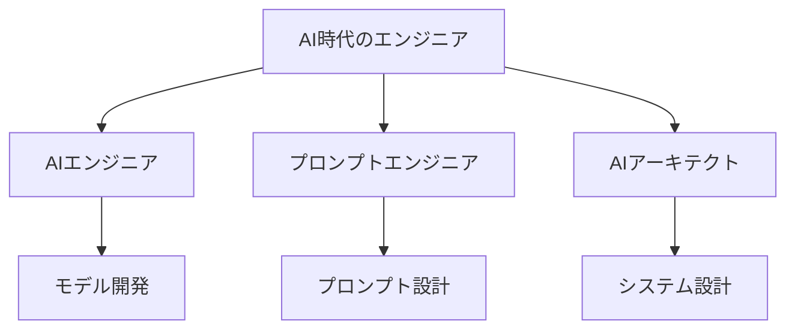

# エンジニアのキャリア展望

## AI時代のエンジニアリング

### キャリアの変革

AIの台頭により、エンジニアのキャリアパスは以下のように変化しています：

- 技術的な専門性の深化
- 新しい役割の創出
- キャリアパスの多様化
- 継続的な学習の重要性

### 新しい役割の出現

## キャリアパスの選択肢

### 1. 技術スペシャリスト

特定の技術領域に特化したキャリアパス：

- AI/ML エンジニア
- クラウドアーキテクト
- セキュリティエキスパート
- パフォーマンスエンジニア

### 2. マネジメント

技術的な知識を活かしたマネジメント職：

- テックリード
- エンジニアリングマネージャー
- プロジェクトマネージャー
- チームリーダー

### 3. コンサルタント

技術的な専門性を活かしたコンサルティング：

- 技術コンサルタント
- アーキテクチャコンサルタント
- セキュリティコンサルタント
- パフォーマンスコンサルタント

## スキル開発の方向性

### 技術スキル

今後求められる主要な技術スキル：

- AI/ML の実践的な知識
- クラウド技術
- セキュリティ
- パフォーマンス最適化

### ソフトスキル

技術以外に重要なスキル：

- コミュニケーション能力
- リーダーシップ
- 問題解決能力
- 継続的な学習

## キャリア戦略

### 短期目標（1-2 年）

- 技術的な専門性の確立
- 新しい技術の習得
- プロジェクト経験の積み重ね
- ネットワークの構築

### 中期目標（3-5 年）

- リーダーシップの確立
- 専門分野の確立
- チームマネジメント
- キャリアの方向性の決定

### 長期目標（5 年以上）

- キャリアの確立
- 組織への貢献
- 後進の育成
- 新しい挑戦

## 実践的なアドバイス

### キャリア開発のポイント

1. 継続的な学習
2. ネットワークの構築
3. 実践的な経験の積み重ね
4. キャリアの方向性の明確化

### 成功への道筋

- 明確な目標設定
- 計画的なスキル開発
- 積極的なチャレンジ
- 継続的な自己評価

## まとめ

AI時代のエンジニアには、技術的な専門性とソフトスキルの両方が求められます。明確なキャリア戦略を持ち、継続的に成長していくことが重要です。
