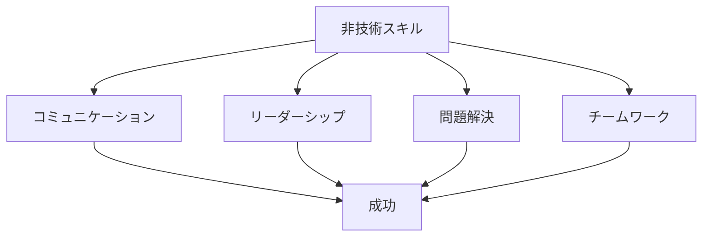

# エンジニアは、非技術が最重要

## 非技術スキルの重要性

### なぜ非技術スキルが重要か

エンジニアとしての成功には、以下のような理由で非技術スキルが不可欠です：

- チームワークの向上
- コミュニケーションの改善
- リーダーシップの発揮
- 問題解決能力の強化

### 非技術スキルの要素

## 主要な非技術スキル

### 1. コミュニケーション能力

効果的なコミュニケーションの重要性：

- 要件の明確化
- チーム内の協力
- ステークホルダーとの関係構築
- フィードバックの活用

### 2. リーダーシップ

リーダーシップの発揮方法：

- ビジョンの共有
- チームの動機付け
- 意思決定の促進
- メンタリング

### 3. 問題解決能力

効果的な問題解決の方法：

- 分析的な思考
- クリティカルシンキング
- 創造的な解決策
- 意思決定

## 実践的なアプローチ

### スキル開発

非技術スキルの開発方法：

- 自己評価
- フィードバックの活用
- 実践的な演習
- 継続的な改善

### チームでの活用

チームでの非技術スキルの活用：

- コラボレーション
- ナレッジ共有
- メンタリング
- チームビルディング

## 成功のポイント

### スキルのバランス

技術スキルと非技術スキルのバランス：

- 両方の重要性の理解
- 継続的な学習
- 実践的な経験
- フィードバックの活用

### 成長の継続

継続的な成長のポイント：

- 自己評価
- 目標設定
- 学習計画
- 実践的な演習

## 実践的なアドバイス

### スキル開発のステップ

効果的なスキル開発のステップ：

1. 自己評価の実施
2. 目標の設定
3. 学習計画の作成
4. 実践的な演習
5. フィードバックの活用

### 成功への道筋

スキル開発を成功させるポイント：

- 明確な目標設定
- 計画的なアプローチ
- 継続的な学習
- 実践的な経験

## まとめ

エンジニアとしての成功には、技術スキルと非技術スキルの両方が重要です。バランスの取れたスキル開発、継続的な学習、そして実践的な経験が不可欠です。
