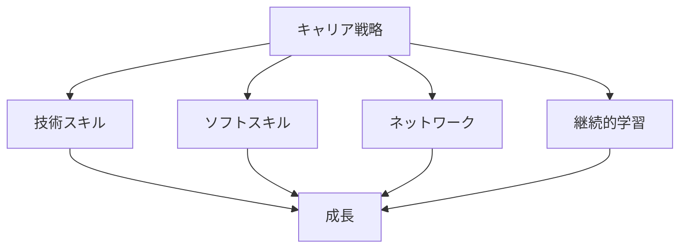

# キャリア戦略の構築

## AI時代のキャリア戦略

### キャリア戦略の重要性

AI時代において、エンジニアのキャリア戦略は以下のような理由で重要です：

- 技術の急速な変化への対応
- 新しい役割の出現
- 競争力の維持
- 長期的な成長の確保

### キャリア戦略の要素

## 戦略の構築方法

### 1. 自己分析

効果的なキャリア戦略の構築には、以下のような自己分析が重要です：

- 強みと弱みの把握
- 興味のある分野の特定
- 目標の明確化
- 必要なスキルの特定

### 2. 市場分析

AI時代の市場動向を理解することが重要です：

- 需要の高い技術の把握
- 新しい役割の理解
- 業界トレンドの分析
- 将来性の評価

### 3. 目標設定

明確な目標設定が重要です：

- 短期目標（1-2 年）
- 中期目標（3-5 年）
- 長期目標（5 年以上）
- 具体的なアクションプラン

## 実践的なアプローチ

### スキル開発

効果的なスキル開発の方法：

- 技術スキルの習得
- ソフトスキルの向上
- 実践的な経験の積み重ね
- 継続的な学習

### ネットワーク構築

ネットワーク構築の重要性：

- コミュニティへの参加
- メンターの確保
- 情報交換の機会創出
- コラボレーションの促進

## 成功のポイント

### 戦略の実行

効果的な戦略実行のポイント：

- 計画的なアプローチ
- 定期的な評価と調整
- 柔軟な対応
- 継続的な改善

### リスク管理

キャリア戦略におけるリスク管理：

- 技術変化への対応
- 市場動向の監視
- 代替案の準備
- 継続的な学習

## 実践的なアドバイス

### 戦略の構築ステップ

効果的なキャリア戦略を構築するステップ：

1. 自己分析の実施
2. 市場動向の把握
3. 目標の設定
4. アクションプランの作成
5. 定期的な評価と調整

### 成功への道筋

キャリア戦略を成功させるポイント：

- 明確な目標設定
- 計画的なアプローチ
- 継続的な学習
- 柔軟な対応

## まとめ

AI時代において、効果的なキャリア戦略の構築は、長期的な成功の鍵となります。自己分析、市場理解、目標設定、そして継続的な学習と改善が重要です。
