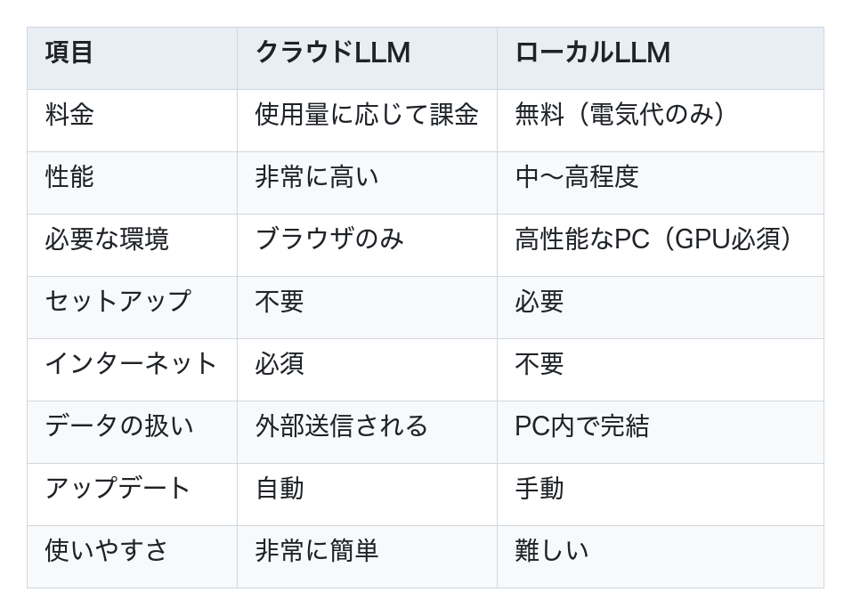
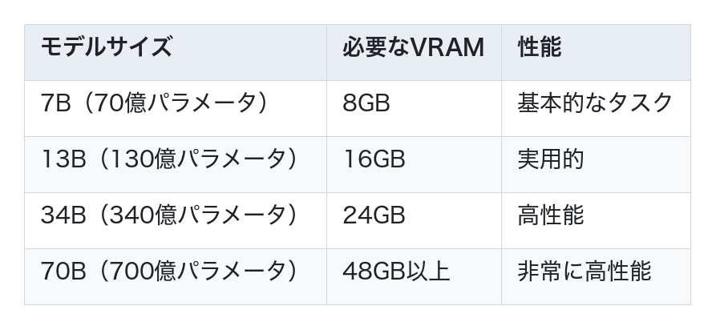

# クラウドLLMとローカルLLM

LLMには、大きく分けて**クラウドLLM**と**ローカルLLM**の2種類があります。それぞれの特徴と使い分けを見ていきましょう。

## クラウドLLMとは

**クラウドLLM**は、インターネット経由でアクセスするLLMです。サービス提供会社のサーバー上でモデルが動作しています。

### クラウドLLMが使える主なサービス

- **ChatGPT**（OpenAI）… GPT-4o などのモデルを提供
- **Claude**（Anthropic）… Claude Sonnet 4.6 などのモデルを提供
- **Gemini**（Google）… Gemini 2.5 などのモデルを提供
- **DeepSeek**（DeepSeek）… DeepSeek-V3 などのモデルを提供

### クラウドLLMの特徴

**メリット**
- **高性能**：最新の高性能モデルを使える
- **環境不要**：自分のPCにインストール不要
- **すぐ使える**：ブラウザやアプリからすぐにアクセス
- **メンテナンス不要**：アップデートは自動で提供される

**デメリット**
- **料金がかかる**：使った分だけ課金される
- **インターネット必須**：オフラインでは使えない
- **データが外部送信される**：機密情報の取り扱いに注意が必要
- **API制限がある**：リクエスト数に制限がある場合も

## ローカルLLMとは

**ローカルLLM**は、自分のコンピュータ上で動作するLLMです。モデルをダウンロードして、自分のPC内で実行します。

### ローカルで利用できる主なLLM（モデルシリーズ）

- **Llama**（Meta）… Llama 4 などのモデルが利用可能
- **Mistral**（Mistral AI）… Mistral 7B などのモデルが利用可能
- **Gemma**（Google）… Gemma 2 などのモデルが利用可能
- **Qwen**（Alibaba）… Qwen 2.5 などのモデルが利用可能

### ローカルLLMの特徴

**メリット**
- **無料**：一度ダウンロードすれば追加料金なし
- **オフラインで使える**：インターネット接続不要
- **データが外に出ない**：機密情報を安全に扱える
- **カスタマイズ可能**：独自の用途に合わせて調整できる

**デメリット**
- **高性能なPCが必要**：GPUメモリ（VRAM）が大量に必要
- **セットアップが面倒**：インストールや設定に手間がかかる
- **性能は控えめ**：クラウドLLMに比べると性能が劣る
- **自分で管理**：アップデートやメンテナンスを自分で行う

## クラウドLLMとローカルLLMの比較

## AI駆動開発ではどちらを使うべきか？

### クラウドLLMがおすすめの場合

**ほとんどのAI駆動開発では、クラウドLLMを使います。**
- 高品質なコードを生成したい
- すぐに使い始めたい
- 環境構築に時間をかけたくない
- 最新のモデルを使いたい

現在のAI駆動開発ツール（GitHub Copilot、Cursorなど）は、主にクラウドLLMを使っています。

### ローカルLLMが適している場合

以下の場合は、ローカルLLMの利用を検討します。

- **機密情報を扱う**：社外秘のコードを外部に送りたくない
- **コストを抑えたい**：大量に使う場合、料金が高額になる
- **オフライン環境**：インターネット接続がない環境で作業する
- **カスタマイズしたい**：特定の用途に特化したモデルを作りたい

## ローカルLLMを使うための要件

ローカルLLMを動かすには、高性能なPCが必要です。

### 最低限必要なスペック

- **GPU**：NVIDIA製GPU（CUDA対応）
- **VRAMメモリ**：8GB以上（16GB以上推奨）
- **メインメモリ**：16GB以上（32GB以上推奨）
- **ストレージ**：モデルサイズに応じて10GB〜100GB以上

### モデルサイズとVRAMの目安

一般的なノートPCでは、VRAMが不足するため、ローカルLLMの実行は難しいことが多いです。

## まとめ

**クラウドLLM**と**ローカルLLM**には、それぞれメリット・デメリットがあります。

- **クラウドLLM**：高性能で使いやすい。AI駆動開発の標準
- **ローカルLLM**：無料でプライベート。高性能なPC環境が必要

**AI駆動開発を始めるなら、まずはクラウドLLMから**がおすすめです。使い慣れてから、必要に応じてローカルLLMを検討しましょう。
