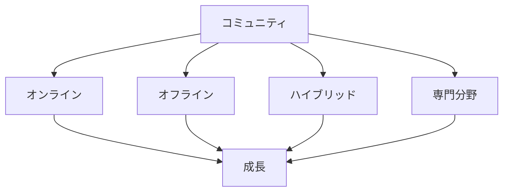

# コミュニティの活用

## コミュニティの重要性

### コミュニティの役割

AI駆動開発におけるコミュニティの役割：

- 知識の共有
- 経験の交換
- サポートの提供
- ネットワークの構築

### コミュニティの種類

## 効果的な活用方法

### 1. オンラインコミュニティ

オンラインコミュニティの活用方法：

- フォーラムへの参加
- ソーシャルメディアの活用
- オンライン勉強会
- コードレビュー

### 2. オフラインコミュニティ

オフラインコミュニティの活用方法：

- 勉強会への参加
- カンファレンス
- ハッカソン
- メンタリング

### 3. 専門分野のコミュニティ

専門分野のコミュニティの活用方法：

- ドメイン特化型の勉強会
- 技術コミュニティ
- 業界団体
- 研究グループ

## 実践的なアプローチ

### コミュニティへの参加

効果的なコミュニティ参加の方法：

- 積極的な発言
- 質問の活用
- 経験の共有
- コラボレーション

### ネットワーク構築

ネットワーク構築の重要性：

- メンターの確保
- ピアとの交流
- 情報交換
- 機会創出

## 成功のポイント

### コミュニティの選択

適切なコミュニティ選択のポイント：

- 目的に合致
- 活動の活発さ
- メンバーの質
- 継続的な成長

### 参加の最適化

コミュニティ参加を最適化するポイント：

- 積極的な参加
- 価値の提供
- 継続的な関与
- 関係性の構築

## 実践的なアドバイス

### 参加のステップ

効果的なコミュニティ参加のステップ：

1. 目的の明確化
2. 適切なコミュニティの選択
3. 積極的な参加
4. 価値の提供
5. 継続的な関与

### 成功への道筋

コミュニティ活用を成功させるポイント：

- 明確な目的設定
- 積極的な参加
- 価値の提供
- 継続的な関与

## まとめ

効果的なコミュニティの活用は、AI駆動開発の学習と成長に不可欠です。適切なコミュニティの選択、積極的な参加、そして継続的な関与が重要です。
