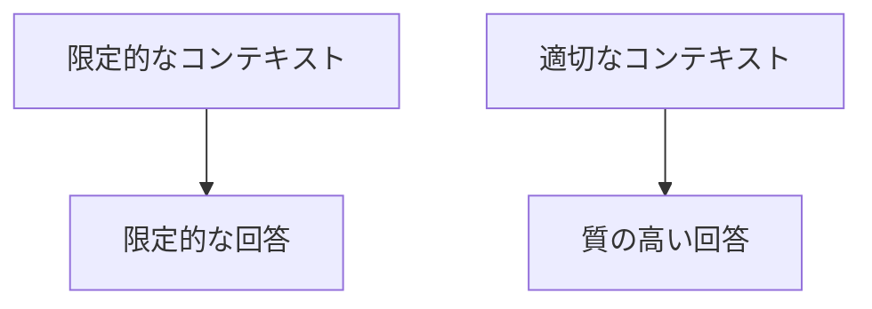
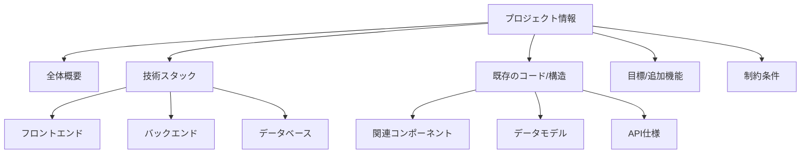

# コンテキスト提供と必要情報の整理手法

## はじめに

AI 駆動開発を効率的に行うには、AI に適切なコンテキスト（文脈情報）を提供することが非常に重要です。適切なコンテキストを提供することで、AI からより質の高い回答や成果物を得ることができます。この記事では、AI に効果的にコンテキストを提供するための手法と、必要情報を整理する方法について解説します。

## コンテキスト提供の重要性

AI は与えられた情報のみに基づいて回答を生成します。プロジェクトの背景、既存のコードベース、技術的制約など、開発者が当然知っていることでも、AI には明示的に伝える必要があります。



### コンテキストが不足する例

**質問例**：

```
ユーザー認証機能を追加してください。
```

この質問には以下の情報が欠けています：

- どの言語・フレームワークを使用しているか
- 既存のコードベースの構造
- 認証の種類（JWT、セッションベースなど）
- セキュリティ要件

### 適切なコンテキストを含む例

**改善例**：

```
私は、Node.js/Expressで構築されたRESTful APIにJWTベースのユーザー認証機能を追加したいと思います。

現在のプロジェクト構造：
/src
  /controllers
  /models
  /routes
  /middlewares
  /config
  server.js

データベースにはMongoDBを使用しており、ユーザーモデルには既に以下のフィールドがあります：
- name
- email
- createdAt

パスワードのハッシュ化にはbcryptを使用する予定で、認証トークンの有効期限は24時間としたいです。
```

## 効果的なコンテキスト提供の構成要素

### 1. プロジェクトの概要

プロジェクトの基本情報を簡潔に伝えます。

**例**：

```
このプロジェクトは、小規模チーム向けのタスク管理ツールです。React（フロントエンド）とDjango（バックエンド）を使用しています。現在、タスクの作成、編集、削除機能は実装済みで、タスクの割り当て機能を追加したいと考えています。
```

### 2. 技術スタックの詳細

使用している言語、フレームワーク、ライブラリなどの情報を提供します。

**例**：

```
技術スタック：
- フロントエンド：React 18、TypeScript、Redux Toolkit、Material-UI
- バックエンド：Django 4.2、Django REST Framework
- データベース：PostgreSQL 14
- 認証：JWT
```

### 3. 既存のコード構造

関連する既存のコードや構造について説明します。

**例**：

```
関連するコンポーネント構造：
TaskList.tsx - タスク一覧を表示するコンポーネント
TaskItem.tsx - 個々のタスクを表示するコンポーネント
TaskForm.tsx - タスク作成/編集フォーム

Taskモデルの現在の構造：
{
  id: number,
  title: string,
  description: string,
  dueDate: Date,
  status: 'pending' | 'in_progress' | 'completed',
  // ここにassigneeフィールドを追加したい
}
```

### 4. 目標とする結果

何を達成したいのかを明確に説明します。

**例**：

```
目標：
1. タスクにユーザーを割り当てる機能を追加
2. タスク一覧画面でどのユーザーに割り当てられているかを表示
3. ユーザーごとのタスクフィルタリング機能の実装
```

### 5. 制約条件と要件

プロジェクトの制約条件や特定の要件を説明します。

**例**：

```
制約条件：
- モバイルでも使いやすいUIであること
- 複数ユーザーへのタスク割り当てはサポートしない（一対一のみ）
- パフォーマンスへの配慮（大量のタスクがある場合）
- アクセシビリティ（WCAG 2.1 AA準拠）
```

## 必要情報の整理手法

効果的なコンテキスト提供のためには、必要な情報を整理することが重要です。以下の手法を活用しましょう。

### 1. 構造化された形式での提供

情報をカテゴリ別に整理し、見やすい形式で提供します。

**例**：

```
## プロジェクト概要
Eコマースサイトの商品レビュー機能

## 技術スタック
- Next.js 13（App Router）
- Prisma ORM
- PostgreSQL
- Tailwind CSS

## 既存の機能
- 商品詳細表示
- ユーザー認証

## 追加したい機能
- 認証ユーザーによるレビュー投稿
- 星評価（5段階）
- レビューの表示と並び替え

## 制約条件
- SEO対応
- サーバーサイドレンダリング
```

### 2. 階層的な情報提示

情報を階層的に整理することで、AI が全体像を理解しやすくなります。



### 3. 段階的な情報提供

複雑な問題では、一度にすべての情報を提供するのではなく、段階的に提供することも効果的です。

**段階的アプローチの例**：

1. まず基本的なプロジェクト情報と目標を提供
2. AI からの初期回答を得る
3. より詳細な技術的情報や制約条件を追加
4. 具体的なコード例や既存構造を共有

### 4. 視覚的情報の活用

図表やダイアグラム、コード例などの視覚的情報を活用することで、より明確に情報を伝えることができます。

**例**：

```
データベースのER図：

User (1) --- (*) Task
  |
  |
 (*)
Comment
```

## 状況別のコンテキスト提供例

### 1. バグ修正の依頼

````
## 発生している問題
ユーザーがプロフィール画像をアップロードした後、画像が表示されず404エラーになる

## エラーメッセージ
コンソールに以下のエラーが表示される：
"Failed to load resource: the server responded with a status of 404 (Not Found) - /uploads/profile/user_123.jpg"

## 関連コード
画像アップロード処理（ProfileController.php）：
```php
public function uploadImage(Request $request)
{
    $file = $request->file('image');
    $filename = 'user_' . Auth::id() . '.' . $file->getClientOriginalExtension();
    $file->move(public_path('uploads/profile'), $filename);

    $user = Auth::user();
    $user->profile_image = $filename;
    $user->save();

    return response()->json(['success' => true]);
}
````

## 試したこと

- ディレクトリのパーミッションの確認（755 に設定済み）
- 別のブラウザでのテスト（同じ結果）
- storage:link コマンドの実行（変化なし）

## 環境情報

- Laravel 9.0
- PHP 8.1
- Nginx 1.21

```

### 2. 新機能追加の依頼

```

## 追加したい機能

ユーザーが自分のタスクをカレンダービューで表示する機能

## 現在のプロジェクト状況

- React/TypeScript の SPA
- バックエンドは Rails API モード
- タスクの一覧表示と CRUD 操作は既に実装済み

## データモデル

Task:

- id: number
- title: string
- description: string
- due_date: Date
- status: string
- user_id: number

## 技術的要件

- FullCalendar ライブラリを使用したい
- タスクはカレンダー上でドラッグ＆ドロップで日付変更可能にしたい
- 複数のカレンダービュー（月、週、日）に対応させたい

## UI イメージ

[カレンダー表示のモックアップスクリーンショット]

```

### 3. コードレビューの依頼

```

## レビューしてほしいコード

以下の React コンポーネントのパフォーマンスと可読性についてレビューしてください。

```jsx
function UserList() {
  const [users, setUsers] = useState([]);
  const [loading, setLoading] = useState(true);
  const [error, setError] = useState(null);

  useEffect(() => {
    fetch("/api/users")
      .then((res) => res.json())
      .then((data) => {
        setUsers(data);
        setLoading(false);
      })
      .catch((err) => {
        setError(err.message);
        setLoading(false);
      });
  }, []);

  const handleDeleteUser = (userId) => {
    fetch(`/api/users/${userId}`, {
      method: "DELETE",
    })
      .then(() => {
        setUsers(users.filter((user) => user.id !== userId));
      })
      .catch((err) => {
        setError(err.message);
      });
  };

  if (loading) return <p>Loading...</p>;
  if (error) return <p>Error: {error}</p>;

  return (
    <div>
      <h2>User List</h2>
      {users.map((user) => (
        <div key={user.id}>
          <span>{user.name}</span>
          <button onClick={() => handleDeleteUser(user.id)}>Delete</button>
        </div>
      ))}
    </div>
  );
}
```

## レビュー観点

- パフォーマンス最適化
- エラー処理
- ベストプラクティス準拠
- コンポーネントの分割

```

## コンテキスト提供の実践的なコツ

### 1. 最小限の例を提供する

問題を簡素化し、最小限の再現可能な例を提供することで、AIが問題の核心に集中できます。

### 2. 過去の試行錯誤を共有する

既に試したアプローチや解決策を共有することで、重複した提案を避けられます。

### 3. プロンプトを準備する

重要なプロジェクトでは、事前にプロンプトのテンプレートを準備しておくと効率的です。

**プロンプトテンプレート例**：
```

## プロジェクト概要

[プロジェクトの簡単な説明]

## 技術スタック

[使用している言語、フレームワーク、ライブラリなど]

## 関連コード

[既存のコードや構造の説明]

## 目標

[達成したいこと]

## 制約条件

[考慮すべき制約や要件]

```

### 4. 段階的な質問

複雑な問題では、AIの回答に基づいて段階的に詳細な質問をすることで、より深い議論が可能になります。

## まとめ

AIに効果的なコンテキストを提供し、必要情報を整理するためのポイントをまとめると：

1. プロジェクトの全体像を簡潔に説明する
2. 使用している技術スタックの詳細を提供する
3. 関連する既存のコードや構造を共有する
4. 明確な目標と期待する結果を伝える
5. 制約条件や特定の要件を明示する
6. 情報を構造化された形式で整理する
7. 必要に応じて段階的に情報を提供する
8. 視覚的な情報を活用する

これらの手法を活用することで、AIとのコミュニケーションの質が向上し、より高品質な成果物を得ることができます。適切なコンテキスト提供は、AI駆動開発の効率と品質を大きく左右する重要な要素です。
```
