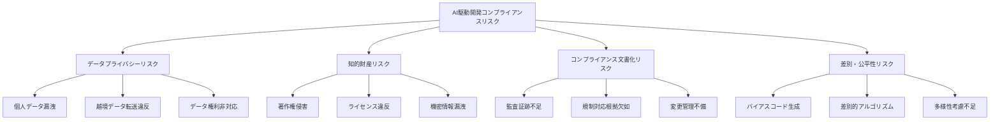
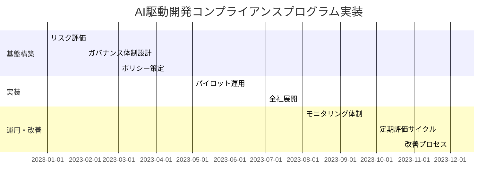
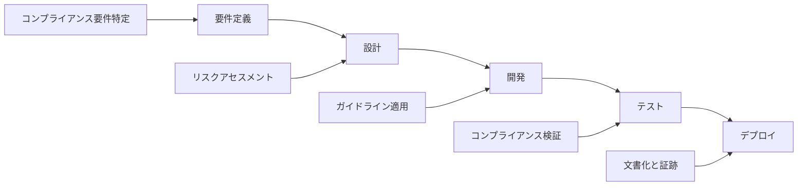
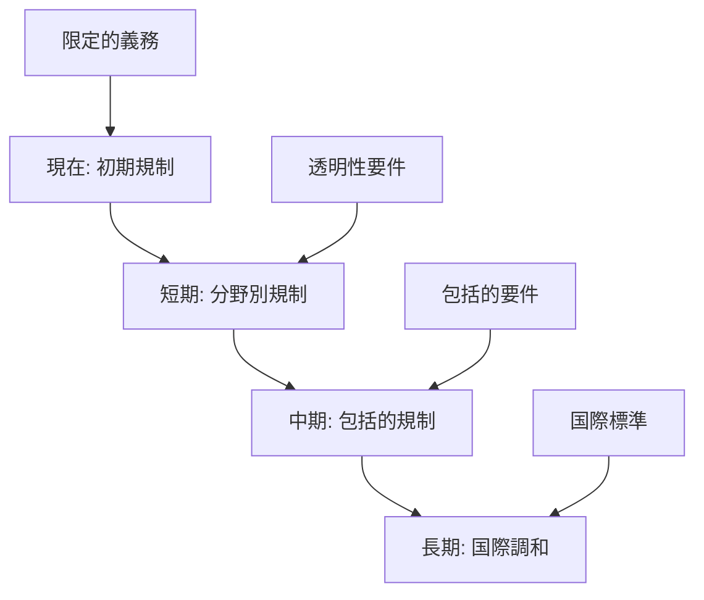

# コンプライアンス対応

## AI駆動開発におけるコンプライアンスの重要性

AI駆動開発の導入は、開発効率と革新性を高める一方で、新たなコンプライアンス上の課題をもたらします。AI技術を活用する開発プロセスには、従来の開発手法とは異なる法的・規制的考慮事項が存在します。これらのコンプライアンス要件を適切に理解し対応することは、持続可能な AI活用のために不可欠です。

本章では、AI駆動開発におけるコンプライアンスの主要課題と効果的な対応アプローチについて解説します。

## 主要な法規制とコンプライアンス要件

### データプライバシー関連法規

AI駆動開発におけるデータプライバシー関連の法規制要件を理解します。

**主要なプライバシー規制**:

- **GDPR (EU 一般データ保護規則)**

  - 個人データの処理に関する厳格な要件
  - データ最小化と目的限定の原則
  - データ主体の権利（アクセス権、削除権など）
  - 設計によるプライバシー（Privacy by Design）の要件

- **CCPA/CPRA (カリフォルニア州消費者プライバシー法/権利法)**

  - 消費者の個人情報に関する権利
  - 事業者の開示義務
  - オプトアウト権の保障

- **各国・地域のプライバシー法**
  - 日本の個人情報保護法
  - カナダの PIPEDA
  - ブラジルの LGPD
  - インドの個人データ保護法案

**AI駆動開発での具体的影響**:

- AIツールへの入力データにおける個人情報の取り扱い
- AIモデルによる個人データの処理と学習
- 自動化された意思決定に関する制限
- クロスボーダーデータ転送の制限

### 知的財産関連法規

AI駆動開発における知的財産権の課題と法的側面です。

**主な知的財産法規**:

- **著作権法**

  - AIが生成または支援したコードの著作権
  - 学習データとしての著作物使用
  - 派生著作物の権利関係

- **特許法**

  - AIが生成したアルゴリズムの特許可能性
  - AIツールと特許出願の関係
  - 既存特許に対する侵害リスク

- **営業秘密保護法**
  - AIツールを通じた営業秘密の漏洩リスク
  - 機密情報の適切な保護措置

**AI駆動開発での具体的影響**:

- AIが生成したコードの所有権と権利帰属
- AIツールベンダーの利用規約と知的財産条項
- オープンソースライセンスとの互換性
- AIを活用した発明の発明者性

### AI特有の規制とガイドライン

AI技術そのものに関する新たな規制とガイドラインです。

**既存および新興の規制**:

- **EU AI法**

  - リスクベースのアプローチ
  - 高リスク AIシステムへの要件
  - 透明性と監督の義務

- **米国 AI権利章典**

  - 安全で効果的、差別のない AIシステム
  - アルゴリズムの説明責任
  - プライバシー保護措置

- **アルゴリズム説明責任法**
  - アルゴリズムの公平性評価
  - 差別的影響の監視と報告

**業界別ガイドライン**:

- 金融規制当局による AI/ML ガイダンス
- 医療分野での AI規制フレームワーク
- 公共部門での AI調達・利用ガイドライン

**AI駆動開発での具体的影響**:

- AIツールの選定と評価における規制考慮
- 生成コードの監査と検証要件
- リスク評価とドキュメント要件

## コンプライアンスリスク評価とマッピング

### AI駆動開発における主要リスク

AI駆動開発で特に注意すべきコンプライアンスリスクの特定と評価です。

**データプライバシーリスク**:

- **不適切なデータ取り扱い**: AIツールへの個人データ入力による漏洩
- **目的外利用**: 入力データの AIベンダーによる目的外処理
- **データ主体の権利侵害**: 消去権、アクセス権などへの対応不備
- **越境データ転送**: 国際的データ転送規制への違反

**知的財産リスク**:

- **第三者権利侵害**: AIが生成したコードによる著作権侵害
- **著作権帰属の不確実性**: 生成コードの権利関係の曖昧さ
- **ライセンス違反**: オープンソースライセンス条項への不遵守
- **営業秘密漏洩**: プロンプトを通じた機密アルゴリズムの漏洩

**コンプライアンス文書化リスク**:

- **証跡不足**: AIの意思決定プロセスの記録不足
- **説明責任の欠如**: 生成コードの根拠や判断基準の不透明さ
- **監査対応不備**: 規制当局の監査に対応できない状況
- **変更管理の不備**: AIツールを介した変更の追跡管理不足

**リスクマッピング**:



### リスク評価フレームワーク

AI駆動開発特有のコンプライアンスリスクを評価するためのフレームワークです。

**評価プロセス**:

1. **リスク特定**:

   - AIツール活用シナリオの棚卸し
   - データフローと処理の可視化
   - 関連する法規制の特定

2. **リスク分析**:

   - 発生可能性と影響度の評価
   - リスク間の相互関係の分析
   - リスク閾値の設定

3. **リスク対応計画**:
   - 対応優先順位の決定
   - 対応策の検討と実施計画
   - 残存リスクの管理計画

**リスク評価マトリックス例**:

| リスク                      | 発生可能性 | 影響度 | リスクスコア | 対応優先度 |
| --------------------------- | ---------- | ------ | ------------ | ---------- |
| AIツールへの個人データ送信 | 高         | 高     | 9            | 最高       |
| 生成コードの著作権侵害      | 中         | 高     | 6            | 高         |
| ライセンス条項違反          | 中         | 中     | 4            | 中         |
| 規制変更への対応遅延        | 低         | 高     | 3            | 中         |
| 社内ポリシー違反            | 低         | 低     | 1            | 低         |

**評価チェックリスト例**:

- □ AIツールの利用規約と条件を確認したか
- □ データフローマップを作成し検証したか
- □ 関連法規制のリストを最新化しているか
- □ 業界特有の規制要件を考慮したか
- □ 部門横断的なリスク評価を実施したか

## コンプライアンス対応のフレームワーク構築

### コンプライアンスプログラムの設計

AI駆動開発におけるコンプライアンスプログラムの効果的な設計アプローチです。

**プログラム構造**:

1. **ガバナンスと責任体制**:

   - AI倫理・コンプライアンス委員会の設置
   - 役割と責任の明確化（RACI）
   - 経営層の関与と監督

2. **ポリシーとガイドライン**:

   - AI利用倫理ポリシー
   - データガバナンスフレームワーク
   - AIツール選定・利用ガイドライン

3. **教育とトレーニング**:

   - 開発者向けコンプライアンス研修
   - リスク認識向上プログラム
   - 定期的な更新トレーニング

4. **モニタリングと監査**:
   - AIツール利用の継続的監視
   - 定期的なコンプライアンス評価
   - 第三者監査の実施

**実装ロードマップ**:



### 文書化とエビデンス管理

コンプライアンス対応のための文書化とエビデンス管理戦略です。

**主要文書類**:

1. **方針文書**:

   - AI倫理・コンプライアンスポリシー
   - データ保護影響評価（DPIA）テンプレート
   - AIツール利用ガイドライン

2. **プロセス文書**:

   - AIツール評価・承認フロー
   - コンプライアンス違反報告プロセス
   - インシデント対応手順

3. **記録と証跡**:
   - AIツール利用ログ
   - コード生成・修正履歴
   - リスク評価実施記録
   - トレーニング受講記録

**文書管理アプローチ**:

- **一元管理システム**: コンプライアンス文書の集中管理
- **バージョン管理**: 文書の変更履歴の追跡
- **アクセス制御**: 役割に基づく文書アクセス権限
- **定期レビュー**: 文書の有効性と最新性の確認

**自動化と効率化**:

- コンプライアンスワークフロー管理ツールの活用
- AIツール利用ログの自動収集と分析
- コンプライアンス状況のダッシュボード化
- 定期報告の自動生成

### ポリシーと手順書の整備

AI駆動開発のためのコンプライアンスポリシーと手順書です。

**主要ポリシー**:

1. **AI倫理・利用ポリシー**:

   - 責任ある AI利用の基本原則
   - 社内での許可された AIツールと用途
   - 禁止事項と遵守事項

2. **AIデータガバナンスポリシー**:

   - AIツールへの入力データ管理原則
   - 個人データ取り扱い制限
   - データ分類と保護要件

3. **AI生成コード管理ポリシー**:
   - コードレビュー要件
   - ライセンス確認プロセス
   - 帰属と権利関係の管理

**手順書例**:

- **AIツール承認プロセス**:

  1. セキュリティ評価
  2. プライバシー影響評価
  3. 契約条件レビュー
  4. 承認プロセス

- **コンプライアンス違反対応**:

  1. 違反の検出と報告
  2. 初期評価と分類
  3. 調査と根本原因分析
  4. 是正措置と再発防止

- **AI生成コードレビュー**:
  1. 基本品質チェック
  2. ライセンスと帰属確認
  3. セキュリティレビュー
  4. コンプライアンス確認

**ポリシーテンプレート例**:

```markdown
# AI倫理・利用ポリシー

## 目的

本ポリシーは、当社における AI技術の責任ある利用を確保し、法的・倫理的要件への準拠を促進することを目的とします。

## 適用範囲

本ポリシーは、AI駆動開発ツール（コード生成 AI、チャットボット、自然言語処理ツールなど）を利用するすべての従業員に適用されます。

## 基本原則

1. **透明性**: AI利用は透明であり、適切に文書化されること
2. **説明責任**: AI生成物の最終責任は人間にあること
3. **公平性**: バイアスの監視と対策を行うこと
4. **適法性**: すべての関連法規制に準拠すること

## 許可された AIツール

以下の AIツールの利用が承認されています：

- GitHub Copilot（承認 ID: AI-001）
- ChatGPT（承認 ID: AI-002、利用制限あり）
- ※詳細は付録 A の承認済みツールリストを参照

## 禁止事項

以下の行為は厳格に禁止されています：

- 未承認 AIツールの業務利用
- AIツールへの機密情報・個人データの入力
- AIが生成したコードの無レビュー採用
- AIツールを通じた著作権侵害

## 違反への対応

本ポリシーへの違反は、社内規律手続きの対象となります。
違反を発見した場合は、compliance@example.comに報告してください。

## 関連文書

- データ保護ポリシー
- 情報セキュリティポリシー
- 知的財産管理ポリシー

## 改訂履歴

バージョン 1.0 - 2025 年 1 月 1 日（初版）
```

## 実践的なコンプライアンス戦略

### AI駆動開発の開発ライフサイクルへの統合

コンプライアンスを AI駆動開発プロセスに組み込むためのアプローチです。

**フェーズ別コンプライアンス統合**:

1. **計画フェーズ**:

   - コンプライアンス要件の特定
   - AIツール選定時のコンプライアンス評価
   - データ保護影響評価（DPIA）の実施

2. **開発フェーズ**:

   - AIプロンプト設計時のコンプライアンス考慮
   - 機密情報フィルタリングメカニズムの実装
   - コンプライアンスバイデザインの適用

3. **テスト・品質保証フェーズ**:

   - コンプライアンスチェックリストによる検証
   - 生成コードの権利関係確認
   - 規制要件への適合性テスト

4. **デプロイ・運用フェーズ**:
   - コンプライアンス文書の最終確認
   - 監視と監査メカニズムの確立
   - インシデント対応体制の整備

**統合アプローチ**:



### ベンダー管理とサードパーティリスク

AIツールベンダーの選定と管理のためのコンプライアンスアプローチです。

**ベンダー評価基準**:

1. **データ処理ポリシー**:

   - データ保持と削除ポリシー
   - 入力データの利用制限
   - データの地理的処理場所

2. **法的条件**:

   - 利用規約の法的分析
   - 知的財産権条項の評価
   - 責任・補償条項の確認

3. **セキュリティとコンプライアンス**:
   - セキュリティ認証と監査報告
   - コンプライアンス体制の成熟度
   - インシデント対応能力

**デューデリジェンスプロセス**:

- **質問票**: 標準化されたセキュリティ・コンプライアンス質問
- **文書レビュー**: ポリシー、手順、認証の確認
- **技術評価**: 必要に応じたセキュリティテスト
- **契約交渉**: コンプライアンス要件の契約への反映

**継続的モニタリング**:

- 定期的なコンプライアンス再評価
- 規制変更の影響分析
- インシデント報告の追跡
- サービスレベル合意の監視

### 監査と証明への対応

規制当局や監査への効果的な対応準備です。

**監査準備のアプローチ**:

1. **内部監査プログラム**:

   - 定期的な自己評価
   - コンプライアンス状況の内部監査
   - ギャップ分析と改善計画

2. **証跡と文書の整備**:

   - AI利用の意思決定記録
   - リスク評価とその対応記録
   - コンプライアンストレーニング記録

3. **監査対応チーム**:
   - 監査対応の役割と責任の明確化
   - 監査シナリオのリハーサル
   - 調査結果への対応計画

**監査対応のベストプラクティス**:

- 情報の一元管理と素早いアクセス
- 明確で一貫性のある回答の準備
- 事前の自己評価と弱点の認識
- オープンで協力的なアプローチ

**監査後の改善サイクル**:

- 指摘事項の体系的な分析
- 根本原因の特定と対策立案
- 再発防止のためのプロセス改善
- 類似問題の予防的対応

## 業界別コンプライアンスガイド

### 金融業界での AI駆動開発

金融業界特有の AI駆動開発コンプライアンス考慮事項です。

**主要規制と要件**:

- **バーゼル委員会ガイダンス**:

  - AIの責任ある利用と説明責任
  - リスク管理フレームワークへの統合
  - モデルリスクの管理

- **金融当局の AIガイドライン**:

  - 米国連邦金融監督機関のガイダンス
  - 欧州銀行監督機構（EBA）の AI原則
  - 金融庁の AI利用原則

- **セクター特有の要件**:
  - マネーロンダリング対策要件との整合
  - 市場濫用防止規制への対応
  - 消費者保護規制の遵守

**実装のポイント**:

- AIツール選定時の厳格なリスク評価
- コード生成・変更の詳細な監査証跡
- 迅速な規制変更への対応メカニズム
- 金融特有の用語やリスクへの対応

### 医療・ヘルスケア業界での AI活用

医療・ヘルスケア分野での AI駆動開発コンプライアンスです。

**主要規制と要件**:

- **医療機器規制**:

  - FDA（米国）の SaMD（Software as Medical Device）規制
  - EU 医療機器規則（MDR）
  - 日本の医薬品医療機器等法

- **健康情報保護**:

  - HIPAA（米国）
  - 各国の医療情報保護法
  - 医療研究データ利用規制

- **臨床バリデーション要件**:
  - 臨床的有効性の検証
  - バイアスと公平性の評価
  - 患者安全確保措置

**実装のポイント**:

- 匿名化・仮名化技術の積極活用
- 厳格なデータ分離とアクセス制御
- 医療特有の用語や文脈の理解
- 患者安全を最優先とするアプローチ

### 公共部門での AI開発コンプライアンス

政府機関や公共部門における AI駆動開発のコンプライアンスです。

**主要規制と要件**:

- **政府 AI規制**:

  - 行政機関の AI利用ガイドライン
  - 透明性と説明責任に関する要件
  - 調達規制とセキュリティ要件

- **情報公開とプライバシー**:

  - 情報公開法との整合性
  - 行政機関個人情報保護法
  - 公文書管理規則

- **公平性と透明性**:
  - アルゴリズムの公平性要件
  - 市民への透明性確保
  - デジタルインクルージョン

**実装のポイント**:

- 透明性と説明責任の高い文書化
- 市民参加とステークホルダーエンゲージメント
- アルゴリズム影響評価の実施
- 多様性と包摂性への配慮

## コンプライアンスの将来展望と準備

### 規制の進化と今後の動向

AI規制の将来トレンドと準備アプローチです。

**主要な規制トレンド**:

1. **包括的 AI規制の拡大**:

   - EU の AI法のグローバルな影響
   - 国・地域ごとの規制フレームワーク開発
   - セクター別規制からの横断的規制へ

2. **透明性とガバナンス強化**:

   - アルゴリズム透明性の法的要件
   - AI倫理監査の義務化
   - AIガバナンス体制の要求

3. **リスクベースアプローチの普及**:
   - AIユースケースのリスク分類
   - 高リスク AIへの厳格な規制
   - リスク低減措置の証明要件

**将来に向けた準備**:

- 規制動向の継続的モニタリング体制
- 柔軟で適応可能なコンプライアンスフレームワーク
- 国際的なベストプラクティスの採用
- 業界団体や標準化団体への参加



### コンプライアンス成熟度モデル

組織の AIコンプライアンス成熟度を評価し、発展させるためのモデルです。

**成熟度レベル**:

1. **初期レベル（アドホック）**:

   - 個別対応が中心
   - 限定的な認識と対応
   - 体系的なアプローチの欠如

2. **管理レベル（計画的）**:

   - 基本的なポリシーと手順の存在
   - 主要リスクの認識
   - 一貫性に欠ける実施

3. **定義レベル（標準化）**:

   - 標準化されたプロセスとポリシー
   - 教育プログラムの実施
   - 監視メカニズムの確立

4. **測定レベル（定量的）**:

   - 定量的な測定と評価
   - 予測的なリスク管理
   - データに基づく継続的改善

5. **最適化レベル（先進的）**:
   - 組織文化への完全統合
   - 先進的な自動化と最適化
   - イノベーションと順応性

**成熟度評価指標**:

| 領域         | 評価指標         | 初期      | 管理   | 定義   | 測定     | 最適化   |
| ------------ | ---------------- | --------- | ------ | ------ | -------- | -------- |
| ガバナンス   | ポリシーと体制   | 最小限    | 基本的 | 包括的 | 測定可能 | 最適化   |
| リスク管理   | リスク評価と対応 | 反応的    | 意識的 | 体系的 | 予測的   | 戦略的   |
| トレーニング | 教育と意識       | 非公式    | 基本   | 標準化 | 測定     | カスタム |
| 監視と監査   | 監視メカニズム   | なし/最小 | 基本的 | 定期的 | 継続的   | 先進的   |
| 文書化       | 証跡と証明       | 断片的    | 手動   | 構造化 | 統合     | 最適化   |

**成熟度向上ロードマップ**:

- 現在の成熟度レベルの評価
- ギャップ分析と改善領域の特定
- 段階的な改善計画の策定
- 定期的な再評価と調整

## まとめ

AI駆動開発におけるコンプライアンスは、単なる法規制の遵守を超え、責任ある AI活用と持続可能なイノベーションの基盤となります。主要なポイントをまとめると：

1. **多様な規制要件の理解**: データプライバシー、知的財産、AI特有の規制など、複合的な法的枠組みへの理解が不可欠

2. **リスクベースアプローチ**: AI活用の性質とリスクに応じた適切なコンプライアンス対応の設計

3. **プロセス統合**: コンプライアンスを開発ライフサイクル全体に統合し、設計段階から考慮する

4. **文書化と証跡**: 意思決定プロセスと対応の透明性を確保するための体系的な文書化

5. **継続的な適応**: 急速に進化する規制環境に適応するための柔軟なフレームワークとモニタリング

効果的なコンプライアンス対応は、単なるリスク回避策ではなく、より信頼性の高い AI駆動開発を実現し、組織の競争優位性と持続可能性を高める戦略的投資です。規制遵守と革新のバランスを取りながら、責任ある AI活用を推進していきましょう。
