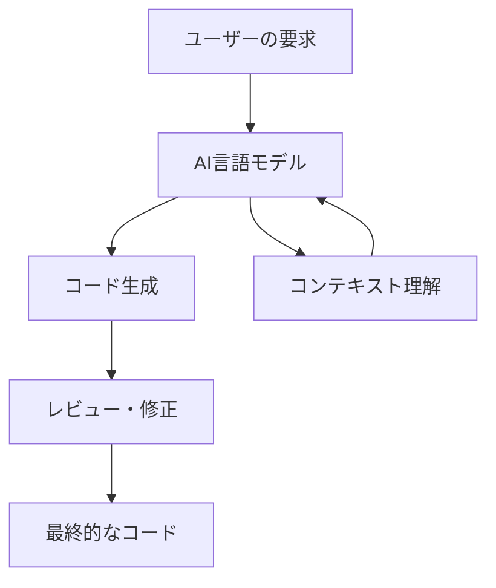
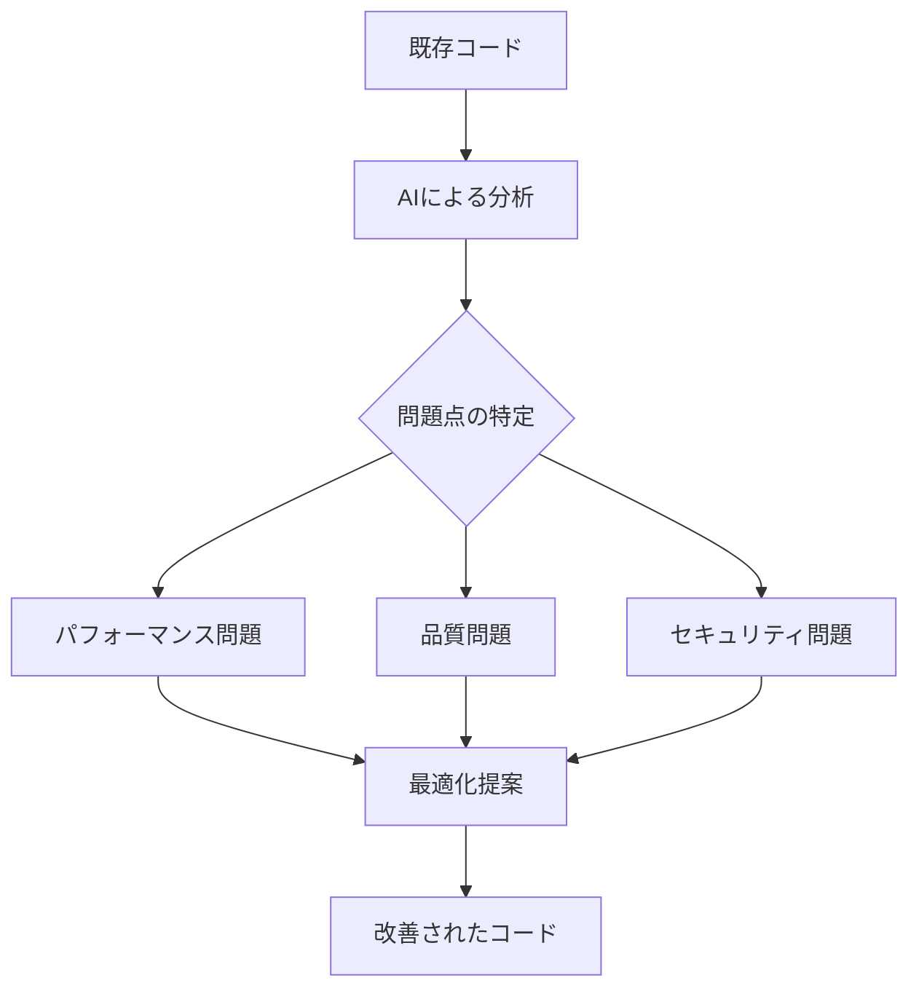
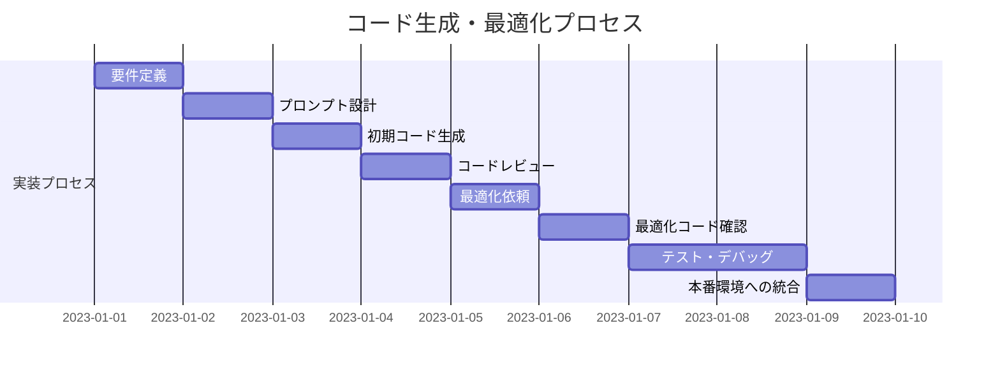

# コードの自動生成と最適化

## はじめに

コードの自動生成と最適化は、AI 駆動開発における最も重要な機能の一つです。適切なプロンプトと設定を使用することで、AI はあなたの要件に合わせたコードを素早く生成し、既存のコードを最適化することができます。この章では、効果的なコード生成と最適化の方法について学びましょう。

## 目次

1. [コード自動生成の基本](#コード自動生成の基本)
2. [最適なプロンプト設計](#最適なプロンプト設計)
3. [言語・フレームワーク別のコード生成のコツ](#言語・フレームワーク別のコード生成のコツ)
4. [コード最適化の手法](#コード最適化の手法)
5. [実践例：コード生成から最適化まで](#実践例コード生成から最適化まで)
6. [よくある問題と解決策](#よくある問題と解決策)

## コード自動生成の基本

### AI によるコード生成の仕組み

AI によるコード生成は、大量のソースコードで訓練された大規模言語モデル（LLM）の能力に依存しています。これらのモデルは、プログラミング言語の文法、コーディングパターン、一般的な実装方法を学習しており、ユーザーの要求に基づいてコードを生成します。



### 効果的なコード生成の流れ

1. **要件の明確化**: 何を実現したいのかを明確にする
2. **基本情報の提供**: 使用言語、フレームワーク、制約条件を指定する
3. **詳細な仕様の提示**: 必要な機能、入出力、エッジケースなどを説明する
4. **コード生成**: AI にコードを生成してもらう
5. **レビューと修正**: 生成されたコードを確認し、必要に応じて修正を依頼する
6. **統合とテスト**: 生成されたコードを実際のプロジェクトに統合してテストする

### コード生成に適した機能

AI によるコード生成は、以下のような機能の実装に特に効果的です：

- 定型的なソースコード
- CRUD の実装
- データ処理や変換ロジック
- API エンドポイント
- ユーティリティ関数
- バリデーションロジック
- 設定ファイル

## 最適なプロンプト設計

コード生成の品質はプロンプトの質に大きく依存します。効果的なプロンプト設計のポイントを紹介します。

### 構造化されたプロンプトの例

```
【タスク】以下の要件を満たすJavaScriptのコードを作成してください

【言語/フレームワーク】JavaScript / React

【機能の説明】
ユーザーリストを取得して表示するコンポーネント。
APIから取得したユーザーデータを一覧表示し、クリックするとユーザー詳細ページに遷移する。

【入力/出力】
- 入力: なし
- 出力: ユーザーリストのレンダリング

【制約条件】
- React Hooksを使用すること
- エラーハンドリングを実装すること
- レスポンシブデザインに対応すること

【追加コンテキスト】
APIエンドポイント: https://api.example.com/users
レスポンスフォーマット: { users: [{ id, name, email }, ...] }
```

### プロンプトの改善ポイント

- **具体的な要件**: 曖昧さを排除し、具体的な要件を提示する
- **コンテキストの提供**: 関連する情報や背景を提供する
- **制約条件の明示**: 守るべきルールや制約を明確にする
- **例の提示**: 可能であれば期待する出力の例を示す
- **段階的な指示**: 複雑な要求は段階的に指示する

## 言語・フレームワーク別のコード生成のコツ

プログラミング言語やフレームワークによって、効果的なコード生成のコツは異なります。

### JavaScript/TypeScript

- 型定義を明確に指定する（TypeScript）
- 使用するライブラリやフレームワークのバージョンを明示する
- React、Vue、Angular など、使用するフレームワークの設計思想に言及する

### Python

- PEP8 スタイルガイドへの準拠を指定する
- 使用するライブラリのバージョンを明示する
- 実行環境（Python3.x など）を指定する

### Java

- Java 言語バージョン（Java 8, 11, 17 など）を指定する
- 使用するフレームワーク（Spring Boot, Hibernate など）のバージョンを明示する
- コーディング規約（Google の Java スタイルガイドなど）に言及する

### その他の言語

- 言語固有の慣習やベストプラクティスへの準拠を指定する
- パフォーマンスや互換性に関する要件を明示する
- コード生成に必要な特定のライブラリやツールの情報を提供する

## コード最適化の手法

AI を活用して既存のコードを最適化する方法について説明します。

### パフォーマンス最適化

AI は以下のようなパフォーマンス最適化を提案できます：

- 計算量の削減（O(n²)→O(n log n)など）
- メモリ使用量の削減
- 非同期処理の最適化
- キャッシュの活用
- データ構造の最適化

### コード品質の向上

コードの品質を向上させるための最適化：

- コードの可読性向上
- 重複コードの排除（DRY 原則の適用）
- デザインパターンの適用
- エラーハンドリングの改善
- テスト容易性の向上



### リファクタリングの自動化

AI を活用したリファクタリングのプロセス：

1. 現在のコードを AI に提示する
2. リファクタリングの目的を明確に伝える
3. AI による改善案を確認する
4. 提案された変更を適用する
5. テストを実行して機能が維持されていることを確認する

## 実践例：コード生成から最適化まで

実際の例を通じて、コード生成から最適化までのプロセスを見ていきましょう。

### 例：TODO リストアプリの実装

#### ステップ 1: 基本機能の実装依頼

```
【タスク】シンプルなTODOリストアプリのReactコンポーネントを作成してください

【言語/フレームワーク】React（Hooks使用）

【機能要件】
- TODOの追加
- TODOの完了/未完了の切り替え
- TODOの削除

【UI要件】
- 入力フォームとリスト表示
- 完了したTODOには取り消し線
- 削除ボタン付き
```

#### ステップ 2: 生成されたコードのレビュー

AI によって生成された基本的な TODO リストのコードをレビューし、改善点を特定します。

#### ステップ 3: 最適化の依頼

```
【タスク】以下のTODOリストコンポーネントを最適化してください

【最適化目標】
- パフォーマンスの向上（不要な再レンダリングの防止）
- コードの可読性向上
- エラーハンドリングの追加
- ローカルストレージを使ったデータ永続化

【現在のコード】
// ここに現在のコードを貼り付け
```

#### ステップ 4: 最適化されたコードの確認と統合

AI によって最適化されたコードを確認し、実際のプロジェクトに統合します。

### 最適化前後の比較

最適化前のシンプルな実装と、最適化後の改善された実装を比較することで、AI によるコード最適化の効果を確認できます。



## よくある問題と解決策

AI によるコード生成と最適化で直面する可能性のある問題と、その解決策を紹介します。

### 生成されたコードの問題

| 問題                 | 解決策                                                   |
| -------------------- | -------------------------------------------------------- |
| 正確でないコード     | 要件をより具体的に指定し、エラーを指摘して修正を依頼する |
| 古い API/構文の使用  | 使用する言語やライブラリのバージョンを明示する           |
| 不完全な実装         | 足りない部分を具体的に指摘し、追加実装を依頼する         |
| セキュリティの問題   | セキュリティ要件を明示し、脆弱性のチェックを依頼する     |
| パフォーマンスの問題 | パフォーマンス要件を明示し、最適化を依頼する             |

### 効果的な修正依頼

コードに問題がある場合の効果的な修正依頼の例：

```
【修正依頼】先ほど生成されたTODOリストコードに以下の問題があります：

1. 新しいTODOを追加する際にリストが全て再レンダリングされている
2. 入力欄が空の場合でもTODOが追加できてしまう
3. TODOが多数ある場合のパフォーマンスが考慮されていない

これらの問題を修正した改善版のコードを提供してください。React.memo、useCallbackなどを使って最適化し、入力バリデーションも追加してください。
```

## まとめ

AI を活用したコードの自動生成と最適化は、開発効率を大幅に向上させる強力なツールです。効果的なプロンプト設計と、生成されたコードの適切なレビュー・修正プロセスを確立することで、高品質なコードをより迅速に開発できるようになります。

AI はあくまでもツールであり、最終的な責任はエンジニアにあることを忘れないでください。AI が生成したコードを理解し、必要に応じて修正・改善する能力を養うことが重要です。

次のステップとして、より複雑なアプリケーション開発やシステム設計に AI を活用する方法を学んでいきましょう。
