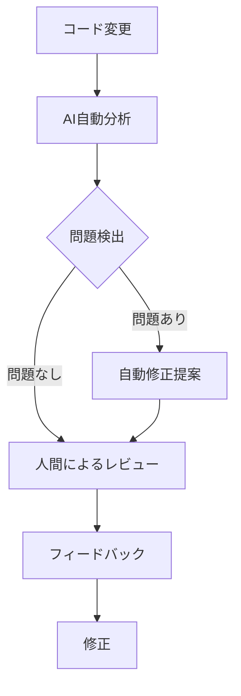
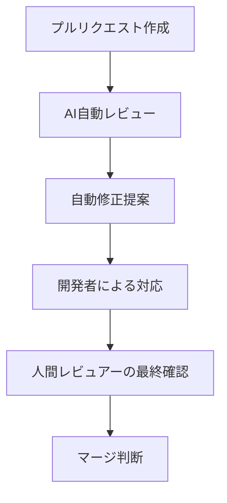
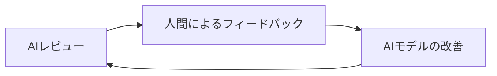

# コードレビューの効率化

## はじめに

ソフトウェア開発において、コードレビューは品質を確保するための重要なプロセスです。しかし、多くの開発チームにとって、コードレビューは時間がかかり、レビュアーに大きな負担をかける作業でもあります。AI 駆動開発の手法を取り入れることで、このプロセスを大幅に効率化し、より効果的なレビューを実現できます。この章では、AI を活用したコードレビューの効率化について解説します。

## コードレビューの課題

従来のコードレビューには、以下のような課題があります：

1. **時間の消費**: 大規模なコード変更のレビューには多くの時間が必要
2. **見落とし**: 人間のレビュアーは疲労や注意力の限界により、問題を見落とすことがある
3. **知識の偏り**: 特定の領域に詳しいレビュアーが不在の場合、品質にばらつきが生じる
4. **主観性**: 人によってコードスタイルや設計の好みが異なり、一貫性のあるレビューが難しい
5. **フィードバックの遅延**: レビュアーの負荷が高いと、フィードバックが遅れ開発速度が低下する

## AI を活用したコードレビュー手法

### 1. 自動コード分析

AI を活用した自動コード分析ツールは、コードの問題を事前に検出し、レビュープロセスを加速します。



#### 主な自動分析の種類

1. **構文・スタイルチェック**: コーディング規約違反、フォーマット問題の検出
2. **セキュリティ脆弱性スキャン**: 潜在的なセキュリティ問題の特定
3. **パフォーマンス分析**: 非効率なコードパターンの検出
4. **重複コード検出**: コードの重複や類似箇所の特定
5. **複雑度分析**: 過度に複雑なコードの特定

### 2. AI によるコードレビュー補助

現代の AI モデルは、人間のレビュアーをサポートする様々な機能を提供します：

#### コメント生成と改善提案

AI は、コードを分析し具体的な改善提案を生成できます：

```python
# 元のコード
def calculate_total(items):
    total = 0
    for i in range(len(items)):
        total += items[i].price * items[i].quantity
    return total
```

AI による改善提案例：

```
1. Pythonのイテレーション方法を最適化できます。`range(len(items))`の代わりに
   直接リストをイテレートする方が効率的です。
2. 変数名をより明確にすることで可読性が向上します。
3. list comprehensionを使用してコードを簡潔にできます。
```

改善後のコード例：

```python
def calculate_total(items):
    return sum(item.price * item.quantity for item in items)
```

#### コンテキスト理解と知識ギャップの埋め合わせ

AI はプロジェクト全体のコンテキストを理解し、レビュアーの知識ギャップを埋めるのに役立ちます：

```
このコードは、データベースのコネクションプールを管理するモジュールで使用されています。
現在の実装では、接続が明示的に閉じられていないためリソースリークが発生する可能性があります。
tryブロックでの例外発生時に確実に接続が解放されるよう、with文またはtry-finally構造を検討してください。
```

### 3. レビュープロセスの自動化

AI を活用してレビュープロセスの一部を自動化することで、人間のレビュアーは価値の高い部分に集中できます。



#### CI/CD パイプラインとの統合

GitHub や GitLab などのプラットフォームでは、AI レビューを CI/CD パイプラインに統合できます：

```yaml
# GitHub Actionsの例
name: Code Review

on:
  pull_request:
    branches: [main, develop]

jobs:
  ai-code-review:
    runs-on: ubuntu-latest
    steps:
      - uses: actions/checkout@v2

      - name: Setup AI Review Tool
        uses: example/ai-code-review-action@v1

      - name: Run AI Code Review
        run: ai-review analyze --pr ${{ github.event.pull_request.number }}

      - name: Post Review Comments
        uses: example/pr-comment-action@v1
        with:
          comments: ./review-comments.json
          token: ${{ secrets.GITHUB_TOKEN }}
```

### 4. コードレビューの優先順位付け

AI は変更の複雑さや重要度を分析し、レビュー優先度を提案できます：

1. **リスク評価**: セキュリティリスクの高い変更を優先
2. **複雑度スコア**: 複雑な変更を優先
3. **影響範囲分析**: 広範囲に影響する変更を優先
4. **履歴分析**: 過去に問題が多かった領域の変更を優先

## 実践的な AI コードレビューの導入ステップ

### 1. 適切なツールの選定

目的に合わせた AI レビューツールを選定します：

- **GitHub Copilot**: コード生成と簡易レビュー
- **DeepCode**: セキュリティと品質分析に強い
- **SonarQube + AI 拡張**: 包括的なコード品質管理
- **CodeGuru**: AWS サービスとの統合が強み
- **カスタム GPT モデル**: 特定のコーディング規約に特化

### 2. レビューガイドラインの設定

AI と人間のレビュアーの役割分担を明確にします：

- AI に任せる部分: スタイル、基本的なバグ、セキュリティ問題など
- 人間が集中すべき部分: アーキテクチャ、ビジネスロジック、エッジケースなど

### 3. フィードバックループの確立

AI レビューの品質を継続的に向上させる仕組みを作ります：



1. AI が見落とした問題を記録
2. 誤検出（false positive）のパターンを特定
3. プロジェクト固有のルールで AI をカスタマイズ

## 効果的な AI コードレビューのベストプラクティス

### 1. 適切な粒度でのレビュー

AI は小さな変更に対してより正確なフィードバックを提供できます：

- 一度に大量のコードをレビューするのではなく、小さなプルリクエストに分割する
- 関連性の高い変更をグループ化してレビューする

### 2. コンテキスト提供の重要性

AI にプロジェクトのコンテキストを適切に提供することで、レビュー品質が向上します：

- プロジェクトの設計方針やアーキテクチャドキュメントへのアクセス
- コーディング規約や品質基準の明確化
- 関連するモジュールやコンポーネントの情報提供

### 3. 人間と AI の協業モデル

最も効果的なレビュープロセスは、AI と人間のそれぞれの強みを活かす協業モデルです：

| AI の強み              | 人間の強み                 |
| ---------------------- | -------------------------- |
| 大量のコードの高速処理 | 文脈や意図の理解           |
| 一貫性のあるレビュー   | 創造的な解決策の提案       |
| パターン認識           | ビジネス価値の判断         |
| 技術的な正確さの検証   | チーム文化や学習機会の創出 |

## AI コードレビューの導入事例

### 中規模 Web アプリケーション開発チームの例

ある開発チームでは、AI コードレビューを導入後、以下の変化が見られました：

1. レビューにかかる時間が 30%減少
2. バグの発見率が 25%向上
3. 初級開発者のコード品質が大幅に向上
4. チーム内でのベストプラクティス共有が活発化

彼らの成功要因：

- 自動チェックと人間のレビューを明確に分離
- AI の提案を盲目的に受け入れず、常に検証
- レビュープロセスを継続的に改善

## 注意点と課題

AI を活用したコードレビューには、考慮すべき課題もあります：

1. **過度の依存**: AI に頼りすぎると、人間のレビュースキルが低下する可能性
2. **誤った提案**: AI は常に正しいわけではなく、誤った提案をすることもある
3. **コンテキスト理解の限界**: プロジェクト固有の詳細な事情を完全に理解するのは難しい
4. **学習機会の損失**: 教育的な価値があるレビュープロセスの一部が失われる可能性

これらの課題に対処するために：

- AI のフィードバックを常に批判的に評価する習慣をつける
- AI と人間のレビューを並行して行い、相互補完する
- レビュープロセスを学習と知識共有の機会と位置づける

## まとめ

AI を活用したコードレビューは、開発プロセスの効率と品質を大幅に向上させる可能性を秘めています。自動化できる部分は AI に任せ、人間のレビュアーは創造的で高付加価値な部分に集中することで、最適なバランスを実現できます。

AI ツールはレビュープロセスを完全に置き換えるものではなく、人間のレビュアーを強力に支援するツールとして活用することが重要です。AI と人間のそれぞれの強みを理解し、効果的に組み合わせることで、より効率的で質の高いソフトウェア開発を実現しましょう。

最後に、AI コードレビューは静的な技術ではなく、継続的に進化していきます。新しいツールや手法を積極的に取り入れながら、自分たちのプロジェクトに最適なレビュープロセスを構築していくことが成功への鍵となります。
