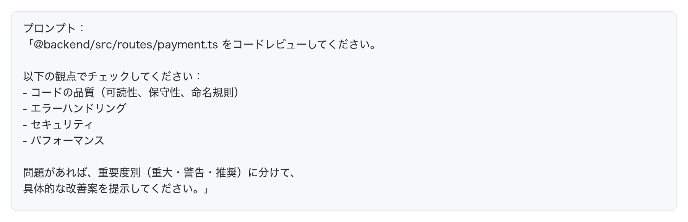
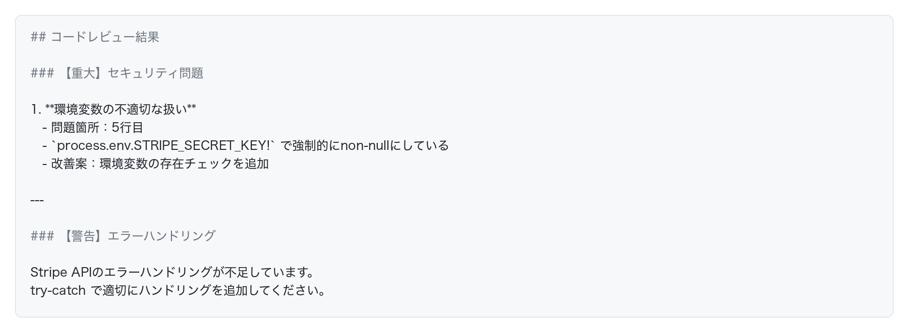
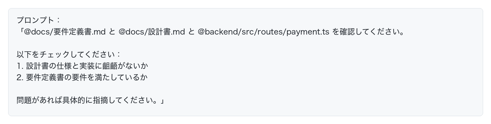
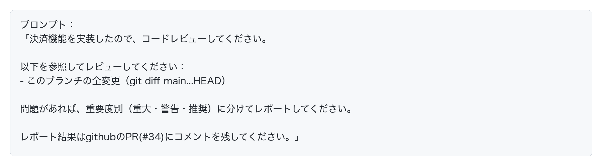

# コードレビューの効率化

**AIを活用することで、コードレビューの効率と品質を大幅に向上させることができます。**

## ECサイトの決済機能をレビューしてみよう

実装したECサイトの決済機能を、AIにレビューさせます。

まずは基本的な使い方から始めましょう。

### 基本的なコードレビュー

AIが以下のようにレビュー結果を返します：

### 設計書・要件定義書との整合性チェック

設計書や要件定義書がある場合、それらと実装コードを比較してレビューできます。

### AIに修正を実装させる

レビュー結果を受けて、そのままAIに修正を依頼できます。

AIが自動で修正してくれます。

## 人間による最終レビュー

AIのレビュー結果を参考に、**人間が最終的にレビューします。**

AIはあくまで、あなたの助手。コードの責任者はAIではなく、あなたです。
最終的にはしっかりと人間がレビューしましょう。

## ワンランク上の使い方：Git/GitHubとの連携

ここからは、Git/GitHubと連携したより高度なレビュー方法を紹介します。

### ブランチ単位での包括的レビュー

通常、Gitでは機能ごとにブランチを切って開発します。レビュー時は、**そのブランチ全体をまとめてAIにレビューさせる**ことができます。

なお、このような使い方をするために、**AIが動作する環境に**gitをインストールしておきましょう。また、APIやMCPで接続できるようにしておくと、AIがGitHubにコメントを残すなどの操作が可能になります。

このように指示すると、AIが：
1. ブランチ全体の変更を確認
2. レビューを実施
3. 結果をGitHubのPRに自動でコメント

という一連の作業を自動で行ってくれます。

### GitHub Actionsでレビューを自動化

さらに、GitHub Actionsを使うことで、プルリクエストが作成されるたびに自動でAIレビューが実行されるように設定できます。

## まとめ

AIでレビューの生産性が大幅に向上します。ただし最終的には、人間がしっかりとレビューをしましょう。
