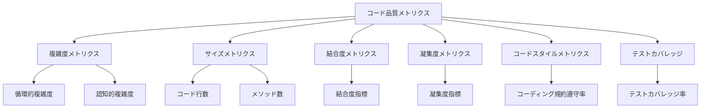
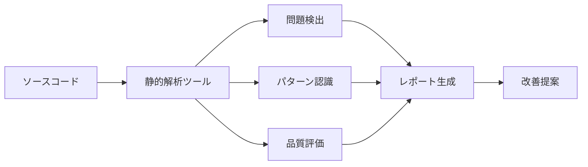
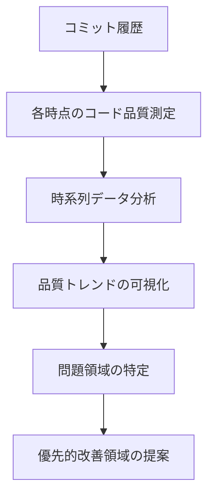
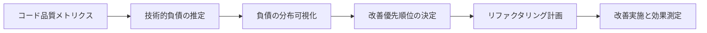

# コード品質メトリクスと静的解析

## コード品質の重要性

ソフトウェア開発において、コード品質は非常に重要な要素です。高品質なコードは以下のような利点をもたらします：

- **保守性の向上**: 将来の変更や機能追加が容易になる
- **バグの減少**: 潜在的な問題が少なくなる
- **理解しやすさ**: 他の開発者がコードを理解しやすくなる
- **チームの生産性向上**: レビューや修正にかかる時間の削減
- **セキュリティの強化**: 脆弱性のリスク低減

コード品質を客観的に評価・改善するためには、コード品質メトリクスと静的解析が有効です。AI駆動開発の手法を活用することで、これらのプロセスをより効率的かつ効果的に行うことができます。

## コード品質メトリクスとは

コード品質メトリクスとは、コードの品質を定量的に測定するための指標です。さまざまな側面からコードを数値化することで、品質の評価や比較を可能にします。



### 主要なコード品質メトリクス

1. **複雑度メトリクス**

   - **循環的複雑度（Cyclomatic Complexity）**: コード内の条件分岐の複雑さを測定
   - **認知的複雑度（Cognitive Complexity）**: コードを理解するための難しさを測定
   - **ネスト深度（Nesting Depth）**: コードのネストの深さを測定

2. **サイズメトリクス**

   - **コード行数（Lines of Code）**: 物理的なコードの行数
   - **論理行数（Logical Lines of Code）**: 実際の命令文の数
   - **メソッド数（Number of Methods）**: クラス内のメソッド数

3. **結合度と凝集度**

   - **結合度（Coupling）**: モジュール間の依存関係の強さ
   - **凝集度（Cohesion）**: モジュール内の機能の関連性の強さ

4. **コードスメル指標**

   - **重複コード率（Duplication）**: コードの重複度合い
   - **長すぎるメソッド（Long Methods）**: 適切な長さを超えたメソッドの数
   - **大きすぎるクラス（Large Classes）**: 適切なサイズを超えたクラスの数

5. **テスト関連メトリクス**
   - **テストカバレッジ（Test Coverage）**: テストによるコードのカバー率
   - **テスト密度（Test Density）**: コード量に対するテスト量の比率

## 静的解析とは

静的解析（Static Analysis）とは、プログラムを実行せずにソースコードを分析する技術です。潜在的なバグ、脆弱性、コード品質の問題などを特定するのに役立ちます。



### 静的解析の主な種類

1. **構文解析**: コードの文法エラーや構文の問題を検出
2. **セマンティック解析**: 変数の型チェックや未使用変数の検出など
3. **データフロー解析**: データの流れを追跡し、潜在的な問題を特定
4. **コントロールフロー解析**: 制御の流れを分析し、到達不能コードなどを検出
5. **パターン検出**: 既知の問題パターンやアンチパターンを特定

## AIを活用したコード品質評価

AIはコード品質の評価と改善において、以下のような支援が可能です：

### 1. 高度なパターン認識

AIはコード内の複雑なパターンを認識し、従来の静的解析ツールでは検出が難しい潜在的な問題を特定できます。

**AIによるパターン認識の例**:

```
以下のコードを分析し、潜在的な問題やコード品質の課題を特定してください。
特に、パフォーマンス問題、メモリリーク、スレッドセーフティの問題に注目してください。

[コードを提示]
```

### 2. コンテキスト考慮型分析

AIはコードのコンテキストを理解し、単純なルールベースの分析では見逃されがちな問題を検出できます。

**コンテキスト考慮型分析の例**:

```java
// 単純なルールでは問題なさそうに見えるが、
// コンテキストを考慮すると問題のあるコード
class UserService {
  private Database db;

  public User findUser(String userId) {
    // データベース接続がnullかチェックしていない
    return db.query("SELECT * FROM users WHERE id = ?", userId);
  }

  // データベース接続の初期化は別のメソッドで行われる可能性があり、
  // findUserが呼ばれる時点でdbがnullの可能性がある
}
```

### 3. 品質改善提案

AIは検出した問題に対して、具体的な改善案を提示することができます。

**AIによる改善提案の例**:

```
以下のJavaコードの複雑度が高すぎます。認知的複雑度を下げるために、
リファクタリング案を提案してください。メソッドの分割や設計パターンの
適用なども考慮してください。

[複雑なコードを提示]
```

### 4. コード品質トレンド分析

AIは時間の経過とともに変化するコード品質のトレンドを分析し、悪化傾向にある領域を特定できます。



## AIを活用した静的解析ツール

AIによって強化された静的解析ツールの例と特徴を紹介します。

### 1. コード品質チェックツール

AIを活用したコード品質チェックツールは、従来のルールベースのチェックに加えて、学習ベースの分析を提供します。

**活用例**:

```
以下のプロジェクトのコード品質を包括的に分析し、主要な指標（複雑度、結合度、
テストカバレッジなど）のスコアとその解釈を提供してください。
また、最も優先的に改善すべき領域を特定してください。

[プロジェクト情報]
```

### 2. セキュリティ脆弱性スキャン

AIを用いたセキュリティスキャンツールは、既知および未知の脆弱性パターンを検出します。

**AIによるセキュリティ分析の例**:

```
以下のWebアプリケーションコードを分析し、セキュリティ脆弱性をスキャンしてください。
OWASP Top 10の脆弱性カテゴリに基づいて分類し、深刻度評価と修正提案を行ってください。

[Webアプリケーションコード]
```

### 3. コードレビュー支援

AIはコードレビュープロセスを支援し、レビュアーが見落としがちな問題を特定できます。

**コードレビュー支援の例**:

```
以下のプルリクエストの変更内容を分析し、コードレビューの観点から
フィードバックを提供してください。特に以下の点に注目してください：
- コーディング規約への準拠
- 潜在的なバグやエッジケース
- パフォーマンスへの影響
- テスト漏れ
- ドキュメントの必要性

[プルリクエスト差分]
```

## コード品質メトリクスの活用方法

コード品質メトリクスを効果的に活用するための方法を紹介します。

### 1. 品質ゲートの設定

特定のメトリクスに対して、許容範囲やしきい値を設定することで、コード品質の低下を防止します。

```yaml
# SonarQubeの品質ゲート設定例
quality_gate:
  conditions:
    - metric: coverage
      op: LT
      value: 80% # テストカバレッジが80%未満の場合に失敗
    - metric: duplicated_lines_density
      op: GT
      value: 5% # コードの重複が5%を超える場合に失敗
    - metric: cognitive_complexity
      op: GT
      value: 25 # 認知的複雑度が25を超える場合に失敗
```

### 2. 継続的品質モニタリング

CI パイプラインにコード品質チェックを組み込み、継続的に品質を監視します。

```yaml
# GitHub Actionsでの品質チェック例
name: Code Quality Check

on:
  push:
    branches: [main, develop]
  pull_request:
    branches: [main]

jobs:
  quality:
    runs-on: ubuntu-latest
    steps:
      - uses: actions/checkout@v2

      - name: Setup Java
        uses: actions/setup-java@v2
        with:
          java-version: "11"

      - name: Run SonarQube Analysis
        uses: sonarsource/sonarqube-scan-action@master
        env:
          SONAR_TOKEN: ${{ secrets.SONAR_TOKEN }}
          SONAR_HOST_URL: ${{ secrets.SONAR_HOST_URL }}

      - name: Check Quality Gate
        uses: sonarsource/sonarqube-quality-gate-action@master
        timeout-minutes: 5
        env:
          SONAR_TOKEN: ${{ secrets.SONAR_TOKEN }}
```

### 3. 技術的負債の可視化

コード品質メトリクスを用いて、技術的負債を定量化し可視化します。



**AIによる技術的負債分析の例**:

```
以下のプロジェクトの技術的負債を分析し、定量化してください。
各コンポーネントごとの負債レベルを評価し、最も効果的な
リファクタリング投資領域を提案してください。改善ROIの観点からも評価をお願いします。

[プロジェクト情報]
```

## 実践的な静的解析の導入方法

組織に静的解析を効果的に導入するための実践的なアプローチを紹介します。

### 1. 適切なツールの選定

プロジェクトの特性に合った静的解析ツールを選定します。

**言語別の代表的な静的解析ツール**:

| 言語       | ツール                          | 特徴                                   |
| ---------- | ------------------------------- | -------------------------------------- |
| Java       | SonarQube, PMD, Checkstyle      | 広範なルールセット、高いカスタマイズ性 |
| JavaScript | ESLint, Prettier, JSHint        | モダン JS 対応、プラグイン豊富         |
| Python     | Pylint, Flake8, mypy            | PEP 準拠チェック、型チェック           |
| C/C++      | Clang Static Analyzer, Coverity | メモリ問題検出に強い                   |
| C#         | Roslyn Analyzers, NDepend       | .NET エコシステム統合                  |

**AIによるツール選定支援**:

```
私たちのプロジェクトは以下の特徴を持っています：
- 言語: TypeScript + React
- チームサイズ: 15名
- CI/CD: GitHub Actions
- 懸念事項: コード品質の一貫性、型安全性、パフォーマンス

このプロジェクトに最適な静的解析ツールセットを提案してください。
各ツールの役割、設定方法、導入ステップも含めてください。
```

### 2. カスタムルールの作成

プロジェクト固有のニーズに合わせたカスタムルールを作成します。

**ESLint カスタムルール例**:

```javascript
// コンポーネント名がPascalCaseであることを確認するルール
module.exports = {
  create: function (context) {
    return {
      ClassDeclaration: function (node) {
        if (node.id && node.parent.type === "ExportDefaultDeclaration") {
          const name = node.id.name;
          if (!/^[A-Z][A-Za-z]*$/.test(name)) {
            context.report({
              node: node.id,
              message: "Reactコンポーネント名は PascalCase で記述してください",
            });
          }
        }
      },
    };
  },
};
```

**AIによるカスタムルール生成支援**:

```
当社のコーディング規約には以下のルールがあります：
1. サービスクラスの名前は必ず「Service」で終わること
2. すべてのAPIエンドポイント関数は適切なエラーハンドリングを実装すること
3. 非同期関数内ではtry-catchを使用すること

これらの規約をチェックするためのESLintカスタムルールを
作成してください。それぞれのルールの実装コードと設定方法を提示してください。
```

### 3. 段階的な導入

静的解析ツールは段階的に導入することで、チームの負担を軽減します。

**段階的導入ステップ**:

1. **初期導入**: 最も重要なルールのみを適用し、警告モードで稼働
2. **アダプテーション**: チームがルールに慣れる期間を設け、フィードバックを収集
3. **ルール拡張**: フィードバックに基づいてルールを調整・拡張
4. **品質ゲート化**: CI パイプラインに組み込み、品質ゲートとして運用
5. **継続的改善**: 定期的にルールセットを見直し、最新のベストプラクティスを反映

## AIとのインタラクティブなコード品質改善

AIとインタラクティブにコミュニケーションすることで、コード品質を効率的に改善する方法を紹介します。

### 1. 対話的コード分析

コードの特定部分について、AIに詳細な分析を依頼できます。

**対話例**:

```
このControllerクラスが複雑すぎると感じています。
どの部分が最も複雑で、どのようにリファクタリングすべきか
アドバイスをお願いします。

[コントローラーコードを提示]
```

### 2. 段階的リファクタリング支援

AIがリファクタリングのステップを案内し、各ステップの効果を確認できます。

**対話例**:

```
このメソッドを小さく分割したいのですが、どのように進めるべきでしょうか？
段階的なリファクタリングステップを提案してください。

[複雑なメソッドを提示]
```

### 3. コードレビューの自動化

AIがコードレビューを支援し、品質に関する問題を指摘します。

**AIレビュー例**:

```
以下のコミット差分をレビューしてください。
コード品質、潜在的なバグ、パフォーマンス問題、
セキュリティ脆弱性の観点でフィードバックください。

[コミット差分]
```

## コード品質向上のケーススタディ

実際に AIを活用してコード品質を向上させた事例を紹介します。

### ケーススタディ 1: 技術的負債の削減

**プロジェクト状況**:

- レガシーコードベースの品質改善が必要
- 複雑度が高く、保守が困難
- テストカバレッジが低い

**AIを活用したアプローチ**:

1. AIによるコードベース分析と負債の定量化
2. 優先度の高い改善領域の特定
3. リファクタリング計画の策定
4. 段階的な実装と継続的な品質モニタリング

**結果**:

- 循環的複雑度が平均 30%減少
- テストカバレッジが 25%から 70%に向上
- 修正時間が平均 40%短縮

### ケーススタディ 2: 新規プロジェクトでの品質維持

**プロジェクト状況**:

- 新規開発プロジェクト
- アジャイル開発で速いペースが求められる
- 長期的な保守性を確保したい

**AIを活用したアプローチ**:

1. 開発初期からの静的解析ツール導入
2. AIによるコードレビュー自動化
3. 定期的な品質レポートとトレンド分析
4. 問題が検出された際の早期対応

**結果**:

- 一貫した高品質コードベースの維持
- レビュー工数の 30%削減
- バグ発生率の 40%減少

## まとめ

コード品質メトリクスと静的解析は、ソフトウェア品質を客観的に評価し、継続的に改善するための重要なツールです。AI駆動開発を取り入れることで、以下のような大きなメリットが得られます：

- より高度で文脈を考慮したコード分析
- 具体的で実用的な改善提案
- 技術的負債の効率的な削減
- 品質問題の早期発見と対応

効果的なコード品質向上のためには、適切なツールの選定と段階的な導入、チーム全体の品質意識の向上が重要です。AIはこれらのプロセスを支援する強力なパートナーとなりますが、最終的な判断は人間の開発者が行うことが重要です。

AIと人間のそれぞれの強みを活かした協業モデルを構築することで、持続可能な高品質ソフトウェア開発を実現できるでしょう。
