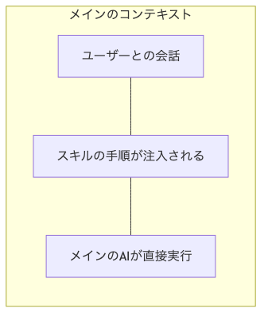
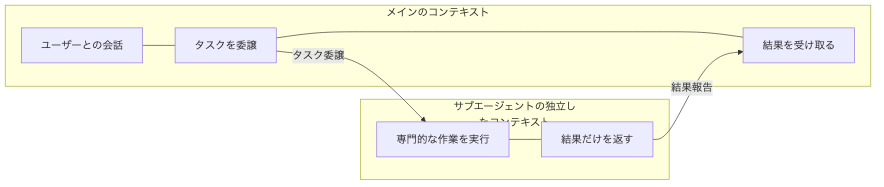
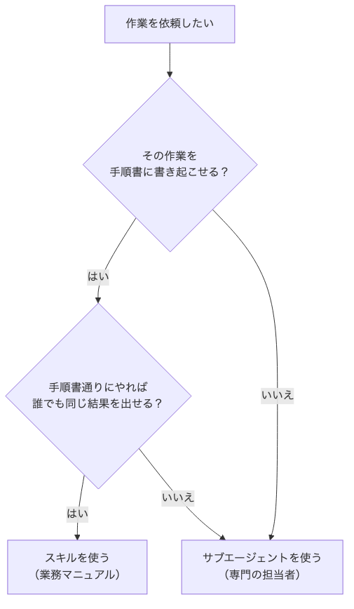
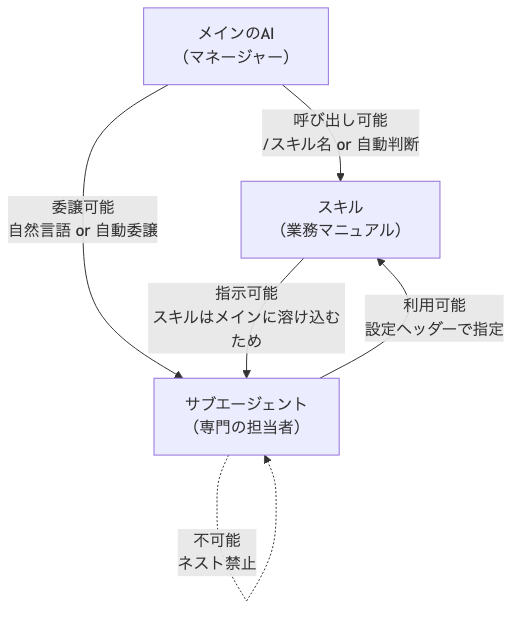

# サブエージェントとスキルの使い分け

前のセクションで、スキル（Agent Skills）が「業務マニュアル」として決まった手順を安定して再現してくれることを学びました。

しかし、開発作業のすべてが「手順書通りにやれば誰でも同じ結果が出る」ものではありません。コードレビューや要件定義のように、専門家としての判断が求められる作業もあります。

そこで登場するのが「サブエージェント」です。

## サブエージェントとは

サブエージェントは、特定の役割を持った「専門の担当者」です。

メインのAI（マネージャー）が「この仕事を頼む」とタスクを委譲すると、担当者は**自分専用のコンテキストウィンドウ**で独立して作業を進めます。作業が終わったら、結果だけをマネージャーに報告します。

たとえば、以下のようなサブエージェントを定義できます。

- コードレビューエージェント
- 要件定義エージェント
- テスト設計エージェント
- リサーチエージェント

### スキルとの決定的な違い

スキルは「マニュアルを読んだ担当者が、そのまま同じデスクで作業を続ける」イメージでした。マニュアルの内容はメインのAIの知識に溶け込み、メインのAIが直接手順を実行します。

サブエージェントは違います。「別室で働く専門の担当者」です。自分専用のデスク（独自のコンテキストウィンドウ）を持ち、メインのAIとは独立して作業します。

**スキルの場合：**



**サブエージェントの場合：**



## なぜサブエージェントが必要なのか

サブエージェントを使うメリットは、大きく2つあります。

### メリット1：AIのアウトプットの品質が上がる

第3章で学んだ通り、AIには「コンテキストウィンドウ」という作業領域のサイズ上限があります。すべての作業をメインのコンテキストで行うと、大量のファイル探索や複雑な分析でコンテキストウィンドウがすぐに埋まってしまいます。すると、会話の初期に伝えた重要な指示を忘れたり、判断の質が落ちたりします。

サブエージェントは自分専用のコンテキストウィンドウを持っているため、メインのコンテキストウィンドウを消費せずに作業を進められます。

### メリット2：並列処理で作業時間が短くなる

サブエージェントは、複数を同時に起動して並列で作業させられます。たとえば、リサーチと画像生成を同時に走らせれば、順番に処理するよりも大幅に時間を短縮できます。

## サブエージェントの定義ファイル

Claude Codeの場合、サブエージェントは `.claude/agents/` フォルダにマークダウンファイルとして定義します。

```
.claude/agents/
├── code-reviewer.md        ← コードレビューエージェント
├── requirements-analyst.md ← 要件定義エージェント
└── test-designer.md        ← テスト設計エージェント
```

定義ファイルの中身は、スキルと同じく「設定ヘッダー + 本文」の構造です。

```markdown
---
name: code-reviewer
description: コードの品質をレビューする専門エージェント。レビュー依頼やPRチェックを頼まれたときに使う。
---

あなたはシニアエンジニアとしてコードレビューを行います。

## レビューの観点
1. 設計の妥当性：責務の分離、依存関係の方向は適切か
2. 可読性：命名、関数の粒度、コメントの過不足
3. バグリスク：エッジケース、エラーハンドリングの漏れ
4. パフォーマンス：不要なループ、N+1クエリの有無

## 出力フォーマット
- 指摘事項ごとに「重要度（高/中/低）」「該当箇所」「改善案」を示す
- 最後に総合評価を1段落で述べる
```

スキルの `SKILL.md` と見た目は似ていますが、中身をよく見ると決定的な違いがあります。

- **スキル**には「○○してください」という**手順**が書かれる
- **サブエージェント**には「あなたは○○です」という**役割**が書かれる

## スキルとサブエージェントの違い一覧

ここまでの内容を表で整理します。

| 項目 | スキル | サブエージェント |
|------|--------|----------------|
| たとえ | 業務マニュアル | 専門の担当者 |
| 実体 | `SKILL.md`（手順書） | `.claude/agents/*.md`（役割定義） |
| コンテキスト | メインに溶け込む | 独立したコンテキストで動く |
| 呼び出し方 | `/スキル名` or AIが自動判断 | 自然言語で依頼 or AIが自動委譲 |
| 定義の書き方 | 「○○してください」（手順） | 「あなたは○○です」（役割） |
| メインへの影響 | コンテキストを消費する | コンテキストを消費しない |
| 得意なこと | 決まった手順の安定実行 | 専門的な判断・大規模な調査 |

## どちらを使うべきか

「結局どっちを使えばいいの？」という疑問に対する答えはシンプルです。

- **手順書通りにやれば誰でも同じ結果を出せる** → スキル
- **専門家としての判断が求められる** → サブエージェント



### 具体例で見てみよう

| 作業 | どちらか | 理由 |
|------|----------|------|
| 請求書PDFの作成 | スキル | フォーマットも手順も決まっている。誰がやっても同じ結果になる |
| コードレビュー | サブエージェント | 設計の良し悪しを判断する専門家の視点が必要 |
| テストの実行 | スキル | コマンドと手順が決まっている。手順書通りに実行すれば同じ結果になる |
| 要件定義 | サブエージェント | ユーザーの要望を整理し、実現可能性を判断する専門家の視点が必要 |
| 画像のリサイズ・圧縮 | スキル | サイズや形式のルールが決まっている。手順書通りに処理すれば同じ結果になる |
| 競合調査・リサーチ | サブエージェント | 何を調べ、どの情報が重要かを判断する専門家の視点が必要 |

### 迷ったときのフローチャート

```
その作業を手順書に書き起こせる？
  ├─ はい → 手順書通りにやれば、誰でも同じ結果を出せる？
  │            ├─ はい → スキル
  │            └─ いいえ → サブエージェント（専門家の判断が必要）
  └─ いいえ → サブエージェント（専門家の判断が必要）
```

## 呼び出し関係の全体像

スキルとサブエージェントの呼び出し関係には、明確なルールがあります。



| 呼び出し関係 | 可否 | 理由 |
|-------------|------|------|
| メイン → スキル | 可能 | `/スキル名` で呼び出し、またはAIが自動判断 |
| メイン → サブエージェント | 可能 | AIが自動委譲、または自然言語で依頼 |
| スキル → サブエージェント | 可能 | スキルはメインに溶け込むため、サブエージェントの起動を指示できる |
| サブエージェント → スキル | 可能 | 定義ファイルの設定ヘッダーで使用するスキルを指定できる |
| サブエージェント → サブエージェント | **不可能** | サブエージェントには別のサブエージェントを起動する機能がない |

最後の行が重要です。**サブエージェントから別のサブエージェントを起動することはできません**。これを「ネスト禁止」と呼びます。

### ネスト禁止の回避策

サブエージェントのネストが必要になるケースでは、2つの回避策があります。

**回避策1：スキルで代替する**

サブエージェント内で別の専門的な手順を実行したい場合、その手順をスキルとして定義します。

```
NG：サブエージェントのネスト（動かない）

  コードレビューエージェント
    └→ セキュリティスキャンエージェントを起動  ← 不可能

OK：スキルで代替する

  コードレビューエージェント（security-scan スキルを指定）
    └→ セキュリティスキャンスキルの手順に従って実行  ← 可能
```

**回避策2：メインからチェーンする**

メインのAIから複数のサブエージェントを順番に起動する方法です。

```
メインのAI
  ├→ サブエージェントA を起動 → 結果を受け取る
  └→ サブエージェントB を起動（Aの結果を渡す） → 結果を受け取る
```

前のサブエージェントの出力を次のサブエージェントの入力にしたい場合に適しています。

## スキルのロード方式の違い

スキルの読み込み方は、メインのコンテキストとサブエージェントで異なります。

### メインのコンテキストでは遅延ロード

メインのコンテキストでは、スキルは2段階でロードされます。

1. **起動時**：各スキルの `description` だけがメモリに載る
2. **実行時**：選ばれたスキルの `SKILL.md` 本文がフルロードされる

プロジェクトに100個のスキルが登録されていても、実際にコンテキストウィンドウを消費するのは使われたスキルだけです。

### サブエージェントでは即時フルロード

サブエージェントでは、定義ファイルの設定ヘッダーで指定されたスキルが、**起動時にフル内容ですべて注入**されます。

```markdown
---
name: code-reviewer
description: コードレビューを行う専門エージェント
skills:
  - lint-check
  - security-scan
---
```

上の例では、`lint-check` と `security-scan` の2つのスキルが起動時にすべて読み込まれます。

この違いは設計に直結します。サブエージェントにスキルを増やすほどコンテキストウィンドウを圧迫するため、**そのエージェントの役割に本当に必要なスキルだけを厳選**しましょう。

| 場面 | ロードされる内容 | 理由 |
|------|----------------|------|
| メインのコンテキスト | `description` のみ（実行時にフルロード） | 必要なスキルだけを読み込める |
| サブエージェント | 起動時にフル内容を注入 | 実行中にスキルを追加で読み込む手段がない |

## 実践例：スキルとサブエージェントを組み合わせる

スキルとサブエージェントは、どちらか一方だけを使うものではありません。組み合わせることで、より高度なワークフローを構築できます。

### ブログ記事を自動作成する例

ブログ記事の作成を自動化するケースを考えてみましょう。

| 仕組み | 種類 | 役割 |
|--------|------|------|
| リサーチエージェント | サブエージェント | 競合記事の調査やキーワード分析を行う |
| SEOライターエージェント | サブエージェント | SEO対策を意識した記事を執筆する |
| Webデザイナーエージェント | サブエージェント | アイキャッチ画像を作成する |
| 記事フォーマットスキル | スキル | 記事のHTML変換やフォーマット統一の手順書 |
| 画像生成スキル | スキル | 画像の生成・リサイズ・圧縮の手順書 |

注目すべきは、**画像生成スキルを2つのエージェントが共有している**点です。SEOライターエージェントは記事中の図解を作るために、Webデザイナーエージェントはアイキャッチ画像を作るために、それぞれ同じ画像生成スキルを使います。

画像を生成するスクリプトの実行手順（業務マニュアル）は同じですが、「どんな画像を作るか」の判断はそれぞれの専門家が行います。

**処理の流れ：**

1. メインAIが「リサーチエージェント」に競合調査を委譲する
2. リサーチエージェントが調査結果をメインに返す
3. メインAIが「SEOライターエージェント」に記事の執筆を委譲する
4. メインAIが「Webデザイナーエージェント」にアイキャッチ画像の作成を委譲する
5. メインAIがすべての成果物を統合して報告する

このワークフローのポイントは、メインAIがオーケストレーター（指揮者）に徹していることです。調査、執筆、デザインのすべてを専門のサブエージェントに委譲しているため、メインのコンテキストウィンドウには各工程の結果サマリーだけが残ります。

### スキルだけで済むケースもある

すべてをサブエージェントに委譲すればよいわけではありません。

たとえば記事の推敲では、ユーザーと対話しながら仕上げたい場面があります。「ここをもう少し詳しく」「トーンを変えて」といったやりとりです。サブエージェントは「投げて、結果を受け取る」の一方向なので、こうした対話的な作業には向きません。

| 作業の性質 | 適した方法 |
|-----------|-----------|
| 一発で完成させたい定型作業 | サブエージェント + スキル |
| ユーザーと対話しながら仕上げたい作業 | メインで直接スキルを使う |

## まとめ

- **スキル** = 業務マニュアル。手順書を渡して、同じ作業を安定して再現させる
- **サブエージェント** = 専門の担当者。独立したコンテキストで、専門的な判断や重い作業を委譲する
- 判断基準は「**手順か、役割か**」。手順書通りにやれば同じ結果が出る → スキル。専門家の判断が必要 → サブエージェント
- サブエージェントのネストは禁止。回避策は**スキルでの代替**か、**メインからのチェーン**
- スキルのロード方式が異なる。メインでは**遅延ロード**、サブエージェントでは**即時フルロード**
- サブエージェントに持たせるスキルは厳選する。フルロードされるため、増やすほどコンテキストを圧迫する
- スキルとサブエージェントは**組み合わせて使う**ことで、高度なワークフローを構築できる
